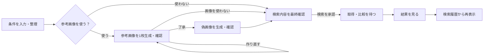

# 次期商品検索の利用フロー

この文書は、次期デスクトップ画面で利用者が商品を探すときに、何を入力し、何を確認し、どの操作で処理が始まるかを説明する。

> **現在の提供状況:** このフローは採用済みの次期仕様であり、現行のStreamlit画面ではまだ利用できない。現在利用できる機能と起動方法は [README.md](README.md)、実装状況は [TASK-008](docs/GOAL.md#task-008-次期検索フロー-v2-の実装) を参照する。

> **開発方針（2026-09-11）:** 次期フロントエンドはこのリポジトリで自前開発する。この文書を画面操作と受入条件の正本とし、外部納品を着手条件にしない。今回は文書更新までで、画面実装とバックエンド・API接続は後続作業である。

条件整理では、入力に明記された属性名・値・必須・希望・除外の区別を保持する。属性名が省略された数量は、取得した商品に記載された仕様候補から利用者が対応を確認する。AIは画像比較に使う見た目の条件整理に使う。言い換え語・英訳は辞書から文脈に合う候補を選び、意味が確定できなければ追加しない。商品の適合点数はAIに付けさせない。関係が曖昧な条件は確認事項として表示し、商品情報に根拠がなければ結果では未確認として扱う。

テスト方法と合格条件は [DEVELOPMENT.mdの統合済みテスト方針](docs/DEVELOPMENT.md#統合済みテスト方針)、画面の実装仕様は [FRONTEND.md](docs/FRONTEND.md)、検索処理の内部仕様は [BACKEND.md](docs/BACKEND.md)、データと安全上の境界は [DB-SCHEMA.md](docs/DB-SCHEMA.md) と [SECURITY.md](docs/SECURITY.md) に分けて記載する。

- 対象はデスクトップ版の次期検索画面であり、現行Streamlit画面ではない。
- レイアウトの参考は [amazon-explorer｜検索フロー UI Design Sheet v2](https://www.figma.com/design/PEVM5G4854vaDqdWgSA3ui) とする。

次期UIはReact + StyleXで実装し、[視覚統一契約](docs/FRONTEND.md#13-次期uiの視覚統一契約)を色・文字・装飾・操作配置の正本とする。Figmaに残る旧配色や文言は継承しない。背景は `#000000`、指定のない文字・外枠は `#ffffff`、補足背景は `#212121`。指定のないハイライトを追加しない。

入力・確認・操作を左上から右下へ並べ、主要操作を右側、削除などの危険操作を左側へ離す。ウィンドウ外枠の角丸は15px、全ボタンは共通寸法・余白で文字中央揃え・角丸100pxとし、幅・高さの数値は後続設計で決める。短い文言と操作対象の説明を併用する。以下の外部処理とサーバー応答は実接続時の契約であり、UIだけの確認は末尾のオフラインモック要件に従う。

## UI操作フロー

### 1. 最短の操作順

1. 探している商品を自然文で入力する。
2. 整理された条件と価格を確認し、必要なら修正する。
3. 必要な場合だけ参考画像をまず1枚作る。内容を了承したら比較用の偽画像を生成し、生成物を確認する。
4. 検索先、比較件数、条件、参考画像の有無を最終確認する。
5. `検索` を押す。
6. 商品の取得と比較が終わるまで待つ。
7. `条件に近い順` に結果を比較する。
8. 後から見直す場合は `検索履歴` から保存済み結果を開く。



### 2. 画面上部の共通表示

画面上部のヘッダーと、中央上部の全体の段階バーは、どのStepでも同じ位置に残す。各段階の上に丸、下にテキストを置く。バーの基本色は `#ffffff`、過去から現在まで通過した部分は `#3a83f7` とする。

| 部分 | 通常時の表示 | 状態が変わったときの表示 |
|---|---|---|
| ヘッダー左 | `Amazon Explorer` と現在画面の名前 | 画面遷移後に画面名だけ切り替える |
| ヘッダー右 | `検索履歴` | 接続確認中はボタンへ状態を詰め込まず、見出しの下へ `接続を確認しています` を表示する |
| 通過したStep | 通過部分のバーは `#3a83f7`、文字は `#ffffff` | 内容変更で確認が無効になると、影響を受ける後続部分を基本色へ戻す |
| 現在のStep | 上半身シルエットの現在位置アイコンとラベル | 次画面を開いたときに現在位置を更新する |
| 未到達のStep | バー・文字・外枠は `#ffffff` | 未到達であることを示し、移動操作は提供しない |

現在位置アイコンは、簡略化した人の上半身シルエットとする。外枠・シルエットは `#ffffff`、背景は `#3a83f7`。商品調査内の5工程のアイコンとは区別する。

進行表示は現在位置を示すものであり、押して別のStepへ移動するものではない。画面を移動した直後は、新しい画面の見出しへキーボードフォーカスを移す。

初回実装で共通ヘッダーへ追加するグローバル操作は `検索履歴` だけとする。設定ボタン、設定画面、設定用routeは作らず、無効な設定ボタンも置かない。session ID、run ID、request ID、内部接続先、利用量メーターもヘッダーへ表示しない。

### 3. Step 1: 条件を整理する

#### 3.1 条件を入力する

自然文入力欄へ、探している商品、予算、必要な特徴、避けたい特徴を入力する。入力は2,000文字以内とする。

入力例:

```text
1万5千円以内で、白くて静かな日本語配列のワイヤレスキーボード。
テンキー付きは避けたい。
```

入力から整理完了までは、次のように画面を変化させる。

| タイミング | 入力欄と条件領域 | 主要ボタン | 進行表示・メッセージ |
|---|---|---|---|
| 初期表示 | 空の入力欄、`0 / 2,000`、参考画像OFF | `条件を整理` は無効 | 現在位置はStep 1、Step 2以降のバーは基本色 |
| 文字入力中 | 文字数を即時更新する | 1文字以上かつ2,000文字以内で有効 | 外部処理は始めない |
| 2,000文字超過 | 白い入力枠と文字数を維持し、入力上限のエラーを文字で示す | `条件を整理` を無効化 | 直下へ `2,000文字以内で入力してください` を表示し、入力欄へフォーカスできる |
| `条件を整理` 押下直後 | 入力欄を読み取り専用にし、条件領域へ読み込み用の仮表示を置く | `整理中...` に変えて無効化 | 見出し下へ `入力内容を整理しています` を表示 |
| 整理成功 | 仮表示を条件カードと価格へ置換する | 画像OFFなら `画像なしで進む`、ONなら `参考画像を生成` を表示 | 現在位置をStep 1に保ち、内容確認待ちにする |
| 整理失敗 | 入力欄を再編集可能に戻し、条件カードは表示しない | `再試行` を表示 | 画面上部と入力欄直下へ同じ要旨のエラーを表示 |

ボタンを押す前に条件整理は始めない。処理中のボタンを連打しても、新しい要求や読み込み表示を増やさない。

#### 3.2 整理された内容を確認する

整理が終わると、次の内容を種類ごとに表示する。

- 商品の種類とカテゴリ
- `必ずほしい` 条件
- `できればほしい` 条件
- `避けたい` 条件
- 色、材質、機能
- 入力した価格、または `AIが提案した目安`

AIが提案した価格は入力した価格と区別する。希望と違う場合は、そのまま進まず修正する。

条件や価格を編集すると、`内容が変更されました。次へ進む前に更新してください` と表示する。`変更を反映` を押すまで次のStepへは進めない。実際に使う検索語を確認したい場合だけ、`検索語を確認・修正` を開く。元の検索語と言い換え語にはそれぞれ英訳を1つ対応付け、訳が不確かな場合は未確定として表示する。元の検索語を先頭に、日本語・英訳の候補を表示し、画像生成前に1本を選べる。選ばなければ元の語句で検索する。検索語を選び直しても、確認済みの価格や必要な仕様は変えない。

`必ずほしい`、`できればほしい`、`避けたい` は色だけで区別せず文字ラベルも付ける。利用者が入力した条件に `入力値` のような内部タグは付けず、価格欄は `入力した価格` または `AIが提案した目安` を見出しに表示する。変更後の案内は変更した欄の近くへ置き、`変更を反映` までは後続の主要ボタンも無効にする。

条件を整理できなかった場合は入力欄を再び編集できる。入力を修正するか、画面に表示された `再試行` を使う。

#### 3.3 参考画像を使うか選ぶ

参考画像は既定でOFFである。

| 選択 | 次に進む画面 |
|---|---|
| 参考画像を使わない | Step 3の最終確認 |
| `参考画像を使う（残り2回）` をONにして `参考画像を生成` | Step 2の参考画像確認 |

表示する回数は、最初に確認する参考画像1枚の作成回数である。1つの検索計画では、初回作成と作り直しを合わせて2回まで利用できる。了承後の偽画像の生成は、同じ了承に対して1回だけ実行する。

画像比較に使う見た目の条件は1〜3件とする。対象が4件以上ある場合は利用者が最大3件を選ぶか、画像を使わずに続行する。選ばなかった条件も商品検索の条件には残る。寸法、個数、材質、接続方式など画像だけでは確定できない仕様は、この見た目の条件へ含めない。

未解決の曖昧点が表示されている間は次へ進めない。該当する条件を具体的にして、もう一度確認する。

画像作成回数はサーバーが外部要求の直前に予約する。予約できず外部要求を始めなかった場合は残り回数を減らさない。先行1枚の要求を始めた後は、失敗しても1回を使用済みとし、画面はサーバー応答の残り回数へ更新する。ブラウザだけで先に減算しない。

### 4. Step 2: 参考画像を確認する

参考画像をONにした場合だけ表示される。

#### 4.1 最初の1枚を確認する

Step 2では、整理した条件に基づく参考画像をまず1枚だけ生成する。生成後は `このイメージでよいですか？` と確認を求め、利用者の操作を待つ。この段階では偽画像を生成しない。

| 操作 | 次に起きること |
|---|---|
| `了承して生成` | 確認した1枚を参照して、別途比較用の偽画像を生成する |
| `作り直す` | 確認ダイアログを開き、実行すると先行1枚を作り直して再び確認を求める |
| `画像なしで進む` | 画像を比較に使わずStep 3へ進む |

了承ボタンの近くへ `了承後に、比較用の偽画像を生成します` と表示する。画面を開く、画像を拡大する、ページを再読み込みする操作では了承したことにしない。

先行1枚の確認は15分で期限切れになる。期限切れでは了承ボタンを無効にし、残り回数がある場合は先行1枚を作り直すか、参考画像を使わずに続行する。古い確認から後続生成を始めない。

初回作成後は `作り直せる回数：残り1回` と表示する。作り直し確認ダイアログには `参考画像1枚を作り直します。作成済みの偽画像も取り消されます`、現在の残り回数、`実行後：残り0回` を表示する。`キャンセル` では画像も残り回数も変更せず、閉じた後は起動元へフォーカスを戻す。ダイアログの `作り直す` を押した場合だけ生成を始める。

#### 4.2 参考画像と偽画像を確認する

了承した参考画像1枚をそのまま残し、その画像を参照して条件別の偽画像だけを生成する。参考画像の下には `比較用の偽画像` を別枠で表示する。偽画像は見た目の条件を1件だけ変えた比較用画像であり、選択した視覚条件1〜3件に対して1枚ずつ生成する。各画像に変更した条件を表示し、意図しない条件まで変わっていないか確認できるようにする。

各画像には `AI生成イメージ` と表示する。参考画像は、色、外観形状、商品種別など画像で確認できる見た目の希望だけを比較へ補助的に反映するものであり、実在する商品、仕様、在庫、価格を証明するものではない。有線・無線は商品名と取得できた商品属性で確認し、画像の近さから推測しない。画像が近くても、商品名または商品属性で条件不一致が確認できる場合は、その不一致をランキングへ反映する。

| 操作 | 次に起きること |
|---|---|
| `最終確認へ` | 参考画像1枚と偽画像を確認し、比較への利用を了承してStep 3へ進む |
| `作り直す` | 残り回数がある場合だけ先行1枚の作り直し確認へ戻る。新しい1枚の了承後に後続画像も生成し直す |
| `画像なしで進む` | 画像全体を比較に使わずStep 3へ進む |

1枚でも生成に失敗している場合は採用できない。後続画像の一部だけを作り直したり、成功分だけを採用したりしない。同じ了承から後続画像を再生成せず、作り直す場合は先行1枚の確認からやり直す。

画像を押すと1枚を大きく表示できる。先行1枚の拡大時は閉じる操作だけ、複数画像の拡大時は前後移動と閉じる操作を提供する。画像の了承、採用、作り直しは元の画面で行う。

#### 4.3 画像生成中と生成後の画面変化

先行参考画像・偽画像とも、生成枠の背景は `#424242` とし、右上から左下へ光が波打つ効果を1.5秒間隔で繰り返す。その上に `生成中...` のポップを置き、末尾を空文字→`.`→`..`→`...`へ0.5秒間隔で循環させる。完了・失敗時は動きを止める。

| タイミング | 画像領域 | 操作領域 | 進行表示・メッセージ |
|---|---|---|---|
| Step 2へ移動・先行1枚を生成中 | 1枚の空カードに右上から左下へ波打つ光と `生成中...` | 全操作を無効化 | バーはStep 2まで通過色、現在位置はStep 2。`参考画像を1枚生成しています` |
| 先行1枚が成功 | 1枚と `AI生成イメージ` を表示 | 了承、残数内の作り直し、画像なし続行を有効化 | `このイメージでよいですか？`。ここで生成を停止する |
| 先行1枚が失敗 | カードへ `参考画像を作成できませんでした` を表示 | 残数内の作り直し、画像なし続行を有効化 | 了承は無効 |
| 了承を送信中 | 確認した1枚を残す | 了承・作り直し・画像OFFを一時無効化 | `開始中...` |
| 偽画像を生成中 | 了承済みの参考画像を残し、別枠の偽画像カードを `待機`・`生成中`・`生成済み` で表示 | 全操作を無効化 | `比較用の偽画像を生成しています`。件数は確定した値だけ更新 |
| 後続画像がすべて成功 | 参考画像の了承済み表示と、偽画像の変更条件を表示 | 最終確認へ進む、残数内の作り直し、画像なし続行を有効化 | `画像の準備ができました` |
| 後続画像が1枚でも失敗 | 該当カードに失敗を表示し、成功分も採用不可にする | 残数内の先行画像作り直し、画像なし続行を有効化 | `必要な画像をすべて作成できませんでした` |
| 作り直しを開始 | 旧先行画像と後続画像の採用を取り消し、1枚の生成表示へ戻す | 全操作を無効化 | サーバー応答に合わせて残り回数を更新 |
| 参考画像をOFFへ変更 | 全画像を採用対象から外す | 画像なしでStep 3へ進む | Step 2を完了扱いにする |

生成中に同じボタンを連打しても、アニメーション、要求、生成件数を増やさない。実行中はページ内の設定変更も無効にする。model名、request ID、seed、hash、画像寸法は通常画面に表示しない。

### 5. Step 3: 検索内容を最終確認する

この画面を開いただけでは商品検索は始まらない。

#### 5.1 確認する内容

- 整理された商品条件と価格
- 検索先
- 比較候補の上限（最大48件）
- 採用した参考画像1枚と比較用の偽画像、または参考画像を使わない設定
- 商品名と特徴、価格、見た目などの比較項目
- この確認内容で商品検索を1回実行すること

検索語は、確認したい場合だけ `検索語を確認・修正` を開く。内容に誤りがある場合は `修正` でStep 1へ戻る。画像を変更する場合はStep 2へ戻る。

採用した参考画像1枚と比較用の偽画像のサムネイルを押した場合も、Step 2と同じライトボックスを開く。ライトボックス内では採用内容や検索条件を変更しない。

#### 5.2 検索を始める

内容を確認し、`検索` を押す。このボタンだけが商品検索を始める明示的な操作である。

次の操作では商品検索を始めない。

- 最終確認画面を開く
- ページを再読み込みする
- Enterキーを押す
- 参考画像を採用する
- 以前の検索内容を表示する

確認内容は15分で期限切れになる。期限切れになった場合は `内容を再確認` を押し、最新の内容を確認してから検索を始める。

検索開始直後はボタンを `開始中...` に変えて押せない状態にし、同じ検索が重複して始まらないようにする。開始できなかった場合はStep 3に留まり、画面に表示された再試行または条件修正を選ぶ。

#### 5.3 確認から検索開始までの画面変化

| タイミング | 確認カード | 主要ボタン | 進行表示・メッセージ |
|---|---|---|---|
| Step 3へ移動直後 | 条件、価格、検索先、比較候補の上限、比較項目、画像、`この承認で商品検索を1回実行します` を読み取り専用カードで表示 | 内容が有効なら `検索` を有効化 | バーはStep 3まで通過色、現在位置はStep 3 |
| `修正` を押す | Step 1へ戻り、以前の入力値を編集欄へ復元 | 検索ボタンは画面から消える | `検索内容を変更すると、現在の確認は取り消されます` を表示 |
| 期限切れ | 確認カードを残し、カード上部へ白い文字で期限切れの警告を表示 | `検索` を無効化し、`内容を再確認` を表示 | 現在位置はStep 3のまま |
| `検索` 押下直後 | 確認カード全体を編集不可のまま維持 | `開始中...` に変えて無効化 | 二重送信防止のため `修正` と `戻る` も一時無効化 |
| 検索開始成功 | 確認カードを閉じ、Step 4画面へ置換 | 検索ボタンは表示しない | バーをStep 4まで通過色にし、現在位置をStep 4へ移す |
| 検索開始失敗 | 確認カードを残し、上部へ失敗理由の短い説明を表示 | 再実行できる場合だけ `再試行` を表示 | Step 3に留まり、Step 4は未到達のまま |

`この承認で商品検索を1回実行します` と比較候補の最大件数は主要ボタンの近くにも表示する。この案内は現在の確認に結び付いた1回限りの承認を意味し、利用者の検索残数を意味しない。

### 6. Step 4: 商品の取得と比較を待つ

検索開始後は専用の待機画面へ切り替える。見出しは `商品を探しています`、説明は `条件に合う商品を集めて、比較しています。完了までこの画面でお待ちください。` とし、次の5段階を順に表示する。

1. 商品を探しています
2. 商品情報を整理しています
3. 商品の特徴を確認しています
4. 希望条件と比べています
5. 結果を準備しています

商品調査の工程表示は上部の段階バーとは別にする。完了アイコンの外枠・背景は `#ffffff`、チェックマークは `#000000`。現在工程の行背景は `#424242`、アイコンの外枠・背景は `#ffffff`、中央の丸は `#3a83f7` とし、丸を1.5秒周期で拡大・縮小する。`処理中...` の末尾は空文字→`.`→`..`→`...`を0.5秒間隔で循環させる。完了・失敗時は動きを止める。

各段階には次の状態を文字で表示する。

| 表示 | 意味 |
|---|---|
| `待機` | 前の工程が終わるのを待っている |
| `処理中...` | 現在実行している。末尾の点はアニメーションする |
| `完了` | 正常に終了した |
| `失敗` | 利用者の対応または再試行が必要 |

確定していない進捗率や残り時間は表示しない。商品件数は実数が確定した時点で初めて `24件の商品が見つかりました` のように表示し、確定前に仮の商品名、価格、件数を置かない。

画面の右側には、`検索条件` として確定した条件、価格、検索先、比較候補の上限、参考画像を使うかどうかを読み取り専用のサイドビューとして常時表示する。ボタンで開閉するモーダルやシートにはしない。待機中にこの内容は変えず、郵便番号、お届け先、検索語、内部情報は表示しない。

画面を再読み込みしても、完了済みの段階を最初からやり直さない。ブラウザを閉じても処理が続くことが保証されるまでは、そのような案内は表示しない。

#### 6.1 待機中に段階が進むときの画面変化

| タイミング | 工程行 | 上部の要約 | 操作 |
|---|---|---|---|
| Step 4へ移動直後 | 1行目だけ現在工程の背景・アイコンと `処理中...`、2〜5行目は `待機` | 件数はまだ表示しない | `結果を見る` は無効 |
| 商品が見つかった | 1行目を完了アイコン付きの `完了` にし、2行目を `処理中...` にする | `24件の商品が見つかりました` のように確定件数を表示 | 利用者の操作は不要 |
| 商品情報の整理が完了 | 2行目を完了アイコン付きの `完了` にし、3行目を `処理中...` にする | 対象外の商品がある場合だけ理由を平易に要約 | 利用者の操作は不要 |
| 特徴の確認が完了 | 3行目を完了アイコン付きの `完了` にし、4行目を `処理中...` にする | 一部を確認できなくても続行できる場合は `確認できた情報で比較を続けています` と表示 | 利用者の操作は不要 |
| 条件との比較が完了 | 4行目を完了アイコン付きの `完了` にし、5行目を `処理中...` にする | 参考画像を使わなかった場合は `画像を使わずに比較しました` と表示 | 利用者の操作は不要 |
| 結果の準備が完了 | 5行すべてを完了アイコン付きの `完了` にする | `22件の比較が終わりました` のように結果件数を表示 | `結果を見る` を有効化 |
| 途中で失敗 | 完了済み行は完了表示のまま、失敗行だけ白い文字の `失敗`、後続行は `待機` のまま | 上部へ `商品を探せませんでした` を表示 | 許可された `再試行` または `条件を見直す` を表示 |

サーバーが現在の段階を安全に取り消せると返した場合だけ `検索を中止` を表示する。押すと確認ダイアログを開き、完了済み処理は元に戻らないこと、保持される条件、再開できないことを平易に示す。`中止しない` では処理を継続し、確認ダイアログ内の `検索を中止` を押した場合だけ取消要求を送る。

`再試行` が保存済み状態の再読込だけなら確認ダイアログを出さない。外部処理を再実行する場合だけ、再実行する範囲を示す確認ダイアログを開く。サーバーが残り回数を返せる場合は `もう一度試せる回数：残りN回` と実行後の回数を表示し、返せない場合は `再試行できます` または `再試行できません` だけを表示する。再試行回数は画面側で仮定しない。

#### 6.2 取得と比較が完了した画面

最後の段階が完了すると、待機画面を同じ位置で次のように更新する。

- 動いていた丸を、外枠・背景が `#ffffff`、チェックマークが `#000000` の完了アイコンへ置き換える
- 見出しを `比較が終わりました` に変える
- `22件の比較が終わりました` のように確定件数を表示する
- 5段階をすべて完了アイコン付きの `完了` にする
- `結果を見る` を主要ボタンとして有効化する
- 内部の処理時間、証拠値、識別子は追加表示しない

結果画面へは自動で移動せず、利用者が `結果を見る` を押して進む。各更新で画面全体を白く点滅させたりスクロール位置を先頭へ戻したりせず、変化した工程行だけを更新する。現在処理中の行が画面外の場合だけ、その行まで滑らかに移動する。

### 7. Step 5: 結果を比較する

商品は `条件に近い順` に表示する。必須条件を満たす商品を優先し、未確認と不一致を区別する。同じ条件の充足状況なら商品名の語句との一致と、利用する場合は参考画像との比較で並べる。順位付け後の結果全体は固定3件に切り捨てず、検索履歴の1項目として自動保存を試みる。履歴保存だけに失敗しても完了した比較を捨てず、現在結果は表示できる状態を保つ。

初期表示は10件で、1件から30件の範囲で表示件数を変更できる。比較候補の上限、実際に比較できた件数、現在表示している件数は別々に示す。

#### 7.1 商品カードで確認できること

- 順位と商品名
- 商品画像
- 商品価格
- 条件との近さ
- 希望に合う点
- 商品説明では確認できない点
- 避けたい条件への該当
- 参考画像を比較に使ったかどうか

条件の確認結果は、利用者が入力した条件ごとに `一致`、`確認できない`、`合わない` のいずれかで示す。商品名・商品情報で確認した事実と、参考画像から見た外観の近さは混ぜない。例えば「無線」「収納口2つ」は商品情報で確認できた場合だけ一致とし、参考画像に似ているだけでは一致にしない。参考画像は色、外観形状、商品種別などの補助比較として表示する。 外観の近さは商品全体の印象として示し、特定の部位が希望通りであることや寸法の一致を保証しない。部位を切り出せない商品も比較対象に残し、画像がない場合などは外観を確認できないと表示する。

必ずほしい条件が全て一致した商品、情報不足または矛盾が残る商品、明示的に合わない商品をこの順で表示する。後二者を自動で隠さず、順位が低い理由を確認できるようにする。価格、参考画像、高評価レビューの結果だけで、必ずほしい条件の明示的不一致を打ち消さない。この順位規則と利用者向け理由への変換は、次期検索の第1確認から履歴保存までのofflineバックエンド境界へ実装済みである。現行Streamlit、API、次期画面には未接続である。

価格や画像を確認できない場合は、`価格は確認できません`、`画像を使わずに比較しました` のように事実を明記する。確認できない値を推測して表示しない。

`Amazonで開く` を押すと商品ページを新しいタブで開く。最終的な価格、在庫、仕様はAmazonの商品ページで確認する。保存済みの検索結果と現在の商品ページの内容が異なる場合がある。

表示件数の変更、商品カードの開閉、結果の再読込では、商品検索や比較をやり直さない。結果の再読込に失敗した場合も、商品を自動で再取得しない。

別の商品を探す場合は `新しい検索` を押す。現在結果が履歴へ保存済みなら追加確認なしでStep 1へ戻る。履歴保存に失敗していて、画面を離れると結果を復元できない場合だけ確認を表示する。

#### 7.2 結果表示時の画面変化

| タイミング | 結果領域 | 操作 |
|---|---|---|
| Step 5へ移動直後 | 表示対象の商品カードと件数要約の読み込み用仮表示を置く | 表示件数変更と外部リンクは一時無効 |
| 結果読込完了 | 仮表示を件数要約と商品カードへ置換 | 表示件数、カード詳細、`Amazonで開く` を有効化 |
| 表示件数を変更 | 表示するカード数だけ即時に増減 | 商品検索や比較は再実行しない |
| 商品カードの詳細を開く | 条件ごとの `一致`・`確認できない`・`合わない`、商品情報による確認と外観補助の区別、`避けたい条件への該当` をカード内へ展開 | 他の商品カードと順位は変えない |
| `Amazonで開く` | 現在画面を維持したまま新しいブラウザタブを開く | 戻ったときも同じスクロール位置と展開状態を維持 |
| `新しい検索` | 保存済み結果は履歴に残し、空の入力画面へ移動 | 現在位置をStep 1へ、後続バーを基本色へ戻す。保存済みなら追加確認しない |
| 履歴保存失敗 | 現在の商品カードは維持し、上部へ `結果を履歴に保存できませんでした` を表示 | `保存を再試行` と `保存せず新しい検索` を表示 |

結果カードの読み込みに失敗しても、商品取得や比較を自動で再実行しない。`結果を再読込` は保存済み結果の再取得だけを行う。raw score、評価component、内部weight、採用言語、内部タグは通常の商品カードへ表示しない。

### 8. 検索履歴を使う

ヘッダーの `検索履歴` を押すと、現在の検索を再実行せず履歴一覧を開く。処理中の検索がある場合も、その処理を止めたり別の要求を送ったりしない。

履歴一覧と保存済み結果は5段階の検索Step外にあるため、進行表示は置かない。ヘッダーには `検索へ戻る` を表示し、押すと進行中または表示中だった検索の同じ画面と状態へ戻る。戻る対象がない場合は `商品を探す` を表示してStep 1へ移動する。

#### 8.1 保存単位

比較が正常に完了した検索は、0件だった場合も含めて履歴へ1件だけ自動保存する。保存期間は完了日時から30日間であり、失敗または中止した検索は結果履歴へ保存しない。新しい検索を始めた後、ページを再読み込みした後、アプリを再起動した後も、同じ利用者は保存期間内の履歴を開ける。

履歴の1項目には次の利用者向けスナップショットをまとめて保存する。

- 検索した日時
- 自然文と、その時点で確定した条件・価格
- 参考画像を比較に使ったかどうかと、使った場合の参考画像1枚と比較用の偽画像
- 比較できた件数と、順位付け済み結果全件
- 商品カードに表示する商品名、画像、価格、説明、外部商品リンク、判断用の平易な説明

画面表示用スナップショットと監査用metadataは分離する。履歴画面には郵便番号、お届け先、内部ID、外部サービス名、model名、検索要求parameter、token数、digest、raw score、評価方式、内部タグを表示しない。

#### 8.2 履歴一覧

履歴は新しい順に表示する。各項目には検索日時、商品の種類または自然文の短い要約、価格条件、参考画像利用の有無、比較件数、`YYYY年MM月DD日 HH:mmまで保存` を表示し、`結果を見る` と `削除` を置く。

| 状態 | 一覧の表示 | 操作 |
|---|---|---|
| 読込中 | 履歴カードと同じ大きさの仮表示 | 操作を一時無効化 |
| 履歴なし | `保存された検索結果はまだありません` と説明を表示 | `商品を探す` でStep 1へ移動 |
| 読込成功 | 新しい順に履歴カードを表示 | `結果を見る`、`削除` |
| 読込失敗 | 既存項目を勝手に空扱いせず、`検索履歴を読み込めませんでした` を表示 | `再読込` だけを行い、検索は実行しない |

#### 8.3 保存済み結果を開く

`結果を見る` を押すと、保存時点の条件要約と順位付け結果を履歴用の結果画面へ読み込む。画面上部には `保存された検索結果` と検索日時を表示し、価格、在庫、商品ページの内容は現在と異なる可能性があると案内する。`履歴へ戻る` では一覧の同じスクロール位置へ戻る。

履歴を開く、結果を再読込する、表示件数を変える、商品詳細を開閉する操作では、条件整理、画像作成、商品取得、情報整理、特徴確認、比較を再実行しない。商品詳細は現在結果と同じくカード内で展開し、モーダルやシートへ切り離さない。

#### 8.4 履歴を削除する

`削除` を押すと確認ダイアログを開き、対象の検索日時と条件要約、削除後に結果を復元できないことを示す。`キャンセル` では何も変更せず元のボタンへ戻り、`削除` を押した場合だけ、その履歴項目に属する利用者向け結果、条件スナップショット、生成画像を削除する。

削除中は対象カードだけを操作不能にする。成功時は一覧から取り除き、残りが0件なら空状態へ切り替える。失敗時はカードを残し、`履歴を削除できませんでした` と `再試行` を表示する。削除の再試行では商品検索や比較を実行しない。

完了日時から30日の期限へ到達した履歴は、履歴項目、結果スナップショット、その履歴だけが所有する生成画像をサーバー側で物理削除し、一覧へ返さない。期限切れの履歴をブラウザ履歴等から開いた場合は、外部処理で復元せず `この検索履歴の保存期間は終了しました` と表示して履歴一覧へ戻る。

### 9. 確認ダイアログと画像の拡大表示

一時的な確認と補助参照だけをページから切り離す。

| 部品 | 開く操作 | 閉じた後 |
|---|---|---|
| 画像ライトボックス | 参考画像を押す | 同じ画像へフォーカスを戻す |
| 画像再作成の確認ダイアログ | `作り直す` | キャンセル時は起動元へ戻す |
| 検索中止の確認ダイアログ | 安全に取消可能なときの `検索を中止` | 中止しない場合は待機を継続 |
| 新しい検索の確認ダイアログ | 現在結果を復元できない場合の `新しい検索` | 保存済みならダイアログ自体を開かない |
| 外部処理の再試行確認ダイアログ | 外部処理を再実行する `再試行` | 保存済み結果の再読込では開かない |
| 履歴削除の確認ダイアログ | 履歴項目の `削除` | 削除しない場合は対象カードへ戻す |

参考画像の拡大表示は内容確認だけに使う。条件と価格の編集、`検索語を確認・修正`、待機中の条件要約、商品詳細、最終確認、結果、履歴一覧は通常のページ内に表示し、Step 3全体、待機画面、結果画面、履歴一覧をモーダルへ入れない。表示件数は選択部品、エラーは発生箇所近くのalertを使う。

同時に開くモーダル系部品は1つだけとし、重ねて開かない。開いたときは見出しまたは安全な操作へフォーカスを移し、背景をキーボードと支援技術から操作できなくする。`Esc`、閉じる、キャンセルでは処理を実行せず、閉じた後は起動元へフォーカスを戻す。内容が画面高を超える場合は部品内だけをスクロール可能にし、背後のページはスクロールさせない。

### 10. 内容を変更した場合

内容の整合性を保つため、変更後は影響する確認をやり直す。

| 変更したもの | やり直す確認 |
|---|---|
| 自然文、条件、価格、検索語 | 先行1枚の了承、後続画像の採用、検索の最終確認 |
| 参考画像の作り直し | 新しい先行1枚の了承、後続画像の採用、検索の最終確認 |
| 参考画像をOFFへ変更 | 検索の最終確認 |
| 比較件数または比較方法 | 検索の最終確認 |
| 先行1枚の確認期限切れ | 残数内で先行1枚を作り直して了承するか、参考画像を使わない |
| 確認内容の期限切れ | 検索の最終確認 |

確認が取り消された場合は `検索内容が変更されたため、以降の確認を取り消しました` と表示し、対象Stepを未到達にし、後続バーを基本色へ戻す。古い画面をブラウザ履歴から開いても、以前の確認では処理を始められない。

### 11. 処理が始まる操作と回数

| 利用者の操作 | 起きること | 回数の案内 |
|---|---|---|
| `条件を整理` | 入力を検索条件へ整理する | 残り回数を確認できる場合だけ表示する |
| `参考画像を生成` | 確認用の参考画像を1枚作る | 初回前は `残り2回` |
| `作り直す` | 確認後に先行1枚を作り直し、改めて了承を求める | 初回後は `残り1回`、実行後は `残り0回` |
| `了承して生成` | 了承した1枚を参照して条件別偽画像を生成する | 同じ了承に対して1回だけ実行する |
| `最終確認へ` | 生成物を確認し、参考画像と偽画像の利用を了承して商品検索前の最終確認を開く | 画像生成と商品検索は行わない |
| `検索` | 商品を取得して比較する | 現在の確認内容に対して1回だけ実行する |
| 商品情報の整理・特徴確認 | 取得済みの商品情報を整理し、確認できる特徴だけを比較へ使う | 承認した商品検索1回に含まれ、別の利用者向け回数には数えない |

先行1枚の残り回数は画面が先に計算せず、サーバー応答に合わせて更新する。要求を始める前に失敗した場合は回数を減らさず、要求開始後に失敗した場合は1回として扱う。後続生成の失敗も自動で再実行せず、先行1枚を作り直して再確認するか、画像なしで続行する。

画像以外の残り回数は、正確な値を確認できる場合だけ `残りN回` と表示する。`残り0回` または現在実行できない場合は操作を押せない状態にし、条件を見直す方法を示す。

画面に表示する回数は利用者が選ぶ操作を単位とし、provider別のcall数、token数、poll数へ置き換えない。商品情報の整理と特徴確認では取得済みの情報だけを使い、確認できない値は確認できないまま保持する。通常画面では外部APIの単価、見積額、合計額、金額上限を表示せず、内部上限を予約できない場合は金額や内部設定を明かさず `今回はこれ以上実行できません` と案内する。

### 12. エラーから回復する

| 状況 | 表示 | 利用者が選べる操作 |
|---|---|---|
| 条件を整理できない | `入力内容を整理できませんでした` | 入力を修正、`再試行` |
| 先行1枚を用意できない | `参考画像を作成できませんでした` | 残数内で先行1枚を作り直す、参考画像を使わない |
| 偽画像をすべて用意できない | `必要な画像をすべて作成できませんでした` | 残数内で先行1枚から作り直して再確認、参考画像を使わない |
| 商品検索を開始または完了できない | `商品を探せませんでした` | `再試行`、条件を見直す |
| 一部の特徴を確認できないが続行できる | `確認できた情報で比較を続けています` | 操作不要 |
| 画像による比較を利用できない | `画像を使わずに比較します` | 続行、条件を見直す |
| 正常に0件で完了した | `条件に合う商品が見つかりませんでした` | 条件を見直す |

入力値の問題は該当する入力欄の近くへ表示する。処理全体を続けられない問題は画面見出しの下へ表示し、問題が起きた工程を示す。エラー表示を閉じただけでは再試行しない。

`再試行` が表示された場合だけ再試行する。ブラウザを連続して再読み込みしても解決手段にはならない。

エラー表示には次の共通ルールを適用する。

- 画面全体の処理を続けられないエラーは、画面見出しの直下へ白い文字と外枠のalertとして表示する。
- 入力値だけのエラーは、該当する入力欄へ白い文字の説明を付け、最初のエラー欄へフォーカスを移す。
- 工程単位のエラーは該当する工程行だけに白い文字とアイコンで失敗を示し、完了済みの行を失敗表示へ戻さない。
- alertを閉じただけでは再試行せず、明示されたボタンからだけ再試行する。
- 再試行開始後は古いエラー文を消し、同じ位置へ `再試行中...` を表示する。
- 成功通知は数秒で消えるtoastだけに頼らず、カードや工程行の状態変更として残す。

### 13. 通常画面に表示しない情報

通常画面には、利用者が判断と操作に必要な情報だけを表示する。次の情報は表示しない。

- 認証情報、外部サービスの生の応答、内部エラー、内部パス
- session、request、task等の内部識別子
- 内部サービス名、モデル名、prompt、schema、hash、seed
- API call数、token数、poll数、内部query数
- JSON、内部状態名、採点方式、内部スコア、内部weight
- 外部APIの単価、見積額、合計額、金額上限
- 郵便番号、お届け先等の内部送信条件

内部の利用上限により処理できない場合は、金額や内部設定を表示せず `今回はこれ以上実行できません` と案内する。

### オフラインモックでの操作確認（実装予定）

React + StyleXの共通画面部品へ固定の合成応答を渡し、任意の自然言語入力から結果表示まで操作できるモックを作る。入力文は確認画面に保持し、固定のデモ条件と区別する。条件整理・商品・画像は固定データであり、入力から実際に理解・検索した結果とは表示しない。

入力→条件確認→参考画像1枚の模擬生成・確認→了承後の比較画像確認→最終確認→5工程の商品調査→固定結果表示を、各ボタンで進める。画像なし経路、戻る操作、後続確認の無効化、処理中の二重操作防止も確認する。生成中と調査中のアニメーションは通常画面と共通にする。

モック利用中であることを明示し、フォント・画像はローカル資材で用意する。実バックエンド、Bonsai、外部API、認証情報を使用せず、実サービスへ自動接続しない。mockの成功は画面操作の検証だけを示す。詳細は [オフラインモック要件](docs/FRONTEND.md#14-オフラインモック実装予定) を参照する。

### 14. 関連文書

- 現行アプリの利用方法: [README.md](README.md)
- 次期画面の実装仕様: [FRONTEND.md](docs/FRONTEND.md)
- 次期検索処理の技術仕様: [BACKEND.md](docs/BACKEND.md#13-次期検索バックエンド-v2基盤を一部実装)
- 要件と実装状態: [REQUIREMENTS.md](docs/REQUIREMENTS.md#35-次期検索フロー-v2)
- テスト方針と受入確認: [DEVELOPMENT.md](docs/DEVELOPMENT.md#統合済みテスト方針)
- セキュリティ境界: [SECURITY.md](docs/SECURITY.md)
- 実装計画と進捗: [TASK-008](docs/GOAL.md#task-008-次期検索フロー-v2-の実装)
