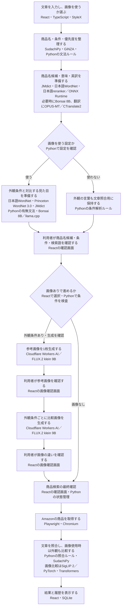
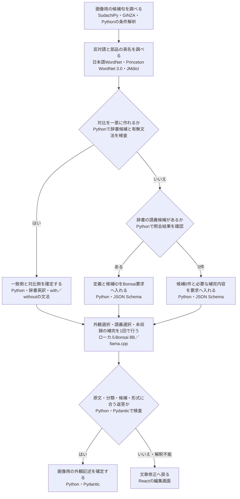
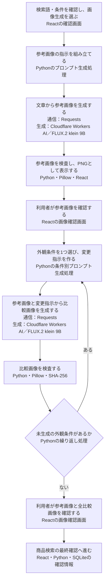
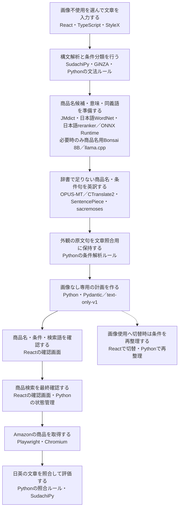
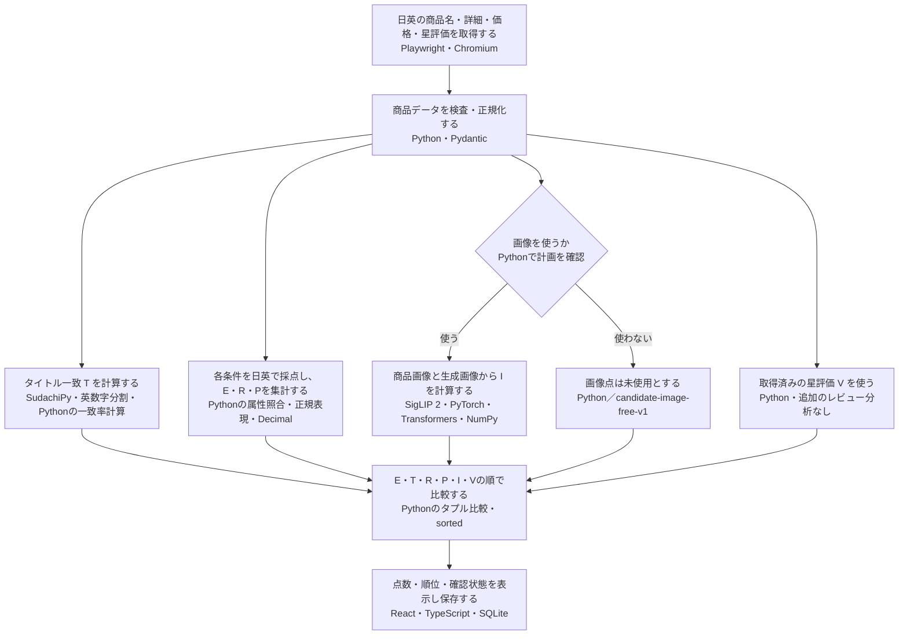
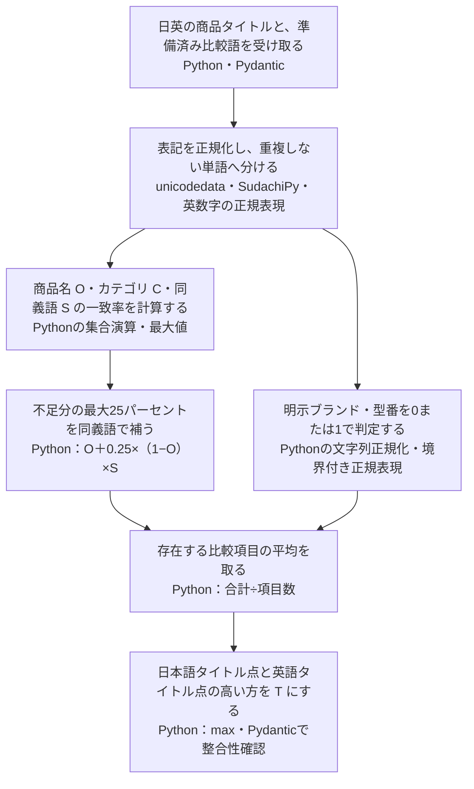
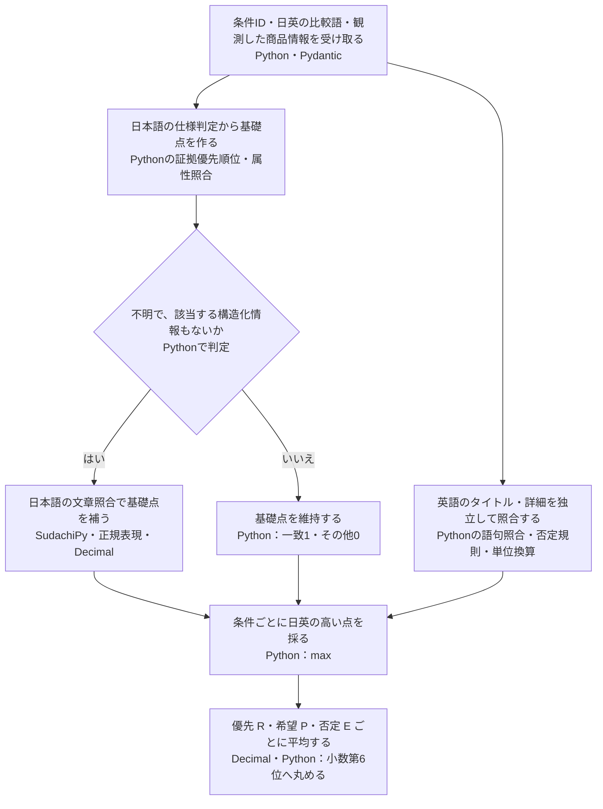
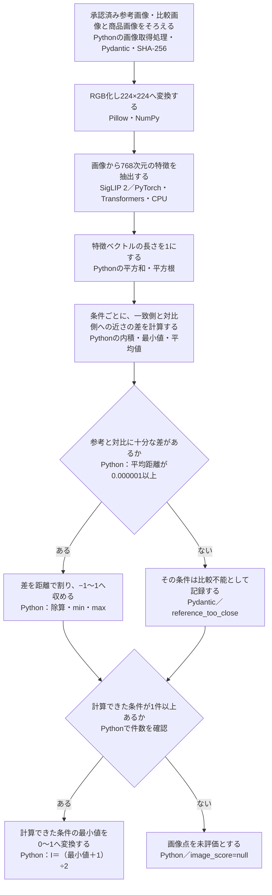
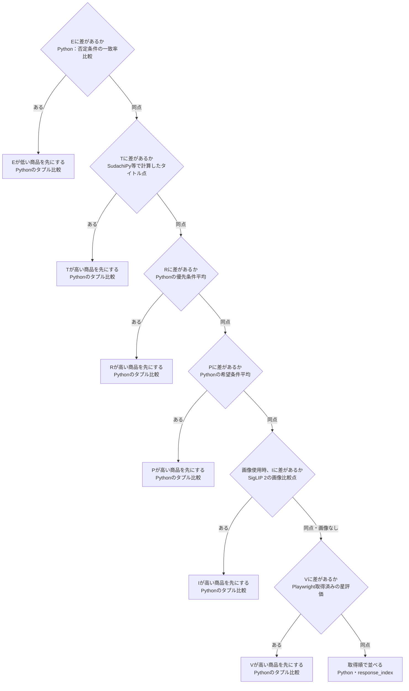

# 文章の分解・画像生成・スコアリングの仕組み

このアプリは、入力された文章を「探す商品」「商品の条件」「見た目の条件」に整理し、利用者が確認した内容から画像を作ります。文章の整理には日本語解析・辞書・翻訳モデル・Bonsaiを組み合わせ、画像を描く処理にはCloudflare Workers AIの **FLUX.2 klein 9B** を使います。取得した商品の採点は、文章の照合ルールと **SigLIP 2** による画像比較で行います。

**各技術の仕組み・入力と出力・役割分担は第2節**、文章の分解は第3〜5節、画像生成は第6〜8節、採点の計算式・具体例・最終順位は第9節にまとめています。

本書は、非エンジニア向けに、処理の順序と各技術の役割を説明するものです。**2026年9月13日時点の作業ツリーにある、Reactの接続画面とcandidate経路のコード**を対象にしています。未コミットの実装も含むため、起動済みサーバーへの反映や公開済みバージョンの動作を示すものではありません。

コードと仕様を読み合わせた解説であり、本書作成のための実モデル実行・画像生成・商品検索は行っていません。以下の入力・英訳・画像内容はすべて説明用に作った例で、実利用者の入力や実サービスの応答ではありません。

## 1. 最初に押さえる全体像

役割を人の作業に例えると、次のようになります。

| 役割 | このアプリで行うこと | 主な技術 |
|---|---|---|
| 文章を読む担当 | 単語の区切りや、「何を探すか」「何が条件か」を調べる | SudachiPy、GiNZA、Pythonの文法ルール |
| 辞書を引く担当 | 商品名の意味・別名・英訳、見た目を対比する語を調べる | JMdict、日本語WordNet、Princeton WordNet |
| 意味を比べる担当 | 入力文と辞書の説明がどれくらい合うかを調べる | 日本語reranker、ONNX Runtime |
| 足りない解釈を補う担当 | 商品名候補を選ぶ・提案する。外観と対比の記述を補う | ローカルのBonsai 8B |
| 翻訳する担当 | 辞書で足りない日本語の商品名や条件句を英語にする | OPUS-MT、CTranslate2 |
| 絵を描く担当 | 参考画像と、条件を1つ変えた比較画像を作る | Cloudflare Workers AI、FLUX.2 klein 9B |
| 画像を比べる担当 | 生成画像と、取得した実商品の画像の見た目を比べる | SigLIP 2 |

利用者が読む順序でまとめると、次の流れです。ひし形は分岐、四角は処理や確認を表します。図はMermaid形式です。Mermaid対応のMarkdownビューアーで表示でき、図を表示できない環境でも各節の文章と表で同じ内容を確認できます。



文章の意味が曖昧な場合は、画像生成前に文章修正へ戻ります。画像の確認段階でも、条件へ戻る・上限内で作り直す・画像なしに切り替える操作があります。これらの戻り道は第8節で説明します。

**Reactの既定のモック画面**は、固定の合成データで操作を試すものです。本書のBonsai・画像生成・商品取得につながるのは、専用サーバーを明示的に起動して使う接続画面です。

## 2. 実際に使われている技術

「AI」という呼び方だけでは役割が分からないため、モデル名・実行基盤・辞書を分けて示します。

| 技術・モデル | 何をするか | 実行場所・補足 |
|---|---|---|
| React、TypeScript、StyleX | 入力、条件確認、画像確認、結果の画面を作る | 利用者のブラウザ |
| Python、Python HTTPServer | 接続画面の操作を受け取り、確認段階に沿って処理を進める | ローカルサーバー。検索を進めるworkerは1本 |
| Pydantic、JSON Schema | 入力やAIの返答が所定の形式・範囲に収まるか検査する | ローカル。例えば余計な項目や不正な分類を拒否する |
| SudachiPy、SudachiDict-core | 日本語を単語に分け、表記を正規化する | ローカル。これを「形態素解析」と呼ぶ |
| spaCy、GiNZA、`ja_ginza` | 単語同士の係り受けから商品句と条件の範囲を調べる | ローカル。辞書・構文解析を構成した経路で使用 |
| Pythonの条件解析ルール | 「できれば」「避けたい」「なくてもよい」などを分類する | `condition-language-v1`。分類用LLMは追加しない |
| JMdict | 日本語の表記、語義、英訳を参照する | 準備済みSQLite辞書をローカルで読む。部品名の英訳にも使う |
| Japanese WordNet 1.1 | 語の意味・同義語・日本語の定義や用例を参照する | 商品名・条件語句の展開と、外観の辞書参照に使用 |
| Princeton WordNet 3.0 | 英語の直接反対語の関係を参照する | 準備済み`data.adj`を日本語WordNetの語義と対応させる |
| `hotchpotch/japanese-reranker-xsmall-v2` | 入力文と辞書の語義説明の対応を点数化する | ONNX RuntimeとHugging Face Tokenizersを使いCPUで実行。商品そのものの採点には使わない |
| Bonsai 8B、`Bonsai-8B.gguf` | 商品名候補の選択・補完と、視覚条件の解釈を行う | llama.cppの`llama-server`を通してローカル実行。GGUFはモデルの保存形式 |
| OPUS-MT | 日本語の商品名・条件句を英語へ翻訳する | ローカル翻訳を設定した構成で使用。接続画面のlive構成はこの経路を組み込む |
| CTranslate2、SentencePiece、sacremoses | OPUS-MTの実行、翻訳用の単語分割、句読点の整理を担う | 別Python環境のCPUで`int8_float32`モデルを実行 |
| Cloudflare Workers AI | 画像生成の要求を受け付ける外部サービス | 画像生成時にCloudflareへ通信し、設定済みAPIトークンを使用 |
| **FLUX.2 klein 9B** | 文章から参考画像を作り、参考画像から比較画像を作る | 現行モデルIDは`@cf/black-forest-labs/flux-2-klein-9b` |
| Requests、Pillow | HTTP通信、返ってきた画像の検査・PNG化などを行う | API応答をそのまま画面に渡さず、ローカルで検査する |
| SigLIP 2、`google/siglip2-base-patch16-224` | 画像を数値の特徴へ変換し、見た目を比較する | PyTorch・Transformersを使う別Python環境。画像は生成しない |
| Playwright、Chromium | 実商品の検索結果と日英の商品詳細を取得する | ローカルの匿名ブラウザからAmazon.co.jpへ通信する |
| SQLite、SHA-256 | 履歴の保存、条件・画像・確認内容の対応確認 | SHA-256は内容から作る識別用の値。画像の品質を保証する仕組みではない |

モデルや辞書は事前準備された資材を使います。検索のたびに辞書をダウンロードする構成ではありません。任意のCLI構成では辞書・翻訳の設定が異なるため、本書では接続画面の構成を中心に説明します。

### 2.1 「モデル」「実行ソフト」「辞書」「ルール」の違い

本書に出てくる技術名は、同じ種類のものではありません。次の区別をすると、それぞれを組み合わせる理由が分かります。

| 種類 | 意味 | このアプリの例 |
|---|---|---|
| 辞書 | 人が整理した単語・意味・語の関係を収録したデータ | JMdict、WordNet |
| モデル | 学習によって調整された数値を使い、入力から結果を計算する仕組み | Bonsai、OPUS-MT、SigLIP 2、日本語reranker |
| 実行ソフト・ライブラリ | モデルの計算や、特定の処理を実際に動かすプログラム | llama.cpp、CTranslate2、ONNX Runtime、PyTorch |
| ルール | 開発者が条件分岐や計算式として明示した決まり | 希望・否定の分類、単位換算、最終順位 |
| ファイル形式 | データやモデルを保存・受け渡しするための形 | GGUF、ONNX、JSON、PNG |
| サービス | 通信で処理を依頼できる実行先 | Cloudflare Workers AI |

**モデルは学習済みの中身、実行ソフトはそれを動かす側**です。例えば「Bonsaiをllama.cppで実行する」「OPUS-MTをCTranslate2で実行する」という関係になります。Bonsaiとllama.cppを、2つのAIが順番に回答する構成と捉えると誤解が生じます。

モデルを動かして答えを得ることを「推論」と呼びます。学習済みの数値を調整し直す「学習」とは別です。この検索フローは準備済みのモデルを推論に使い、検索のたびに利用者の入力でモデルを再学習する処理はありません。

「ライブラリ」は、アプリから呼び出して使うプログラム部品です。例えばPillowを呼べば画像を読み込め、SQLiteを使えば情報をファイルに保存できます。

### 2.2 React・TypeScript・StyleX：利用者が操作する画面

**React**は、画面を「入力欄」「条件カード」「画像確認」「点数表」などの部品に分け、データに応じて表示を更新する仕組みです。このアプリでは、Python側から届いた検索段階や残り回数を基に、表示する画面や押せるボタンを切り替えます。

**TypeScript**は、JavaScriptに「どの種類のデータを扱うか」という型を加える言語です。例えば画像点が「数値または未評価」であることを開発時に確認し、未評価を数値として計算してしまうような誤りを見つけやすくします。ただし、通信相手の返答が正しいことまで型だけで保証されるわけではありません。

**StyleX**は、画面部品の色・余白・文字・枠などを定義する仕組みです。条件の意味や採点値を決める処理は担当しません。

| 画面が受け取るもの | 画面が表示・送信するもの |
|---|---|
| 検索の段階、条件、画像、点数、エラー状態 | 条件一覧、画像、点数表、操作可能なボタン |
| 利用者による入力・確認・修正 | Python側への開始・確認・再整理などの操作要求 |

画面の開発・配布準備には**Node.js・npm・Vite**を使います。Node.jsはJavaScriptをブラウザ外で動かす環境、npmは依存部品の管理、Viteは画面コードやStyleXの定義を配布用ファイルへまとめるビルドを担当します。接続サーバーは、その配布用ファイルをブラウザへ届けます。

実装：[main.tsx](frontend/src/main.tsx)、[ConnectedApp.tsx](frontend/src/ConnectedApp.tsx)、[vite.config.ts](frontend/vite.config.ts)。

### 2.3 Python・HTTPServer：確認の順序を管理する

**Python**は、辞書を引く、条件を分類する、モデルを呼ぶ、点数を計算する、履歴を保存するといった処理をつなぐプログラミング言語です。このアプリ独自の判断の多くはPythonのコードとして書かれています。

**HTTPServer**はPython標準のHTTPサーバーです。接続画面では、例えばブラウザから状態取得の要求を受けると、現在の段階をJSONで返します。「画像を確認した」という操作要求では、現在その操作が可能な段階か、対象の計画と一致するかを調べてから次へ進めます。

この「いまどの段階か」を扱う仕組みを**状態管理**と呼びます。「文章整理前」「検索語確認中」「参考画像確認中」などを区別することで、確認前の商品取得や、古い画像の確認を使った実行を防ぎます。

検索を進めるworkerは1本です。一方、翻訳や画像モデルなどには専用の子プロセスがあります。「workerが1本」は、パソコン上のOSプロセスがすべて1個になるという意味ではありません。

実装：[browser_search_server.py](tools/browser_search_server.py)、[browser_search.py](src/search_v2/browser_search.py)、[candidate_flow.py](src/search_v2/candidate_flow.py)。

### 2.4 SudachiPy・SudachiDict-core：日本語を比較できる単位にする

**SudachiPy**は、日本語の文章を単語に分け、各単語の品詞・基本形・位置などを調べる形態素解析器です。**SudachiDict-core**は、その解析器が参照する辞書データです。「解析するプログラム」と「解析に必要な語彙データ」という関係です。[SudachiPy公式API](https://worksapplications.github.io/sudachi.rs/python/api/sudachipy.html)には、分割モード、辞書形、正規化形、単語位置などの取得方法が定義されています。

日本語は「白いマグカップが欲しい」のように単語間へ空白を置かないため、どの部分を比較対象の単語にするかを決める必要があります。SudachiPyの出力から、このアプリは名詞・動詞・形容詞・形状詞などを使います。

| 入力 | 途中で得る情報 | このアプリでの出力 |
|---|---|---|
| 日本語の文字列 | 単語の表記、正規化形、品詞、開始・終了位置 | 検索語やタイトル照合用の単語、原文との対応範囲 |

実装は長い単位を扱う**SplitMode.C**を使い、さらに接頭辞・接尾辞を扱う規則を加えています。「名刺入れ」のような商品名を不適切に分割し、別の意味の語にしないためです。実際の分割は辞書と入力に依存します。

**NFKC正規化**は、全角英数字などの互換的な文字表現をそろえる処理です。例えば`ＡＢＣ１２３`と`ABC123`の表記差を小さくします。小文字化も組み合わせます。ただし、正規化だけで「意味が同じ別の単語」を見つけられるわけではありません。それには後述の辞書の語義を使います。

実装：[tokenizer.py](src/search_v2/tokenizer.py)。採点への使い方は第9.3・9.5節。

### 2.5 spaCy・GiNZA・ja_ginza：何が何を説明しているかを調べる

**spaCy**は自然言語処理の基盤となるライブラリ、**GiNZA**はその上で動く日本語解析の仕組み、**ja_ginza**は読み込む日本語解析モデルのパッケージです。GiNZAは単語の係り受けや品詞などを扱います。[GiNZA公式説明](https://github.com/megagonlabs/ginza)

例えば「蓋のあるマグカップを探す」という文では、「探す」の対象が何か、「蓋のある」がどの名詞を説明しているかという関係が重要です。これは単語一覧だけでは表しにくい情報です。

このアプリは解析結果のうち、文の中心を示す`ROOT`、目的語の`obj`、主語の`nsubj`などの関係を使い、商品句とそれ以外の条件範囲を取り出します。出力は「商品名の文字範囲」「条件部分の文字範囲」「依頼表現の文字範囲」です。

GiNZA自体が最終的な検索条件をすべて決めるわけではありません。「できれば」を希望条件へ分類する処理や、複数の商品候補が曖昧なら修正を求める処理は、その解析結果を受け取るPython側の規則です。現在の読込では固有表現認識の`ner`を無効にしています。

実装：[GinzaProductParser](src/search_v2/lexical_runtime.py)。

### 2.6 JMdict：表記・語義・英訳を調べる

**JMdict**は、日本語を中心とした多言語の語彙データベースです。元データはXMLという構造化された形式で配布されます。[JMdict公式説明](https://www.edrdg.org/jmdict/j_jmdict.html)

このアプリでは、準備段階で元データから対象の表記・読み・語義・英訳を取り出し、検索しやすいSQLiteファイルへまとめます。実行時にXML全体を毎回読み直す必要はありません。

| 用語 | 意味 | 利用例 |
|---|---|---|
| 表記・読み | 漢字やかななど、その語を見つける手掛かり | 入力の商品名で辞書を照会する |
| 語義 | 1つの語が持つ意味の区別 | 同じ語の別の意味を混ぜない |
| 英訳・gloss | その意味を英語で表す語や説明 | 商品名や部品名の英語候補を得る |
| 語義ID | どの辞書のどの意味を参照したかの識別子 | Bonsaiの選択や出典を検査する |

このリポジトリの取込処理は名詞の語義を対象にし、読みや用法の制限を安全に扱えない語義などは採用しません。したがって「JMdictに収録されている」ことと「このアプリが用意した辞書から候補を返せる」ことは同一ではありません。

JMdictは商品カタログではないため、販売中の商品や在庫を保証しません。ここでは「探す商品を何と呼ぶか」「部品名を英語で何と言うか」の準備に使います。

実装：[lexical_dictionary.py](src/search_v2/lexical_dictionary.py)、[product_phrase.py](src/search_v2/product_phrase.py)。

### 2.7 WordNet：同じ意味と反対の意味を区別する

**WordNet**は、語を意味のまとまりと関係で整理した辞書です。同じ意味を表す語のまとまりを**synset**と呼び、同義・上位下位・反対語などの関係を区別します。[Princeton WordNetの語義・関係の説明](https://wordnet.princeton.edu/documentation/wninput5wn)

このアプリでは、用途によって参照先を分けています。

| 用途 | 参照先 | 得るもの |
|---|---|---|
| 商品名・条件語句を展開する | 日本語WordNet 1.1から準備したローカル辞書 | 同一語義の日本語表記・英語表記・定義・用例 |
| 外観の直接反対語を探す | 日本語WordNet 1.1とPrinceton WordNet 3.0の`data.adj` | 元の語義に対応する英語の反対語候補 |
| 部品名の英訳を探す | 日本語WordNetの名詞語義 | 「ある／ない」の文を作るための英語名詞句 |

反対語の照会は、日本語の語 → 語義ID → 同じ語義に対応する英語記録 → 直接反対語、という順でたどります。Princetonのデータでは`!`が反対語、`&`が類似関係を表します。このアプリは`!`を読み、類似関係を反対語として流用しません。

また、上位語が同じだからといって同義語にはしません。例えば「どちらも容器」という関係だけで、異なる商品名を交換可能とは扱いません。検索用辞書では手動確認された日本語の対応を使います。

`data.adj`内の位置を表す番号と日本語側の語義を対応させるため、Princeton側の版を3.0に固定しています。別の版を無条件に混ぜると番号の意味が変わり得るので、コードで版と内容を検査します。複数候補なら文脈に合うものを選び、候補0件なら第5節のBonsai補完へ進みます。

実装：[wordnet_contrast.py](src/search_v2/wordnet_contrast.py)、[visual_contrast.py](src/search_v2/visual_contrast.py)。日本語データの公開元：[Japanese Wordnet](https://github.com/bond-lab/wnja)。

### 2.8 日本語reranker・ONNX Runtime・Tokenizers：辞書の意味を文脈に照らす

**reranker（リランカー）**は、質問や文脈と候補文の対応を比較するモデルです。採用モデルは`hotchpotch/japanese-reranker-xsmall-v2`で、公開資料ではModernBERT系の小型モデルとして説明されています。[モデルの公式説明](https://huggingface.co/hotchpotch/japanese-reranker-xsmall-v2)

このアプリでは、通常の文書検索の順位付けではなく、辞書の語義選択へ使っています。入力は「利用者の原文」と「候補語義の語・日本語定義・最大2件の用例」の組です。候補ごとに1つの対応点を得ます。

**Cross-Encoder**とは、この2つの文章を組にして読み、その組の対応を直接評価する方式です。例として「棚に置くための台」と「演奏に使う台」では、商品句が同じでも周囲の説明が異なるため、辞書の意味との対応点が変わることがあります。これは仕組みの例で、実際のモデル応答ではありません。

| 部品 | このアプリでの仕事 |
|---|---|
| Hugging Face Tokenizers | 文の組を、そのモデル専用のトークンIDへ変換する |
| ONNX形式のモデル | 学習済みの計算手順と数値を保持する |
| ONNX Runtime | モデルの計算をCPU上で実行する |
| Python側の後処理 | 出力値を0〜1へ変換し、採用基準と次点との差を検査する |

**トークン**はモデルが扱う文字列の単位です。人間の単語と必ずしも一致せず、SudachiPyによる日本語の単語分割とも用途が異なります。このモデルでは専用tokenizerを使い、長すぎる入力を無条件に切って採用することはしません。

ONNX Runtimeは機械学習モデルを実行するエンジンで、モデル自体の代わりにはなりません。[ONNX Runtime公式説明](https://onnxruntime.ai/docs/) 本実装では`CPUExecutionProvider`を指定し、出力した数値をシグモイド関数`1 ÷ (1 + exp(−x))`で0〜1へ変換します。その値が0.80以上かつ次点差0.20以上なら採用するという判断は、アプリ側の規則です。

ここで高得点だったことは、「この語義が原文とよく対応する」という意味です。Amazonの商品が高品質、条件に合格、という点数ではありません。

実装：[lexical_context.py](src/search_v2/lexical_context.py)、[lexical_runtime.py](src/search_v2/lexical_runtime.py)。

### 2.9 Bonsai 8B・llama.cpp・GGUF：必要な言語解釈を補う

**Bonsai 8B**は、文章を入力し、語や文章の続きを生成する言語モデルです。配布元はQwen3-8B系の構造と約81.9億のパラメータを説明しています。パラメータは、学習で調整された計算用の数値です。「8B」はおおよその規模を示し、回答精度や処理秒数を示す数字ではありません。[Bonsai配布元のモデル説明](https://huggingface.co/prism-ml/Bonsai-8B-gguf)

**llama.cpp**は、こうした言語モデルを動かす実行ソフトです。**GGUF**はモデルの重み・関連情報を保存するファイル形式で、`llama-server`がこのファイルを読みます。[llama.cpp公式説明](https://github.com/ggml-org/llama.cpp)

配布元のBonsai GGUFには、重みを少ないビット数で表す`Q1_0`という量子化形式の説明があります。**量子化**は、多数の計算用数値の表現を圧縮して必要な容量や計算負荷を減らす工夫です。モデル規模、量子化したファイルサイズ、実行時に必要なメモリ量は、それぞれ別の数字です。

このアプリでは配置済みの`Bonsai-8B.gguf`を読み、ローカルのHTTP窓口を通して要求します。接続画面のコードには、商品名用・視覚条件用という2つの用途があります。

| 用途 | 入力 | 出力 |
|---|---|---|
| 商品名の選択・補完 | 原文の商品句と文脈、ある場合は辞書候補 | 辞書の語義ID、または未収録の商品名の提案 |
| 視覚条件の解釈 | 候補句、確定済み分類、辞書対比候補、未収録の補完依頼 | 選んだ原文句、対象部位、候補IDまたは画像用の対比記述 |

視覚条件の要求では`temperature = 0.0`を指定しています。temperatureは出力の選択のばらつきに関係する設定です。低くしても内容の正しさが保証されるわけではないため、返答は必ずコードで検査します。

辞書のIDを選ぶ処理では、候補にないIDを生成しても採用しません。未知の部品名を補う場合も、有無を含む自由な文章すべてを任せず、短い英語名詞句を受けてPythonが有無の指示を作ります。商品本文を送って最終点や順位を回答させる用途には使いません。

実装：[browser_search_runtime.py](tools/browser_search_runtime.py)、[bonsai_visual_conditions.py](src/search_v2/bonsai_visual_conditions.py)、[lexical_context.py](src/search_v2/lexical_context.py)。

### 2.10 OPUS-MT・CTranslate2・SentencePiece・sacremoses：ローカルで英訳する

**OPUS-MT**は翻訳モデルです。採用する日本語→英語モデルの公開資料は`Helsinki-NLP/opus-mt-ja-en`で、Marian系のTransformerモデルと、正規化・SentencePieceによる前処理を説明しています。[OPUS-MT公式モデルカード](https://huggingface.co/Helsinki-NLP/opus-mt-ja-en)

**Transformer**は、文中の要素同士の関係を取り込んで表現を計算するモデル構造です。翻訳では、入力文の表現を計算し、それに基づいて出力言語のトークン列を生成します。このアプリでは、辞書に確定した英訳がない商品名や条件句を渡します。

翻訳処理には、次の部品が順番に関わります。

| 順序 | 技術 | このアプリでの処理 |
|---:|---|---|
| 1 | sacremoses | 句読点や制御文字などを整理する |
| 2 | SentencePiece | 日本語を、翻訳モデルが読める部分語のトークン列へ変換する |
| 3 | CTranslate2 | 変換済みOPUS-MTの重みを使い、英語トークン列を生成する |
| 4 | SentencePiece | 英語トークン列を文字列へ戻す |
| 5 | Pythonの検証 | 出力数・長さ・数値の変化などを調べ、採用できる英訳だけを保持する |

**SentencePiece**は、単語全体だけでなく、その一部である「部分語」を単位として扱うtokenizerです。日本語のように空白で単語が区切られていない言語も扱えます。[SentencePiece公式説明](https://github.com/google/sentencepiece) SudachiPyが検索・解析用の単語を扱うのに対し、こちらは翻訳モデルの語彙と一致する入力・出力を作ります。

**CTranslate2**は翻訳などのモデルを効率よく動かす実行ソフトです。本実装はCPUで`int8_float32`を指定します。これは、重みの8ビット量子化と、それ以外の浮動小数点計算の型を組み合わせた設定です。文字列を8ビットに短縮するという意味ではありません。[CTranslate2の量子化仕様](https://opennmt.net/CTranslate2/quantization.html)

1回のworker入力は最大2句、1句100文字までです。生成では`beam_size = 4`を使い、途中の訳候補を複数保ちながら探索しますが、返す候補は1句につき1つです。生成上限は64トークンで、正常な終端に到達しなければ、その訳を未取得として扱います。

この別Python環境は、モデルとライブラリの組合せを固定するためのものです。翻訳の失敗で日本語条件を捨てたり、商品本文を丸ごと外部翻訳へ送ったりする経路はありません。

実装：[opus_mt.py](src/search_v2/opus_mt.py)、[opus_mt_worker.py](src/search_v2/opus_mt_worker.py)、[condition_terms.py](src/search_v2/condition_terms.py)。

### 2.11 Cloudflare Workers AI・FLUX.2 klein 9B：画像を描く

**Cloudflare Workers AI**はモデルを動かす外部サービス、**FLUX.2 klein 9B**はそこで実行するBlack Forest Labsの画像モデルです。Cloudflareのモデル窓口へ要求すると、生成画像が返ります。[Cloudflare公式モデル仕様](https://developers.cloudflare.com/workers-ai/models/flux-2-klein-9b/)

このアプリでの役割は、文章から新しい参考画像を描くことと、参考画像を基に条件を変えた比較画像を描くことです。辞書から既存の写真を取り出す処理ではありません。

| 生成の種類 | モデルへ渡すもの | 返ってくるもの |
|---|---|---|
| 参考画像 | 商品の題材、外観記述、背景などの指示、サイズ、seed | 512×512の画像 |
| 比較画像 | 同じ参考画像、条件を1つ変える編集指示、サイズ、seed | 512×512の比較画像 |

**プロンプト**は生成への指示文、**seed**は生成に使う乱数を制御する値です。プロンプトに「蓋を取り除く」と書くことと、結果画像で実際に蓋が消えることは別なので、人が確認する段階を設けています。

通信には画像ファイルと文章を同時に送れる**multipart形式**を使います。返答のBase64は、画像のバイナリデータを文字列として運ぶための表現です。暗号化や画像の意味理解をする技術ではありません。返答をデコードして画像を検査し、PNGとして扱います。

この経路の画像モデルはCloudflare側で動きます。ローカルPCにFLUXの重みを読み込んで描く実装ではありません。生成モデルの内部処理をアプリが自由に変更する構成でもなく、アプリが制御するのはモデルID、入力画像、指示、サイズ、seedなどの要求内容です。

実装：[counterfactual_cloudflare_request.py](src/search_v2/counterfactual_cloudflare_request.py)、[counterfactual_cloudflare_http.py](src/search_v2/counterfactual_cloudflare_http.py)。

### 2.12 SigLIP 2・PyTorch・Transformers：画像を比較用の数値にする

**SigLIP 2**は画像と言語を扱う事前学習済みモデルで、画像検索や画像分類、画像特徴の抽出などに使えます。このリポジトリが使うのは画像の特徴を取り出す側です。[Google公式モデルカード](https://huggingface.co/google/siglip2-base-patch16-224)

写真はそのままでは数値比較しにくいため、画像の内容を圧縮した**特徴ベクトル**へ変換します。採用モデルでは1画像から768個の数値を得ます。「768個の画像条件を判定する」という意味ではなく、画像全体の表現に使う数値の個数です。

| 技術 | このアプリでの仕事 |
|---|---|
| SigLIP 2の学習済み重み | どのような画像を近い表現にするかを含む、学習済みの計算を提供する |
| Transformers | 指定モデルと画像前処理を読み込み、`get_image_features`を呼び出す入口を提供する |
| PyTorch | 多次元の数値配列であるテンソルを扱い、モデルの演算を実行する |
| Pillow | RGB画像として読み込み、入力サイズへ変換する |
| NumPy | 複数画像の画素を数値配列へまとめ、専用workerと受け渡す |
| Pythonの比較式 | ベクトルの正規化・コサイン類似度・条件別の差・最小値を計算する |

このフローは画像から「白い」「蓋あり」という文章を生成し、その文章を再採点する方式ではありません。商品画像と見本画像を同じモデルで数値に変換し、数値同士の近さを比べます。

モデルの重みや前処理が違えば、同じ768次元でも比較の意味が変わり得ます。そのため、同じ固定資材・同じ前処理で作った特徴だけを組み合わせます。別Python環境のCPUで動かし、画像点を計算するworkerでは外部接続と自動モデル取得を無効にしています。

画像が似ているかというモデルの出力と、アプリ独自の「条件ごとに差を取り、その最小値を画像点にする」という式は別の層です。具体的な式は第9.8節に掲載しています。

実装：[siglip2.py](src/search_v2/siglip2.py)、[siglip2_worker.py](src/search_v2/siglip2_worker.py)、[relative_image_ranking.py](src/search_v2/relative_image_ranking.py)。

### 2.13 Pillow・NumPy・Decimal・正規表現：AIの前後を支える計算

これらは、データの変換や決められた規則の計算を担当する部品です。

| 技術 | どのような仕組みか | このアプリの具体的な処理 |
|---|---|---|
| Pillow | 画像を画素として読み書きし、色形式やサイズを変える | RGB化、PNG化、縮小表示、SigLIP入力の224×224化 |
| NumPy | 大量の数値を配列としてまとめて扱う | 高さ×幅×RGBの画素配列、複数画像のまとめ処理、モデル結果の受け渡し |
| `Decimal` | 十進数の精度を管理して計算する | 0.5Lを500mlへ換算、価格・容量の上下限比較、条件点の平均 |
| 正規表現 `re` | 文字の並びのパターンを照合する | 属性名の後ろの数値・単位、否定表現、ブランドや型番の境界 |
| 集合演算 | 重複を除いた要素の共通部分を数える | 比較語の何単語が商品タイトルにあるかを計算 |
| タプル比較 | 複数項目を左から順に比べる | E、T、R、P、I、Vの順で最終順位を決める |

例えば`Capacity: 0.5 liters`を処理する場合、正規表現などで容量ラベルと値・単位を取り出し、定義済みの換算規則で500mlへ直し、指定の下限と比較します。この過程に、数値を推測する言語モデルは入りません。

**補間**は、画像を拡大・縮小するときに新しい画素値を計算する処理です。採用するBILINEARは周辺の画素から値を補います。高精細化する生成AIとは異なり、元画像で見えない部品の構造を確定できるものではありません。

実装：[candidate_text.py](src/search_v2/candidate_text.py)、[candidate_bilingual.py](src/search_v2/candidate_bilingual.py)、[candidate_completion.py](src/search_v2/candidate_completion.py)。

### 2.14 Playwright・Chromium：商品ページを読み取る

**Chromium**は実際にページを表示するブラウザ、**Playwright**はそのブラウザをプログラムから操作するライブラリです。このアプリはNode.js上の処理からChromiumを操作し、Amazon.co.jpの検索結果や商品詳細を読みます。

ページから読み取るのは、ブラウザ内に作られた**DOM**、つまり見出し・文章・リンクなどの要素の構造です。画面のスクリーンショットをAIに読ませて価格や商品名を推測する方式ではありません。

| 入力 | 処理 | 出力 |
|---|---|---|
| 確認済み検索語・取得件数など | 検索結果を開き、商品詳細を日英で順に確認する | 商品名、説明、特徴、価格、星評価、画像URLなど |

日英の取得では、同じ商品の識別子である**ASIN**が一致するかを調べます。英語ページを要求しただけでは英語取得済みにせず、ページの言語や内容も検査します。日本語と英語はcookieを共有しない匿名のブラウザ環境で扱います。

実際に存在するページを取得する処理なので、通信失敗やページ構造の変更、CAPTCHAなどで情報を得られないことがあります。その場合に、商品情報をBonsaiへ作らせて埋める処理はありません。取得できなかった情報は欠損として扱うか、その取得段階を停止します。

実装：[playwright_products.py](src/search_v2/playwright_products.py)、[playwright_products_worker.mjs](tools/playwright_products_worker.mjs)、[playwright_products_collect.mjs](tools/playwright_products_collect.mjs)。

### 2.15 JSON・JSON Schema・Pydantic・Requests：受け渡しと検査

**JSON**は、名前と値、配列を組み合わせて情報を送る文字形式です。例えば条件の強さを`"strength": "preferred"`のように表せます。人間向けの自由文より、プログラムが項目を取り出して検査しやすくなります。

**JSON Schema**は、JSONに「必要な項目」「値の型」「許される選択肢」などを定める規則です。視覚Bonsaiの要求では、条件ごとに許可する原文句や語義IDなどをschemaへ入れます。

**Pydantic**は、Pythonでデータの構造・型・範囲と追加の整合性を検査するライブラリです。このアプリは、返答の形式だけでなく、次のような関係も検査します。

- 分類が`required / preferred / excluded`の許可された値か。
- 原文の範囲が、その条件の記述と対応しているか。
- 指定された辞書IDが、その条件へ渡した候補のものか。
- 採用点が日英の最大値と一致しているか。
- 画像や履歴が別の商品・条件・計画と混ざっていないか。

形式検査に通ることと、文章の解釈や絵の内容が正しいことは別です。例えば数値が0〜1の範囲にあることは検査できますが、それだけでモデルの意味判断が正しいとは言えません。

**Requests**はPythonからHTTP通信をするライブラリです。ローカルBonsaiやCloudflareの窓口に要求を送り、応答を受け取ります。HTTPは通信の方法であり、HTTPを使ったら必ず外部インターネットへ送るわけではありません。`127.0.0.1`宛ては同じコンピューター内への接続です。

実装：[bonsai_visual_conditions.py](src/search_v2/bonsai_visual_conditions.py)、[candidate_search.py](src/search_v2/candidate_search.py)、[cloudflare_http.py](src/search_v2/cloudflare_http.py)。

### 2.16 SQLite・SHA-256：履歴を保存し、取り違えを検知する

**SQLite**は、ファイルに表形式のデータを保存し、条件を指定して検索・更新できるデータベースです。別のデータベースサーバーを立ち上げず、Pythonの処理から読み書きできます。

このアプリではSQLiteを複数の用途に使います。辞書用DBは準備済みデータを読み取り専用で参照し、履歴用DBには完了時の条件・順位・点数・画像などを保存します。同じSQLiteという技術を使っていても、辞書と履歴は役割が異なります。

関連するデータをまとめて保存し、途中までだけ保存された状態を避ける仕組みを**トランザクション**と呼びます。履歴本体と画像などを同じ処理のまとまりで保存・削除し、失敗時には不完全な更新を残さないようにします。

**SHA-256**は、データから一定の長さの識別値を計算するハッシュ関数です。このアプリはモデル・辞書のファイル、条件、画像の画素などから値を作り、準備時・確認時・採点時で内容が同じかを検査します。

例えば、確認した画像が後から別の画像へ差し替わると、その画像から計算する識別値も変わります。条件と画像を結び付けた情報を検査することで、古い確認を新しい画像へ流用することを防ぎます。

ハッシュは暗号化とは異なります。ハッシュだけで画像の内容が正しいか、文章が正しく解釈されたかは判断できません。また、秘密の値をハッシュ化しただけで、あらゆる保存・公開が安全になるわけでもありません。本書での用途は、内容と版の対応確認です。

実装：[lexical_assets.py](src/search_v2/lexical_assets.py)、[provisional_approval_repository.py](src/search_v2/provisional_approval_repository.py)、[provisional_history_repository.py](src/search_v2/provisional_history_repository.py)。

### 2.17 どこで動き、どんなデータを渡すのか

| 処理 | 実行先 | 入力 | 主な出力 |
|---|---|---|---|
| 画面 | ブラウザのReact | 操作、サーバーからの状態 | 画面表示、操作要求 |
| 単語・係り受け解析 | ローカルのSudachiPy・GiNZA | 原文 | 単語、関係、文字範囲 |
| 辞書照会 | ローカルのJMdict・WordNet資材 | 商品句・条件句・語義 | 表記、英訳、定義、反対語 |
| 語義照合 | ローカルのONNX Runtime | 原文と語義説明の組 | 候補ごとの対応点 |
| 商品名・外観の補完 | ローカルのllama.cpp／Bonsai | 原文、候補、分類、補完依頼 | 検査前の候補・構造化された返答 |
| 翻訳 | ローカルのCTranslate2／OPUS-MT | 短い日本語句 | 英語句、または未取得 |
| 画像生成 | Cloudflare Workers AI／FLUX | 指示文、比較生成では参考画像も | 生成画像 |
| 商品取得 | ローカルChromiumからAmazonへ接続 | 確認済み検索語など | 日英の商品情報 |
| 商品画像取得 | ローカルの画像取得処理から許可された画像ホストへ接続 | 取得済み画像URL | 検査済み画像 |
| 画像特徴抽出 | ローカルのPyTorch／SigLIP 2 | 検査済み画像 | 768次元の数値列 |
| 最終採点・順位 | ローカルPython | 観測値、比較語、画像特徴 | 点数、順位、確認状態 |
| 履歴 | ローカルSQLite | 完了時の結果 | 保存済み結果の再表示 |

「ローカルモデルを使う」ことと「検索全体が通信しない」ことは別です。画像生成、商品ページ取得、商品画像取得には外部通信があります。一方、辞書・語義照合・翻訳・画像特徴抽出は、事前準備した資材を端末内で使います。画像なしの設定では、画像生成・商品画像取得・画像特徴抽出の各処理を省きます。

公式資料は技術そのものの説明として参照し、アプリでの用途・上限・計算式は本リポジトリのコードを根拠にしています。参照した一次資料は[技術解説の参照記録](docs/REFERENCES.md#文章分解画像生成採点の技術解説2026-09-13確認)にもまとめています。

## 3. 入力文をどのように分解するか

### 3.1 説明用の入力

次の文を例にします。

> マグカップ。白い。できれば蓋付き。容量は300ml以上。2000円以下。

整理の考え方は次のとおりです。実際にこの文をモデルへ送った結果ではありません。

| 原文の部分 | 意味 | 強さ | 主な使い道 |
|---|---|---|---|
| マグカップ | 探したい商品 | 商品名 | 検索語候補と画像の題材 |
| 白い | 外観の色 | 優先条件 | 文章照合と、画像を使う場合の外観比較 |
| できれば蓋付き | 蓋があると望ましい | 希望条件 | 文章照合と、画像を使う場合の部品有無の比較 |
| 容量は300ml以上 | 容量の下限 | 優先条件 | 商品情報に記載された数値の確認・照合 |
| 2000円以下 | 価格の上限 | 優先条件 | 取得した価格の比較 |

このとき、画像に描く対象は主に「マグカップ」「白い」「蓋付き」です。容量300ml以上や2000円以下は、生成画像を見ても確かめられないため、画像用の条件から外します。

### 3.2 単語と文の構造を調べる

まず入力が空でないか、2000文字以内かを確認します。SudachiPyで表記を整え、単語の位置を調べます。GiNZAは、「何を探すのか」と、その商品を説明する部分を係り受けから取り出します。

「形態素解析」は文章を単語に区切る作業、「係り受け解析」はどの言葉がどの言葉を説明しているかを調べる作業です。単に空白や読点で切るだけでは、商品名と修飾語の関係を取り違えるため、両方を使います。

元の文のどの位置から取り出したかも保持します。これにより、確認画面で原文との対応を示し、Bonsaiが入力にない句を作ったり、一部だけ落としたりしていないか検査できます。

商品名に含まれる修飾語の範囲は構文解析の結果に従います。「〜付き」を見つけるたびに商品名を新しく分解し直し、必ず独立条件にするわけではありません。

### 3.3 条件の強さをローカルで分類する

条件には、内容とは別に「どれくらい重視するか」があります。

| 分類 | 表現の例 | アプリでの意味 |
|---|---|---|
| 優先条件 `required` | 「白い」「必ず」「必須」 | 優先して一致させたい条件 |
| 希望条件 `preferred` | 「できれば」「なるべく」「だとうれしい」 | 合えば望ましい条件 |
| 否定条件 `excluded` | 「避けたい」「不要」「いらない」「以外」 | 該当する商品を避けたい条件 |
| 指定なし `neutral` | 「なくてもよい」「こだわらない」「でも構わない」 | 絞り込みや採点に使わない条件 |

例えば「できれば蓋を避けたい」では、希望と否定が重なるため否定を優先します。「蓋はなくてもよい」は指定なしです。指定なしの句は原文と確認表示に残しますが、検索語・条件採点・画像生成から外します。

この分類はPythonの共通ルールで行い、Bonsaiには決まった分類を渡します。「優先条件」は、情報が不足した商品まで必ず検索結果から削除するという意味ではありません。文章の一致度と、仕様が確認できたかどうかは別に扱います。

また、「非対応の商品が欲しい」と「対応していなくてもよい」は違う意味です。単に「ない」があるかどうかだけで全条件を除外にはしません。二重否定や矛盾、修飾先の不明な文は、文章の修正を求めます。

## 4. 商品名・同義語・英訳を準備する

### 4.1 辞書の意味を文脈と照合する

「語義」とは、辞書にある意味の区別です。1つの言葉に複数の意味がある場合、検索したい商品の意味に合うものを選ぶ必要があります。

JMdictと日本語WordNetから商品名の候補を取り出し、必要に応じて日本語rerankerで入力文と辞書の定義・用例を比べます。このモデルは新しい文章を作らず、対応の強さを数値で返します。

ローカルの文脈評価で自動採用する基準は、次の両方です。

```text
1位の対応点が 0.80 以上
かつ
1位の対応点 − 2位の対応点が 0.20 以上
```

例えば1位0.91、2位0.60なら差は0.31なので採用できます。1位0.91、2位0.82なら差は0.09なので、この基準では決めません。**0.91は「91%の確率で正しい」という意味ではなく、このモデルの対応点**です。文脈を使う必要がなく辞書の意味が一意なら、辞書だけで確定できる経路もあります。

### 4.2 商品名用Bonsaiが補う場合

辞書の複数候補から文脈に合う意味を決めきれない場合、商品名用Bonsaiに候補と文脈を渡し、語義の選択や商品名の提案を求めます。

辞書照会が正常に終了し、候補が0件だった場合は、原文に基づく商品名提案へ進みます。この「正常な0件」と「辞書が未設定・読込失敗」は別です。読込失敗を、辞書にないことの証拠として扱いません。

正常な0件から直接提案する経路では、生成後に辞書へ再照会しません。一方、最初に辞書候補があり、その後で新しい複合商品名が提案された経路には、提案名を辞書へ照会して確認する処理があります。

補完された候補は、利用者の確認を経て検索語に採用します。Bonsaiが提案しただけで、確認前に商品検索は始まりません。

### 4.3 英訳と条件の言い換え

英訳は辞書の確定した訳を優先します。ローカル翻訳を設定している場合、未収録の商品名や条件句をOPUS-MTへ渡します。商品名用Bonsaiには日本語名を提案させ、英訳は翻訳側で処理します。

翻訳の単位は商品名や条件句です。検索文全体を一括翻訳して、その結果から条件を作り直す方式ではありません。同じ句の翻訳は重複を避けます。翻訳できなくても日本語候補を保持し、Bonsaiの英訳へ自動で戻しません。

条件の言い換えも元の意味を保ちます。例えば「蓋付き」の部品名を言い換える際に、「付き」を落として部品単体の条件に変えません。数値が変わった英訳などは採用しません。

ここで準備する情報には、異なる3つの用途があります。

| 用途 | 渡す内容 |
|---|---|
| Amazonで候補を探す | 利用者が確認した商品名の検索語候補 |
| 取得後の文章照合 | 各条件の日本語、同義語、英訳 |
| 画像を作る | 商品の題材と、画像用に確定した外観記述 |

**条件の同義語・英訳を、そのままAmazon検索語へ追加することはしません。** 画像の対比用に作った英文も、商品を採点する新しい条件にはしません。

## 5. 外観条件と「対比する見た目」を準備する

### 5.1 画像で判断する条件を選ぶ

画像ありでは、原文から取り出した句のうち、形状・色・表面の質感・見た目の印象・見える部品の有無などを、既存の視覚条件用Bonsai要求で扱います。画像で扱う外観条件は最大3件です。

価格、容量、耐荷重、解像度、性能、対応可否などは、この画像用の選択対象にしません。「軽い」から架空の重量を作ることもありません。

Bonsaiの応答は、そのまま確定情報として使いません。原文の句、分類、語義候補、出力形式などをコードで検査します。応答が不正、原文自体が解釈不能、条件数が上限を超えるなどの場合は文章修正へ戻します。

### 5.2 なぜ比較画像も作るのか

白くて蓋のあるマグカップの参考画像だけでは、実商品が「白さ」で似ているのか、「蓋の有無」で似ているのかを比較しにくくなります。そこで、外観条件を1つだけ変えた画像を条件ごとに用意します。

説明用の例なら、次の3枚です。

| 画像 | 白さ | 蓋 | 意図 |
|---|---|---|---|
| 参考画像 | 白い | ある | 希望する外観の見本 |
| 色の比較画像 | 対比する色 | ある | 色だけを変える |
| 蓋の比較画像 | 白い | ない | 蓋の有無だけを変える |

比較画像は、ここでは「対比画像」とも呼びます。「白い」の対比色が何になるかは、辞書候補やBonsaiの補完結果によります。この例で特定の色が必ず選ばれるとは限りません。

比較画像は**生成された見本**であり、販売されている実商品の写真ではありません。

### 5.3 辞書を優先し、候補のない条件をBonsaiで補う

新しい対比準備は、独自の手書き色・形対応表を使いません。日本語WordNetとPrinceton WordNet 3.0の直接反対語を優先します。部品の有無には、辞書英訳と文法を組み合わせます。



同じ要求の中に、句ごとの辞書確定案・語義候補・未収録の補完依頼をまとめます。辞書で対比を作れた場合も、画像ありでは外観条件の選択や対象部位の解釈を既存の視覚Bonsaiが担当します。

| 辞書照会の結果 | 処理 |
|---|---|
| 対比が一意 | コードで確定し、Bonsaiに上書きさせない |
| 複数の語義候補がある | 定義と候補IDを渡し、BonsaiがIDを選ぶ。コードが候補に結び付いた記述を採用する |
| 通常の外観で候補0件 | 候補0件であることを明示し、Bonsaiに一致側・対比側の具体的な英語記述を求める |
| 部品の有無で候補0件 | Bonsaiには部品の短い英名だけを求め、有無の文章はコードで作る |
| 候補はあるが、どの意味も文脈に合わない | 候補IDを勝手に作らず、文章修正へ戻す |

「辞書にない」という理由だけで、その条件を捨てたり保留にしたりしないよう要求に明示しています。ただし、原文の意味自体が分からない場合や、返答が検査に通らない場合は先へ進みません。

「丸くない」のように文法上否定できても、それだけでは変更後の形が具体的に決まりません。単純な否定文は補助情報として扱い、画像で分かる変更結果を別に用意します。

### 5.4 「蓋付き」は、部品名と有無の文法に分ける

「付き／つき」「が付属」「が付いている」「がある／ない」などは、部品の有無を表す文法として扱います。

例えば部品名「蓋」の英名が`lid`と確定すれば、コードは次のような組を作れます。

```text
部品あり：A product with a visible lid
部品なし：A product without any lid
```

英名はまずWordNet、必要に応じて既存のJMdictから探します。辞書候補が複数ある場合は既存の視覚Bonsai要求でIDを選び、候補がない場合だけ英名を補います。複雑な部品名を、知っている一部分だけに切り詰めることはしません。

この設計により、部品の訳を補うことと、「ある／ない」の向きを決めることを分離できます。Bonsaiへ部品ごとに追加の問い合わせはしません。

### 5.5 否定条件では参考側と対比側を入れ替える

内部の「一致側」は、照合対象となる特徴そのものを表します。利用者がその特徴を避けたい場合は、画像の指示を組み立てる段階で向きを入れ替えます。

| 利用者の希望 | 参考画像 | 比較画像 |
|---|---|---|
| 蓋付きがよい | 蓋あり | 蓋なし |
| 蓋は不要 | 蓋なし | 蓋あり |

否定の反転は画像要求側で一度だけ行います。部品名の英訳に否定を混ぜたり、Bonsai側とコード側で二重に反転したりしないよう検査します。

## 6. 画像生成用の文章を作る

画像生成AIに渡す指示文を「プロンプト」と呼びます。コードが商品名・外観記述・共通の撮影指示を組み立てます。

### 6.1 参考画像用の指示

参考画像には、次のような内容を指定します。

- 商品の題材。英語の商品名があれば優先し、なければ日本語名などを使う。
- 確定した外観条件と、否定条件の向きを反映済みの見た目。
- 必要な特徴が見え、隠れたり切れたりしない視点。
- 無地の中立的な背景に、ブランド表示のない商品を1つ配置すること。
- 文字、ロゴ、型番、包装、人物、余計な商品を加えないこと。

説明用の日本語にすると、「白く、蓋が見えるマグカップを1つ、無地背景に描く」という指示です。実装では英語の指示と、商品・条件のデータを組み合わせます。

希望条件の外観も参考画像に含めます。ただし、画像の見本に含めたことによって、商品採点で希望条件が優先条件へ変わるわけではありません。

### 6.2 比較画像用の指示

比較画像には、承認した参考画像を入力画像として添付します。そのうえで、対象条件だけを変え、他の外観・商品の同一性・視点などを維持するよう指示します。

部品の有無では、「条件を満たさなくする」という抽象的な指示だけでなく、**対象部品を取り除く／付け加える**という編集指示も組み立てます。

画像指示の編集欄からプロンプトを修正する経路もあります。これは画像の描き方の修正です。検索語や条件分類を変更したい場合は、条件の修正と再整理を使います。入力したプロンプトにも文字数やURL・制御文字などの検査があります。

## 7. Cloudflareで画像を生成する

### 7.1 生成と確認の順序



参考画像を確認する前に、比較画像まで一括で生成する構成ではありません。比較画像は、それぞれ**同じ参考画像**を基にします。直前の比較画像を次の比較画像の元にして変更を積み重ねる方式ではありません。

### 7.2 モデル・画像サイズ・通信内容

| 項目 | 現行コードの設定 |
|---|---|
| 画像生成サービス | Cloudflare Workers AI |
| 画像生成モデル | `@cf/black-forest-labs/flux-2-klein-9b` |
| 出力画像 | 512 × 512ピクセル |
| 比較画像に添付する参考画像 | 最大辺511ピクセルに収めたPNG |
| 最初の生成 | プロンプト、幅、高さ、生成用のseedを送る |
| 比較画像の生成 | 上記に加えて参考画像を`input_image_0`として送る |
| 認証 | 設定済みのCloudflareアカウントとAPIトークン |

`seed`は生成のばらつきを制御するための数値です。要求と生成回を区別する情報からコードが作ります。比較画像だけを作り直す経路でも、新しい生成を区別する値を使います。

画像生成では、商品名・外観の原文句や英語記述など、プロンプトに含めた内容がCloudflareへ送られます。比較画像の生成では参考画像も送られます。「文章整理がローカル」であっても、画像生成まで端末内で完結するわけではありません。

### 7.3 何枚生成するのか

外観条件の数を`n`とすると、作り直しのない1セットでは次の枚数です。

```text
生成枚数 = 参考画像1枚 + 比較画像n枚
外観条件は1〜3件なので、1セットは2〜4枚
```

| 外観条件数 | 参考画像 | 比較画像 | 合計 |
|---|---:|---:|---:|
| 1件 | 1枚 | 1枚 | 2枚 |
| 2件 | 1枚 | 2枚 | 3枚 |
| 3件 | 1枚 | 3枚 | 4枚 |

第3節の例では、画像条件は「白い」「蓋付き」の2件なので3枚です。容量と価格の比較画像は作りません。四方向から見た画像を必ず4枚作る処理とも異なります。

### 7.4 技術的な検査と、人の確認

返ってきた画像は応答形式・画像データ・サイズなどを検査し、PNGへ正規化します。さらに条件・要求・画像の対応をSHA-256で結び付け、別の条件や古い画像の確認を流用しないようにします。

ただし、これらは「蓋が本当に消えた」「白さ以外が変わっていない」という意味内容まで保証するものではありません。利用者は次を見て確認します。

- 参考画像が、意図した商品と外観になっているか。
- 各比較画像で、対象の条件だけが十分に変わっているか。
- 対象外の色・形・部品や、視点まで大きく変わっていないか。

比較画像セットが完成すると、期限付きで一度だけ使える画像確認の情報が発行されます。現行の期限は発行から15分です。これは検索全体を15分で打ち切る制限とは別です。

## 8. 画像なし・修正・失敗時の流れ

### 8.1 最初から画像を使わない場合



画像不使用は、条件整理の開始時から反映します。視覚条件用Bonsai、対比辞書の参照、画像用対比の確定、Cloudflareの画像生成、商品画像の取得処理、SigLIP 2を省きます。

商品名用Bonsaiが必要な場合の処理、辞書・OPUS-MT、日英の文章採点は残ります。したがって「画像なし」は「Bonsaiを一切使わない」という意味ではありません。

「白い」「蓋付き」などの外観句は消さず、商品の文章との照合に使います。計画には`text-only-v1`という区別を付け、この計画のまま画像生成や画像採点へ進む操作は拒否します。画像使用に切り替えるには、条件整理をやり直します。

### 8.2 途中で直したい場合

| 状況 | 利用者の操作と処理 |
|---|---|
| 商品名や条件の解釈が違う | 文章や条件を修正し、再整理する |
| 参考画像が意図と違う | 残り回数があれば、指示を見直して参考画像から作り直す |
| 参考画像はよいが比較画像が違う | 残り回数があれば、参考画像を保持して比較画像を作り直す |
| 画像準備に失敗した | 残り回数内で作り直すか、画像なしに切り替える |
| 外観条件が0件 | 画像を生成せず、画像なしで進む |
| 画像確認の期限が切れた | 期限切れの確認で画像検索を進めず、画像なしへの切り替えなどを選ぶ |
| 履歴保存だけが失敗した | 表示済み結果を保持し、保存だけを再試行する |

画像なしへ切り替えた場合も、商品取得前の最終確認を行います。切り替え前に既に行った生成の利用量が取り消されるわけではありません。

### 8.3 呼出回数と上限

以下は接続画面の経路の上限です。

| 対象 | 上限・考え方 |
|---|---|
| 入力文章 | 2000文字 |
| 条件整理 | 1検索につき初回を含め3回 |
| Bonsai | 1回の整理につき最大2回。商品名用最大1回、視覚条件用最大1回 |
| 視覚条件用Bonsaiの追加補完 | 辞書未収録の外観・部品も既存の1回へ含める |
| 外観条件 | 画像ありでは1〜3件 |
| 接続画面の画像生成の試行 | 初回を含め最大2セット。参考画像からの作り直しと比較画像だけの作り直しは同じ残り回数を使う |
| 作り直しのない画像1セット | 最大4回の生成要求 |
| 接続画面の商品候補 | 最大24件 |

**「画像生成2セット」は「最初に作った後で、さらに2回作り直せる」という意味ではありません。** この上限はブラウザ側の`MAX_BROWSER_IMAGE_SETS = 2`によります。下位の`CandidateSearchFlow`には別の上限値がありますが、接続画面ではブラウザ側の制限も適用されます。

条件の再整理と、同じ条件の画像の作り直しは別の操作です。Bonsaiが毎回必ず2回呼ばれるわけでもありません。辞書だけで商品名が決まる場合や画像なしの場合などは、必要な呼出しだけになります。

## 9. スコアリングのフローと技術仕様

### 9.1 何を点数にし、どの順番で比べるか

スコアリングとは、取得した商品と入力条件の対応を数値にする処理です。現行の接続画面では、次の項目を別々に計算します。

| 記号 | 採点項目 | 内部の範囲 | 順位で有利な方向 |
|---|---|---|---|
| E | 否定条件に該当する度合い | 0〜1 | 小さい方 |
| T | タイトルの商品名・カテゴリ・ブランド・型番との一致 | 0〜1 | 大きい方 |
| R | 優先条件への文章一致 | 0〜1 | 大きい方 |
| P | 希望条件への文章一致 | 0〜1 | 大きい方 |
| I | 参考・比較画像を使った外観の比較点 | 0〜1、または未評価 | 大きい方 |
| V | 取得したAmazonの星評価 | 0〜5、または未取得 | 大きい方 |

**最終順位は E → T → R → P → I → V の順に比較し、同点の場合だけ次へ進みます。** 全部を足した総合点の順ではありません。全項目が同じなら、取得順を使います。

画面ではT・R・P・Iや個別条件の点を100倍した尺度で扱います。否定条件は、悪影響を分かりやすくするため`−100 × 一致点`で表示します。例えば否定一致0.8は−80点相当です。保存する一致点そのものは0.8のままです。



図の分岐は採点の役割分担を表します。複数の検索workerを作り、各処理を同時実行するという意味ではありません。

### 9.2 採点に使う技術と、準備に使う技術

| 技術 | 採点との関係 |
|---|---|
| SudachiPy・SudachiDict-core | 日本語の比較語を切り出す。タイトルは単語集合の一致率、条件は句内の一致率へ使う |
| Python標準の`re`・`unicodedata` | 英数字の抽出、全角・半角の正規化、否定語・属性名・数値・単位の照合 |
| Python標準の`decimal.Decimal` | 数値・単位換算や条件点の加重平均を扱う |
| Python標準の`math`・NumPy | 画像特徴の正規化、内積、数値データの受け渡し |
| Pydantic | 点数の範囲、日英最大値、条件IDや商品との対応、保存データの整合性を検査 |
| SigLIP 2・PyTorch・Transformers・Pillow | 画像の前処理と特徴抽出を行い、画像同士を比較する |
| Pythonの`sorted`とタプル比較 | 優先順位を固定して最終順位を決める |
| JMdict・WordNet・日本語reranker・OPUS-MT | 採点前に比較語・語義・英訳を準備する。商品ごとに新しい語義を生成しない |
| Bonsai 8B | 商品名・外観を準備する段階で使用。商品の良し悪しや採点値を回答させない |
| FLUX.2 klein 9B | 画像比較の見本を作る段階で使用。商品に点数を付けるモデルではない |

このcandidate経路のタイトル・条件点は、決められた照合規則で計算します。既存CLIにあるTF-IDFや、辞書の語義選択用rerankerの点数を、そのまま商品の最終点として使う方式ではありません。

### 9.3 タイトル一致 T の計算

#### 比較する4種類の情報

タイトル点は、次の比較項目の平均です。項目が指定されていない場合は、その項目を平均の分母に入れません。

| 項目 | 比較方法 |
|---|---|
| 商品名 | 元の商品名の日英表現と照合し、同義語で不足分を少し補う |
| カテゴリ | 日英カテゴリと照合し、同義語で不足分を少し補う |
| ブランド | 指定があれば、正規化した文字列の一致を0または1で判定 |
| 型番 | 指定があれば、正規化した文字列の一致を0または1で判定 |

カテゴリは、明示指定を優先し、なければ商品句やその英訳の中心語から準備します。ブランドと型番は「ブランド：」「型番：」などの明示された項目から取ります。商品名中の英数字だけでブランドや型番を推測しません。



#### 単語一致率

単語の集合を使うため、同じ単語が何回出てきても加点は増えません。

```text
単語一致率 = タイトルにも存在する比較語の単語数 ÷ 比較語の単語数
```

例えば英語の比較語が`travel mug`、タイトルが`ACME mug Q21`なら、比較する2語のうち`mug`が一致し、0.5です。タイトルに余計な単語が多いこと自体を、この式で直接減点することはありません。

日本語はSudachiPyのSplitMode.Cと複合語を保つ規則、英語は`[a-z0-9]+`による分割を使います。表記はNFKC正規化と小文字化を行います。同じタイトルに対し、比較語の日本語版・英語版をそれぞれ照合して高い方を使います。

#### 同義語の補助と平均

`O`を元の商品名の一致率、`C`をカテゴリの一致率、`S`を同義語候補の最大一致率とします。

```text
商品名点 = O + 0.25 × (1 − O) × S
カテゴリ点 = C + 0.25 × (1 − C) × S

各言語の商品タイトル点
  = 存在する項目の商品名点・カテゴリ点・ブランド点・型番点の平均

T = max（日本語タイトル点, 英語タイトル点）
```

同義語が複数あっても、最大の1つを使います。すべてを足しません。元語が完全一致なら補助は0、元語が全く一致しなければ同義語による補助は最大0.25です。この25%制限はタイトル用の規則であり、後述の条件語句の照合へ一律に適用するものではありません。

ブランド・型番はNFKC正規化と小文字化をした後、指定文字列の前後が英数字でないかを検査します。例えば指定`Q20`を`Q200`の一部分として一致させません。

具体例として、英語の商品名`travel mug`、カテゴリ`mug`、同義語`mug`、ブランド`ACME`、型番`Q20`を、タイトル`ACME mug Q21`と比較します。

```text
O = 0.5、C = 1、S = 1、ブランド点 = 1、型番点 = 0
商品名点 = 0.5 + 0.25 × 0.5 × 1 = 0.625
タイトル点 = (0.625 + 1 + 1 + 0) ÷ 4 = 0.65625
```

他方の言語のタイトル点が0.8なら、最終的なTは0.8です。英語タイトルを取得できなければ英語点は未取得として保持し、日本語点を使います。

### 9.4 条件の「確認状態」と「文章一致点」を分ける

「商品ページに容量500mlと記載されている」と、「説明文の言葉が希望に似ている」は、証拠の性質が異なります。アプリは以下を別々に保持します。

| 情報 | 用途 |
|---|---|
| 条件ごとの判定 `match / mismatch / unknown / conflict` | 観測した商品情報から、その仕様に合うかを記録する |
| 確認状態 `confirmed / uncertain / contradicted` | 優先・否定条件について、確認できた範囲をまとめる |
| 条件ごとの日英一致点 | 文章の対応度を0〜1で計算し、順位に使う |

構造化された情報とは、「色：白」「容量：500ml」のように項目名と値が対応している情報です。条件の判定では採用可能な証拠の優先度を比べます。共通属性の定義では、構造化情報が優先度10、許可されたタイトルの厳密な情報が20で、数値が小さい方を優先します。同じ最高優先度の証拠が異なる値を示す場合は`conflict`です。

日本語側の基礎点は、次のように決めます。

| 条件判定・情報の状況 | 基礎点 | 説明文による補完 |
|---|---:|---|
| `match`：一致する証拠がある | 1 | 不要 |
| `mismatch`：一致しない証拠がある | 0 | 日本語の説明文で上書きしない |
| `conflict`：同じ優先度の証拠が競合する | 0 | 日本語の説明文で上書きしない |
| `unknown`だが該当する構造化項目はある | 0 | 日本語の説明文で救済しない |
| `unknown`で構造化項目もない | 説明文などの照合結果 | 部分一致を補助点にできる |
| 価格が未取得 | 0 | 説明文に書かれた価格で補わない |

日英採点では英語側を独立評価するため、**日本語の不一致があっても、英語側が1なら採用一致点は1になることがあります。** その場合も、日本語観測から作った仕様の確認状態を一致へ書き換えません。日英の点と確認状態を両方見る必要があります。

確認状態のまとめ方は次のとおりです。

- 優先条件に不一致、または否定条件に一致があれば`contradicted`。
- そのような違反がなく、優先・否定条件に不明や競合があれば`uncertain`。
- それ以外は`confirmed`。該当する優先・否定の仕様条件が0件の場合もこの値になる。

これは判定対象となった仕様条件の状態です。外観の文章一致や画像点を含む全条件の実物確認を意味しません。現行の最終並べ替えでは、この確認状態をEより前に置きません。

### 9.5 条件語句の文章一致を計算する



この図は仕様条件の基本経路です。価格は取得した共通の円価格を使い、外観条件の文章点は仕様の確認判定を経ず、日英の外観語句を独立して照合します。

#### どの文章を使うか

日本語・英語それぞれのタイトル、説明文、特徴欄を使います。ただし、条件に対応する項目がある場合はそれを優先します。

- 色・素材の専用項目が利用できる場合は、その値を先に照合する。
- 通常の語句条件で、特徴欄に条件名と対応する`項目名: 値`がある場合は、その記載を優先する。
- 数値条件は特徴欄 → タイトル → 説明文の順で、採点可能な値を探す。
- 日英の条件文章照合では、取得時に途中で切れたと記録されたタイトル・説明文・特徴欄を使わない。

最後の規則は`_language_score`の条件照合についてのものです。独立したタイトル点Tは、`score_title`に渡された保存済みタイトルから計算します。すべての採点が同一の欠損処理をするわけではありません。

#### 部分一致率

各比較句を単語にし、その単語が商品側の1つの句にいくつ現れるかを数えます。

```text
句の一致率 = 商品側の句で見つかった比較単語数 ÷ 比較句の単語数
条件の語句一致点 = 利用できる句・同義語・英訳候補の中の最大一致率
```

例えば比較語が2単語に分かれ、そのうち1語が同じ句にあれば0.5です。複数の文に散らばった単語を全部つなげて、必ず1.0にする方式ではありません。英数字には単語の境界を検査し、日本語の比較語にはSudachiPyを使います。

条件点では、準備済みの同義語も最大値の候補になります。タイトル点のような一律25%の割引はありません。ただし、同義語を大量に並べても各一致点を足し合わせません。

#### 否定・曖昧・矛盾の扱い

肯定の条件語に一致する文でも、「not」「without」「非対応」などの否定表現があれば、そのまま肯定の点を与えません。「may」「場合による」「未確認」など、不確かな表現がある句も肯定根拠から外します。

同じ照合対象について、採用対象の文章に肯定と否定が競合している場合は、その照合の点を0にします。「非対応が条件」のような真偽値falseの仕様では、求める否定方向も踏まえて比較します。

この処理は語句・句単位の規則です。あらゆる文章の否定範囲を理解する保証はなく、文脈を商品採点LLMで補いません。

### 9.6 数値・単位・価格の計算

数値条件は、商品側の**属性名・数値・単位の対応**を確かめます。数値が文のどこかにあるだけでは一致にしません。

```text
最小値以上：観測値 >= 最小値なら1、それ以外は0
最大値以下：観測値 <= 最大値なら1、それ以外は0
範囲指定　：最小値 <= 観測値 <= 最大値なら1、それ以外は0
完全一致　：観測値 == 指定値なら1、それ以外は0
```

例えば条件「容量400ml以上」なら、次の扱いです。

| 商品の記載例 | 点 | 理由 |
|---|---:|---|
| `Capacity: 500 ml` | 1 | 属性・単位が合い、下限以上 |
| `Capacity: 0.5 liters` | 1 | 0.5Lを500mlへ換算できる |
| `Capacity: 300 ml` | 0 | 下限に届かない |
| `Weight: 500 grams` | 容量の根拠にしない | 重量の記載であり、容量ではない |
| `Capacity: 500 grams` | 容量の値として使わない | 容量と重量の単位が合わない |
| `Capacity: 500 ml approximately` | 0 | 概数を確定値として採用しない |
| 特徴欄`Capacity: unknown`、説明文`Capacity: 500 ml` | 0 | 上位の該当項目が不明なので、説明文だけで救済しない |

単位換算にはコードで定義された同じ種類の単位と`Decimal`を使います。数値の文章照合では「約」「最大」「minimum」「up to」などの修飾にも注意し、確定した単一の測定値として扱えない表現を0にする規則があります。

同じ採用段階に複数の数値がある場合、都合のよい値だけを選びません。数値の文章点は採点可能な値の最小点を使い、仕様判定では同じ優先度の異なる観測値を競合として扱います。

価格には`price_jpy`という取得済みの円価格を使います。例えば2000円以下なら、1980円は1、2100円は0、価格未取得も点としては0です。説明文中の「通常価格」「以前の価格」を、現在価格の代わりに使いません。価格条件が「できれば2000円以下」なら、この点はRではなくPへ入ります。

### 9.7 日英の最大値と、優先・希望・否定への集計

同じ条件IDについて、日本語点を`q_ja`、英語点を`q_en`とすると、採用する点`q`は次のとおりです。

```text
q = max(q_ja, q_en)
英語点が未取得の場合は q = q_ja
日英同点の場合、採用言語の記録は日本語
```

例えば日本語0.25・英語1なら、採用点は1です。日本語0・英語1で内容が食い違っても最大値を採用します。これを「日英で一致が確認された」と読み替えません。

条件の重みを`w`として、優先・希望・否定の各グループで平均します。

```text
R = 優先条件の Σ(w × q) ÷ 優先条件の Σw
P = 希望条件の Σ(w × q) ÷ 希望条件の Σw
E = 否定条件の Σ(w × q) ÷ 否定条件の Σw
```

`Σ`は「対象をすべて足す」という記号です。現在の共通属性・新規candidateの仕様条件は重み1、外観の文章条件も重み1なので、通常は同じグループ内の単純平均になります。結果は小数第6位に丸めます。優先・希望の違いは、この重みを大きくすることでなく、最終順位でRをPより先に比較することで表します。

例えば、日英最大値を採った後の優先条件3件が容量1・色0.5・価格1なら、次の値になります。

```text
R = (1 + 0.5 + 1) ÷ 3 = 0.833333
希望条件が1件で1なら P = 1
否定条件が1件で0.25なら E = 0.25
否定の表示点は −25.0
```

該当グループの条件が0件なら、RとPは1、Eは0です。これは「比較する条件がない」という初期値です。実物の条件をすべて確認したという意味ではありません。

否定条件で情報が見つからない場合も、一致点は0になり得ます。**Eが0でも、避けたい特徴が存在しないと確認できたとは限りません。** 不明や競合を含む確認状態は別に残ります。

### 9.8 画像点 I：SigLIP 2で何を計算するか

#### 画像の準備と特徴抽出

商品ごとに先頭の商品画像URLを取得対象にし、サーバー側の画像取得処理で検査します。ブラウザに直接、採点用画像を取りに行かせる方式ではありません。同じ画素内容の画像は、特徴抽出で重複処理を避けます。

| 項目 | 現行のSigLIP 2実装 |
|---|---|
| モデル | `google/siglip2-base-patch16-224` |
| 実行基盤 | 別Python環境のPyTorch・Transformers、CPU、float32 |
| 画像入力 | RGB化し、PillowのBILINEARで224×224へリサイズ |
| モデル側の前処理 | 固定資材のAutoImageProcessor。画素のスケーリング・平均0.5／標準偏差0.5での正規化 |
| 抽出するもの | `get_image_features`の768個の数値 |
| 特徴の正規化 | 768個の数値全体の長さが1になるよう割る |
| 実行単位 | 外側の受付は最大36画像、worker内部は4画像ずつ |
| モデル資材 | ローカルに準備したファイルとライブラリ版を検査。自動ダウンロードなし |

画像特徴の「768個の数値」を、ベクトルと呼びます。それぞれを人間向けの「白さ」「蓋の有無」の点として直接読むことはできません。全体を使って画像同士を比較します。ここではモデルの文章入力側は使いません。



図の「平均距離」は参考画像同士の比較です。商品画像を取得できない場合は、特徴抽出と条件比較へ進まず`missing`にします。

#### 画像同士の近さ：コサイン類似度

特徴ベクトル`x`の長さを`||x||`とすると、正規化は`x ÷ ||x||`です。2つの画像の近さは、コサイン類似度で計算します。

```text
cos(x, y) = Σ(xの各成分 × yの各成分) ÷ (||x|| × ||y||)

正規化後は両方の長さが1なので、成分同士の積の合計で計算できる。
丸め誤差を考慮し、計算結果を −1〜1 に収める。
```

大きい値ほどモデル上で見た目が近いことを表します。「似ている確率」ではありません。

#### 1条件の画像比較式

外観条件`i`について、次の記号を使います。

- `x`：実商品の画像。
- `N_i`：条件iだけを反転させた比較画像。
- `P_i`：条件iを保っている見本の集合。参考画像と、条件i以外を反転させた比較画像を含む。

例えば条件が「白い」「蓋付き」の2つなら、「白い」の一致側には参考画像だけでなく、白さを保った「蓋なし比較画像」も含めます。「白さを変えた画像」が対比側です。

```text
一致側への近さ a_i = P_iの中で最も低い cos(x, p)
対比側への近さ b_i = cos(x, N_i)
近さの差       m_i = a_i − b_i

見本同士の距離 d_i = P_iについて平均した [1 − cos(p, N_i)]

条件別画像値   z_i = clamp(m_i ÷ d_i, −1, 1)
```

`clamp`は指定範囲に収める処理です。1より大きければ1、−1より小さければ−1にします。`d_i < 0.000001`なら、見本同士が近すぎて比較できないため、その条件の`z_i`を作りません。

一致側の平均でなく最小の近さを使うため、複数の一致側見本のうち、1枚にだけよく似ている商品を高く評価しにくい計算です。

否定条件は、画像生成時に既に「避けたい特徴がない参考画像」にしてあります。画像採点時にもう一度符号を逆転させません。

#### 条件別の値を1つの画像点へまとめる

```text
z_min = 計算可能な条件の z_i の最小値
I = (z_min + 1) ÷ 2
```

外観条件に優先・希望の違いがあっても、この画像点では計算可能な条件の最小値を使います。画像点の中で優先条件だけに大きな重みを掛けることはありません。

1条件の説明用数値として、一致側との近さ0.80、対比側0.70、見本同士の類似度0.75なら、次のようになります。

```text
m = 0.80 − 0.70 = 0.10
d = 1 − 0.75 = 0.25
z = 0.10 ÷ 0.25 = 0.40
I = (0.40 + 1) ÷ 2 = 0.70
```

2条件で`z_1 = 0.6`、`z_2 = 0.2`なら、画像点は`(0.2 + 1) ÷ 2 = 0.6`です。平均して0.7にする方式ではありません。

`I = 0.5`は正規化した最小差が0という意味です。合格ラインや正解確率50%を意味しません。商品一覧内の最高点を100点にする相対換算も行いません。同じ条件・見本・商品画像・モデルなら、他の商品が増減してもこの計算値は変わりません。

### 9.9 画像がない・一部しか比べられない場合

| 状況 | 保存する状態・点 | 最終順位での扱い |
|---|---|---|
| 画像を使わない設定 | `not_used`、画像点なし | Iの比較段階自体を省く |
| 商品画像のURLがない、取得・検査に失敗 | `missing / missing_image`、`I = null` | 画像比較時だけ−1として扱い、評価済み0より後 |
| 全外観条件で見本同士が近すぎる | `unknown / indistinguishable_references`、`I = null` | 同上 |
| 一部の条件だけ計算可能 | `available / partial_conditions` | 計算できた条件だけの最小値からIを作る |
| 全条件を計算可能 | `available / scored` | 全条件の最小値からIを作る |

一部だけ計算可能な場合、計算できない条件を自動的に0点にしたり、全条件が確認済みになったりはしません。利用できた条件数を別に保持します。現行の最終順位キーに、この件数自体の加点・減点はありません。

資材の改変、モデル実行失敗、異なる条件の参照画像の混入などは、通常の「商品画像なし」とは別の処理失敗です。勝手にCLIPや別のモデルで採点を続けません。

画像比較は全体の見た目の比較です。条件の対象部位が「蓋」と記録されていても、専用の部品検出・実寸測定を保証しません。画像点から容量・耐荷重・対応機能を確認済みにはしません。

### 9.10 最終順位の計算と具体例

Pythonでは、次のキーを小さい順に並べます。大きい点を先にしたい項目だけ、符号を逆にしています。

```text
画像あり： (E, −T, −R, −P, −I, −V, 取得順)
画像なし： (E, −T, −R, −P,     −V, 取得順)

画像点と星評価の未取得値は、この比較時だけ −1 とみなす。
保存値は null のままであり、架空の採点値 −1 を表示しない。
```



説明用の4商品を並べると、次の順になります。各値は計算方法を説明するための合成値です。

| 最終順位 | 商品 | E | T | R | P | I | V |
|---:|---|---:|---:|---:|---:|---:|---:|
| 1 | B | 0 | 0.80 | 0.90 | 0.50 | 0.30 | 3.5 |
| 2 | A | 0 | 0.80 | 0.60 | 1.00 | 0.95 | 4.9 |
| 3 | C | 0 | 0.75 | 1.00 | 1.00 | 1.00 | 5.0 |
| 4 | D | 0.10 | 1.00 | 1.00 | 1.00 | 1.00 | 5.0 |

BとAはE・Tが同点なのでRで決まり、Bが先です。AとCはTで決まり、Aが先です。Dは否定一致Eが大きいため、それ以外が高くても最後になります。

星評価は取得済みの0〜5の値をそのまま使います。レビュー件数や本文を使った追加補正、レビューの真偽を判定するLLMはありません。星評価未取得は、取得済みの0より後になります。

表示で同じ点に丸められていても、保存値の差で順位が付くことがあります。現行の順位キーには「差が小さいから同点とみなす」という許容幅はありません。

### 9.11 参考合成点と、実際の順位の違い

画像点がある場合は、参考表示用に次の合成点も作ります。

```text
参考合成点 = 0.5 × T + 0.5 × I
画像点が未評価なら、参考合成点 = T
```

これはタイトルと画像の50:50です。R・P・Eやレビュー点まで足した点ではなく、現行の最終順位キーにも使いません。

前の表では、Aの参考合成点は`(0.80 + 0.95) ÷ 2 = 0.875`、Bは`(0.80 + 0.30) ÷ 2 = 0.55`です。それでもBが先になるのは、画像より先に優先条件Rを比べるからです。

画像なし履歴では`total_score`へTを保存しますが、接続画面は画像なしの参考合成点を表示しません。ファイル中に残る旧画像重み0.2や旧並べ替え関数を、現行の50:50表示・最終順位と混同しないでください。

### 9.12 保存する内訳・互換性・確認の限界

日英タイトル点、条件ごとの日英点・採用点・採用言語、条件の強さ、画像点、星評価、仕様の確認状態などを分けて保持します。接続画面の日英内訳は100倍し、小数1桁で表示します。欠損は`—`、画像不使用は「未使用」として扱います。

| 現行の識別名 | 区別する対象 |
|---|---|
| `candidate-confirmed-lexical-v5` | 日英の比較語を準備したcandidateの文章採点 |
| `candidate-text-bilingual-v2` | 条件ごとの日英最大値 |
| `candidate-siglip2-appearance-v1` | SigLIP 2を使う画像ありの結果 |
| `siglip2-appearance-image-v1` | SigLIP 2による全体外観の画像点 |
| `candidate-image-free-v1` | 画像不使用の結果 |
| `excluded-title-conditions-image-review-v1` | E・T・R・P・I・Vの最終順位 |

これらの識別名と内容のSHA-256で、異なる採点方式・条件・モデルの結果が混ざらないようにします。履歴を開く際に、新しい辞書やモデルで再生成・再採点はしません。

旧履歴には、確認状態を先に比較する方式や、タイトルの後に画像を比べる方式などが残ります。本節の順位は新規candidateの現行方式です。途中の`CandidateSearch.rank`の内部整列も、画像あり・画像なしの完了処理で行う最終整列とは区別してください。

本節の式と分岐はコードから確認したものです。点数は、実物の性能確認、未知商品の検索品質、翻訳の正しさを保証しません。特に「否定一致0」「画像点0.5」「確認済み」という値や表示は、それぞれ計算対象と意味が異なります。

## 10. 実装を確認するための参照先

本書は読みやすさを優先した解説です。変更時には、以下のコードと設計文書を確認してください。

| 説明対象 | 主な実装 |
|---|---|
| 接続画面の技術の組合せ・画像オン／オフ | [tools/browser_search_runtime.py](tools/browser_search_runtime.py) |
| 画面と確認段階・画像生成回数 | [browser_candidate.py](src/search_v2/browser_candidate.py)、[browser_search.py](src/search_v2/browser_search.py) |
| 文章分解・商品句の構文解析 | [tokenizer.py](src/search_v2/tokenizer.py)、[lexical_runtime.py](src/search_v2/lexical_runtime.py) |
| 優先・希望・否定・指定なし | [condition_language.py](src/search_v2/condition_language.py) |
| 商品名の辞書照会・Bonsai補完 | [product_phrase.py](src/search_v2/product_phrase.py)、[lexical_context.py](src/search_v2/lexical_context.py) |
| 辞書の読込と展開 | [lexical_assets.py](src/search_v2/lexical_assets.py)、[lexical_expansion.py](src/search_v2/lexical_expansion.py) |
| ローカル翻訳と条件語句 | [opus_mt.py](src/search_v2/opus_mt.py)、[opus_mt_worker.py](src/search_v2/opus_mt_worker.py)、[condition_terms.py](src/search_v2/condition_terms.py) |
| 視覚Bonsaiの要求・応答検査 | [bonsai_visual_conditions.py](src/search_v2/bonsai_visual_conditions.py) |
| 反対語・部品英名・有無の組立 | [wordnet_contrast.py](src/search_v2/wordnet_contrast.py)、[visual_contrast.py](src/search_v2/visual_contrast.py) |
| 条件から検索計画を作る処理 | [candidate_search.py](src/search_v2/candidate_search.py)、[candidate_queries.py](src/search_v2/candidate_queries.py) |
| 画像生成・再生成・確認の進行 | [candidate_flow.py](src/search_v2/candidate_flow.py) |
| 画像モデルID・画像サイズ | [cloudflare_request.py](src/search_v2/cloudflare_request.py) |
| 参考画像と比較画像のプロンプト | [counterfactual_cloudflare_request.py](src/search_v2/counterfactual_cloudflare_request.py) |
| 画像生成APIとの通信・画像検査 | [counterfactual_cloudflare_http.py](src/search_v2/counterfactual_cloudflare_http.py)、[cloudflare_http.py](src/search_v2/cloudflare_http.py) |
| 画像確認の期限と一度だけの使用 | [provisional_approval_repository.py](src/search_v2/provisional_approval_repository.py) |
| 画像比較モデル | [siglip2.py](src/search_v2/siglip2.py)、[siglip2_assets.json](src/search_v2/siglip2_assets.json) |
| タイトル点・同義語25%補助 | [candidate_title.py](src/search_v2/candidate_title.py)、[tokenizer.py](src/search_v2/tokenizer.py) |
| 条件点・否定・数値・日英最大値 | [candidate_text.py](src/search_v2/candidate_text.py)、[candidate_bilingual.py](src/search_v2/candidate_bilingual.py) |
| 仕様の証拠優先順位・確認状態 | [requirement_evaluation.py](src/search_v2/requirement_evaluation.py)、[typed_requirements.py](src/search_v2/typed_requirements.py) |
| 画像取得・特徴抽出・条件別の画像式 | [counterfactual_product_evaluator.py](src/search_v2/counterfactual_product_evaluator.py)、[siglip2_worker.py](src/search_v2/siglip2_worker.py)、[counterfactual_v4.py](src/search_v2/counterfactual_v4.py) |
| 画像点の集約・一部条件だけの採点 | [relative_image_ranking.py](src/search_v2/relative_image_ranking.py) |
| 最終順位・参考合成点・画像なし順位 | [candidate_completion.py](src/search_v2/candidate_completion.py)、[candidate_image_free.py](src/search_v2/candidate_image_free.py) |
| 接続画面の点数表示 | [ConnectedScores.tsx](frontend/src/ConnectedScores.tsx) |

利用者の操作全体は[SEARCH-FLOW.md](SEARCH-FLOW.md)、最新の設計と経緯は[docs/BACKEND.md](docs/BACKEND.md)を参照してください。辞書未収録の補完、画像なし準備、部品付き条件は、特にEXEC-156・155・154の説明が関係します。

旧CLIや旧履歴向けには、CLIP、旧辞書照合、以前の画像モデルなどの互換処理が残っています。ファイル名や過去の記録だけで、現行の接続画面が使う技術と混同しないようにしてください。
