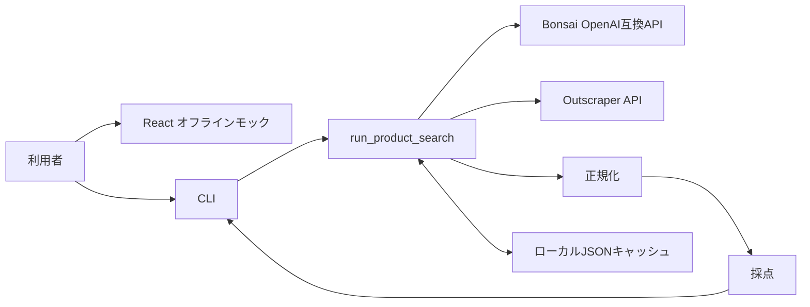

# バックエンド設計

次期フロントエンドは2026-09-11の決定により自前開発する。外部納品待ちを解除し、`frontend/` にオフライン画面を実装した。モックは実バックエンド・local HTTP API・SQLite履歴へ接続せず、固定合成データとタブ内の `sessionStorage` を使う。画面とローカルAPIの接続は後続作業とする。既存の暫定job・履歴APIを現行candidateの確認フローへ接続済みとは扱わず、接続時に不足するcontrollerと表示契約を整理する。検索実行の単一host・単一process・worker 1本と実サービス検証の承認規則を維持する。詳細は [FRONTEND.md](FRONTEND.md#11-次期フロントエンドの自前開発方針) を参照する。

## 1. 目的と範囲

この文書は、amazon-explorer の検索パイプライン、外部API境界、正規化、ランキング、設定、キャッシュ制御を説明する。現行バックエンドは独立したWeb APIサーバーではなく、CLIから直接呼ばれるPythonモジュール群である。

全体方針は [統合済み全体設計](#統合済み全体設計)、利用者向けの次期操作は [SEARCH-FLOW.md](../SEARCH-FLOW.md)、内部モデルと保存形式は [DB-SCHEMA.md](DB-SCHEMA.md)、利用条件と制約は [REQUIREMENTS.md](REQUIREMENTS.md)、検証方法は [DEVELOPMENT.mdの統合済みテスト方針](DEVELOPMENT.md#統合済みテスト方針) を参照する。

## 2. エントリーポイント

### 2.1 共通パイプライン

`src/main/run.py` の次の関数がCLIとPython呼出の共通入口である。

```python
run_product_search(
    user_input: str,
    *,
    use_cache: bool = True,
    cache_scope: str = "local-cli",
) -> list[ProductScore]
```

入力検証:

- `user_input` は前後空白を除いた後に非空でなければならない
- `cache_scope` は前後空白を除いた後に1文字以上128文字以下でなければならない
- CLIとscope未指定のPython呼出は `local-cli` を使う

### 2.2 フロントエンド

Streamlitは2026-09-11の利用者指示で削除した。React + StyleXの画面はオフラインモックとして動作し、この検索パイプラインへの接続は未実装である。起動方法は [README](../README.md#起動方法) を参照する。

### 2.3 CLI

```sh
uv run python -m src.main.run "静かで軽い日本語配列のワイヤレスキーボード"
```

| 引数 | 意味 |
|---|---|
| `user_input` | 必須の自然文検索条件 |
| `--display-limit N` | 上位N件を表示する。1以上 |
| `--no-cache` | 既存キャッシュを読まずに処理する。新規結果は保存する |

## 3. パイプライン

### 3.1 第1段階: 属性抽出

1. 入力、scope、Bonsai設定、systemプロンプトのSHA-256、生成設定から属性キャッシュキーを作る。
2. キャッシュが有効でTTL内なら `ProductAttributes` として再検証する。
3. ミスの場合はBonsaiを呼ぶ。
4. 応答JSONを補正し、`ProductAttributes` に変換して保存する。

### 3.2 第2段階: 検索語選択

`select_outscraper_query()` は次の優先順で先頭の検索語を選ぶ。

1. `search_queries_ja[0]`
2. `search_queries_en[0]`
3. `estimated_product_name_ja`

どの優先段階を選んだ場合も、空文字と `http://` / `https://` で始まる値を拒否する。`estimated_product_name_ja` へのfallbackも同じ `validate_search_query()` を通る。

### 3.3 第3段階: 商品取得と正規化

1. scope、検索語、Outscraper検索設定から生レスポンスキーを作る。
2. キャッシュが有効でTTL内のJSON objectがあれば再利用する。
3. ミスの場合はOutscraperの非同期タスクを作成し、完了までポーリングする。
4. scope、生レスポンス全体、換算レート、正規化版から正規化キーを作る。
5. キャッシュを `NormalizedAmazonProduct` のリストとして再検証する。
6. ミスの場合は生レスポンスを正規化し、保存する。

### 3.4 第4段階: 採点

1. `ProductAttributes` 全体、正規化キー、すべての採点設定、採点版からキーを作る。
2. キャッシュを `ProductScore` のリストとして再検証する。
3. ミスの場合は全商品を採点し、総合スコア降順へ並べて保存する。
4. CLIまたはPython呼出元へリストを返す。

## 4. 設定

現行設定の正は `src/config.py` の `Settings` である。Pydantic SettingsがOS環境変数とリポジトリルートの `.env` を読む。環境変数名はフィールド名の大文字表記であり、`.env.example` は設定可能な名前を示す。

### 4.1 Bonsai

| 環境変数 | 既定値 | 制約・用途 |
|---|---|---|
| `BONSAI_BASE_URL` | `http://127.0.0.1:8080/v1` | OpenAI互換APIのbase URL |
| `BONSAI_MODEL` | `Bonsai-8B.gguf` | chat completionsへ渡すモデル名 |
| `BONSAI_TIMEOUT_SECONDS` | `60` | 正数。POSTのタイムアウト秒数 |
| `BONSAI_TEMPERATURE` | `0.1` | 0以上2以下 |
| `BONSAI_MAX_TOKENS` | `1000` | 正数 |
| `BONSAI_PROMPT_PATH` | `src/clients/bonsai_prompt.txt` | systemプロンプト。相対値はプロジェクト基準 |

`/models` の疎通確認は設定値ではなく3秒のタイムアウトを使用する。Streamlit専用だった画面側の5秒キャッシュは削除した。

### 4.2 Outscraper

| 環境変数 | 既定値 | 制約・用途 |
|---|---|---|
| `OUTSCRAPER_API_KEY` | 空 | `X-API-KEY`。検索実行時に必須 |
| `OUTSCRAPER_ENDPOINT` | `https://api.outscraper.cloud/amazon-products` | HTTPSのタスク作成先 |
| `OUTSCRAPER_DOMAIN` | `amazon.co.jp` | Amazonドメイン |
| `OUTSCRAPER_LANGUAGE` | `ja` | 表示言語 |
| `OUTSCRAPER_POSTAL_CODE` | `100-0001` | 配送地域。空なら送信しない |
| `OUTSCRAPER_LIMIT` | `100` | 正数。取得上限 |
| `USD_TO_JPY_RATE` | `160` | 正数。固定換算レート |
| `OUTSCRAPER_POLL_INTERVAL_SECONDS` | `30` | 正数。ポーリング間隔 |
| `OUTSCRAPER_MAX_POLLS` | `50` | 正数。最大ポーリング回数 |
| `OUTSCRAPER_REQUEST_TIMEOUT_SECONDS` | `30` | 正数。1要求のタイムアウト |
| `OUTSCRAPER_MAX_ATTEMPTS` | `3` | 正数。1要求の最大試行回数 |
| `OUTSCRAPER_RETRY_BACKOFF_SECONDS` | `1.0` | 0以上。指数バックオフの基準秒数 |

対話式の暫定ranking live E2Eでは、通常の文字列設定とは別に `OutscraperLiveSettings` がAPI keyを `SecretStr` として受け取る。この設定objectを作るloaderは、Cloudflare参照2枚の保存、参照fileの同一性検査、15分以内の人間確認、single-use承認consumeが全て成功した後にだけ呼ばれる。

### 4.3 Cloudflare Workers AI

| 環境変数 | 既定値 | 制約・用途 |
|---|---|---|
| `CLOUDFLARE_ACCOUNT_ID` | 空 | 空または32文字の小文16進Account ID。exact Workers AI endpointの構築にだけ使う |
| `CLOUDFLARE_API_TOKEN` | なし | live専用のPydantic `SecretStr`で読み、reprとJSON表示で実値をマスクする |

この2項目は通常の `Settings`とglobal `settings` のfieldに含めず、値を保持・公開しない。別の人間承認とpytestの二重opt-inを必須とするCloudflare基準画像1枚の初回live試験だけが `CloudflareLiveSettings` を生成して値を受け取る。設定済みcredentialは送信承認ではない。

1-call live runnerの失敗は `configuration`、`output`、`transport`、`http_status`、`response_contract`、`image_content`、`unexpected` のclosed stageへ分類する。安全なmetadataはstage、検証済みの100〜599のHTTP statusまたはnull、request count、retry count、wall millisecondsだけである。credential、Account ID、URL、prompt、header、provider本文、生例外、画像bodyは含めない。HTTP status以外から認証失敗などの意味を推測しない。

`tools/counterfactual_cloudflare_live_e2e.py` は、旧低位のdesired＋条件別counterfactual一括adapterを最小1条件・exact 2 calls・retry 0で確認する独立runnerである。先行1枚の明示了承を含む現在の公開入口は検証しない。「白い陶器製マグカップ」とsource-groundedな「白い」1条件だけを使い、既存1-call生成物や商品候補を入力しない。出力2枚が全て成功した場合だけ、新規absolute directoryへ `desired.png` と `counterfactual-visual-condition-001.png` を0600で保存する。失敗時は `configuration`、`output`、`execution`、request count、retry count、wall millisecondsだけを出し、生要求、生応答、provider本文を残さない。専用のlive markerとCLI selectorは別の人間承認を代替しない。

`tools/provisional_search_live_e2e.py` は旧低位の画像一括adapterから商品rankingまでを同一processの二段階で診断する。Bonsaiと新公開入口を使わず、先行1枚の明示了承を含む現在の製品フローは検証しない。第1段階は固定合成入力と「白い」1条件でCloudflareをexact 2 calls、retry 0で実行し、新規0700 directoryの0600 PNG 2枚とtoken digestだけのSQLite approvalを作って停止する。第2段階は保存時と同じdirectory・device・inode、単一link、mode、長さ、SHA-256、byte内容を同じfile descriptorで再検証し、15分以内のsingle-use承認をconsumeした後だけ、固定日本語query `白い 陶器製 マグカップ`をOutscraper 1 task・retry 0・最大24候補へ送る。各商品の先頭画像はexact `m.media-amazon.com` proxyへ最大24 GET、固定CLIPは参照1 batchと候補最大6 batchesへ制限し、EXEC-073の暫定ranking v5へ渡す。安全な出力は段階、call・task・poll・候補・画像・CLIP batchの件数と参照digestだけで、生token、API key、生response、provider request ID、商品本文・ASIN・URL、画像body、embeddingを含めない。call数だけを強制し、手動承認・自動再実行なしという利用者判断に従って金額上限はrunner内で強制しない。実行直前には最新料金を確認して見積りを提示する。

初回liveの `failure_stage=ranking` を再実行なしで診断できなかったため、画像評価、暫定backend、検索pipeline、live runnerの各固定errorへ安全な `failure_substage` を伝搬する。値は `execution_validation`、`product_normalization`、`typed_ranking`、`backend_validation`、`image_validation`、`reference_clip`、`candidate_preparation`、`candidate_clip`、`candidate_scoring`、`calibration`、`ranking_v5`、`result_validation` のclosed setである。正規化成功後だけ受信・正規化・reject・画像URL保有件数を、画像処理開始後だけ画像要求・取得成功・参照CLIP batch・候補CLIP batch件数を出し、未到達は `null` とする。例外class・本文、商品data、provider request ID、URL、画像digest、score、embeddingは診断へ含めない。追加後のfixture testはstage伝搬を確認するだけで、初回live失敗を過去に遡って特定せず、live再実行の承認にもならない。

検索結果の画像outcomeは、有効画像4件以上を `image_ready`、較正不能な画像がある場合を `image_unknown`、全商品画像が取得不能でmissingだけの場合を `image_unavailable` とする。全件missingを `image_ready` として最終契約で失敗させない。

### 4.4 スコアリング

| 環境変数 | 既定値 | 制約・用途 |
|---|---:|---|
| `TITLE_SCORE_WEIGHT` | `0.45` | 0以上1以下 |
| `ATTRIBUTE_SCORE_WEIGHT` | `0.35` | 0以上1以下 |
| `PRICE_SCORE_WEIGHT` | `0.20` | 0以上1以下 |
| `REQUIRED_TERM_WEIGHT` | `4` | 0以上 |
| `COLOR_TERM_WEIGHT` | `3` | 0以上 |
| `FEATURE_TERM_WEIGHT` | `2` | 0以上 |
| `PREFERRED_TERM_WEIGHT` | `2` | 0以上 |
| `RELATED_TERM_WEIGHT` | `1` | 0以上 |

総合係数3つの合計は1.0でなければならない。条件語重み5つは、少なくとも1つを正にする。

### 4.5 キャッシュとCLI表示

| 環境変数 | 既定値 | 制約・用途 |
|---|---|---|
| `CACHE_DIR` | `cache` | 相対値はプロジェクト基準 |
| `ENABLE_CACHE` | `true` | 既存キャッシュの読込可否 |
| `LLM_CACHE_TTL_SECONDS` | `86400` | 正数。属性キャッシュTTL |
| `OUTSCRAPER_CACHE_TTL_SECONDS` | `3600` | 正数。生レスポンスTTL |
| `SEARCH_RESULT_DISPLAY_LIMIT` | `10` | 正数。CLIの既定表示件数 |

空文字を数値、bool、Pathの項目として有効化すると型変換に失敗し得る。`.env.example` をコピーした後、利用する行だけコメントを外す。

未参照だった `APP_ENV` と `LOG_LEVEL` は設定契約と `.env.example` から削除した。旧 `.env` やprocess環境に残る同名値は `Settings` の未知項目として無視され、実行環境の切替やログレベル変更には使われない。観測可能性を実装するときは、実際の処理へ接続する型付き設定を [TD-004](ISSUES.md#td-004-観測可能性とログ管理) の一部として追加する。

## 5. Bonsai OpenAI互換API

### 5.1 属性抽出要求

```http
POST {BONSAI_BASE_URL}/chat/completions
Content-Type: application/json
```

```json
{
  "model": "Bonsai-8B.gguf",
  "messages": [
    {"role": "system", "content": "商品属性抽出プロンプト"},
    {"role": "user", "content": "利用者の自然文"}
  ],
  "temperature": 0.1,
  "max_tokens": 1000
}
```

応答はJSON object、非空の `choices`、object型の `message`、非空文字列の `content` を順に検証する。HTTP通信またはHTTP状態の失敗は `BonsaiRequestError`、JSONまたは形状の不正は `BonsaiResponseError` である。現行実装に再試行はない。

### 5.2 属性JSON補正

- コードフェンスを除き、JSON object候補を抽出する
- リスト項目の `null` を空リスト、文字列を1要素リストにする
- 価格文字列から通貨記号、`JPY`、桁区切りを除き、正の整数だけを採用する
- 0、負数、非整数、非有限値は価格未指定として `None` にする
- 明示価格帯と推定価格帯の上下限が逆なら入れ替える
- カテゴリに推定商品名や特徴からの根拠がなければ除く
- 空要素と大小文字を無視した重複を除き、検索語を再構成する

変換できない場合は、生のLLM応答を含めない固定メッセージの `ValueError` を送出する。

## 6. Outscraper Amazon Products API

### 6.1 タスク作成

```http
GET {OUTSCRAPER_ENDPOINT}?query=...&domain=amazon.co.jp&language=ja&limit=100&async=true&postal_code=100-0001
X-API-KEY: {OUTSCRAPER_API_KEY}
```

APIキーが空ならHTTP要求前に停止する。endpointはHTTPS、ホストあり、URL内認証情報なしでなければならない。`requests` の `params` で検索パラメータを渡し、APIキーはヘッダーだけに入れる。

### 6.2 タスク状態

| 内部状態 | 認識する値・条件 |
|---|---|
| pending | `pending`、`in progress`、`in_progress`、`processing` |
| failed | `failed`、`failure`、`error`、`cancelled`、`canceled` |
| success | `success`、`succeeded`、`complete`、`completed`、`done`、`finished`、`ok`、または `data` キーあり |
| unknown | 上記以外 |

`data=[]` は正常終了した0件である。完了レスポンスの `data` はリストでなければならない。初回応答がpendingなら `results_location` が必要である。

### 6.3 結果URLの検証

`results_location` へAPIキーを送る前に次を確認する。

- 文字列である
- HTTPSである
- ホストがある
- username、passwordをURLへ含まない
- 設定endpointとホスト・実効ポートが同じである

タスク作成と結果取得のどちらでもリダイレクトを許可しない。違反は `OutscraperSecurityError` とする。

### 6.4 再試行

次だけを、1要求につき `OUTSCRAPER_MAX_ATTEMPTS` まで再試行する。

- `requests.Timeout`
- `requests.ConnectionError`
- HTTP 429
- HTTP 5xx

試行間の待機は `base_delay * 2 ** (attempt - 1)` 秒である。その他の4xxは再試行しない。`Retry-After`、ジッター、接続・読取タイムアウトの分離は未実装である。

### 6.5 ポーリング

結果取得ごとに状態を分類し、successなら商品リストを返し、failedまたはunknownなら即時終了する。pendingのまま最大回数に達すると `OutscraperTaskTimeoutError` とする。最後のポーリング後に余分なsleepは行わない。

## 7. 商品正規化

正規化で参照する主なOutscraper項目:

- 構造: `data`
- 識別・名称: `name`、`asin`、`store_title`
- 価格: `price_parsed`、`price`、`old_price_parsed`、`strike_price_parsed`、`old_price`、`strike_price`
- 通貨推定: `currency`、`delivery_price`
- 評価: `rating`、`reviews`
- 分類・説明: `categories`、`description`
- 画像: `high_res_images`、`image_1` から `image_10`
- URL: `url`、`short_url`
- 配送等: `prime`、`availability`、`shipping`
- 出所: `query`、`position`

`data` の各要素が辞書なら商品として使い、リストならその中の辞書を1段だけ展開する。タイトルが空の商品と、明示通貨がJPY・USD以外の商品は除外する。

数値はboolを除外し、数値型または文字列中の最初の有限数値を使う。価格は負数を欠損扱いにし、USDだけ固定レートを掛ける。通貨値が空の場合は価格文字列中の `USD`、`$`、`JPY`、`¥`、`￥`、`円` から補完する。

Primeは真のbool、数値1、文字列 `1`、`true`、`yes`、`y` だけを真とする。重複はASIN、短縮URL、商品URL、タイトルの順で最初の利用可能な値をキーにする。

## 8. テキスト処理とランキング

### 8.1 トークン化

- 文字列は `casefold()` で小文字相当に正規化する
- 英数字は正規表現 `[a-z0-9]+` で抽出する
- 日本語はSudachiPyのSplitMode Cで解析する
- 日本語トークンは名詞、動詞、形容詞、形状詞かつ日本語文字を含むものに限る
- 語句全体の部分一致を先に試し、失敗した場合は分割語がすべて存在するかを確認する

### 8.2 TF-IDF

クエリと候補商品群を同じ `TfidfVectorizer` で学習し、コサイン類似度を求める。商品名はタイトルだけ、属性はタイトル、ストア名、カテゴリ、説明を使う。空データや語彙を作れない場合は0.0とする。

### 8.3 条件一致

必須語、色、特徴、優先語、関連語を設定重み付きで評価する。同じ正規化語が複数グループにあれば最初のグループだけを採用する。属性スコアにはTF-IDFと重み付き一致率の高い方を使う。

### 8.4 価格スコア

- 商品価格が正の整数でなければ0.0
- 目標価格があれば `min(price, target) / max(price, target)`
- 範囲内なら1.0、範囲外なら近い境界との比率
- 下限だけなら価格が下限以上で1.0
- 上限だけなら価格が上限以下で1.0
- `cheap` は推定上限が正なら `min(1.0, expected_max / price)`、なければ0.5
- `premium` は推定下限が正なら `min(1.0, 0.5 + 0.5 * log10(price / expected_min + 1.0))`、なければ0.5
- 価格指定がなければ0.5

### 8.5 総合値

```text
total = clamp(
    title_similarity * TITLE_SCORE_WEIGHT
    + attribute_similarity * ATTRIBUTE_SCORE_WEIGHT
    + price_score * PRICE_SCORE_WEIGHT
    - negative_penalty,
    0.0,
    1.0,
)
```

否定語は一致1件につき0.2、最大0.5である。各値を小数4桁へ丸め、総合値の降順へ並べる。

## 9. キャッシュ境界

`JsonCacheRepository` はrootを絶対パスへ解決する。namespaceの絶対パスと `..` を拒否し、キーは非空の小文字16進文字だけを許可する。ファイル不在、期限切れ、OSエラー、Unicodeエラー、JSON不正はキャッシュミスとして扱う。

属性、正規化、採点の復元時はPydanticで再検証し、失敗したら再計算する。生レスポンスもJSON objectでなければ再取得する。詳細は [DB-SCHEMA.md](DB-SCHEMA.md)を参照する。

## 10. 例外と出力

| 例外 | 意味 |
|---|---|
| `BonsaiRequestError` | Bonsai通信またはHTTP失敗 |
| `BonsaiResponseError` | BonsaiのJSONまたは形状不正 |
| `OutscraperRequestError` | Outscraper通信・HTTP失敗 |
| `OutscraperResponseError` | OutscraperのJSON・形状・状態不正 |
| `OutscraperSecurityError` | endpoint、結果URL、リダイレクトの安全条件違反 |
| `OutscraperTaskFailedError` | プロバイダー側タスク失敗 |
| `OutscraperTaskTimeoutError` | 最大ポーリング回数内に完了しない |
| `RuntimeError` | `OUTSCRAPER_API_KEY` が未設定 |
| `ValueError` | 空入力、不正なscope、URL形式の検索語、不正なキャッシュ形状 |

標準出力には処理段階、request ID、ポーリング回数・状態、キャッシュのヒットまたは保存先を出す。検索語、要求URL、結果URL、APIキーは出力しない。生成ファイルのローカルパスは出力される。

## 11. テスト境界

現行テストは外部通信をモックし、次を直接検証する。

- Bonsaiのパス解決、通信例外、JSON・応答形状
- Outscraperの状態分類、正常0件、失敗、待機超過、同一origin、リダイレクト拒否、再試行
- JPY・USD価格、Prime、商品正規化
- 属性JSONの価格補正、価格帯、応答秘匿
- TF-IDF補助、条件語重み、価格スコア、言語同点時の不足条件
- JSONキャッシュの原子的保存、TTL、破損、パス検証
- パイプラインのキー材料と完全キャッシュ再利用
- CLIの正数引数

```sh
uv run --frozen --offline --no-sync ruff check .
uv run --frozen --offline --no-sync ruff format --check .
uv run --frozen --offline --no-sync pytest -m 'not live_api'
git diff --check
```

これらは実Bonsai・Outscraperとの結合試験ではない。実検索はAPIキー、料金、取得件数、タイムアウトを確認してから明示的に実施する。

## 12. 変更時のチェック

- `Settings` を変えたら `.env.example`、この文書、設定テストを更新する
- Bonsaiプロンプトを変えたら属性キャッシュキーのプロンプトハッシュにより再計算されることを確認する
- 外部レスポンスの解釈を変えたら正規化キャッシュ版を上げる
- 採点ロジックを変えたら採点キャッシュ版またはキー材料を更新する
- 外部APIキーを送る新しいURLは送信前に明示的な許可条件を設ける
- API失敗、商品0件、キャッシュミスを異なる結果として扱う

## 13. 次期検索バックエンド v2（基盤を一部実装）

2026-09-08の現行画像生成フローは [EXEC-080](GOAL.md#exec-080-4方向生成を製品フローから除去) を正とする。操作は参考画像1枚の生成、利用者の明示了承、条件別偽画像だけの生成、生成物の確認、商品検索の最終確認の順である。独立orchestrationと暫定productionの公開入口の両方を対象とし、旧4方向一括生成・desired＋counterfactual一括生成とは区別する。低位adapterを使う既存live runnerの診断実績は、新しい先行確認と全後続生成の成功を証明しない。

次期バックエンドは現行 `run_product_search()` の同期4段階処理へ継ぎ足さず、[SEARCH-FLOW.md](../SEARCH-FLOW.md) の利用者向けStepを支える独立した状態機械とtyped boundaryを実装する。内部契約はこの節を正とする。

主要な変更点:

- 製品検索のLLM providerは現行と同じBonsaiを維持し、`/chat/completions` の `message.content` をv2 strict intent境界へ接続する
- v2ではcontent全体を単一JSON objectとしてfail closedでparseし、Markdown fence、前後の説明文、JSON断片抽出、unknown field、型coercionを許可しない
- LLM語句をローカルtokenizerで再分割し、日本語・英語の最大2クエリを決定的に作る
- 第1確認後、任意でCloudflareによる参考画像を1枚生成する。明示了承後だけ、その画像を参照して条件別偽画像だけを生成する。gpt-imageは画像評価テストだけに使い、製品providerへ接続しない
- single-useの第2確認後だけOutscraperを実行する
- Outscraper候補は決定的に正規化し、未解決の採点対象属性を未知のまま保持する。Outscraper後にBonsai、OpenAIその他のLLMを呼ばない
- pHash重複検出と固定CLIP embeddingによる意味的画像scoreを分離する
- title 0.35、attributes 0.30、price 0.20、image 0.10、review quality 0.05を基準とし、欠損componentを除外して重みを再正規化する。review qualityは唯一の最小weightとする
- stable tie-breakを含め総合score降順で返す

最初の独立したdomain境界は `src/search_v2/` に実装済みである。

- `intent.py` は `strict=True`、`extra="forbid"`、nested instance再検証を使う `SearchIntentDraft`、`NormalizedSearchIntent`、`PriceCondition`、`IntentAmbiguity`、4種類のSHA-256 provenanceを持つ
- `bonsai_adapter.py` はfull raw response bytesをUTF-8・1,048,576 bytes以下に限定し、OpenAI互換envelope、非空content、content全体のstrict JSON、duplicate key・非有限数、単一object、strict compact wire draftを検証する。省略されたscalar、list、価格の既定値を決定的に補完し、完全な `SearchIntentDraft` へ再検証してからnormalizerへ渡す
- adapterはexact prompt、canonical `SearchIntentDraft` JSON schema、full raw response bodyのSHA-256をintentへ結ぶ。不一致時は固定messageを維持し、`response_metadata_invalid`、`envelope_invalid`、`content_not_json`、`draft_schema_invalid`、`intent_normalization_invalid`、`intent_searchability_invalid`、`output_truncated` の段階と、正規化済みfinish reason、妥当なcompletion token件数、response byte数だけを保持する。draft schema不一致時だけ値やvalidation本文を持たない固定 `draft_failure_group`、検索不能時だけ正規化済み値を持たない `missing_terms` または `invalid_terms` の固定 `searchability_failure_group` を保持する。生content、検索文、field値、provider固有理由、内部例外は保持しない
- `bonsai_adapter.py` はprovider wire専用のcompact draftから、ambiguity codeのpatternを保持し、decimal patternを同じ受理言語のllama.cpp互換表現へ変換し、価格のmode・source・有効値field・必要なconfidenceだけを持つ8つの排他的variantへする非空の生成用schemaを決定的に作る。検索可能rootは `product_name_ja` を必須とする最大12種類の固定field、確認待ちrootは1件以上の全blocking `ambiguities` だけに分ける。商品名等48文字、term 32文字、各term list・typed condition・set値4件、ambiguity 2件・各96文字を制限する。categoryはproduct nameへ、colorとfeaturesはtermsまたはtyped conditionへ集約し、値がないoptional field、空list、価格なしのroot field、固定 `currency=JPY`、非該当価格値、null confidenceはwireから省略する。生成用schemaは既知のfield横断矛盾と検索可能性を生成段階で制約する補助であり、完全schemaとquery plannerによるapplication側の最終検証を置き換えない
- `bonsai_request.py` はschema 9.0のrequestとして、固定 `bonsai_intent_prompt.txt` だけをsystem message、利用者入力をuser messageにしたexact `/v1/chat/completions` JSON bodyを作る。生成形式は `response_format={"type":"json_object","schema":<bounded compact生成用schema>}` とし、完全canonical schema本文をsystem messageへ重ねて送らない。local LLMへ `max_tokens` を送らず、request descriptorとbuilderにも生成token上限またはHTTP timeoutの入力を持たない
- request境界はloopback HTTPまたはcanonical HTTPS、固定header、redirect禁止、identity encoding、1 MiB応答上限をstrict descriptorへ固定し、source・prompt・完全schema・compact生成schema・bodyとrequest全体をv9のSHA-256へ結ぶ。完全schemaはmodel入力から外しても別digestとapplication側のstrict検証に維持する。executionはrequest digestへ一致するreserved Bonsai intent 1 callと、request byte数＋最大response byte数をtoken数の保守的上界とした予約を送信前に確認する。これはledger上の予約値であり、LLMの生成token上限ではない
- executionはledgerを開始して注入transportを1回だけ呼び、strict adapter成功後は `succeeded`、通信・HTTP・応答失敗は `failed` として確定する。raw入力・prompt・request body・responseはserializable descriptorまたは結果へ保持しない
- `bonsai_http.py` の `RequestsBonsaiTransport` はEXEC-012のexact transport契約を再検証し、新規Sessionからcanonical bodyを `data` として1回だけPOSTする。`trust_env=False`、既定header・cookie・proxyの除去、TLS検証有効、HTTP/HTTPS retry 0、redirect禁止、streamingを固定する。application timeoutは指定せず、応答または失敗まで待つ
- 同transportはstatusと限定したContent-Type・Content-Encoding・Content-Lengthだけを投影し、非200、不正content type、圧縮、宣言済み1 MiB超過のbodyを読まない。読込時も実測1 MiBを超えた時点で停止し、成功・失敗の両方でResponseとSessionを閉じる。生body、任意header、Requests objectを結果・log・例外へ保持しない
- `tokenizer.py` はNFKC/casefold、URL・改行・control拒否、SudachiPy `SplitMode.C` の内容語抽出と接頭辞・接尾辞の保持、英数字 `[a-z0-9]+` 抽出、順序維持・重複排除を行う
- 価格は正のJPY整数とmode別field整合を強制し、inferred値だけconfidenceを必須にする
- normalizerは自然文を2,000 code points以下、intent JSONを49,152 UTF-8 bytes以下へ制限し、NFKC、空白縮約、空語除去、casefold重複除去を決定的に行う
- brandとmodel numberはNFKC後のsource inputにliteral根拠がある場合だけ残す
- `query_planner.py` は商品名、カテゴリ、明示brand/model、必須語、希望語の順で、日本語1件、英語1件、各200文字以下の最大2queryを作る。brand/modelは原形を維持し、他の意味語句は言語別tokenizerを通す
- URL、改行、制御文字、空query、同一言語の重複、NFKC・casefold後の同一queryを拒否し、intentとplanをdomain-separated SHA-256へ結び付ける
- `approval.py` はschema 3.0でowner・session、intent・query、readyなtyped proposal digest、Outscraper request、任意画像、provider allowance、固定 `typed-ranking-v4`・product evidence profileを含むruntime binding、15分期限をstrictなcanonical planへ固定する。旧2.0 plan、ranking-v3 runtime、proposal不一致を拒否する
- `usage_ledger.py` はBonsai・Cloudflare・Outscraperのcall・token・整数micro-USDを送信前予約し、失敗attemptを含めて同一process内で原子的に記録する。quota有効policyはper-user-day・per-session・global-day上限を強制する一方、現行production用 `build_no_quota_usage_policies()` は3 scopeを明示的に無効化し、累計利用量・費用を理由に予約を拒否しない。どちらも操作単位のcall数、候補・poll・byte・timeout・retry契約を変更しない
- `state_machine.py` はschema 3.0で `draft` から商品受信・正規化・検索完了または固定失敗までのsnapshot、revision、第1確認、typed proposal digestとready・blocking status、画像set確認、第2確認、raw tokenを保持しないsingle-use claim、計画変更時の失効を実装する。readyはquery digestを必須、blockingは `intent_review` かつquery digestなしだけを許可し、query付きblockingとqueryなしreadyを拒否する。blocking条件から画像生成・最終承認へ進まず、画像生成途中失敗は `image_generation_failed` と失敗reservation IDへ結び、最大2組の範囲で新しい予約を使う明示retryまたは画像OFFだけへ進める。後半stateは件数、typed batch digest、正常結果種別、失敗工程・固定コードだけを保持する
- `cloudflare_request.py` はexact FLUX.2 klein 4B model、固定512px、4方向順、attempt別32 bit seed、prompt contractをcredential-free multipart descriptorへ固定する。旧先行確認付き4方向経路のschema 3.0では4要求すべてが了承済みの同じ最大511px PNGを `input_image_0` に持つ。旧schema 2.0の基準画像なしの先頭要求・派生3要求も低位互換として維持する。serializable metadataから画像byteを除き、SHA-256、長さ、寸法をrequest set digestへ結ぶ
  prompt v2では参照カメラを0度とし、前斜めは商品左側へ45度、左側面は左90度、右側面は右90度、後ろ斜めは右135度へcameraを移動する。参照視点のコピーやmirrorを禁止し、見えなくなる特徴の遮蔽を指示する。prompt digestは更新されるため旧要求metadataの再利用は拒否する。保存済み履歴は書き換えない。[EXEC-079](GOAL.md#exec-079-4方向画像の視点指示修正と限定再生成) の別承認4-call liveでも3枚がほぼ同じ向きとなり、4方向品質は未達である。
  E2E検索は利用者指示で停止中。診断runnerの `landmark-v1` は固定マグカップだけに取っ手の最終位置・見え方を指示し、6組のpHash距離で近似組を記録する。4B実画像では右側面が不合格となり、pHashでは検出できなかった。本番の汎用promptは置換せず、独立 `tools/view_model_probe.py` で9Bの同一右側面1枚を比較する準備をした。実modelを別diagnostic契約へ記録し、4B artifactへは紐付けない。9Bの右側面1枚は改善を目視できたため、generic-four modeで汎用camera-v2の4要求を変更せず比較する準備をした。generic-four実画像も左右90度の見え方を満たさず未達だった。追加診断turntable-fourはcamera固定・参照姿勢からobjectを0/90/270/180度へ回転させ、絶対面名をpromptから除く。既存angle IDは診断ファイルの対応付けにだけ使い、本番promptは変更しない。既定landmark-rightは1回、generic-fourとturntable-fourは各4回に限定する。turntable-four実画像も上下反転・取っ手増殖で不合格となったため、prompt追加試行を停止した。数値カメラ制御を持つ方式は未導入で、本番4Bと旧cacheを維持する。本番はiGPUのためローカル3D生成を採用しない。外部の視点変換APIが候補だが、provider切替・実画像品質は未検証である。
- `cloudflare_http.py` は開始済み4-call予約と `image_generating` stateを再検証し、account IDとAPI tokenをserver-sideでだけ注入する。4件を固定順のmultipart POSTへ送り、HTTP・JSON envelope・canonical Base64をfail closedに検証する。decode画像は2 MiB以下のJPEG・PNG・WebPだけをmagicとPillow formatの両方で受理し、単一frame・512×512・完全decodeを確認してmetadataなしRGB PNGへ決定的に再encodeする。新経路は4件とも了承済み先行画像の511px参照を使い、旧低位経路だけが新規正面から派生3件の参照を作る。全件成功時だけ予約を `succeeded`、stateを `image_review` へ進め、途中失敗は一部画像を返さず予約を `failed` にする
- `outscraper_contract.py` は最大2件のqueryを1回のGETに反復し、endpoint、`amazon.co.jp`、`ja`、server-side postal code、24件/query、`async=true`、最大48候補をcredential-free descriptorとdomain-separated digestへ固定する。`outscraper_request.py` はこの純粋契約を再公開し、actual query batch・request digestをtoken claim前に照合して、既存single-use承認と開始済み1-call予約が通った場合だけexecution permitを返す。商品正規化は認可moduleを逆参照せず純粋契約だけを使う
- `outscraper_http.py` はpermit、`scrape_submitted` snapshot、開始済み1-call予約を再検証し、API keyを `X-API-KEY` にだけ注入してtask作成と結果取得を行う。HTTP要求ごとの新規Session、`trust_env=False`、既定metadata除去、TLS検証、retry 0、redirect禁止、30秒timeout、8 MiB上限を固定する
- 同moduleは初回の `Pending`・`Success`、最大50回のpoll、正常0件、`Failure`、不明status、同一originかつexact `/requests/{id}` の結果URL、poll応答IDを検証する。通信・HTTP・応答・危険URL・task失敗・待機超過は生provider文を含まない固定エラーへ変換し、開始済み利用量を成功または失敗へ必ず確定する
- `product_normalization.py` は検証済みOutscraper request descriptor、provider request ID、明示的なUSD/JPY profileへ応答を結び、最大48候補を観測値だけからstrict batchへ正規化する。未観測のbrand、categories、color、material、featuresとPrimeは未知のまま残し、query本文・postal code・raw responseを出力へ複製しない
- 商品候補の文字列・数値・配列と出力件数を正規化前から有界化し、明示通貨、ASIN、Amazon HTTPS商品URL、HTTPS画像URLを検証する。ASINまたはcanonical商品URLだけで入力順を保って重複除去し、固定reject理由とdomain-separated profile・batch digestを返す。provider client、Bonsai adapter、OpenAI SDK、intent、prompt、enricherには依存しない
- `image_proxy.py` はserver-sideのexact host allowlist、HTTPS、最大8件のglobal DNS address、接続peer IP一致、redirect拒否、10秒、identity encoding、8 MiBを固定し、注入transportのresponseをJPEG・PNG・WebP、単一frame、縦横4096px・総pixel数4096²以下へ限定する。DNS adapterは生 `getaddrinfo` 結果を最大64件まで全件構造検証し、順序を保って重複排除した後にtransport候補を最大8件へ制限する。Pillowのdecompression bomb warningをerrorにし、raw URL・metadataを残さないRGB artifactと寸法込みdigestへ変換する
- `image_proxy_dns.py` は小文字ASCIIのcanonical DNS hostを再検証し、443番、`AF_UNSPEC`、`SOCK_STREAM`、`IPPROTO_TCP`、`AI_NUMERICSERV` を固定した `getaddrinfo` を1回だけ呼ぶ。1〜64件の組込みlistを受け、全項目のIPv4・IPv6 TCP tuple、空canonical name、443番、IPv6 flowinfo・scope ID 0、canonical numeric addressを検証する。結果順を保って重複除去した後、先頭最大8件を返し、global判定はcoreへ残す。raw結果と生例外は固定errorへ変換する
- `image_proxy_dns_process.py` はWindows 11 / WSLで共通の `spawn` を明示し、上記resolverを1要求1子processへ隔離する。親processは作成前から5秒のapplication deadlineを計測し、結果待機に4.5秒、terminate・killに最大0.25秒ずつを確保する。子processからの結果はpickle objectではなく最大512 bytesのASCIIへ限定し、親側で1〜8件のcanonical numeric IPv4・IPv6へ再検証する。timeout、異常終了、EOF、不正IPCは固定errorにし、host、IP、生例外を返さない
- `image_proxy_http.py` はcoreが検証した先頭のglobal IPへIPv4またはIPv6 TCP socketで1回だけ直接接続し、元host名をTLS SNI・証明書検証へ使う。TLS 1.2以上、HTTP/1.1 ALPN、compression禁止、10秒timeoutを固定し、origin-form GETへHost・画像Accept・identity encoding・closeだけを送る。実peer IP、HTTP version・status・header上限、Content-Length・chunked framingを再検証し、拒否応答のbodyを読まず、成功bodyだけを8 MiB以内へ投影して全資源を閉じる
- `image_similarity.py` は32x32 grayscale DCTの8x8低周波から64-bit pHashを作り、Hamming距離5以下だけを順序維持の重複除去へ使う。意味score関数へpHashまたはHamming距離を渡さない
- 同moduleは `openai/clip-vit-base-patch32` revision `12b36594d53414ecfba93c7200dbb7c7db3c900a` の456 bytesのconfig、605,804,513 bytesの `model.onnx`、468 bytesのpreprocessorをexact SHA-256へ固定する。local directoryの3通常fileだけを許可し、symlink・hardlink、読込中のidentity変化を拒否する。注入encoderへ `local_files_only=True` で渡し、512次元・有限値を検証してL2正規化する。4参照方向ごとの最大cosine平均を `clamp((mean + 1) / 2, 0, 1)` へ写像し、scoreは現行pinned runtime digest以外を拒否する。画像scoreは色、外観形状、商品種別など画像で確認できる特徴だけの補助評価とし、構造化属性を推定、補完、上書きしない。有線・無線は商品名と構造化された観測属性で判定する。ranking有効化flagはfalseである
- `image_similarity_onnx.py` は検証済みRGBを縦横比を維持して224×224内へBICUBIC resizeし、中央配置する。残りはCLIP image meanで埋め、正規化後0の余白、固定rescale・mean・std、NCHW `float32`へ変換する。最大4枚と生成tensor上限を固定し、ONNX Runtime 1.23.2の `CPUExecutionProvider` だけを使う。固定thread・sequential session、graph入出力名・型・shape、`image_embeds` の件数・512次元・有限・非0を検証し、asset全体をsession作成前と推論後に再検証する。application preprocessing profile IDはruntime digestへ含め、旧center-crop embeddingとの混在を拒否する
- `image_similarity_process.py` は親で作った最大約2.4 MBのtensor bytesを、Windows 11 / WSL共通の `spawn` 子processへ渡す。子からの結果は固定header付きlittle-endian `float32`、最大約8 KB、または固定失敗tagだけとする。30秒のapplication deadline、自動retryなし、terminate・kill・join・pipe closeを固定し、path、画像byte、生ONNX例外を公開errorへ含めない
- `ranking.py` はstrict・frozenな `ranking-v3` profile、component、score breakdown、ranked batchを持つ。title 0.35、attributes 0.30、price 0.20、image 0.10、review quality 0.05をbase weightとし、imageは固定でdisabledにして、利用可能なcomponentだけを1.0へ再正規化する
- titleは商品名・カテゴリ・brand・model numberと商品titleの言語別token coverageの高い方、attributesはrequired 3、preferred 2、カテゴリ・色・特徴・brand 1と `ObservedProductAttributes` の構造化観測値だけの一致率を使う。価格はintentのexact・range・min・max modeに従い、未指定・未観測をmissingとして0点と区別する
- review qualityは平均rating 4.0以上だけを対象に `rating / 5.0` とし、総review countを `min(1, log1p(count) / log1p(1000))` へ写像した値との積を使う。ratingまたはreview countの片方が未観測ならmissing、0件または4.0未満は観測済み0点とする。星別件数やレビュー本文は推測しない
- negative termは観測済みtitle・store・description・属性へのtoken一致1件につき0.20、最大0.50を減点するだけで候補を除外しない。scoreは4桁へ丸め、同点を全候補で一意なOutscraper `response_index` 昇順で解決する。intent・query plan・normalized batch・profileのdigest連鎖を再検証し、ranked batch全体をdomain-separated SHA-256へ結ぶ
- `product_pipeline.py` はschema 3.0で成功済みOutscraper execution、承認plan、session、intent、query plan、ready proposal、request、利用量、normalization・typed ranking・product evidence profileの結合を再検証し、商品正規化から `rank_typed_product_batch()` までを順に実行する。結果ありと正常0件を成功として分け、完了stateにはtyped batch digestだけを残す。provider・正規化・ranking失敗は工程別の固定コードだけをstateへ残し、生provider応答、query、postal code、商品本文、URL、生例外文は保持しない
- `orchestrator.py` はschema 3.0のbackend policyと、ready用 `IntentReview`、query fieldを持たない `BlockingIntentReview`、schema 1.0の先行1枚用 `ReferenceReview`、`ImageReview`、`ImageFailureReview`、`SearchReview`、非reprの `ApprovedSearch` を持つ。Bonsai後はtyped proposalを先に確定し、readyだけにquery planを作る。blockingはintent・proposal・成功済みBonsai利用量へ結んだ専用第1確認で停止し、画像生成または画像なし続行へ渡しても追加provider予約前に固定errorで拒否する。先行画像の了承、後続生成、生成物確認、商品検索の最終確認、single-use承認、Outscraper、typed後半pipelineを利用者操作ごとの関数へ分ける。画像途中失敗は固定回復stageとして返し、自動retryや部分画像採用をせず、明示操作で先行1枚を作り直して再確認する。生成成功後の破棄と失敗後の画像OFFでも、既発生の利用量をledgerへ残す
- `history_repository.py` はschema 2.0の正常な `results` または `empty` の表示用snapshotを、owner内のcompletion keyで冪等にローカルSQLite `user_version=2` へ保存する。ranking profile IDと商品ごとの必須状態を表示契約へ持ち、旧version 1 DBはbyteを変更せず固定errorで拒否する。ownerで絞った新着順一覧、公開locatorによる詳細・512px PNG取得、個別削除、完了から30日の期限削除を提供し、期限後はcleanup前でも返さない。履歴と専有画像はforeign key・transactionで一体保存・削除し、表示JSONのSHA-256、固定例外、0600の新規DB file、未知schema・安全でない既存file modeの拒否を強制する
- `history_snapshot.py` は正常完了したschema 3.0の `ProductSearchPipelineResult`、承認済み `SearchReview`、元入力を再検証し、typed proposalの条件、価格、必須状態、各decisionを「一致」「未確認」「情報が矛盾」「不一致」等の限定表示へ変換し、了承済み参考画像1枚とともにschema 3.0の `SearchHistoryWrite` を作る（旧4方向reviewはschema 2.0）。raw score、weight、evidence、registry、provider metadataは表示snapshotへ複製しない。元入力はexact digest照合後に表示用NFKC・空白正規化し、ranked商品がnormalized batchに実在することも照合する。失敗result、結合不一致を保存前に固定errorで拒否し、同じ完了結果の再保存はprovider・正規化・rankingを再実行せず同じcompletion keyを使う
- `search_job.py` は固定 `local-user`、owner・approval runtime binding digest内の冪等性、SQLite `user_version=1` の永続状態、worker 1本、FIFO実行、状態照会、queued取消、running callbackへの協調的取消を持つlocal単一process境界である。24時間以内に開始できないqueued jobだけを `timed_out` にし、実行中callbackへruntime timeoutを追加しない。callback例外は本文を保存せず固定codeへ変換し、成功時も結果本体ではなく既存履歴等のlocatorだけを保存する。終了状態は30日後の明示purge対象とし、process再起動時はcallbackを推測復元せずactive jobを固定失敗または取消へ移す。自動retryは行わない
- `production_search.py` はBonsai・Cloudflare・Outscraperの全policyがquota無効であることを構築時に要求し、quota有効ledgerの誤注入を拒否する。固定local ownerの未消費 `ApprovedSearch`、同じowner・session・元入力に結ばれた `ApprovedCounterfactualReferences` と視覚条件をdomain-separated job bindingへ固定する。worker内でだけOutscraper credential loaderを呼び、既存single-use認可、task 1回、暫定pipeline、schema 5.0履歴保存を順に実行する。成功時は履歴locatorだけをjobへ返し、同一bindingの再投入は別callbackを実行しない。取消・失敗後の自動再実行、検索文・token・商品・URL・provider本文・生例外のjob DB保存を行わない

これらの境界は現行 `run_product_search()` から未参照である。暫定production backendでは、承認済み検索からjob、Outscraper認可、商品画像、固定CLIP、ranking v5、履歴locatorまでをfixtureで接続したが、Bonsai・Cloudflare・Outscraper・Amazonの実通信をこの接続testでは行っていない。現行画面からのjob投入、認証・tenant解決、API・UI、次期フロントエンド、deploy、複数process・hostはまだ存在しない。限定liveでは固定1条件についてCloudflare 2 calls、Outscraper 1 task、24商品画像、固定CLIP 7 batches、ranking v5まで成功したが、新application serviceとjob・履歴を含むproduction E2Eではない。Pythonの `Process.start()` 自体は親processからpreemptできないため、5秒と30秒はapplication側のdeadlineでありOS process起動の絶対上限ではない。in-memory ledgerとstageのatomicity、検索履歴・検索jobの単一file SQLite境界は複数worker・hostの運用保証ではなく、browserからsnapshot、owner、予約状態を受け取るAPIとして使えない。offline fixture成功も実Amazon候補、検索順位の品質、認証済み利用者分離を証明しない。現行のBonsai parserはMarkdown fenceとJSON断片を許容し、`ProductAttributes` もv2 strict contractではないため、隔離基盤が存在しても現行検索がv2受入条件を満たしたとは扱わない。この節を現行検索APIの利用手順として使わない。

上記の実host未確認記述より後に、限定liveで運用hostの画像1件を取得できた。続く24商品の診断では同hostの一意DNS結果9件を旧8件上限が拒否したため、生結果の全件構造検証、重複排除、transport候補8件への制限という順序へresolverを修正した。修正後の別承認liveでは、Outscraper 1 taskの24商品すべてについて実DNS・TLS・HTTP画像取得に成功し、固定CLIP 7 batchesと暫定ranking v5を `image_ready` で完了した。これは固定1条件の限定確認であり、未知条件全般、複数query、4方向参照、個々の順位品質、Windows native、API・browser・production E2Eを示さない。

後続の [EXEC-026](GOAL.md#exec-026-単一条件の複数画像clip-characterization) では、当時のcenter-crop profileについて、利用者分類のnear 13枚・far 18枚を固定hashで検証し、現行IDのn1〜n4だけを参照、残るnear 9枚とfar 18枚を各1枚の候補として同じscore関数へ通した。near平均0.934439977、far平均0.881724434、near中央値0.940632749、far中央値0.876893229だった一方、score範囲は重なり、pairwise AUCは事前基準0.80に対して0.790123457で未達だった。固定参照に外形・色が近い黒い有線ゲーミングマウスがfar上位になるため、画像embeddingを「無線」の正本にせず、商品名・構造化された観測属性で扱う。これは単一検索条件のlocal characterizationであり、検索文から得た実4方向参照、複数query、実検索順位の品質を示さない。画像componentは引き続き無効である。

[EXEC-027](GOAL.md#exec-027-far画像の属性別hard-negative-characterization) では、利用者が提示したfar 18枚の色・接続方式・ゲーミング用途・対象種別を固定した。対象条件との差が接続方式だけの黒・有線・ゲーミング・マウス4枚は平均0.945551862、ゲーミング用途だけが異なる黒・無線マウス1枚は0.922820165、色だけが異なる無線ゲーミングマウス6枚は平均0.875869567、非マウス6枚は平均0.830395143だった。接続方式だけが異なる4枚は全てfar中央値を上回るため、CLIP scoreで有線・無線をhard filterしない。同Planではnear側を扱わず、後続Planと根拠を分離した。

[EXEC-028](GOAL.md#exec-028-near画像の目視属性characterization) ではnear 13枚をlocal画像から個別に確認し、全て黒いマウス、n1〜n4とn7〜n13はゲーミング用途、n5〜n6は用途未知として別manifestへ固定した。ケーブル非接続、受信機、充電dockの写り込みだけでは製品の接続方式を確定できないため、[EXEC-030](GOAL.md#exec-030-画像ランキングの視覚的特徴限定) でnear 13枚の接続方式を全て未知へ訂正した。候補内では用途未知2枚の平均score 0.941389590が、用途を目視確認できた7枚の0.932454373より高かった。高い画像scoreを未知属性の根拠にせず、商品仕様の観測値が得られるまで未知を維持する。これは外観の目視結果であり、商品ページや一次仕様による独立確認ではない。

[EXEC-030](GOAL.md#exec-030-画像ランキングの視覚的特徴限定) では、画像scoreの責務を色、外観形状、商品種別など視覚的特徴だけの補助評価へ限定した。有線・無線はtitle・attributes componentで判定し、画像componentでhard filterせず、構造化属性を推定、補完、上書きしない。当時のcenter-crop固定scoreでは、接続方式だけが異なるf2・f4・f7・f10を画像上の正例へ移した正例13枚・負例14枚の全182組中175組が正順で、接続方式非依存AUCは0.961538462、正例中央値は0.942146431、負例中央値は0.843137443だった。元のnear 9枚・far 18枚によるAUC 0.790123457とstrict xfailは、測定後にlabelを変更しない履歴baselineとして維持する。この責務別characterizationだけでは複数queryまたは商品順位の品質を示さず、画像componentも引き続き無効である。

[EXEC-031](GOAL.md#exec-031-case2固定候補と自己参照除外clip診断) では第2条件のnear 4枚・far 7枚を、視覚特徴、`金属製` の構造化特徴、期待順位、rating、review countへ結び付けた。候補と独立した4方向参照がないためproductionの4-reference scoreを適用せず、nearだけ自分自身を参照から除外し、farはnear 4枚を参照するcluster診断へ限定した。当時のcenter-crop固定ONNXではpairwise AUC 0.392857143、期待順位との順序一致21/53であり、case2でも画像componentを有効化しない。同じ一致特徴を持つn4・f4とf1・f2の期待順は、画像とは別にreview quality componentが正しく支えた。

[EXEC-032](GOAL.md#exec-032-全体保持clip前処理とcase3準備) では、上記center-crop profileを全体保持・モデル平均余白profileへ置換した。case1はnear/far AUC 0.759259259、接続方式非依存AUC 0.928571429、正例中央値0.941192911、負例中央値0.874694884へ再固定した。case2はAUC 0.642857143、期待順位一致27/53へ改善したが、独立4方向参照を持たない限定診断である。profile変更はruntime digestへ反映し、固定ONNX asset自体は変更していない。同Plan完了時点ではcase3は未受領で、画像componentもdisabledのままだった。

[EXEC-033](GOAL.md#exec-033-case3固定候補と自己参照除外clip診断) では、第3条件「収納口2つ・小型（卓上）・縦・収納」のnear 8枚・far 12枚を、視覚特徴、構造化特徴、期待順位、rating、review countへ結び付けた。候補と独立した4方向参照がないためproductionの4-reference scoreは適用せず、nearだけ自分自身を参照から除外するcluster診断に限定した。全体保持profileのpairwise AUCは0.468750000（45/96組）、期待順位との順序一致は80/173、near平均0.858911962、far平均0.858491016、near中央値0.861306486、far中央値0.863038093だった。画像単独ではnearとfarを分離できないため、画像componentはdisabledのままである。

[EXEC-064](GOAL.md#exec-064-実ブラウザ候補とgpt-image独立参照のclip診断) では、隔離Chromiumで表示したAmazon.co.jp検索結果から4商品画像を保存し、候補を入力せずテスト用gpt-imageで生成した正面・左・右・背面を独立参照として、固定ONNXの4-reference scoreを初めて一続きで診断した。pairwise AUCは0.75、正例中央値は0.900656571、負例中央値は0.836320198だった。正例2・負例2で正式評価に不適格であり、左・右参照もpHash距離4で重複閾値5以内だったため、画像componentはdisabledのままである。本番の参照生成providerは当初の予定どおりCloudflareを正本とし、既存のrequest・HTTP・ledger・orchestration境界を製品接続へ進める。gpt-imageは画像評価テストだけに使い、製品adapterへ移行しない。

同EXECの後続category-only試験では、検索語を商品カテゴリ「電気ケトル」、評価条件を別の「黒い本体」に固定した。CDP `Fetch.requestPaused` で外部到達を100件へ制限し、追加70件を送信前に遮断した。保存候補10件をCLIP前に正例4・負例6へ固定し、候補を入力しないgpt-image 4 calls・retry 0の参照と固定ONNXへ通した結果、正例中央値0.924253657、負例中央値0.870871561、pairwise AUC 1.0、参照pHash最小距離12となった。AUC 0.80以上、中央値分離、参照非重複という単一条件の事前基準は `pass` したが、1カテゴリ・1条件だけなので画像componentはdisabledのままとする。

さらに未使用の「オフィスチェア」候補を「黒いメッシュ背もたれ・ヘッドレスト付き」で評価した。外部到達100件、送信前遮断70件、保存12件、retry 0で、CLIP前に正例4・負例6・曖昧2へ固定した。候補を入力しないテスト用gpt-image 4 callsの参照と固定ONNXでは、正例中央値0.900518905、負例中央値0.921669262、pairwise AUC 0.291666667、参照pHash最小距離6となった。構成と参照非重複は満たしたがAUCと中央値分離が不合格で、適格な別カテゴリへ単一条件passを再現できなかった。画像componentはdisabledを維持し、本番画像生成providerはCloudflare、gpt-imageは評価テスト専用とする。

### 13.2 条件別counterfactual画像評価（batch較正付きv4をdevelopment相対合格）

[EXEC-065](GOAL.md#exec-065-未知の視覚条件に対する条件別counterfactual画像評価) は、現行の4方向最大cosine平均をそのまま調整せず、未知の視覚条件を個別に比較する実験境界を定義する。`counterfactual_image.py` に外部通信なしのstrict domainと純粋scoreを実装済みだが、現行のCloudflare 4方向descriptor、state、利用量、履歴、ranking profileは変更していない。

入力は最大3件の `VisualCondition` とする。各条件はNFKC/casefold済み元入力中のexact source span、正規化値、`required`・`preferred`・`excluded`、順序、digestだけを持つ。日本語spanは既存のSudachiPy `SplitMode.C`、英数字は既存tokenizerの語境界で再検証し、固定類似語辞書に存在しない語もspanが一致すれば保持する。LLMがcondition ID、evaluator、model、path、URL、weight、閾値を指定するfieldは作らない。4件以上をサーバーが自動選択せず、利用者選択または画像なし続行を要求する。

生成promptは固定templateへ確認済みsource phraseをデータとして差し込むだけとし、既存term上限を超える文字列、URL、改行、control文字を拒否する。required・preferredのcounterfactualは対象外観だけを取り除く固定operation、excludedは対象外観だけを加える固定operationを使う。自由形式の反対語や追加命令をLLM・browser・商品dataから受け取らず、生成後に利用者が「対象条件以外を変えていない」ことを確認できないsetは採用しない。

実験用reference setは次の最大4画像で構成する。

1. 選択した視覚条件を全て満たす `desired anchor`
2. 条件1だけを不成立にし、商品種別、個体、構図、背景を維持したcounterfactual
3. 条件2だけを不成立にしたcounterfactual
4. 条件3だけを不成立にしたcounterfactual

条件が3件未満なら存在しない条件の画像を生成せず、空きslotを方向画像や別条件へ自動転用しない。excluded条件ではdesired anchorが除外対象なし、counterfactualが除外対象ありとなる。この実験用setは選択条件数を `N` としてexact `1 + N` calls、上限4 calls、1計画最大2組、自動retryなしとし、実行前にexact数を予約する。先行1枚の了承後に偽画像だけを生成する現在の公開入口は13.5節に従う。anchor成功後のcounterfactualは相互に独立しているため並列化候補だが、provider上限、失敗時のledger確定、実応答時間を確認するまで性能保証にしない。

候補embedding `c`、anchor `a`、条件iのcounterfactual `n_i` から、raw margin `cos(c,a) - cos(c,n_i)` を条件別に計算する。現行の未較正profileは参照差 `1 - cos(a,n_i)` で割り、`[-1, 1]` へclampする。`1e-6` は数値的なゼロ除算を避ける参照分離guardであり、品質合格閾値ではない。参照分離不足、画像欠損、不正digest、評価不能は0点へ丸めず `unknown` または `missing` にする。他候補のscore、label、center、z-scoreを1商品の計算へ使わず、全出力をranking不適格とする。意味的な参照分離範囲とmatch・mismatch閾値はdevelopment setだけで決め、独立holdoutを開く前に新しいprofile IDとdigestへ固定する。

`counterfactual_redesign.py` の再設計では、条件i以外のcounterfactualは条件iを維持しているというreference setの契約を使う。`P_i = {a} ∪ {n_j | j ≠ i}` を正例参照集合とし、raw marginを `mean(cos(c,p), p∈P_i) - cos(c,n_i)`、参照距離を `mean(1 - cos(p,n_i), p∈P_i)` として同じ `[-1, 1]` clampと `1e-6` guardを適用する。条件が1件なら初回式と完全に一致する。条件名、商品category、固定類似語、label、他候補scoreを計算に使わないため、source-groundedされた未知の視覚条件にも同じ式を適用できる。pixel digest、condition/reference binding、固定runtime、候補と参照の非同一性を再検証し、出力は常にranking不適格とする。

`counterfactual_v4.py` は同じ正例集合 `P_i` を使うが、候補が全ての適合参照に一致することを要求し、raw marginを `min(cos(c,p), p∈P_i) - cos(c,n_i)` とする。正規化分母は `mean(1 - cos(p,n_i), p∈P_i)`、clampは `[-1, 1]`、数値guardは `1e-6` のままである。条件1件では初回式と完全に一致する。平均で弱い正例一致を相殺せず、画像、embedding、provider callを追加しない。条件名、類似語、category、label、他候補を1候補の計算へ使わず、既存と同じdigest・runtime・候補独立性を再検証する。

`counterfactual_calibration.py` は、同じ検索で得た4〜32件の完全なv4 scoreをbatchとして受け、条件ごとの観測最小値と最大値の中点をcenter、半分の幅をscaleとして `calibrated = clamp((score - center) / scale, -1, 1)` へ写す。条件名、category、正解label、固定閾値表は使わず、全条件で共通のdecision thresholdを `0` とする。同一condition・reference・score profile・runtime binding、候補digestの一意性、観測幅 `1e-6` 以上を要求する。元scoreが0を跨ぐか、`-1` または `1` の同じ飽和端点を2候補以上が支持する場合だけ較正し、片側の連続分布は `insufficient_diversity` としてcalibrated marginを返さない。候補集合の最小・最大に依存するためoutlierと単一classの一般化は独立holdoutで未確認であり、出力はranking不適格のままである。

承認済みdevelopment較正では、候補を入力しないテスト用gpt-imageを電気ケトル2 calls、オフィスチェア4 calls、合計6 calls、retry 0で実行し、条件差を利用者が確認した。候補22枚と参照6枚を固定ONNXで評価した初回方式は、ケトル黒色AUC 1.0、椅子ヘッドレスト0.75、適格条件pool 0.78で不合格だった。同じ画像、事前固定label、評価contract、20判定を再利用したmean-positive v2は、椅子ヘッドレスト0.958333333、pool 0.84、accuracy 16/20だった。minimum-positive v4は両適格条件AUC 1.0、pool 0.93、accuracy 17/20へ改善した。参照自己較正案はhard clampでpool AUC 0.72、hard clampなしでも0.84・16/20だったため棄却した。後続のlabel-free batch較正は共通閾値0で両適格条件を各10/10、全20/20、pool AUC 1.0とし、未較正v4よりdevelopment accuracyを改善した。椅子メッシュは片側分布のため `insufficient_diversity` となった。椅子の色とメッシュは各class最低3件を満たさず、独立holdoutも未実施なので絶対判定は `fail` のままである。本番Cloudflare、ranking接続は行っていない。

最初の未知条件probeでは、未使用のデスクライトcategoryと「机の端を挟むクランプ式」を用い、実browser候補12枚へ同じminimum-positive v4とlabel-free batch較正を変更せず適用した。score前にmatch 3、mismatch 5、ambiguous 4を固定し、ambiguousも候補分布として較正へ含めたがaccuracyの分母からは除外した。matchは3/3、mismatchは4/5、pairwise AUCは1.0、共通閾値0のaccuracyは7/8 = 0.875だった。順位分離は得られたが事前固定したaccuracy 0.90へ届かないためcase判定は `fail` とする。最低2 category・各2 caseの最終構成も未完了であり、このcaseを使った閾値再調整、ranking接続、本番Cloudflare採用は行わない。

`counterfactual_selection.py` は、両方式が絶対基準未達だった場合のdevelopment相対選択を外部通信なしで実行した。比較する両方式について絶対判定 `fail`、異なる仕様ID、同一dataset・label・評価contract digest、同一評価件数を要求する。失敗・欠損を正解へ数えない正解数によるdecision accuracy、pairwise AUC、worst-condition AUCを辞書順に比較し、完全同値なら現方式を選ぶ。未較正v4とbatch較正付きv4の選択結果は `counterfactual-minimum-positive-calibrated-v4`、`pass`、basis `relative_development_accuracy`、tie-breaker `accuracy` である。独立holdoutへ進めるだけで `qualified_for_ranking` はfalseとし、絶対基準、独立holdout、本番Cloudflareの採用条件は緩和しない。

### 13.3 counterfactual v4の暫定本番backend

2026-09-07の利用者判断により、未知のデスクライト条件でaccuracy 0.875、AUC 1.0だったlabel-free batch較正付きminimum-positive v4を、品質合格済みとは扱わず「人間承認による暫定採用」として本番backendへ追加した。元の `counterfactual_v4.py` と `counterfactual_calibration.py`、その `qualified_for_ranking=False` は変更していない。`provisional_counterfactual.py` が別profile `counterfactual-v4-provisional-production-v1` で既知精度、共通閾値0、minimum calibrated margin、`(margin + 1) / 2` の0〜1写像、label非利用を固定し、全条件を較正できた候補だけを補助画像scoreへ投影する。画像欠損、参照分離不足、較正不能、4件未満は0点に変換しない。

低位の一括生成adapterは `counterfactual_cloudflare_request.py` と `counterfactual_cloudflare_http.py` に維持する。desiredを1 call、そのdesiredだけを入力参照にした条件別counterfactualを各1 callとし、1〜3条件に対してexact 2〜4 callsを `counterfactual_reference_set` operationで事前予約する。attemptは1だけで、自動retryはない。既存live runnerが使う独立診断の互換境界であり、先行確認を行う現在の公開入口は13.5節の分割生成を使う。送信promptはbounded subjectと確認済みsource phraseだけを含み、brand、model、price、除外語、商品候補、商品URL、利用者入力全文を含めない。応答は既存と同じ上限・strict JSON・Base64・512px metadata-free RGB PNG検証を通す。途中失敗は送信済み件数にかかわらずreservation全体をfailedで終了し、同じ実行内では再試行しない。

`counterfactual_reference_approval.py` はCloudflare artifact、request metadata、condition setのdigestを照合し、明示的な人間確認がある場合だけlocal CLIP用参照へ変換する。pHash重複guardを再適用し、画像bodyはserializeしない。`counterfactual_product_evaluator.py` は正規化商品の先頭画像URLだけを既存allowlist proxyへ渡し、参照と候補を固定local CLIPへ最大4枚ずつ投入する。候補画像やembeddingをCloudflareその他のproviderへ送らない。取得失敗と重複候補はmissing、利用可能候補4件未満はbatch全体をunknownにする。

`provisional_typed_ranking.py` は旧 `typed-ranking-v4` をsourceとして保持し、新schema 5.0 `typed-ranking-v5-counterfactual-provisional` だけで画像weight 0.10を有効にする。typed required statusは総合点より先に並べ、画像scoreからexact属性を補完しない。画像missingは0点ではなく利用可能weightから除外する。`provisional_backend.py` が、承認済み参照、正規化商品、旧typed ranking、proxy、固定CLIPを再照合して商品画像評価からv5順位までを一続きにする。

`provisional_orchestrator.py` の公開入口は、readyな `IntentReview` から `generate_provisional_reference_review()` で先行1枚だけを生成して停止する。`generate_provisional_images()` はその `ReferenceReview` と明示了承を要求し、偽画像がすべて成功した後だけ、`provisional_approval_repository.py` の別SQLiteへ画像bodyとraw tokenを保存せず15分の生成物確認待ちを作る。承認tokenはdomain-separated digestだけを保存し、owner・session・condition・reference・request・usage bindingが一致する1回の原子的consume後だけlocal参照へ変換する。SQLiteでの参照確認は先行1枚のprocess-local了承と別であり、生成物確認のconsumeと二重consume拒否をofflineで確認した。

`provisional_history_snapshot.py` はv5順位を表示用title・価格・Amazon商品URL・必須状態・画像component状態・総合点へ投影し、商品画像URL、embedding、候補画像digestを保存しない。`provisional_history_repository.py` は別SQLite `user_version=5` でprofile ID、既知accuracy 0.875、condition/reference/runtime/ranking binding、source typed-ranking-v4 batch digest、desiredと条件別counterfactual画像を30日保持する。owner内冪等保存、owner分離、再起動読込、一覧・詳細・画像・個別削除・期限削除を持ち、旧history version 2をmigrationまたはin-place解釈しない。

これはproduction用のbackend code pathであるが、実Cloudflare、運用allowlistの実商品host、credential、課金、API、次期frontend、deployは未接続・未検証である。現行 `IntentReview` から新しい永続承認待ちまでの分岐と、承認済み参照からranking v5・履歴までのoffline E2Eは接続済みだが、現行UIやlegacy検索を自動でこの経路へ切り替えない。旧4方向経路と旧履歴を新仕様として読み替えない。

EXEC-072では、この未確認境界をOutscraper再実行から分離するため、`tools/product_image_proxy_live_e2e.py` に専用runnerを追加した。test専用のmask済み環境設定から受けたexact `m.media-amazon.com` URLをproduction `ImageProxyService`へ1回だけ渡し、EXEC-071の0600参照PNG 2枚と候補1枚を固定CLIPの同一batchでencodeしてminimum-positive v4を1件だけ算出する。retry、redirect、別IP failover、Outscraper・Cloudflare・Bonsai callは行わず、成功時だけ候補PNGを新規0600 fileへ保存する。別承認の隔離browserでURL 1件を秘密設定へ保存後、この試験がOutscraper統合ではないことを再確認したうえで別の明示承認を得てlive実行し、1 GET、retry 0、CLIP 3画像、normalized margin 0.570058732で成功した。これは実host・proxy・local CLIPの限定smokeであり、Outscraper応答から `image_urls` を正規化して複数商品を評価する本番経路はlive未確認である。

EXEC-073では `provisional_search_pipeline.py` を追加し、成功済みOutscraper executionから観測値だけの商品正規化、`typed-ranking-v4`、承認済みcounterfactual参照、各商品の先頭 `image_urls[0]`、production proxy、固定CLIP、label-free batch較正、暫定ranking v5までを一つのoffline backend入口へ接続した。対象は日本語query 1件・最大24候補・task 1回・retry 0に固定し、成功済みOutscraper利用予約と最大50 pollを再検証する。商品画像はURLがある商品の先頭1件だけを最大24回試し、参照2枚を1 batch、取得・重複排除後の候補を最大4枚ずつ処理する。結果の `safe_metadata()` はtask・poll・正規化・reject・画像要求・画像状態の件数だけを返し、provider request ID、商品名、ASIN、商品URL、画像URL、画像byte、embeddingを含めない。保存済み参照PNGだけから承認receiptを再構成する経路は追加していない。この接続はfixture・mockによるoffline確認であり、実Outscraper、実商品画像、実CLIP、実ranking品質、API・UI、production E2Eは未確認である。

数値寸法、個数、互換性、接続方式、容量、性能、材質など画像だけで確定できない条件は対象外である。registryで検証済み専用画像evaluatorを許可した属性だけが低優先度の `visual_feature` 証拠候補になり、structuredまたはtitle exact証拠を上書きしない。語彙未登録のopen visual phraseは、品質合格後も最初は補助scoreだけに使い、条件のexact `match`・`mismatch` へ変換しない。

商品候補画像と候補embeddingはlocal proxy・固定ONNX境界から外へ出さない。実装moduleはnetwork、provider、ML runtimeをimportせず、検証済みembeddingだけを受ける。gpt-imageは候補を入力しない評価用reference生成だけ、本番providerはCloudflareだけとする。gpt-imageでの合格はCloudflare品質へ読み替えず、Cloudflare採用には別の未使用holdoutと明示承認を必要とする。2026-09-08には利用者の明示指示により [SEARCH-FLOW.md](../SEARCH-FLOW.md)、FR-403〜FR-405を先行1枚の確認後に偽画像だけを生成する仕様へ更新した。この生成順の変更を、独立評価の品質合格またはranking方式・品質基準の変更とは扱わない。

### 13.4 local job・履歴HTTP API

`production_api.py` は、既存の `ProvisionalProductionSearchService` と `SqliteProvisionalHistoryRepository` を注入して使うStarlette ASGI application factoryである。serverを自動起動せず、legacy CLI、次期フロントエンド、最終承認controllerへは接続しない。APIが受け取るownerはなく、全操作でserver-side固定の `local-user` を使う。ASGI client addressがIPv4またはIPv6 loopbackでない場合は処理前に403を返す。

| method・path | 入力 | 成功応答 |
|---|---|---|
| `POST /api/v1/search-jobs` | `X-Amazon-Explorer-Submission` headerの短命capability | 202とjob表示model。同じcapabilityは同じjobを返す |
| `GET /api/v1/search-jobs/{locator}` | 推測困難なjob locator | 200と状態、取消可否、時刻、成功履歴locator |
| `POST /api/v1/search-jobs/{locator}/cancel` | 取消可能なjob locator | 200と `cancel_requested` または `cancelled` の状態 |
| `GET /api/v1/search-history/{locator}` | 推測困難な履歴locator | 200と未期限schema 5.0履歴の表示用投影 |

最終承認controllerは、raw承認tokenをHTTPへ直列化せず、検証済み `ProductionSearchCommand` を `InMemoryProductionSubmissionStore` へ最大15分だけ登録する。返されたcapabilityはURLやbodyへ入れず専用headerで1回目のjob投入に使う。投入後はstore内のcommand参照を破棄し、期限内の再送は保存済みjob locatorから状態を返す。期限切れ、未登録capability、未知locator、owner不一致相当は同じ固定404へ写像する。

job応答はowner、binding SHA、内部failure codeを除外する。履歴応答はprofile、既知accuracy、全digest、内部score、画像bodyを除外し、参照画像locatorと表示用商品fieldだけを返す。全JSON応答へ `Cache-Control: no-store` と `X-Content-Type-Options: nosniff` を付け、生例外やprovider応答を返さない。これはlocal単一process用の通信境界であり、公開認証、CSRF対策、tenant分離、複数process共有、server lifecycleを提供しない。

### 13.5 先行参考画像の了承後に偽画像だけを生成する

[EXEC-080](GOAL.md#exec-080-4方向生成を製品フローから除去) で4方向生成を公開フローから除いた。参考画像を1枚生成して確認待ちにし、明示了承後はその画像を参照して条件別偽画像だけを生成する。専用backend E2Eの入口は `tools/backend_search_live_e2e.py`、実行手順は [DEVELOPMENT 6.6](DEVELOPMENT.md#66-自然言語からランキング履歴までの本番backend-e2e) を参照する。利用者の再開指示と二段階の画像確認を受けた固定1条件の実サービスbackend E2Eは完走した（WORKLOG 115）。

| 利用者操作 | backend境界 | 停止位置 |
|---|---|---|
| 参考画像を1枚作る | `generate_images()` / `generate_provisional_reference_review()` | `ReferenceReview` の1枚確認待ち、または先行生成失敗 |
| この画像を了承して偽画像を生成 | `approve_reference_image()` / `generate_provisional_images()` の `human_confirmed=True` | 参考画像＋条件別偽画像の確認待ち、または偽画像生成失敗 |
| 参考画像を作り直す | `regenerate_images()` / `retry_failed_images()` | 新しい1枚の確認待ち。旧了承と後続画像を失効させる |
| 参考画像を使わない | `skip_images()` | 画像OFFの最終確認。開始済み利用量は保持する |

先行生成は元入力のSHAと、元入力から再構築した `VisualConditionSet` を照合する。`ReferenceReview` schema 1.0は先行画像、条件、owner・session・policy binding、先行最大2件と過去後続の利用量、完了から15分の期限を持つ。元入力全文は保存しない。現在の了承待ちはledger別process-local registryとlockで管理し、未確認、期限切れ、改ざん、古い画像、二重・同時了承、生成中の作り直しを拒否する。process再起動後の先行確認復元は提供しない。 失敗した `ReferenceReview.failure_diagnostic` は固定の原因段階と任意のHTTP statusだけを保持する。成功reviewには診断を付けない。例外本文を握りつぶして段階を失う旧動作をEXEC-081で改めたが、過去の終了済み試行の原因は復元しない。

先行画像は `reference_image` のexact 1 call、偽画像は `counterfactual_images` のexact N callsとして予約する。Nは視覚条件1〜3件であり、通常は合計2〜4 calls、先行画像の作り直し1回と両回の後続生成を合わせた上限は8 callsである。成功・失敗した過去利用量も計上する。未開始の予約失敗は作成回数を消費しない。自動retry、部分採用、同じ了承からの後続再実行は行わない。既存policyの4-call単価設定は1-call予算への換算元としてだけ使い、新経路は `image_set` を予約・実行しない。

`CounterfactualCloudflareDerivedExecution` は了承済みdesiredを再生成せず、条件別偽画像と既存の条件順へ束ねる。新 `ImageReview` schema 4.0は `execution=None` と先行確認・偽画像executionを必須にし、状態・request・reference・利用量bindingを照合する。`record_counterfactual_images()` が成功したN-call予約を検証して画像確認stateへ進める。旧schema 3.0と低位4方向adapterは互換・診断用に残し、現行生成の証拠として流用しない。

`SearchApprovalPlan.image_generation_profile=reference_counterfactual` と `reference_generation_sha256` に生成全体と過去利用量を結ぶ。先行計画にもflow markerを含め、旧4方向承認とのdigestを分離する。変更前の未消費承認を移行・再利用せず、再確認から新しい承認を発行する。生成成功は商品検索承認の代替ではない。

暫定productionは全偽画像成功後に `IssuedProvisionalReferenceReview` を返す。SQLite生成物承認は既存のdesired＋偽画像1+N契約とsingle-useを維持し、先行1-callと偽画像N-callの成功予約を別々に照合する。生成物確認と商品検索の最終承認を通過した後だけ、既存の `ApprovedCounterfactualReferences`、production job、暫定ranking v5へ進む。planと参照のartifact・request digest、元入力のraw SHAと視覚条件の正規化source SHAをそれぞれ照合する。

CLIP比較・ranking式は変更しない。暫定schema 5.0履歴には従来どおり参考画像1枚と条件別偽画像を保存する。coreの新規 `SearchHistoryWrite` / `HistoryDetail` schema 3.0には了承済み参考画像1枚を保存し、旧schema 2.0の4方向履歴は読み込める。DB `user_version=2` の既存first-slot angle `front_three_quarter` を互換用の保存位置として使い、実際の撮影角度を保証するラベルとは扱わない。旧rowの変換とDB migrationは行わない。

新フローの生成・明示確認・ranking・履歴再読込はfixtureによるoffline回帰で検証する。1視覚条件では画像生成が計2 callsで、保存画像は生成物とpixel一致する。これは実Cloudflare品質、実請求、HTTP controller、次期UI、実サービスを使うproduction E2Eの成功を意味しない。2026-09-08には別の明示承認を受けた新フローの実サービスbackend E2Eも完走し、24商品rankingと履歴再読込、参照画像2枚の画素一致を確認した。未知条件の順位品質、API・次期UI・実請求は未確認である。過去の6-call E2E実績は [EXEC-078](GOAL.md#exec-078-自然言語から画像確認ランキング履歴までのbackend-live-e2e) にそのまま残す。

## 14. 型付き条件と証拠別ランキング（最小domainを一部実装）

この節は、自然文から得た条件、生成した参考画像と偽画像、実商品の文字・構造化属性・画像を、商品分野が変わっても同じ流れで比較する次期設計を定義する。`typed_requirements.py` と `requirement_evaluation.py` には、型付き条件、repository内registry、証拠binding・裁定、必須状態と安定順位keyの外部通信を持たない最小domainを実装した。`product_evidence.py` には、正規化済み商品の専用color field、固定feature全体、限定した商品名表現を `structured`・`title_exact` 証拠へ変換するadapterを実装した。既存1回のBonsai strict intent応答にはJSON-nativeな `typed_conditions` 候補を追加し、`typed_intent_adapter.py` がtrusted registryで `TypedRequirement` または固定blocking issueへ変換する。これらはschema 3.0のoffline orchestration、承認、state、検索後半pipelineとschema 2.0の表示用履歴へ接続済みである。legacy `run_product_search()`、JSON cache、API、React画面へは接続せず、画像componentも無効である。この節を現行検索の動作またはcase3の順位改善実績として扱わない。

### 14.1 設計原則

1. 利用者の条件を、自由文の一致だけでなく「何を、どの型の値と、どの演算子で比較するか」へ分解する。
2. LLMは条件候補を出せるが、attribute key、型、単位、演算子、利用できる証拠、evaluator、既定weightはrepository内のtrusted registryを正とする。
3. 商品情報から確認できない値は `unknown` とし、画像や別のLLMで推測して埋めない。
4. 生成した画像は「正解画像」ではなく、利用者が承認した外観参照である。実商品の個数、寸法、材質、接続方式、互換性を証明しない。
5. exactな必須条件の明示的不一致は、広い外観、価格、レビューの高得点で打ち消さない。
6. 同じ商品の判定は他候補の追加・削除で変えない。候補集合を使ったcenter・z-score正規化はproduction rankingへ入れない。

### 14.2 全体フロー

```text
自然文
  │
  ▼
Bonsai strict intent候補
  │
  ▼
local normalizer ── trusted attribute registry
  │
  ├── typed requirements ──► 第1・第2確認
  │          │
  │          └── visual subset ──► 参考画像1枚 → 了承 → 条件別偽画像
  │
  ▼
Outscraper候補 ──► 観測証拠を抽出
                       │
                       ├── 構造化field
                       ├── 限定したtitle parser
                       ├── 検証済みの専用画像evaluator
                       └── 固定CLIPによる広い外観score
                                  │
                                  ▼
                         条件ごとの証拠裁定
                                  │
                                  ▼
                  必須状態 ──► 条件score ──► 総合score
                                  │
                                  ▼
                         順位と利用者向け理由
```

商品候補のtitle、description、属性、画像はBonsai、gpt-image、Cloudflareその他のLLMへ再送しない。本番Cloudflareとテスト用gpt-imageへ渡せるのは、商品取得前に利用者が承認した視覚条件から作る生成promptと、派生画像用の基準参照だけである。この非再送契約をproviderごとに維持する。

### 14.3 型付き条件

実装した `TypedRequirement` は次を持つ。

| field | 意味 |
|---|---|
| `requirement_id` | 同じ承認plan内で一意な決定的ID |
| `attribute_key` | `form.shape`、`form.orientation`、`dimensions.width` のようなnamespace付きkey。追加属性は `search.attribute_<digest>` |
| `value_type` | `boolean`、`enum`、`integer`、`decimal`、`text_set`、`semantic` |
| `operator` | `equals`、`one_of`、`contains_all`、`at_least`、`at_most`、`between`、`compatible_with`、`similar_to` のうち型が許すもの |
| `expected_value` | 型検証済みの期待値。数値はregistryが許可した単位を必須にする |
| `strength` | `required`、`preferred`、`excluded` |
| `registry_sha256` | key、型、evaluator、weightを定めるtrusted registry版へのbinding |

型と演算子の組合せはregistryで制限する。例えば `integer` の収納口数へ `similar_to`、`semantic` の雰囲気へ `between` は使えない。Bonsai応答が未知key、許可されない単位・演算子、曖昧な値を出した場合、文字列条件へ暗黙fallbackせず、利用者が修正できるblocking ambiguityにする。

registryの1 entryは対象カテゴリ、attribute key、値型、許可演算子・単位・alias、利用可能な証拠source、evaluator ID・version、既定の条件weightを固定する。LLMや商品データはevaluator名、実行module、weightを指定できない。組み込み `common-attribute-registry-v4` は `appearance.color`、`appearance.style`、`dimensions.width`、`form.orientation`、`form.shape`、`material.type` の共通6 keyを持つ。対応モデル・接続方式・充電方式・収納数・設置方法などのカテゴリ固有属性は固定登録せず、検索ごとにBonsaiへ提案させる。形状は円筒形・楕円形・長方形・丸形・球形・正方形を扱い、卓上型・携帯型を形状enumへ混ぜない。検索専用の追加属性は後述する。組み込みexact属性で許可する証拠は `structured` と `title_exact` だけである。evaluator IDはdigestとbindingの識別子であり、動的importや実行先選択には使わない。現行商品証拠adapterは共通の色・材質・形状・向き・幅の有界な表現と、検索専用属性のlabel付き仕様を扱う。カテゴリ専用parserは持たず、semantic styleの専用parserは未実装である。

既存 `SearchIntentDraft` の `typed_conditions` は、Bonsaiが提案するattribute key、operator、JSON-nativeなexpected value、strengthを必須とし、不足属性では任意fieldの `attribute_definition` にlabel・meaning・source_quoteを持つ。最大64件、extra禁止、値型ごとのdiscriminated unionであり、evaluator、module、model path、URL、command、weight、priority、registry digestを受け取らない。integerはJSON整数、decimalは指数表記を許可しない最大小数6桁のASCII文字列とし、Bonsai出力をtrusted `DecimalTarget` へ直接coerceしない。候補は既存のintent schema、prompt、response digestへ結ばれ、別callで同じ利用者入力を再送しない。

`build_typed_requirement_proposal()` は、Bonsai候補順から `condition-001` 形式のIDをローカル生成し、`normalize_typed_requirements()` とtrusted registryだけで正規化する。unknown attribute、known attributeに対する値型・operator・unit・値不整合、`semantic` のrequired・excluded指定、正規化後の重複は、candidate indexと固定codeだけを持つblocking issueにする。上流intentにblocking ambiguityがある場合も `upstream_ambiguity` とし、validなpartial requirementは保持するが `ready` にしない。Bonsaiのcandidate本文とambiguity messageはproposalへ複製せず、intent・candidate set・registry・requirement set・adapter profileのdigestを保持する。

カテゴリ固有の比較可能仕様は検索専用属性として提案する。共通プリセットの語彙・parserを変更する場合はregistry entryとoffline回帰testを更新する。カテゴリ固有で安全に定義できない主観条件は `semantic` とし、exact一致として扱わない。初期registryでは `semantic` を `preferred` だけに許可し、必須または除外として抽出された場合は暗黙にsoft化せずvalidation errorとする。利用者がsoft条件への変更を確認する処理は、intent adapterと確認画面を接続する後続実装で扱う。

例:

| 利用者条件 | typed requirement | 主な証拠 |
|---|---|---|
| 収納口数2個 | 検索専用integer、収納口数 equals 2 個 | `収納口数: 2個` のようなlabel付きfeature |
| 縦型 | `form.orientation enum equals vertical` | 構造化feature、明示的なtitle表現、将来の検証済み形状evaluator |
| 円筒形 | `form.shape enum equals cylindrical` | 構造化feature、明示的なtitle表現 |
| 無線マウス | 原文の無線を根拠に接続方式を推論し、検索専用enumでequals | `接続方式: 無線` のようなlabel付きfeature。CLIPは使わない |
| 黒い | `appearance.color enum equals black` | 構造化color、検証済み画像evaluator |
| ゲーミングらしい外観 | `appearance.style semantic similar_to gaming` | 外観参照とのCLIP scoreまたは検証済み画像evaluator |

#### 検索ごとの属性追加

[EXEC-083](GOAL.md#exec-083-入力に基づく検索専用属性の追加) の `attribute_key=custom` と `attribute_definition` を、[EXEC-084](GOAL.md#exec-084-共通属性だけをプリセットにする) でカテゴリ固有属性の基本経路にした。Bonsaiへ原文を渡す既存の1-call要求で、labelは原文の値や機能から推論した属性名、meaningは意味、source_quoteは条件の連続引用として提案させる。数値・単位・比較方法・強さは既存のtyped targetで表す。共通6属性を再利用し、それ以外の比較可能な仕様はcustomのboolean、enum、integer、decimal、text_setへ分解する。

`dynamic_attributes.py` はSudachiPyの正規化済み形態素位置で引用を照合し、値、単位、上下限、否定・希望、ORの対応を限定規則で検証する。属性名が原文になくても、無線から接続方式、350ml以上から内容量のような名前の推論を許す。数値の前に属性名が明記されている場合は提案labelとの一致を要求する。引用外の否定・希望を切り落とした提案、属性をまたぐOR、カテゴリ否定など判定できない関係はblockingとする。単語の存在は意味の正しさの保証ではなく、meaningと条件の確認を第一確認へ残す。同一属性の複数選択肢はone_ofとして保持する。

バックエンドがlabelから `search.attribute_<digest>` を生成し、固定のweight=1・structured evidence・実行先固定のevaluatorへ束縛する。型・値・単位・意味・引用を含む定義のdigestは検索専用registry IDとproposalへ結ぶ。`TypedRequirementProposal.registry` にその検索の定義を保持し、承認・商品判定・rankingが同じregistryを検証する。共有registryへ自動登録せず、同じlabelの二重定義はblockingとする。既存属性名を異なる型で再定義することも拒否する。

商品側は正規化済み `attributes.features` の各itemについて、`属性名: 値` のlabel全体一致だけを `dynamic_product_evidence.py` で読む。数値・真偽・カテゴリ・文字列集合を共通判定し、ml/l、mm/cm/m、g/kgは固定の換算だけを許可する。それ以外の原文単位は同一単位だけを比較する。欠落、曖昧値、型・単位不整合はunknown、複数の異なる根拠はconflict。任意の本文・タイトル・CLIPや、追加のBonsai callによる推測補完は行わないため、対応するlabel付き仕様が取得できない商品は不明のままとなる。現行商品証拠profileは `bounded-product-evidence-v4`、structured parser v4、title parser v3である。形状の否定・形状風表現は肯定根拠から除外する。

EXEC-087では、原文の有界な「数値＋単位＋以上/以下/以内/未満/超」が有効な数値属性で表現されていなければ `numeric_condition_unresolved` として確認待ちにする。価格の円・万円・千円は既存価格処理へ任せ、customのenumへ数値句全体を押し込んでも数値条件の充足と扱わない。共通の幅は隣接label・値・単位・演算子を照合する。商品種別へ句点等で区切った複数の条件文が混在した場合も `product_condition_mixed` で停止する。これは限定した欠落検出であり、全ての条件関係や英語表現を網羅する意味解析ではない。モデルの代わりに容量・食洗機等の属性を補完しない。

第一確認にはintentのlabel・meaning・引用と型付き条件が含まれる。core表示履歴は追加属性のlabel・条件・各商品の判定説明を保存し、SQLite再読込も同じ表示を返す。暫定画像rankingはtyped側の必須状態とdigestを引き継ぐ。保存済みの表示履歴は再計算しない。

生成schemaはannotationを除去し数値境界を共用する。固定入力の要求はEXEC-084時点で15,485 bytes、EXEC-087の汎用出力例追加後は16,357 bytesである。同じ入力の回帰上限17,000 bytesは維持する。typed条件・set値の最大4件と既存の1-call境界を維持する。これは通信量のoffline測定で、Bonsai tokenizer、生成時間、意味品質、実サービスE2Eの確認ではない。

### 14.4 商品側の証拠と裁定

実装した `EvidenceObservation` はrequirement、商品、source、観測値または観測不能理由、registry、evaluator ID・version、evaluator profile digest、入力artifact digestを結ぶ。source型は `structured`、`title_exact`、`visual_feature` を区別するが、初期registryは `visual_feature` をどのattributeにも許可していない。観測値・source priority・evaluator metadataはregistryに照合し、欠損時は値を作らず `unknown` にする。CLIPの `reference_similarity` と `ImageComparisonResult` の型付き条件への統合は未実装である。

`product_evidence.py` の `build_product_evidence()` は、公開入口で `NormalizedProductCandidate`、typed requirement tuple、trusted registry、固定adapter profileを再検証し、`ProductEvidenceSet` をproduct・requirement set・registry・profileのSHA-256へ結ぶ。入力artifactは本文ではなくsource別digestだけを保持し、結果のreprへtitle、description、feature本文を残さない。1 requirement・1 sourceで採用する異なる値は最大8件であり、複数値は都合よく1件へ丸めず後段の `conflict` 裁定へ渡す。

現行adapterが読む場所と規則は次のとおりである。

| attribute | `structured` | `title_exact` | 未対応時 |
|---|---|---|---|
| `appearance.color` | 専用 `attributes.color` の登録済み値・aliasだけ | 登録済み色語彙。1文字の日本語色名は区切り境界を要求する | feature中の色は本体色に流用しない |
| `form.shape`・`form.orientation` | feature item全体が登録済み値・aliasと一致した場合だけ | 登録済み語彙のbounded exact一致と最長一致 | 部分一致は観測なし |
| `search.*` | 推論したlabelと全体一致する `属性名: 値` を共通の型規則で読む | 許可しない | 欠落・曖昧・単位不整合はunknown |
| `dimensions.width` | feature item全体が幅label、ASCII decimal、mmの固定形式に一致した場合だけ | 同じ有界形式だけ | 一般の寸法値は流用しない |
| その他 | parserなし | parserなし | `evaluator_unavailable` |

descriptionは解析しない。source自体がなければ `source_missing`、sourceはあるが許可表現がなければ `not_observed`、専用fieldに未登録値があれば `invalid_observation`、parserがなければ `evaluator_unavailable` とし、いずれも `mismatch` を捏造しない。共通属性のstructuredの優先度10はtitleの20より高く、両者が異なる場合はstructuredだけを裁定に採用する。検索専用属性は優先度1のstructuredだけを許可する。

実装した条件ごとの `RequirementDecision` は次の4状態を返す。

| 状態 | 意味 |
|---|---|
| `match` | 許可された証拠で期待値との一致を確認した |
| `mismatch` | 許可された証拠で反対の値を明示的に確認した |
| `unknown` | 必要なfield、画像、evaluator、確度がなく判断できない |
| `conflict` | 同じ優先度の有効な証拠が矛盾し、一意に決められない |

単なるtitleへの語句不在を `mismatch` にしない。低優先度の証拠だけで上位証拠を上書きせず、同一優先度の矛盾を都合のよい側へ丸めない。初期の優先順位はattributeごとのregistryで固定し、一般には、providerの明示的な構造化値、限定したexact title parser、当該feature用にholdout検証したlocal画像evaluator、広い外観類似度の順にする。sourceがそのattributeに許可されていない場合は裁定へ入れない。

`reference_similarity` は0〜1の連続した外観補助値であり、exactな `match` や `mismatch` を生成しない。`semantic` なpreferred条件または総合画像componentの加点にだけ使える。例えば高いCLIP scoreから 収納数や接続方式の検索専用属性 を補完せず、構造化値と矛盾したときも構造化値を維持する。

### 14.5 生成した外観参照と実商品画像の比較

画像生成promptにはregistryが `visual_prompt` を許可した条件だけを入れる。無線接続、寸法上限、互換規格のような構造化条件を、見た目の一致へ迂回させない。生成された参考画像1枚と条件別偽画像は、利用者が採用した時点のtyped requirement digest、request set digest、各画像digestへ結ぶ。

候補商品では、許可hostの画像をserver-side proxyで取得し、画像全体保持の同一profileへ正規化し、pHashで重複を除き、固定CLIP runtimeで最大4枚をembeddingへ変換する。以下は残存する旧4方向scoreの互換契約であり、EXEC-080の公開フローでは使わない。暫定productionの比較式は13.3節を正とする。

```text
angle_score[a] = max(cosine(reference[a], candidate[j]))
mean_cosine    = mean(angle_score[front, left, right, back])
image_score    = clamp((mean_cosine + 1) / 2, 0, 1)
```

結果には4つの `angle_score`、reference set digest、候補pixel digest、runtime digestを内部証拠として保持する。候補画像が0枚または取得・推論に失敗した場合はimage componentを `missing` とし、0点や不一致へ変換しない。1枚の候補画像が複数方向の最大値に使われ得るため、この式は4方向の掲載、向きの正しさ、正確な個数を保証しない。方向分類または1対1対応を導入する場合は、現行方式とholdoutで比較する別のprofile変更とする。

CLIP scoreは同じreference setとruntimeに対する絶対値として計算し、他商品のscoreを引いたり候補集合内で標準化したりしない。これにより、無関係な候補を追加・削除しても既存商品の画像scoreを変えない。固定した背景集合による校正を将来検討する場合は、背景集合の内容・権利・digest・更新規則と、未知カテゴリを含むholdout評価を別Planで定義する。

生成画像自体が条件と合うかの自動検査は今回の設計実装順から外す。利用者は参考画像1枚を了承した後の偽画像を確認し、最終確認へ進むか、残数内で参考画像から作り直すか、画像なし続行を選べる。採用済みでも外観補助にしか使わないため、生成画像の誤りを商品仕様の真偽へ伝播させない。

### 14.6 順位決定

`typed_ranking.py` の `typed-ranking-v4` は、readyな条件proposal、intent、query plan、正規化商品batchを再検証し、proposalをintentと固定registryから再構築して完全一致した場合だけ処理する。blocking proposalは、v3 source rankingと商品証拠を作る前に固定errorで停止する。schema 3.0の第1確認、承認、state、`product_pipeline.py`、orchestrationへ同じproposal digestを伝搬し、schema 2.0の履歴では条件decisionを利用者向け限定文へ変換する。旧 `ranking-v3` はsource componentと独立回帰用に残し、legacy検索、cache、API、UIへは接続しない。

v4は商品ごとに `build_product_evidence()`、全条件の `adjudicate_requirement()`、`evaluate_typed_product()` を実行し、`typed_product_sort_key()` で全候補を次の順に並べる。

1. 必須状態: `confirmed`、`uncertain`、`contradicted` の順
2. 必須条件の一致率
3. 希望条件の一致率
4. title、typed attributes、price、外観画像、review qualityから作る固定profileの総合score
5. 既存の安定した `response_index`

必須状態は、全requiredが `match` かつexcluded条件の `match` がなければ `confirmed`、requiredに `mismatch` がなく `unknown` または `conflict` があるか、excluded条件が `unknown` または `conflict` なら `uncertain`、requiredの `mismatch` またはexcluded条件の `match` があれば `contradicted` とする。requiredがなくexcluded条件もない場合は `confirmed` とする。

条件一致率とtyped attributes scoreの分母は、その検索で要求されたregistry weightの合計へ固定する。required・preferredは `match`、excludedは除外対象に対する `mismatch` だけを加点し、`unknown` と `conflict` は0点のまま分母へ残す。商品ごとに未知条件を分母から除かないため、情報が欠けた商品がweight再正規化だけで有利にならない。条件が0件ならtyped attributes componentを `missing/not_requested` とし、他componentのweightだけを再正規化する。条件weightは同じstrength内で既定を等しくし、利用者が明示した優先度または複数カテゴリのholdoutで事前検証したregistry値だけで変更する。case3の期待順位を見てから「縦」を重くするような調整は行わない。

v4の総合scoreはtitle 0.35、typed attributes 0.30、price 0.20、disabled image 0.10、review quality 0.05を使い、review qualityを唯一の最小weightにする。title、price、review quality、negative matchの計算値はv3から再利用するが、v3の自由語attributes score、採用言語、一致語、不足語はv4へ持ち込まない。利用可能なv4 componentだけでeffective weightを再計算する。schema `4.0`、profile ID `typed-ranking-v4`、profile・batch hash domain、v3 source batch digestを固定し、旧ranking batchやcache・履歴をv4として読み替えない。画像rankingは複数queryのholdout採用基準を満たすまでdisabledのままにする。

`TypedRankedProductBatch` はintent、query plan、normalized product batch、proposal、registry、requirement set、product evidence profile、v3 source ranking、v4 profileを別々のdigestへ結ぶ。各商品には再生成可能な限定証拠、全条件decision、typed evaluation、v4 breakdownを結び、商品本文・URL・Bonsai候補本文・生artifactをreprへ出さない。offline検索経路へ接続した合成fixture成功は、legacy現行検索または実サービスがv4を使用すること、実Bonsaiの条件分解品質、実商品の属性充足率、case3やproduction順位の改善を示さない。

### 14.7 case3への適用と評価境界

case3は次のように分解する。

| 条件 | 型 | exact判定 | 外観補助 |
|---|---|---|---|
| 収納口2つ | integer/count | 構造化feature、title exact、将来の専用個数evaluator | CLIPだけで個数一致にしない |
| 小型（卓上） | enumまたは寸法range | 構造化feature、観測寸法、title exact | 広い外観の参考に限る |
| 縦 | enum | 構造化feature、title exact、将来の専用形状evaluator | 広い外観の参考に限る |
| 収納用品 | enum/category | 構造化category、title exact | 商品種別の外観補助を許可できる |

この分解なら、広い収納用品らしさが高くても、収納口数または縦型の明示的不一致を隠さない。ただし、現在のcase3 fixtureにある提出labelをそのままevaluator出力として使う試験はranking engineの上限確認にしかならず、未知商品から属性を抽出できることを証明しない。case3は開発用datasetとし、実装時は最低でも次を分ける。

- domain test: 型、演算子、registry、証拠優先順位、unknown・conflict、順位安定性
- evaluator test: 実装済みproduct evidence adapterの構造化field、固定feature全体、titleの明示表現、unknown、誤検出防止を合成fixtureで確認
- development characterization: case1からcase3で変更理由と失敗例を確認
- holdout evaluation: 設計・weight決定に使っていない複数カテゴリ、複数query、候補、期待順位で採否を判断

候補とは独立した4方向参照の検査は、型付き条件engineの実装を始めるための前提にしない。これは外観componentを有効化する前の本品質評価として後続に残す。

### 14.8 未使用holdoutの評価契約

`holdout_evaluation.py` は、`typed-ranking-v4` の品質を外部通信なしで測るための独立したread-only境界である。正解datasetと予測setを別model・別のdomain-separated SHA-256へ分け、同じdataset ID、case ID、source input digest、評価profile、ranking profileを照合する。既知の `case1` から `case3` はdevelopment用IDとしてholdoutへ登録できない。ただし、この拒否だけでデータが本当に未使用だったことは証明できないため、出所、分割日、利用条件、事前固定を人間の記録で別途確認する。

正解datasetはcase、category、query language、source input digest、canonicalな非semantic型付き条件、商品digest、条件ごとの期待decision、0から3の関連度gradeだけを持つ。予測builderは完全なintent、query plan、typed proposal、ranked batchを入口で相互検証するが、serializableな予測setへはartifact digest、条件identity、商品digest、`match`・`mismatch`・`unknown`・`conflict`、必須状態、順位だけを投影する。検索文、商品名・説明・ASIN、URL、生provider応答、生例外は保存しない。条件identityはannotation用の条件IDを除いたcanonical requirementから計算するため、正解側と予測側でIDが違っても同じ条件を比較できる。

caseごとに次を別々に計算する。

| 対象 | 指標 | 欠落・失敗の扱い |
|---|---|---|
| 条件抽出 | precision、recall、F1 | 余分な条件はprecision、欠けた条件はrecallを下げる |
| 候補集合 | precision、recall | 余分な商品と欠けた商品を別々に数える |
| 条件裁定 | exact decision accuracy | 正解商品の全条件labelを分母に残す |
| 安全側判定 | hard contradiction recall、uncertainty preservation、required status accuracy | 明示的不一致と未知・矛盾を別々に測る |
| 順位 | 同点gradeを除くstrict pairwise accuracy、full-list NDCG | 欠落候補、余分な候補、`blocking`、`failed` を有利に除外しない |

category別と全caseについてlabel microとcase macroを併記し、category数の偏りを抑えるcategory macroも返す。本評価の最低構成は2 category、各2 case、各3商品、各1 exact条件に加え、hard contradictionとuncertaintyのlabelを各1件以上とする。小さいfixtureも計算結果は返すが `coverage_eligible=false` になる。構成を満たしても品質合格を意味せず、reportの `quality_decision` は常に `not_assessed` である。用途別の閾値は実holdoutを開く前に別profile・別digestで固定しなければならない。

評価契約そのものは合成intent・合成商品による計算、改ざん拒否、決定性で確認した。EXEC-042では最初の適格holdoutへ契約を適用したが、localhost Bonsaiの4応答が全てstrict検証で失敗し、失敗caseを除外せず集計した。したがって実行経路のfail-closed動作は確認できた一方、Bonsai条件抽出の意味精度、Outscraper商品の属性充足率、未知categoryへの一般化、実順位品質、画像score、為替鮮度、production合否は確認できていない。

### 14.9 holdout品質合格ポリシー

`holdout_acceptance.py` は、14.8の計測reportへ事前固定した品質基準を適用する、外部通信とfile読込を持たないread-only境界である。元の `HoldoutEvaluationReport` と `quality_decision=not_assessed` は変更せず、別の `HoldoutAcceptanceAssessment` が `pass`、`fail`、`ineligible` を返す。これにより、測定値と用途別の採否を分離し、同じraw reportを後から書き換えない。

固定policy IDは `typed-ranking-holdout-acceptance-v1` で、`typed-ranking-holdout-v1` と `typed-ranking-v4` のprofile digest、metricの小数6桁、全閾値、全category必須、categoryごとの安全label最低件数をdomain-separated SHA-256へ含める。assessmentはpolicy、evaluation report、dataset、prediction set、evaluation profile、ranking profileの各digestへ結ぶ。checkはscope、category、metric、operator、観測値、基準値、成否だけを固定順で保持し、検索文、商品本文、ASIN、生provider response、生errorを保持しない。

coverage不適格、または1つでもcategory内のhard contradiction label・uncertainty labelが0件なら、品質値にかかわらず `ineligible` とする。適格なreportでは、次の基準を全体summaryと全category summaryへANDで適用する。microとcase macroがある指標は両方を満たす必要があり、別指標の高得点や加重平均で未達を相殺しない。

| 項目 | 合格条件 |
|---|---:|
| blocking case、failed case | 各0件 |
| condition F1 | micro・case macroとも0.90以上 |
| candidate precision | 0.85以上 |
| candidate recall | micro・case macroとも0.90以上 |
| decision accuracy | micro・case macroとも0.90以上 |
| hard contradiction recall | 1.00 |
| uncertainty preservation | 1.00 |
| required status accuracy | micro・case macroとも1.00 |
| pairwise accuracy | micro・case macroとも0.85以上 |
| mean NDCG | 0.90以上 |

適格なreportで1項目でも未達なら `fail`、全項目達成時だけ `pass` とする。比較は評価reportが6桁へ丸めた値へepsilonなしで `>=` を適用する。同じpolicy IDの閾値を実結果に合わせて書き換えず、変更する場合は新しいpolicy ID、digest、未閲覧dataを使う。合成fixtureで判定契約、境界値、category隠蔽拒否、改ざん拒否、決定性を確認し、EXEC-042で最初の適格holdoutへ固定policyを一度適用した。結果は `fail` であり、production合格を示さない。

### 14.10 最初の適格holdout評価

2026-09-05のEXEC-042では、事前固定した2 category・各2 case・各3商品・各1 exact条件、category別のhard contradiction・uncertainty labelを持つ非機密holdoutを、`typed-ranking-holdout-acceptance-v1` へ一度適用した。localhostのllama.cppからlocal Bonsaiへexact 4 callsを行い、retry、credential、外部network、画像、Cloudflare、Outscraperを使わなかった。

4件ともHTTP応答後に既存のstrict Bonsai response境界で `bonsai_response_invalid` となり、条件候補0件、ranked case 0件、failed case 4件として集計した。coverageは適格だったため `ineligible` ではなく、元reportは `quality_decision=not_assessed`、独立assessmentは53 checks中45件未達の `fail` である。条件F1、候補precision・recall、decision accuracy、安全指標、required status accuracy、pairwise accuracy、mean NDCGは全て0.000000となった。これは順位が悪かったという測定ではなく、ranking開始前に全caseが停止して順位品質を測れなかったことを示す。

生response、検索文、商品名、URL、ASIN相当値は結果artifactと標準文書へ保存していない。このためEXEC-042だけでは不適合段階を確定できなかった。後続のEXEC-043で安全な段階分類、JSON object宣言、application output-token上限を送らないrequestへ更新し、利用者指定の同じCSVをdevelopment regressionとして再実行した。4件全てが旧300秒timeoutで `request_failed` となったため、EXEC-044でapplication timeoutも削除した。EXEC-045の時間上限なし再実行では4件全てのHTTP応答が完了したが、全件 `content_not_json` だった。EXEC-046で非空の互換生成schemaをrequest v5へ追加した。EXEC-047の初回4要求はport listenだけを起動条件にしたためmodel ready前に失敗したが、新しい明示承認後のhealth-ready再実行では4件全てがstrict intentまで通過した。その後は評価用一時runnerの後処理で全件停止し、typed rankingは未完了である。結果確認後の修正へ使った時点で独立holdoutではなくdevelopment regression dataであり、再評価を未知データへの汎化またはproduction合格の証拠にしない。詳細とdigestは [EXEC-042](GOAL.md#exec-042-固定済み基準による未使用holdout評価)、[EXEC-043](GOAL.md#exec-043-bonsai構造化出力と安全診断)、[EXEC-044](GOAL.md#exec-044-bonsai-application-timeout撤廃)、[EXEC-045](GOAL.md#exec-045-時間上限なしbonsai-development-regression)、[EXEC-046](GOAL.md#exec-046-llamacpp互換bonsai生成schema)、[EXEC-047](GOAL.md#exec-047-request-v5-local-bonsai-development-regression) を参照する。

### 14.11 Bonsai構造化出力と安全診断

EXEC-043では、llama.cpp version 9294が受理するOpenAI互換 `json_object` 宣言をcanonical bodyへ追加し、application側の `max_tokens` を除いた。Pydantic schemaは引き続きsystem promptとprovenanceへ結ぶが、同梱converterがdecimal regexを処理できなかったため生成grammarのschema引数には使わない。最終受理条件は従来どおりstrict Pydantic、duplicate key・非有限数拒否、単一object、正規化成功の全条件であり、JSON断片修復や型変換は行わない。

request v3には生成token上限がなく、llama.cppのcontext windowとEOS、1 call、300秒、1 MiB応答上限が残った。request descriptorとdigestをv3へ更新し、旧v2 requestを新契約として受理しない。固定messageの `BonsaiResponseContractError` は `BonsaiResponseError` のsubclassであり、本文の代わりに列挙済み段階だけを持つ。offline fixtureで6段階、truncation、unknown finish reason、本文非保持、canonical body、tamper拒否、HTTP・orchestration・履歴回帰を確認した。その後、同じCSVを使う承認済みdevelopment regressionを4 calls、retry 0で実行したが、4件全てが旧300秒timeoutで `request_failed` となり、response parserへ到達しなかった。

### 14.12 Bonsai application timeout撤廃

EXEC-044では、request schemaを4.0へ更新し、applicationの生成token上限とHTTP timeoutをrequest descriptor、builder、transport protocol、Requests呼出し、orchestration configから削除した。`None` を利用者設定として残さず、旧schema 3.0 requestと旧fieldを持つconfigをstrictに拒否する。Requestsの高水準呼出しへ `timeout` optionを渡さないため、内部既定値は `None` となり、応答、接続・OS失敗、llama.cppのcontext境界、EOS、または人間の手動停止まで待ち得る。

変更していない境界は、1 call、retry 0、redirect禁止、環境proxy・認証情報の不使用、TLS検証、streaming 1 MiB response上限、本文非保持のstrict parser、利用量ledgerである。`maximum_usage_tokens` はrequest byte数と最大1 MiB responseを送信前予約するための保守的なledger単位であり、modelへ送る生成上限ではない。

### 14.13 時間上限なしdevelopment regression

EXEC-045では、条件、手動停止、保存範囲を提示して明示承認を得た後、request v4で同じ4 caseをlocalhostへ逐次各1回、retry 0で送った。4件は313.169秒、316.069秒、325.651秒、318.563秒でHTTP応答まで完了したが、全て `finish_reason=stop`、completion 2,000 tokens、約9.2 KiBの `content_not_json` となった。coverageは適格、failed 4、ranked 0、元reportは `not_assessed`、固定assessmentは53 checks中45件未達の `fail` である。server停止後にport非listenとprocess終了を確認した。

request bodyに `max_tokens` はなく、llama.cppの既定 `n_predict` は `-1` である。llama.cppはtoken・context上限停止を `finish_reason=length`、EOSまたは停止語を `stop` へ写像するため、観測した2,000 tokensは設定した上限ではなく実生成量である。一方、version 9294の `server-common.cpp` はschemaなしの `json_object` を空schemaへ変換し、Jinjaの `chat-auto-parser-generator.cpp` は非空schemaだけでresponse grammarを有効化する。したがってEXEC-045の宣言はJSON grammarを実質有効化せず、strict parserが非JSON contentを正しく拒否した。この原因に対する非空のllama.cpp互換生成schemaは後続のEXEC-046で追加し、application側の完全canonical schemaを最終検証として維持した。

### 14.14 llama.cpp互換Bonsai生成schema

EXEC-046では、完全な `SearchIntentDraft` schemaから3箇所の `pattern` keywordだけを再帰的かつ決定的に除く生成用schemaを追加した。その他のobject構造、必須field、型、列挙値、配列・文字列・数値上限は完全schemaと同じである。生成用schemaは7,203 bytes、SHA-256 `f557081591fa9d322364e8b65ac0583ee78a0359cd7e1721b659491e1e2fa865` で、llama.cpp version 9294のC++ `json_schema_to_grammar()` と同梱Python converterの両方でgrammar変換が終了0になることを、model推論とHTTPなしで確認した。

request schema 5.0は `response_format.schema` にこの非空objectを含め、完全schema digestと生成schema digestを別fieldへ固定する。canonical bodyとrequest全体のdomain-separated digestも両schemaへ結び、旧4.0、schema欠落、bodyまたはdigest不一致を送信前に拒否する。生成用schemaではdecimal文字列やambiguity codeのregexを強制しないため、それらを含むcontentは従来どおり完全schemaを使うstrict application parserで再検証する。不正値の修復、型coercion、JSON断片抽出は行わない。

この段階のpattern除外schemaはEXEC-051で置き換え、さらにEXEC-052で通常の商品種別またはblocking確認待ちを必須にした。現行生成schemaは互換regex、価格variant、検索可能性の2分岐を持つが、完全schemaとquery plannerを最終権威とする境界は変更していない。

本番フロー上では `条件を整理する` の直後から最初の条件確認までに相当し、1回の条件整理につきBonsai transportを1回だけ呼ぶ。承認、商品取得、結果再表示、履歴閲覧では追加で呼ばず、条件変更後の再整理は新しい1回として扱う。自動retryはない。offline契約とconverter互換に加え、EXEC-047のhealth-ready再実行で4件全てのstrict intent通過まで確認した。意味品質、商品取得・ranking、legacy現行検索、API・UI接続は未確認である。

### 14.15 request v5初回実行とmodel readiness

EXEC-047では、固定model・CSV・request schema 5.0・非空生成schema・4 body・`max_tokens` とtimeoutの不在を送信前に再検証し、localhost限定で4要求を逐次各1回送った。runnerはserver socketのlisten開始だけを待って送信したため、4件は0.006〜0.010秒で全て `request_failed` となり、response body 0 bytes、completion token不明だった。推論、strict intent、typed proposal、rankingには到達していない。失敗を除外しない固定assessmentはcoverage適格、failed 4、ranked 0、53 checks中45件未達の `fail` で、元reportは `not_assessed` のままである。これはrequest v5の生成品質を測った結果ではない。

llama.cpp version 9294はHTTP serverをmodel loadより先に開始する。ready flagがfalseの間はhealthを含む全endpointを503にし、model load完了後にreadyへ移る。同じ起動条件で検索文を送らない `/health` だけを確認すると、listen直後503、2秒後200だった。元4要求の個別HTTP statusとerror本文は保存していないが、所要時間、token・body不在、source上の起動順序、health再現から、port listenをreadinessとして扱ったことが失敗原因と判断できる。

今後のlocal model検証では、process生存とloopback listenに加えて `/health` のHTTP 200を確認した後だけchat completionsを送る。health responseには検索文を含めず、bodyは保存しない。applicationの生成token上限・HTTP timeoutなし、chat completions各1回、retry 0、1 MiB response上限は変更しない。EXEC-047の4要求は承認済み上限を消費したため、自動再送せず、新しい明示承認を得た場合だけ再実行する。

### 14.16 request v5 health-ready再実行と後処理境界

初回失敗とは別の明示承認後、同じ固定model・使用済みCSV・生成schema・4 bodyを再照合し、`/health` のHTTP 200を確認してからlocalhostへ4要求を逐次各1回、retry 0で送った。4件は全てHTTP 200、`finish_reason=stop`、completion 143〜146 tokens、response 1,178〜1,189 bytesで完了し、`execute_bonsai_intent_request()` が全件で正常復帰した。したがってOpenAI互換envelope、content全体のJSON、完全schema、正規化までのstrict intentは4件とも成功し、request v4で起きた `content_not_json` はrequest v5では再現しなかった。

その後の評価用一時runnerは、typed proposal、query plan、固定候補ranking、予測投影をまとめた後処理を1つの例外区分にしていた。4件ともこの区分で `postprocess_failed` となったため、failed 4、ranked 0として固定assessmentへ含めた。元reportは `not_assessed`、assessmentは53 checks中45件未達の `fail` だが、これは後処理失敗の投影であり、typed条件や商品順位の品質を測った値ではない。

modelを呼ばない合成入力では、正しくbindingしたready intentは同じ後処理からrankingまで完了した。一方、上流にblocking ambiguityを持つintentはproposalが `blocking` になり、query plannerが仕様どおり拒否する。この経路を一時runnerが個別分類できないことは確認したが、生responseとintent本文を保持していないため、実4件の失敗がこの経路だったとは断定しない。後続のEXEC-048で、検索文・商品情報・provider本文を保持しない段階分類とquery-less blocking投影を固定した。さらに段階診断付き部分再計測とEXEC-049のoffline修正後、次のmodel確認は全体で1 case・1 callに限定した。条件を再提示して別の明示承認を得るまで実行しない。

### 14.17 holdout後処理段階診断とquery-less blocking投影

`holdout_postprocess.py` はstrict intent後の評価用処理を、typed proposal、query plan、typed ranking、prediction projectionの4段階へ分けるnetwork・file・callback非依存のwrapperである。各段階の失敗は `typed_proposal_invalid`、`query_plan_invalid`、`typed_ranking_invalid`、`prediction_projection_invalid` のいずれかだけを持つfrozen diagnosticと固定messageへ変換する。検索文、商品情報、provider応答、URL、ASIN相当値、元例外の型・本文・cause・contextはdiagnosticへ保持しない。

ready proposalは従来どおりquery planを作り、typed rankingとprediction projectionへ進む。上流blocking ambiguityから作られたblocking proposalはquery plannerを呼ばず、intent・proposal digestだけへ結んだquery-less `blocking` predictionとして評価へ含める。`ranked` は引き続きquery planとranked batchを必須とし、query-less ranked、blockingへの商品順位混入、digest不一致を拒否する。既存のquery plan付きblocking、ranked、artifact-free failed prediction、評価report schema 1.0、評価profile、acceptance policy、`quality_decision=not_assessed` は変更していない。

これは合成fixtureによるholdout評価後処理の境界であり、EXEC-047で保存しなかった過去4件の失敗段階を復元するものではない。この時点では `orchestrator.py` の同等処理は未実装だったが、後続のEXEC-054でquery-less blocking専用第1確認へ接続した。

### 14.18 Bonsai intentの検索可能性contract

EXEC-048後の段階診断付き再計測では、完了した2件がどちらもHTTP 200とstrict intent成功の後に `query_plan_invalid` となった。利用者の実行数訂正を受け、送信済みだった3件目を手動中断し、4件目は送信していない。部分実行からholdout reportまたはassessmentは生成していない。生responseと正規化intentを保存していないため、実2件のquery fieldを後から確認して直接原因を断定することはできない。

一方、非blockingで商品名、カテゴリ、required・preferred検索語、brand、model numberが全て空でも、strict schemaとtyped proposalを通過してproposalが `ready` になり、その直後のquery plannerだけが失敗する契約上の穴は合成入力で再現できた。EXEC-049では `bonsai_adapter.py` が非blocking intentを返す前に既存の `build_search_query_plan()` を実行し、検索不能なresponseを既存の `intent_normalization_invalid` と固定messageへ写像する。これにより、`execute_bonsai_intent_request()` が非blocking intentで正常復帰した場合は、同じintentからquery planを構築できることが保証される。raw本文、field値、query planner例外はdiagnosticへ追加しない。

固定promptには、非blocking出力でproduct name、category、required・preferred termのいずれかへ商品種別または検索語を最低1つ設定し、検索用fieldへURLを入れない規則を追加した。blocking ambiguityはquery plan検査を行わず受理し、EXEC-048のquery-less blockingへ進める。完全schema、生成schema、request schema 5.0、application生成token上限なし、HTTP timeoutなし、1 MiB response上限、retry禁止は変更していない。prompt digestと、それを含むbody・request digestは変更されるため、旧requestと同一として扱わない。local modelでの修正確認は後続のEXEC-050で先頭1 case・合計1 callだけ実行した。

### 14.19 先頭1件の確認と検索可能性失敗段階

EXEC-050では、固定model・使用済みCSV・更新prompt・request schema 5.0・生成schema・1 body・`max_tokens` とtimeout不在を再検証し、`/health=200` 後にlocalhostへ先頭1件だけを送った。HTTP 200、`finish_reason=stop`、143 completion tokens、1,183 response bytes、102.333秒で応答したが、adapterの `intent_normalization_invalid` で受理前に停止した。transport callは1、retry 0で、2件目、同一case再試行、dataset report・assessmentは実行していない。

このstageは実行時点で、provenance・normalizerの失敗と非blocking intentのquery plan構築失敗をまとめていた。生responseと正規化fieldを保存しない境界を維持したため、どちらが直接原因かは断定できない。追加推論なしのoffline修正で、前者は `intent_normalization_invalid`、後者は `intent_searchability_invalid` へ分離した。両stageとも固定message、finish reason、completion token件数、response byte数だけを保持し、検索文、field値、provider本文、内部例外の型・本文・cause・contextを保持しない。blocking ambiguityは引き続きこの検索可能性検査を迂回する。

次回のmodel callでは、`intent_normalization_invalid` ならnormalizer契約、`intent_searchability_invalid` ならmodelの検索field生成を修正対象として区別できる。ただし、承認済みの1 callは消費済みであり、同じcaseでも新しい明示承認なしには実行しない。この結果は使用済みdataによるdevelopment regressionで、typed条件・商品ranking、独立holdout、production E2Eの成功を示さない。

### 14.20 生成schema整合とdraft違反group

EXEC-051では、同じ条件を再提示して明示承認を得た後、旧生成schemaの先頭 `mouse-01` を合計1 callだけ送った。HTTP 200、`finish_reason=stop`、257 completion tokens、1,613 response bytes、117.242秒で完了したが、`draft_schema_invalid` で停止した。これはenvelopeとcontent JSONを通過した後、完全な `SearchIntentDraft` に一致しなかったことを示す。正規化、検索可能性検査、typed proposal、商品rankingには到達していない。生responseを保存していないため、直接違反したfieldは断定しない。

生成用schemaには、完全schemaから3つのpatternを除外していた差と、`PriceCondition` のmodel validatorがJSON Schemaへ表現されない差があった。追加推論なしで、ambiguity code patternをそのまま保持し、decimalは同じ文字列集合を表すconverter互換regexへ変換した。価格はexact・range・min・maxをexplicit/inferredへ分け、noneを加えた9つの排他的variantとし、modeごとの値field、source、confidenceを生成段階で整合させる。新生成schemaは11,051 bytes、SHA-256 `c8537ff3ee378b0ef57d41889210e1a807962d2cbd1ab8772020706481a58ca6` で、llama.cpp同梱Python converterとDraft 2020-12 schema検査に成功した。rangeの大小関係、全体byte上限、今後追加されるapplication validatorは引き続き完全schemaで最終検証する。

`BonsaiResponseDiagnostic` は `draft_schema_invalid` の場合だけ `document`、`fields`、`price`、`typed_conditions`、`ambiguities`、`multiple` の固定groupを持ち、それ以外は `not_applicable` に固定する。分類にはPydantic errorのlocationだけを一時利用し、input、message、context、URLをdiagnosticへ複製しない。今回の1 callはgroup実装前なので、過去stageからgroupを復元しない。新生成schemaの実model確認には、同じ先頭caseでも新しい明示承認が必要である。

### 14.21 新生成schemaの1件確認と生成時検索可能性

EXEC-052では、endpoint、固定model、更新prompt、完全schema、EXEC-051の生成schema、使用済みCSVの先頭1件、合計1 call、retry 0、application生成token上限・HTTP timeoutなし、response 1 MiB、credential・費用・外部networkなし、本文非保持を再提示して明示承認を得た。`/health=200` 後の1 callはHTTP 200、`finish_reason=stop`、143 completion tokens、1,187 response bytes、252.845秒で完了し、`intent_searchability_invalid` で停止した。transport callは1回だけで、2件目、同一caseのretry、dataset report・assessmentは作成していない。server停止、port非listen、process終了、一時runner削除も確認した。

この結果から、EXEC-051の `draft_schema_invalid` はこのcaseでは解消し、生成schema、response envelope、content全体のJSON、完全draft schema、正規化までは通過したと判断できる。停止したのは正規化済み非blocking intentからquery planを作る段階である。生responseとfield値を保持していないため、検索fieldが全て空だったか、URL等の不正値が含まれたかは断定しない。実行時点のdiagnosticには内訳groupがなかったため、過去responseを事後分類しない。

追加model callなしのoffline TDDで生成schemaを完全objectの2分岐へ更新した。通常分岐は `product_name_ja` に日本語の商品種別を必須とし、商品種別を安全に確定できない分岐は1件以上のambiguityを全てblockingにする。promptも同じ契約へ揃えた。これにより商品categoryを固定列挙せず、検索可能な商品種別または利用者確認待ちのどちらかを生成時に要求できる。application側では完全schemaとquery plannerを引き続き最終権威とし、blocking ambiguityのquery-less投影を維持する。

`BonsaiResponseDiagnostic` には `searchability_failure_group` を追加し、`intent_searchability_invalid` の場合だけ `missing_terms` または `invalid_terms`、それ以外は `not_applicable` とする。判定には正規化済み検索fieldの有無だけを一時利用し、値、query、例外本文を保持しない。次の生成schemaは16,663 bytes、SHA-256 `2e5cfed749d4f71898c42226c58e3f838664cac0e66f1c3230e54daf384f004d` で、llama.cpp同梱Python converterとDraft 2020-12 validatorを通過した。この時点では実modelへ未送信であり、後続のEXEC-053で別の明示承認を得て1回だけ送信した。

### 14.22 生成時検索可能性schemaの1件確認

EXEC-053では、endpoint、固定model、更新prompt、完全schema、16,663 bytesの生成schema、使用済みCSVの先頭1件、合計1 call、retry 0、application生成token上限・HTTP timeoutなし、response 1 MiB、credential・費用・外部networkなし、本文非保持を再提示して明示承認を得た。送信前に全artifact・body・request digestとcall guardを照合し、`/health=200` 後に1回だけ送った。

応答はHTTP 200、`finish_reason=stop`、473 completion tokens、2,508 response bytes、395.713秒で完了した。response stage、draft failure group、searchability failure groupは全て `not_applicable` で、strict intent受理と `build_typed_requirement_proposal()` まで成功した。proposal statusは `blocking` であり、商品取得・rankingへ進む `ready` ではない。2件目、同一case retry、dataset report・assessmentは作成していない。server停止、port非listen、process終了、一時runner削除を確認した。

この結果は、生成schema、envelope、content全体のJSON、完全draft schema、正規化、adapter受理、typed proposal生成がこの1件で成功したことを示す。一方、検索文、生response、正規化intent、typed condition、ambiguity、issue本文を保持していないため、blockingが上流ambiguity、未知attribute、値・演算子不整合等のどれに由来したかは断定しない。条件分解の意味精度、blocking判断の妥当性、未知データへの一般化、商品順位の品質も示さない。

EXEC-053時点の `start_intent_review()` はBonsai受理後にquery planを作ってからtyped proposalを作り、`IntentReview` もquery planとready proposalを必須にしていた。そのため、今回のようなquery-less blocking proposalを利用者の第1確認へ返す経路は未実装だった。この不足は次節のEXEC-054で、追加model callなしのoffline TDDとして解消した。

### 14.23 query-less blockingの専用第1確認

EXEC-054では追加model callを行わず、`start_intent_review()` の構築順序をtyped proposal先行へ変更した。proposalが `ready` の場合だけ既存query plannerを呼び、従来のquery必須 `IntentReview` を返す。proposalが `blocking` の場合はquery plannerを呼ばず、query fieldを持たないstrict・frozenな `BlockingIntentReview` を返す。

blocking snapshotはintent digest、typed proposal digest、status、成功済みBonsai reservationへ結び、`query_plan_sha256=None` を必須とする。ready snapshotは従来どおりquery planとdigestを必須にする。query付きblocking、queryなしready、status・digest・artifactの改ざん、非canonical stateは固定errorで拒否し、旧形からの暗黙変換は行わない。

`generate_images()` と `skip_images()` はblocking専用確認を再検証してから固定 `SearchOrchestrationError` で停止する。この拒否はCloudflare・Outscraperの利用量予約とtransport callより前に行われるため、blocking確認から画像生成、画像なし続行、検索承認、商品取得、rankingへ到達できない。確認contractは第1確認に必要な既存intent・proposalを保持するが、source input、生response、商品情報、provider error本文を追加しない。sessionと固定errorにはambiguity messageを含む本文を複製しない。

この境界の検証は合成strict response、注入transport、in-memory ledgerだけを使うoffline TDDである。実Bonsai、Cloudflare、Outscraper、Amazon、credential、課金、画像、Windows native、API、browser、外部委託中フロントエンドには接続していない。画像の未知データ評価は2026-09-07の利用者判断で別の [EXEC-064](GOAL.md#exec-064-実ブラウザ候補とgpt-image独立参照のclip診断) として再開し、後続category-onlyの単一条件は `pass` したが、カテゴリ横断・typed ranking品質は未確認なので画像ranking無効を維持する。

### 14.24 query-less blocking第1確認のlocalhost結合確認

EXEC-055では、固定条件を再提示して明示承認を得た後、使用済みCSVの先頭 `mouse-01` を現行 `start_intent_review()` へ合計1回だけ通した。固定model、prompt、完全schema、生成schema、canonical body、request、orchestratorのdigest、request schema 5.0、`max_tokens`・HTTP timeout不在、port・process状態を送信前に照合し、`/health=200` の後に送信した。

応答は233.419秒でHTTP 200、2,508 bytesだった。transport callは1回、Bonsai利用量は `succeeded`、sessionは `intent_review`、typed proposalは `blocking`、reviewは `BlockingIntentReview` となった。query planとquery digestは存在しない。これにより、EXEC-054のquery-less blocking専用第1確認がlocal modelの実応答と結合して動くことを1件で確認した。

2件目、同一case retry、dataset report・assessment、Cloudflare・Outscraperの予約・call、商品取得、rankingは実行していない。検索文、生response、正規化intent、typed condition、ambiguity・issue本文を保存していないため、blocking理由と判断の妥当性は断定しない。実行後はserverを停止し、port非listen、対象process、一時runner、一時directoryの不在を確認した。この結果は使用済みdataによるdevelopment regressionであり、検索成功、条件分解・商品順位の品質、独立holdout、production E2Eを示さない。

2026-09-07の利用者判断で画像の未知データ評価を再開した。評価contractと固定policyは残し、初回E2E診断を `pass` へ読み替えない。後続category-only試験は未使用の単一条件として構成・AUC・中央値・参照非重複を満たしたが、typed rankingの意味品質とカテゴリ横断性能は未確認で、画像rankingは無効のままとする。次の再現性評価にも別の未使用商品条件、候補を入力しないgpt-image 4方向参照、score確認前に固定した最低3正例・3負例を必要とする。

### 14.25 本番prompt cacheとrequest v6のcontext縮小

EXEC-057では、固定promptと完全canonical schemaを連結していたsystem messageから完全schema本文を除き、固定promptだけにした。生成用schemaは従来どおり `response_format.schema` へ含める。完全schemaはmodelへ二重送信しない一方、request descriptorの `schema_sha256`、domain-separated request digest、`bonsai_adapter.py` のstrict最終検証へ維持する。schema versionは6.0へ更新し、旧5.0 artifactを暗黙に受理しない。合成fixtureのcanonical bodyは20,716 bytes、system messageは3,772 bytesとなり、modelへ重ねていた完全schema 7,352 bytes・2,000 tokensを除去した。

本番の `llama-server` 起動例は `--cache-prompt`、`-np 1`、`-c 8192` を明示する。prompt cacheは同一process内の固定prefix再利用に限定し、`--slot-save-path` を設定しないためdiskへ永続化しない。現行Bonsai tokenizerによる生成なしの確認では、固定promptは883 tokensだったが、現行validationを通る最大2,000 codepointの合成入力に4,000 tokensの例があり、両者だけで4,883 tokensになる。chat template overheadと生成領域を数える前から4,096を超えるため、入力契約を変えない現時点ではcontextを4,096へ下げず8,192を維持する。

実装時点ではoffline request testとlocal tokenizerだけを確認した。その後の明示承認により、Core i5-13600KF・WSL2・CPU版llama-server version 9294で、出力を1 tokenに固定したlocalhost prompt処理benchmarkを行った。変更前相当の完全schema二重送信・cache無効は、有効2計測のwall中央値142.559秒、prompt処理中央値142.525秒、prompt token中央値2,925.5、cache 0だった。request v6・cache有効はcold 40.715秒、cache warm後3計測のwall中央値1.236秒、prompt処理中央値1.208秒、処理18 tokens・cache 895 tokensだった。warm状態の合成比較は約115.3倍、wall time 99.13%短縮、prompt処理約118.0倍・99.15%短縮である。request byte中央値は29,341から20,706へ29.43%減った。

この値は非機密合成入力、`max_tokens=1`、temperature 0、context 8,192、parallel 1、CPU版でprompt prefillとcache効果を分離する限定benchmarkである。変更前4 attemptsのうちwarm-up 1件・計測2件は完了し、bufferされた進捗の誤認で1件をclient側から中断してretryしなかった。変更後はwarm-up 1件・計測3件が完了した。full JSON生成時間、applicationのstrict intent成功率、長いcompletionを含む実検索のend-to-end latency、Core Ultra実機、production E2Eを示さない。外部network、credential、課金、browser、外部委託中フロントエンドは使わず、実行後にserver processとport 18080の不在を確認した。Vulkan版は現行build完成後の別工程とする。

### 14.26 request v6とprompt cacheのlocalhost結合runner

EXEC-058で `tools/bonsai_live_e2e.py` と `bonsai_e2e` pytest markerを追加した。通常CIでは
`live_api` として除外し、`--run-live-api`、`--run-bonsai-e2e`、absolute server・model
pathのすべてを明示したときだけ実行する。runnerは使用中portを上書きせず、専用
`llama-server` をloopback、context 8,192、parallel 1、prompt cache有効、log無効で起動する。
slotはdiskへ保存しない。

異なる非機密合成入力2件をそれぞれrequest v6 builder、actual `RequestsBonsaiTransport`、
applicationのstrict response adapterへ通す。1件目の `cached_tokens=0`、2件目の
`cached_tokens>0`、両requestの `schema_version=6.0` を成功条件とする。時間差でcache hitを
推定せず、llama.cppの `usage.prompt_tokens_details.cached_tokens` をstrictに投影する。

各1 attempt、retry 0、response 1 MiB上限であり、production requestの生成token上限とHTTP timeoutは
追加しない。ready後900秒のtest全体deadlineは、開始したtest所有serverを停止するための
外側安全境界である。response本文はstrict adapterとcache metadata投影の間だけmemoryに置き、
result、log、artifactへ保存しない。成功・例外・deadlineの全経路でserverを停止し、port非listenを
確認してから限定metadataだけを返す。

runnerのoffline契約testだけでは実model、localhost HTTP、full JSONのstrict成功、cache hitを
示さない。明示承認後のCore i5-13600KF・CPU版live testでは、schema 6.0の2 callsがfull JSONと
strict intentを通過し、2件目は925 prompt tokens中891 tokens、約96.3%をcacheから再利用した。
入力とcompletionが異なるため、1件目99.729秒と2件目579.494秒の差はcache速度比較に使わない。

この成功もBonsai intent単一境界のlocalhost結合であり、Outscraper、ranking、API、UI、
production E2Eではない。Core Ultraでの速度は別の実機確認を必要とする。

### 14.27 同一入力によるprompt・生成時間診断

EXEC-059では、EXEC-058で観測した異なる入力間のwall時間差をそのまま比較せず説明するため、
`tools/bonsai_live_e2e.py` へ専用診断経路を追加した。`--run-bonsai-latency-diagnostic` を
選んだ場合は、同じ固定合成入力から作る同一request v6 bodyを同じserverへ2回逐次送る。
通常のBonsai live testとは排他であり、1回のpytest実行で両方の2-call経路を動かさない。

runnerはllama.cpp応答から `completion_tokens`、`prompt_n`、`prompt_ms`、`predicted_n`、
`predicted_ms`、`finish_reason`、response byte数と既存prompt・cache token数だけをstrictに
投影する。duplicate key、非有限数、負値、過大値、型coercion、token数の不整合、未知の
finish reasonを拒否する。生成JSON、request body、入力本文、cache内容、任意provider fieldは
resultと出力へ保持しない。

両requestはrequest v6、actual Requests transport、full JSON decode、applicationのstrict intent
adapterを引き続き通過する必要がある。1件目はcached token 0、2件目は正のcache数を必須とする。
`cached_tokens` と `prompt_ms` でprompt cacheを、`completion_tokens` と `predicted_ms` で生成を
評価する。completion token数が実測で一致した場合だけwall時間を直接比較する。

offline契約と関連回帰の成功後、実行条件を再提示して新しい明示承認を得た。Core i5-13600KF・
CPU版のlocalhost診断は231.24秒で1 passedとなり、同じrequest v6の両callが487 completion tokens、
`finish_reason=stop`、full JSON・strict intent成功となった。coldはprompt 43,655.256 ms、generation
93,609.113 ms、wall 137,311 ms、warmは923 / 924 prompt tokensをcacheし、prompt 123.505 ms、
generation 90,280.801 ms、wall 90,440 msだった。

prompt区間は353.47倍・99.72%短縮、wall全体は1.52倍・34.13%短縮した。warmでは生成がwallの
99.82%を占めるため、prompt cacheは正常に効き、残る主時間はcompletion生成である。EXEC-058の
旧579.494秒はcompletion timingを保存しておらず直接分解できないため、生成量または生成速度の
どちらだったかまでは確定しない。この結果はCore Ultra、Vulkan、production E2E、検索全体の
性能を示さない。

### 14.28 196-token目標のcompact wire応答

EXEC-060では、生成時間を減らす次の段階としてrequest schemaを7.0へ更新した。provider wireでは
意味のある既存field名を維持し、値がないoptional scalar、空list、価格なしのroot fieldを省略する。
価格を返す場合も固定 `currency=JPY`、modeに関係しない値、null confidenceを省略する。adapterは
これらを既存の `null`、空list、完全な `PriceCondition` へ決定的に補完し、従来の完全19-field
`SearchIntentDraft` で再検証してからnormalizer、query planner、typed proposalへ渡す。unknown field、
型coercion、duplicate key、非有限数、価格矛盾、無効なtyped condition・ambiguityは引き続き拒否する。

固定代表fixtureをminified JSONにしたoffline tokenizer確認では、compact wireは126 Bonsai tokens、
同じ意味を持つ完全19-field表現は181 tokensだった。compact化による削減は55 tokens、30.4%であり、
196-token目標を満たした。旧request v6のlocalhost診断で観測した487 completion tokensとの単純比では
74.1%少ないが、入力・実生成結果を揃えたrequest v7のlive比較ではないため、速度改善率には換算しない。
196は代表形式の目標であり、bodyへ `max_tokens=196` を追加せず、長い正当な応答を切断しない。

offline artifactは完全schema 7,352 bytes、compact生成schema 13,804 bytes、固定prompt 4,074 bytes、
代表request body 18,163 bytesである。llama.cpp同梱のJSON-schema converterはcompact生成schemaを
終了0で受理した。focused回帰は省略値の完全復元と意味同等性に加え、不正なsparse priceとunknown
fieldの本文非保持拒否を固定する。後続の明示承認済みlocalhost診断ではrequest v7を実modelへ送信したが、
365.12秒で応答未完了のため原因調査後に手動停止した。停止直前はserverが約995% CPUで動作し、
localhost接続はestablished、clientはsocket read待ちだったため、待ち時間の主処理はserver内の生成だった。
126 tokensは代表fixtureであって生成上限ではなく、生成schemaは任意field、長い文字列、多数要素の配列を
許すため、長い生成が有力原因である。ただし応答とcompletion token数を取得しておらず、grammar sampling
overheadも分離していないため断定しない。strict成功率、意味品質、応答時間の改善率、Core Ultra性能は
未確認で、追加live実行には新しい条件提示と明示承認を必要とする。


### 14.29 bounded compact schema

EXEC-061では現行request schemaを8.0へ更新し、v7で広すぎたprovider wireを2つの固定object branchへ
分けた。検索可能branchは `product_name_ja` を必須とし、日英の商品名、required・preferred・negative
terms、brand、model number、price、typed conditionsの最大12種類だけを許す。確認待ちbranchは1件以上の
全blocking `ambiguities` だけを許し、検索fieldとの混在を拒否する。categoryはproduct nameへ、colorと
featuresはtermsまたはtyped conditionへ集約し、application側では従来どおり完全19-field draftへ復元する。

商品名・brand・model numberは1〜48文字、termは1〜32文字、各term listとtyped conditionは最大4件、
enum・text set値は最大4件、ambiguityは最大2件・messageは1〜96文字である。typed conditionの
attribute key、enum値、単位、semantic labelもtrusted registryの現行集合へ限定する。価格は価格なしvariantを
生成schemaから除き、explicit価格ではconfidenceを生成しない。上限を超える条件はtruncateや黙った欠落を
行わず、最大2件のblocking確認待ちへ戻すようpromptで要求する。ただしschemaだけでは入力条件の意味欠落を
検出できないため、実modelでの意味品質評価は別に必要である。

現行llama.cpp converterは `maxProperties` 自体を処理しない。このため数値上限だけに依存せず、各branchの
`properties` を固定し `additionalProperties=false` とする。offline変換ではschema 9,820 bytesから
48,260 bytes・214 rulesのgrammarを終了0で生成し、商品名 `char{1,48}`、term `char{1,32}`、term・typed
condition・set値の追加反復 `{0,3}`、ambiguityの追加反復1回とmessage `char{1,96}` を確認した。
`category_ja`、`color_ja`、`features_ja` のroot ruleは生成されない。代表fixtureは104 Bonsai tokensで、
同じ意味の完全19-field形式181 tokensより77 tokens・42.5%少ない。これはlocal schema変換とtokenizerの
結果であり、v8の実生成完了、速度、意味品質、Core Ultra性能を示さない。`max_tokens` とapplication timeoutは
追加せず、1 MiB response上限、retry 0、本文非保持diagnostic、完全schemaとquery plannerの最終権威を維持する。

2026-09-06の追加承認では、別の固定合成入力をrequest v8で1 callだけlocalhostへ送り、HTTP、compact
response、完全intentへの復元まで50.628秒・82 completion tokensで成功した。ただし明示された1万円以内、
白、テンキー不要が欠落し、入力にないminimal styleをtext setとして生成したためtyped proposalは
`invalid_condition` のblockingとなり、query planとOutscraper callはなかった。このdevelopment regressionを
受け、固定promptを語彙非依存の原子的条件分解、未知語の原文terms保持、割当不能時のblockingへ整理した。typed conditionの
生成schemaはattributeをboolean、enum、integer、decimal、text set、semanticの6 value-type branchへ結び、
adapterも同じprofileを再検証する。修正後のpromptは3,600 bytes、生成schemaは10,950 bytes、grammarは
54,537 bytes・254 rulesでconverterを通過した。同一入力のrequest bodyは修正前15,032 bytesから14,859 bytesへ
減り、正しいready compact fixtureは203 bytesでquery planまでoffline検証した。修正後の実model品質と応答時間は
別の明示承認済み1 callで確認した。HTTPとstrict intentは53.595秒、887 prompt tokens、248 completion tokensで
完了したが、価格と除外条件を欠落し、入力にないtyped conditionを含めたためproposalはblockingとなった。
retry、query plan、Outscraper callはなく、server停止とport非listenを確認した。追加callなしで、adapterが
入力中の原語またはtrusted registry aliasで裏付けられるtyped conditionだけを保持し、不正候補でも入力に根拠が
ある値は強さを維持した自由語termへ戻す境界を追加した。日本語の明示JPY上限・下限・範囲と、商品語彙に依存しない
「不要・除外・避ける・without」の対象もsourceから決定的に復元する。request body、prompt、生成schemaは変更しない。
取得済み応答相当fixtureは価格上限10,000円、除外対象、色、ワイヤレス条件を保持してquery planまでreadyとなる。
promptに存在しない日英3組の合成語彙はtermsとquery planへofflineで保持できる。後続の承認済み1-call localhost再実行では、
固定合成入力について83.398秒、902 prompt tokens、290 completion tokens、response 1,895 bytes、`finish_reason=stop` で
strict intentへ到達した。未知語2種、明示JPY範囲、除外対象、二重否定拒否、ready proposal、query planの全固定判定が
成功した。retry、Outscraper、Cloudflare、credential、外部network、課金はなく、終了後にserver processなし・port非listenを
確認した。これは1件のdevelopment regressionであり、未知入力全般、実商品候補、ranking、production品質を示さない。

2026-09-07の一続きE2E第1段階では、別の固定合成入力をlocalhost Bonsaiへ1 call・retry 0で送り、44.762秒、906 prompt tokens、268 completion tokens、response 1,778 bytesでstrict intentへ到達した。ただし入力にない商品名を生成し、桁区切り付きの明示JPY範囲と未知色を欠落させてもtyped proposalは `ready` となったため、生成queryを確認してOutscraper前に停止した。生responseは保存せず、server停止、port非listen、一時state削除を確認した。

この結果を受け、source groundingをtyped conditionだけでなく、商品名、brand、model number、日英のrequired・preferred・negative termへ広げた。日本語は連続する完全なSudachiPy形態素span、ASCIIは語境界へ一致する値だけを保持する。商品名が残らなくても、入力に根拠のあるbrand、model number、required term、preferred termのいずれかがあれば、それだけでquery planを構築できる。肯定検索語が1つも残らず、価格・除外語しかない場合は `source_product_ungrounded` のblocking ambiguityを加える。URLを含む値は消して成功扱いにせず、既存の `intent_searchability_invalid` で拒否する。JPY抽出は正しい3桁comma区切りを受理し、不正な区切りを部分一致で価格へ変換しない。これは無根拠値の実行防止であり、providerが入力から欠落させた全条件を決定的に復元する機能ではない。

この判定後の実model出力は必須語として `超低背` を保持したが、既存tokenizerはSudachiPyが分けた連続接頭辞を捨て、queryへ `背` だけを渡した。tokenizerは連続する `接頭辞` のsurfaceを保留し、直後の名詞・動詞・形容詞・形状詞の正規化形へ結合する。これによりquery plannerとrankingの語彙tokenが同じ `超低背` を使い、助詞・句読点の除去とLatin surfaceをSudachi正規化形へ置き換えない既存規則は維持する。

接尾辞は除外しない。直前の語と文字位置が連続する場合は元の表記で結合し、名刺入れ・子供用・sony製・使いやすさを保持する。語を組み立てた後に重複を除き、名刺と名刺入れを混同しない。活用語の辞書形へ接尾辞を直接付けて軽いさ等に変形させない。直前に結合対象がなければ接尾辞自体を残し、助詞・空白・句読点を越えて結合しない。これはsearch_v2の共通tokenizerの規則であり、8.1節のlegacy実装は変更していない。

日本語のsource groundingと否定対象抽出は、手書きの文字境界ではなく既存tokenizerと同じSudachiPy
`SplitMode.C` を使う。内容語だけに絞らず助詞・助動詞・記号を含む全形態素についてsurface、正規化形、辞書形、
品詞、NFKC/casefold済みsourceの開始・終了offsetを1回の解析で保持し、typed valueとtrusted aliasは連続する完全な形態素spanにだけ一致させる。
このため未知の複合語中に現れる単一漢字aliasを条件根拠にせず、「静音キーボードでテンキーは不要」の対象は
格助詞後の「テンキー」だけへ限定できる。「不要ではない」のような二重否定も除外条件へ復元しない。JPY数値は
有界な正規表現で抽出するが、上下限・範囲の関係語は同じ形態素spanから判定する。英語 `without` は従来どおり
ASCII語境界で扱う。公開request、prompt、schema、response token数には影響しない。


## 統合済み全体設計

> 統合元: `docs/DESIGN.md`。統合前の文書は `docs/old/` に保存する。


> **標準文書との関係:** 実装領域ごとの正本は [FRONTEND.md](FRONTEND.md)、[BACKEND.md](BACKEND.md)、[SECURITY.md](SECURITY.md)、[DB-SCHEMA.md](DB-SCHEMA.md) とする。この文書は領域を横断する設計原則と構成を保持する。

### 1. 文書の目的

この文書は、amazon-explorer の現行アーキテクチャ、責務分割、主要な設計判断を示す。実装済みの事実と将来の設計候補を混同しないため、次の優先順位で判断する。

1. `src/` と `app.py` の現行コード
2. `tests/` が固定している振る舞い
3. この文書を含む `docs/`

文書とコードが食い違う場合はコードを正とし、同じ変更で文書とテストを更新する。要件は [REQUIREMENTS.md](REQUIREMENTS.md)、利用者向けの次期検索フローは [SEARCH-FLOW.md](../SEARCH-FLOW.md)、制約は [CONSTRAINTS.md](REQUIREMENTS.md#統合済み制約)、サーバー側の詳細は [BACKEND.md](BACKEND.md)、永続化形式は [DB-SCHEMA.md](DB-SCHEMA.md)を参照する。

### 2. プロダクトの境界

amazon-explorer は、日本語の自然文から Amazon.co.jp の商品候補を探し、条件への近さで順位付けするローカル実行向けPythonアプリケーションである。

現行実装の範囲:

- Bonsai 8BのOpenAI互換APIによる商品属性抽出
- Outscraper Amazon Products APIによる候補取得
- 外部レスポンスのPydanticモデルへの正規化
- SudachiPyとTF-IDFによる日本語・英語テキスト比較
- 条件一致、価格、否定条件を組み合わせたランキング
- CLIとReact + StyleXの独立したオフラインモック
- 処理段階ごとのローカルJSONキャッシュ

現行のlegacy CLI実行経路に含まれないもの:

- `src/search_v2/production_api.py` のlocal ASGI API factoryを起動するcomposition rootと、legacy CLIからの利用
- RDB、検索エンジン、オブジェクトストレージ
- 認証、認可、テナント管理
- React画面からlocal job境界への接続、利用者向け状態表示・取消操作、詳細進捗API
- [次期検索フロー v2](../SEARCH-FLOW.md) を提供するBonsai・Cloudflare・Outscraper実サービス結合、確認画面、実画像類似度。strict intent、network非依存response adapter、Bonsai・Cloudflare・Outscraper Requests HTTP transport、Cloudflareのmock応答・512px PNG正規化・4枚完了・途中失敗回復state、Outscraper task・polling、正規化、Sudachi/英数字tokenizer、最大2件query plan、承認から完了・固定失敗までのstate、single-use token、同一process内の利用量予約、Cloudflare multipart request descriptor、Outscraper複数query descriptor・明示承認permit、観測値だけの商品normalizer、画像proxy・fixture score、画像無効でレビュー補助評価を持つ決定的ranking v3、利用者操作ごとに停止するBonsaiから完了までのoffline orchestrationは隔離基盤として実装済み
- コンテナ、クラウド配布設定。決定論的CI定義は現行作業ツリーに追加済みだが、GitHub上の実行結果は未確認

### 3. アーキテクチャ原則

#### 3.1 ローカルファーストのモジュラーモノリス

UI、CLI、オーケストレーション、外部APIクライアント、ドメイン変換を1つのPythonリポジトリに置く。ネットワーク越しの内部サービス分割は行わない。外部通信は `src/clients/` に限定し、UIとCLIは同じ `run_product_search()` を利用する。

#### 3.2 外部データを内部モデルへ変換する

BonsaiとOutscraperの可変なレスポンスを後段へ直接流さず、次の境界を置く。

```text
利用者入力
  -> Bonsai応答文字列
  -> ProductAttributes
  -> Outscraper生レスポンス
  -> list[NormalizedAmazonProduct]
  -> list[ProductScore]
```

内部モデルは `src/schemas.py` のPydanticモデルを正とする。外部値の緩い表現はサービス層で補正し、キャッシュから復元する場合もモデル検証をやり直す。

#### 3.3 結果に影響する値をキャッシュキーへ含める

各キャッシュキーは、入力、設定、前段の内容、処理版を正規化したJSONからSHA-256を計算し、先頭24桁を使う。APIキーは含めない。CLIでは `local-cli` scopeを使用する。Python呼出ではscopeを明示指定できる。

#### 3.4 外部APIを信頼境界として扱う

Outscraperの結果URLは、APIキーを送信する前にHTTPSかつ設定endpointと同一ホスト・ポートであることを検証する。APIキー付き要求のリダイレクトは拒否する。成功、正常な0件、処理中、失敗、不明、待機超過を区別する。

#### 3.5 現行機能と設計候補を区別する

将来構想は、実装、設定、テストが追加されるまで現行仕様として扱わない。特に本番化、認証、複数process・複数hostのジョブキュー、RDB移行、画像処理は未実装である。local単一processのjob境界があっても、現行画面または実検索が非同期化されたとは扱わない。ただし画像処理を含む次期検索体験は [SEARCH-FLOW.md](../SEARCH-FLOW.md) で確定済みであり、未決候補ではなく実装待ちの仕様として扱う。

### 4. システム構成



内部は次の責務に分ける。

| 場所 | 責務 |
|---|---|
| `frontend/` | React + StyleXのオフライン画面、固定合成データ、タブ内履歴 |
| `src/main/run.py` | 4段階パイプライン、キャッシュ制御、CLI |
| `src/clients/` | Bonsai・OutscraperとのHTTP通信 |
| `src/services/` | 属性補正、検索語選択、商品正規化、テキスト処理、採点 |
| `src/repositories/` | JSONキャッシュのパス検証、TTL判定、読込・保存 |
| `src/utilities/` | ハッシュ生成、アトミックJSON読書き |
| `src/config.py` | Pydantic Settings、既定値、設定値検証 |
| `src/schemas.py` | 内部データモデル |
| `src/paths.py` | リポジトリルートの絶対パス解決 |

`docs/old/examples/` は過去の段階別検証コードであり、現行仕様やテスト対象ではない。

### 5. 処理フロー

`src/main/run.py` の `run_product_search()` が同期的に次を実行する。

1. 入力と `cache_scope` を検証する。
2. Bonsaiを呼び、自然文を `ProductAttributes` に変換する。TTL内の属性キャッシュがあれば再利用する。
3. 日本語検索語、英語検索語、推定日本語商品名の順にOutscraper検索語を選ぶ。
4. Outscraperの非同期タスクを作成し、完了までポーリングする。TTL内の生レスポンスがあればAPIを呼ばない。
5. 生レスポンスを `NormalizedAmazonProduct` のリストへ変換し、重複を除く。
6. 商品名、属性、価格、否定条件を採点し、`ProductScore` の降順リストを作る。
7. 各段階の結果をJSONへ保存し、UIまたはCLIへ返す。

`use_cache=False`、CLIの `--no-cache`、または `ENABLE_CACHE=false` は既存キャッシュの読込だけを無効にする。新たに取得・計算した結果は保存する。

### 6. 属性抽出の設計

Bonsaiへは `src/clients/bonsai_prompt.txt` をsystemメッセージ、利用者入力をuserメッセージとして渡す。応答は次の順で扱う。

1. HTTP成功とOpenAI互換レスポンス形状を確認する。
2. `choices[0].message.content` の非空文字列を取り出す。
3. Markdownコードフェンスを除き、最初の `{` から最後の `}` までをJSON候補にする。
4. 辞書上でリスト項目と価格を補正する。
5. `ProductAttributes` で検証する。
6. モデル上で価格帯を整え、根拠の薄いカテゴリを除き、検索語を再構成する。

入力へ含まれない属性を過剰に補わないことをプロンプト方針とする。ただしLLM出力であるため、後段でも不正形状を拒否・補正する。

### 7. 商品正規化の設計

Outscraperの生レスポンスは保存してから正規化する。正規化では次を行う。

- `data` の直下にある辞書と、1段ネストした辞書リストを商品候補として展開する
- 空タイトルの商品を除外する
- 文字列の前後空白を除く
- 明示通貨がJPYまたはUSD以外の商品を除外する
- USDを設定済み固定レートでJPYへ換算する
- 価格、評価、レビュー数から最初の有限数値を抽出する
- Primeのbool、数値、代表的な文字列表現をboolへ変換する
- 高解像度画像と `image_1` から `image_10` を順に集める
- ASIN、短縮URL、商品URL、タイトルの優先順で重複を除く

外部レスポンスが完全であることを前提にせず、利用可能な値だけを内部モデルへ移す。

### 8. ランキング設計

商品名類似度と属性類似度は日本語・英語を別々に計算し、高い方を採用する。属性類似度はTF-IDFコサイン類似度と重み付き条件一致率の高い方である。同点時は、実際に条件語が存在する言語を優先して不足条件を保持する。

既定の総合スコアは次である。

```text
clamp(
  商品名類似度 * 0.45
  + 属性類似度 * 0.35
  + 価格スコア * 0.20
  - 否定条件ペナルティ,
  0.0,
  1.0
)
```

条件語の既定重みは必須語4、色3、特徴2、優先語2、関連語1である。同じ語が複数グループにあれば、優先度の高い最初のグループだけを使う。否定条件は一致1件につき0.2、最大0.5を減点する。スコアは小数4桁へ丸め、総合値の降順に並べる。

ランキング重みは設定可能だが、3つの総合係数は合計1.0、条件語重みは少なくとも1つが正でなければ起動できない。

### 9. キャッシュ設計

現行実装はRDBではなく、共通のローカルディレクトリへJSONを保存する。

```text
cache/
  product_attributes/<key>.json
  outscraper/raw/<key>.json
  outscraper/normalized/<key>.json
  outscraper/scored/<key>.json
```

属性キャッシュは既定24時間、生レスポンスは既定1時間のTTLを持つ。正規化と採点は内容ベースのキーで無期限に再利用できるが、自動削除はない。書込は同じディレクトリ内の一時ファイルへ行い、flush、`fsync`、`Path.replace()` の順で置換する。詳細な論理スキーマとキー材料は [DB-SCHEMA.md](DB-SCHEMA.md)を参照する。

### 10. エラー設計

外部連携の失敗を正常な0件と混同しない。

| 境界 | 現行分類 |
|---|---|
| Bonsai | `BonsaiRequestError`、`BonsaiResponseError` |
| 属性JSON | 生応答を含まない固定文言の `ValueError` |
| Outscraper | `OutscraperRequestError`、`OutscraperResponseError`、`OutscraperSecurityError`、`OutscraperTaskFailedError`、`OutscraperTaskTimeoutError` |
| 入力 | 空入力、空または長すぎるscope、日本語・英語検索語の空文字またはURL形式を `ValueError` |
| キャッシュ | 不在、期限切れ、JSON破損、モデル不一致をミスとして再計算 |

CLIでは例外が呼出元へ伝播する。Reactモックは固定の失敗状態を表示し、実バックエンドの例外を受け取らない。

### 11. 設定とパス

`src/config.py` の `Settings` がOS環境変数とプロジェクトルートの `.env` を読む。環境変数名はフィールド名の大文字表記である。相対指定されたプロンプトとキャッシュのパスは `src/paths.py` の `PROJECT_ROOT` を基準に解決するため、別のカレントディレクトリからCLIを起動できる。

設定値はimport時にグローバルな `settings` として生成される。実行中に環境変数を変更しても自動再読込しない。

### 12. 変更時の判断基準

- 外部API仕様を変える場合はクライアント、例外、モックテストを同時に更新する。
- モデルを変える場合は `src/schemas.py`、変換処理、キャッシュ版、[DB-SCHEMA.md](DB-SCHEMA.md)を更新する。
- スコア結果へ影響する設定を増やす場合は採点キーにも含める。
- 正規化結果へ影響する設定を増やす場合は正規化キーにも含める。
- 保存形式を変える場合は旧キャッシュとの互換性または再計算方針を決める。
- 秘密情報をURL、キャッシュキー、payload、ログ、利用者向け例外へ含めない。
- 長時間化や複数利用者対応は、同期処理や共有ファイルを前提に継ぎ足さず、[PLANS.md](DEVELOPMENT.md#統合済みexecution-plan規約)で移行計画を作る。

### 13. 本番化の設計候補（未実装）

必要性と運用規模を測定した後、次の順で検討する。

1. 認証、認可、利用者単位の保存領域。本番の利用量・費用quotaは設けず、公開・複数利用者化で濫用対策が必要になった場合だけ別要件として再検討する
2. キャッシュ容量上限、保持期間、自動削除、破損隔離
3. 代表クエリと期待順位を使うランキング評価
4. ジョブキュー、進捗、キャンセル、期限切れ
5. 構造化ログ、相関ID、メトリクス、分散トレース、アラート
6. 複数ワーカーに適したDBまたはオブジェクトストレージ
7. CI、配布方式、シークレット管理

これらの未実装項目は [TECH-DEBT-TRACKER.md](ISSUES.md#統合済み技術的負債トラッカー)、[ISSUES.md](ISSUES.md)、[TASKS.md](GOAL.md#統合済み大規模タスク一覧)で状態を管理する。

### 14. 承認済みの次期検索アーキテクチャ（基盤を一部実装）

[SEARCH-FLOW.md](../SEARCH-FLOW.md) は次期検索フロー v2 の利用者向け操作を定義する。これを支える技術契約はこの節を正とし、現行4段階パイプラインへ画像生成を直接差し込まず、次の独立した状態機械へ置き換える。

```text
自然文
  -> Bonsai JSON text / fail-closed strict intent
  -> deterministic normalization / query plan
  -> 第1確認
  -> optional Cloudflare 参考画像1枚
  -> 参考画像の明示了承
  -> 条件別偽画像の生成・確認
  -> 第2確認
  -> Outscraper
  -> deterministic product normalization
  -> deterministic product attributes / unknown preservation
  -> text / price / optional image scoring
  -> total score降順
  -> immutable result snapshot / search history
```

次の判断は確定している。

- 画像生成トグルは既定OFF
- ONではCloudflareが参考画像1枚を生成し、明示了承後に条件別偽画像だけを生成する
- 偽画像は同じ了承済み参考画像を参照し、gpt-imageやComfyUIへ分岐しない。gpt-imageは画像評価テストだけに使う
- pHashは重複検出、固定CLIP embeddingは意味的画像scoreと役割を分ける
- 欠損componentのweightを除外して再正規化する
- Outscraperは第2確認のsingle-use承認なしでは呼ばない
- Outscraper後の商品候補はBonsai、OpenAIその他のLLMへ送らず、未観測属性を未知のまま保持する
- UIは状態機械とtyped APIだけに依存し、React + StyleXを検索ロジックの所有者にしない
- 完了結果は0件も含めて検索履歴へ冪等に保存し、履歴一覧・詳細・削除から外部処理を呼ばない
- 検索履歴はcache TTLと分離して完了日時から30日間保持し、ownerを検証した表示用スナップショットだけを通常画面へ返す。個別削除と期限削除は結果と専有生成画像を物理削除する
- 一時確認はLightboxとAlertDialogへ分離し、待機中の承認済み条件は読み取り専用の右側要約として常時表示する。検索語と商品詳細はページ内折り畳みを維持する

実装は [TASK-008](GOAL.md#task-008-次期検索フロー-v2-の実装) と個別Execution Planで管理する。

最初の境界として `src/search_v2/intent.py` と `query_planner.py`、Bonsai境界として `bonsai_adapter.py`、`bonsai_request.py`、`bonsai_http.py`、`bonsai_intent_prompt.txt`、型付き条件境界として `typed_requirements.py`、`typed_intent_adapter.py`、`product_evidence.py`、`requirement_evaluation.py`、`typed_ranking.py`、token境界として `tokenizer.py`、承認境界として `approval.py`、`state_machine.py`、`usage_ledger.py`、Cloudflare境界として `cloudflare_request.py` と `cloudflare_http.py`、Outscraper純粋要求契約として `outscraper_contract.py`、認可・HTTP境界として `outscraper_request.py` と `outscraper_http.py`、商品応答境界として `product_normalization.py`、画像境界として `image_proxy.py`、`image_proxy_dns.py`、`image_proxy_dns_process.py`、`image_proxy_http.py`、`image_proxy_service.py`、`image_similarity.py`、`image_similarity_onnx.py`、`image_similarity_process.py`、既存採点境界として `ranking.py`、後半実行境界として `product_pipeline.py`、段階別結合境界として `orchestrator.py`、履歴変換・保存境界として `history_snapshot.py` と `history_repository.py`、local job境界として `search_job.py`、承認済み暫定検索のapplication serviceとして `production_search.py` を現行pipelineから分離して追加した。

画像取得は、安全な画像response境界、1回の有界TCP用IPv4・IPv6名前解決、その名前解決を5秒application deadline付き `spawn` 子processへ隔離する境界、pinned-IP・元host TLS検証・HTTP framingを固定するtransportに分ける。`image_proxy_service.py` は1〜32件のcanonical host allowlistを起動時に固定し、既定のprocess分離resolver・transportとcoreを束ねる。取得methodはURLだけを受け、request単位のpolicy上書き、retry、failover、cache、別network clientを持たない。設定不正と取得失敗は別の固定messageへ変換し、URL、host、IP、生例外をservice外へ再掲しない。

このほか、strict schema、価格mode、NFKC、各artifact digest、Bonsai・Cloudflare・Outscraperのbounded transportと利用量確定、観測値だけの商品正規化、固定registry・限定商品証拠・裁定、固定ONNX CLIP、schema 3.0のtyped proposal付き承認・state・段階別orchestration・`typed-ranking-v4` 後半pipeline、schema 2.0のtyped表示snapshot・SQLite `user_version=2` 履歴、本文非保持のholdout評価契約を扱う。blocking proposal、旧2.0検索artifact、旧Bonsai request v2・v3、ranking-v3 runtime、旧SQLite version 1は新契約として読み替えない。画像scoreは色・外観形状・商品種別だけの補助評価とし、画像componentを無効のまま維持する。localhost BonsaiはEXEC-042で4件を実行したが、全てstrict応答検証に失敗し、条件分解の意味品質と商品順位は未測定である。EXEC-043のdevelopment regressionも4件全てが旧300秒timeoutで失敗した。EXEC-044でapplication timeoutを除き、EXEC-045では4件全てのHTTP応答が完了したが `content_not_json` でranking前に停止した。Cloudflare、運用allowlist・実商品画像host、Windows native、legacy現行検索からの履歴保存、認証、API・UIへは接続していない。Outscraperは2026-09-06の別承認済み単一taskで24候補の応答・正規化契約まで確認したが、Bonsaiからrankingまでの一続きの実サービスE2Eではない。合成fixture、mock HTTP、一時SQLiteと単一live taskによる成功も、実Bonsaiの未知入力品質、実Cloudflare生成品質、実Outscraper属性充足率、一般的なranking品質を証明しない。

実装証拠は [EXEC-003](old/plans/EXEC-003-SEARCH-FLOW-V2-BACKEND.md)、[EXEC-004](GOAL.md#exec-004-bonsai-v2-strict応答境界)、[EXEC-005](GOAL.md#exec-005-決定的検索tokenizer)、[EXEC-006](GOAL.md#exec-006-2段階承認と費用予約境界)、[EXEC-007](GOAL.md#exec-007-cloudflare-4方向request-builder)、[EXEC-008](GOAL.md#exec-008-outscraper複数query-requestと明示承認guard)、[EXEC-009](GOAL.md#exec-009-決定的商品正規化と未知属性境界)、[EXEC-010](GOAL.md#exec-010-安全な画像取得phash固定clip境界)、[EXEC-011](GOAL.md#exec-011-決定的ランキングv2とスコア内訳)、[EXEC-012](GOAL.md#exec-012-bonsai-v2-requestと実行境界)、[EXEC-013](GOAL.md#exec-013-bonsai-v2-http-transport)、[EXEC-014](GOAL.md#exec-014-outscraper-v2-httptaskpolling境界)、[EXEC-015](GOAL.md#exec-015-検索後半pipelineと完了state)、[EXEC-016](GOAL.md#exec-016-cloudflare-http応答と画像正規化)、[EXEC-017](GOAL.md#exec-017-offline検索orchestration)、[EXEC-018](GOAL.md#exec-018-cloudflare画像生成失敗後の回復state)、[EXEC-019](GOAL.md#exec-019-owner分離した30日検索履歴repository)、[EXEC-020](GOAL.md#exec-020-完了検索から表示用履歴への変換と保存)、[EXEC-021](GOAL.md#exec-021-pinned-ip画像https-transport)、[EXEC-022](GOAL.md#exec-022-server-side画像dns-resolver)、[EXEC-023](GOAL.md#exec-023-server-side画像proxy-service)、[EXEC-024](GOAL.md#exec-024-windowswsl向け画像dns-process-isolation)、[EXEC-025](GOAL.md#exec-025-固定onnx-clip-cpu-runtimeと品質smoke)、[EXEC-038](GOAL.md#exec-038-型付き条件ranking-v4境界)、[EXEC-039](GOAL.md#exec-039-型付きranking-v4のoffline検索経路移行)、[EXEC-043](GOAL.md#exec-043-bonsai構造化出力と安全診断)、[EXEC-044](GOAL.md#exec-044-bonsai-application-timeout撤廃)、[EXEC-045](GOAL.md#exec-045-時間上限なしbonsai-development-regression)、[EXEC-062](GOAL.md#exec-062-outscraper単一task実商品接続試験) を参照する。


## 統合済みBonsai system prompt

> 統合元: `src/clients/bonsai_prompt.md`。実行時の正本は `src/clients/bonsai_prompt.txt` とし、Markdown版は `docs/old/runtime/` に保存する。内容を変更するときは両者の役割とdigestを同時に確認する。


あなたはEC商品検索用の商品属性抽出器です。
ユーザーの自然言語入力から、Amazon検索に使う商品属性を抽出してください。

### 出力ルール

- 出力はJSONのみ
- Markdownコードフェンスや説明文は禁止
- 不明な項目は null または [] を使う
- *_ja フィールドは日本語で出力する
- *_en フィールドは自然な英語で出力する
- search_queries_ja は日本語で1から3件
- search_queries_en はOutscraper検索に使える英語で1から3件
- price_preference は cheap / premium / none のいずれか
- category_ja / category_en はAmazonの商品カテゴリを返す。用途名ではない。
- search_queries_ja / search_queries_en は商品カテゴリを含む検索クエリにする。単独の特徴語だけにしない。
- max_price_jpy は文字列ではなく数値または null にする。
- category_ja / category_en は具体的な商品種別を表す名詞句にする。
- category_ja / category_en は推定商品名または特徴から直接判断できる場合だけ出力する。
- category_ja / category_en に自信がない場合は null にする。
- required_terms_ja / required_terms_en は、商品の種類など必須に近いランキング語を最大5件にする。
- preferred_terms_ja / preferred_terms_en は、色、形状、機能など重視したいランキング語を最大10件にする。
- related_terms_ja / related_terms_en は、略語や言い換えなど補助的なランキング語を最大10件にする。
- required_terms / preferred_terms / related_terms には negative_conditions に該当する語を含めない。
- features_ja, features_en, negative_conditions_ja, negative_conditions_en, required_terms_ja, required_terms_en, preferred_terms_ja, preferred_terms_en, related_terms_ja, related_terms_en は、要素が1つでも必ず配列にする
- ユーザーが「5000円以上」「5000円から1万円まで」のように明示した下限は min_price_jpy に入れる。
- expected_price_min_jpy / expected_price_max_jpy は、明示予算ではなく、商品カテゴリと条件から推定される日本Amazonでの一般的な価格帯にする。
- ユーザーが「1万円以内」「5000円くらいまで」のように明示した上限は max_price_jpy に入れる。
- ユーザーが「1万円前後」「5000円くらい」「2万円程度」のように目標価格を指定した場合は target_price_jpy に入れ、min_price_jpy / max_price_jpy には入れない。
- ユーザーが「5000円から1万円まで」「5000円以上1万円以下」のように範囲を指定した場合は min_price_jpy と max_price_jpy に入れ、target_price_jpy は null にする。
- ユーザーが「1万円以内」のように上限だけを指定した場合は max_price_jpy だけに入れ、min_price_jpy と target_price_jpy は null にする。
- min_price_jpy / max_price_jpy / target_price_jpy は文字列ではなく数値または null にする。
- expected_price_min_jpy / expected_price_max_jpy は、ユーザーが明示した予算ではなく相場推定として使う。
- 価格帯を十分に推定できない場合は expected_price_min_jpy / expected_price_max_jpy を null にする。
- expected_price_min_jpy / expected_price_max_jpy は文字列ではなく数値または null にする。
- expected_price_min_jpy は expected_price_max_jpy 以下にする。

### 属性分解ルール

- ユーザー入力を estimated_product_name_ja / estimated_product_name_en に丸ごと入れない。
- estimated_product_name_ja / estimated_product_name_en は、ブランド名や商品シリーズ名が分かる場合はそれを含め、色、価格、感想、用途、修飾語を詰め込みすぎない商品名にする。
- category_ja / category_en は、検索対象として買える具体的な商品種別にする。
- color_ja / color_en は、ユーザーが色を指定した場合だけ入れる。
- features_ja / features_en は、サイズ、重量、素材、形状、対応規格、機能、利用シーンなど、商品選定に使える特徴だけを入れる。
- required_terms_ja / required_terms_en は、ブランド名、商品シリーズ名、商品カテゴリなど、外れると別物になりやすい語を入れる。
- preferred_terms_ja / preferred_terms_en は、色、サイズ、重量、素材、機能、形状など、満たすと順位を上げたい語を入れる。
- related_terms_ja / related_terms_en は、略称、同義語、表記ゆれ、カテゴリの近い言い換えを入れる。
- negative_conditions_ja / negative_conditions_en は、「不要」「避けたい」「以外」「なし」「除く」などで明示された条件だけを入れる。
- 「安い」「高級」「軽い」「小さい」「大容量」「静音」「防水」などの形容は、商品名へ混ぜすぎず features または preferred_terms へ分解する。
- 「白い」「黒の」「赤色」などの色表現は、color と preferred_terms に入れる。
- 「メーカー名」「ブランド名」「シリーズ名」が読み取れる場合は required_terms に入れる。
- 同じ意味の語を features、required_terms、preferred_terms、related_terms に重複して入れない。
- required_terms に入れた語は、同じ意味のまま features / preferred_terms / related_terms に入れない。
- features に入れた語は、同じ意味のまま preferred_terms / related_terms に入れない。
- preferred_terms には、required_terms や features に入れていない追加の重視条件だけを入れる。
- related_terms には、required_terms、features、preferred_terms と同じ語ではなく、表記ゆれや言い換えだけを入れる。
- 検索クエリは、estimated_product_name、category、color、features の主要語を使い、単独の特徴語だけにしない。
- どの項目も入力から十分に判断できない場合は、推測しすぎず null または [] にする。

### JSON形式

必ず以下のJSON型に従うこと。

```json
{
  "estimated_product_name_ja": "string",
  "estimated_product_name_en": "string or null",
  "category_ja": "string or null",
  "category_en": "string or null",
  "color_ja": "string or null",
  "color_en": "string or null",
  "features_ja": ["string"],
  "features_en": ["string"],
  "negative_conditions_ja": ["string"],
  "negative_conditions_en": ["string"],
  "search_queries_ja": ["string"],
  "search_queries_en": ["string"],
  "required_terms_ja": ["string"],
  "required_terms_en": ["string"],
  "preferred_terms_ja": ["string"],
  "preferred_terms_en": ["string"],
  "related_terms_ja": ["string"],
  "related_terms_en": ["string"],
  "price_preference": "cheap | premium | none",
  "min_price_jpy": number or null,
  "max_price_jpy": number or null,
  "target_price_jpy": number or null,
  "expected_price_min_jpy": "number or null",
  "expected_price_max_jpy": "number or null"
}
```

悪い例:

```json
{
  "category_ja": "商品",
  "category_en": "product",
  "search_queries_ja": ["黒い商品", "小さい", "安い"],
  "search_queries_en": ["black product", "small", "cheap"]
}
```

良い例:

```json
{
  "category_ja": "入力内容に合う具体的な商品カテゴリ",
  "category_en": "specific product category matching the input",
  "search_queries_ja": ["商品名 色 特徴 具体的な商品カテゴリ"],
  "search_queries_en": ["product name color feature specific product category"]
}
```

属性分解の例:

入力:

```text
白くて軽いワイヤレスのキーボードを1万円以内で探している
```

出力:

```json
{
  "estimated_product_name_ja": "ワイヤレスキーボード",
  "estimated_product_name_en": "wireless keyboard",
  "category_ja": "キーボード",
  "category_en": "keyboard",
  "color_ja": "白",
  "color_en": "white",
  "features_ja": ["軽量", "ワイヤレス"],
  "features_en": ["lightweight", "wireless"],
  "negative_conditions_ja": [],
  "negative_conditions_en": [],
  "search_queries_ja": ["ワイヤレスキーボード 白 軽量"],
  "search_queries_en": ["wireless keyboard white lightweight"],
  "required_terms_ja": ["キーボード"],
  "required_terms_en": ["keyboard"],
  "preferred_terms_ja": [],
  "preferred_terms_en": [],
  "related_terms_ja": ["無線"],
  "related_terms_en": ["cordless"],
  "price_preference": "cheap",
  "min_price_jpy": null,
  "max_price_jpy": 10000,
  "target_price_jpy": null,
  "expected_price_min_jpy": 3000,
  "expected_price_max_jpy": 15000
}
```

入力:

```text
キャンプで使える大容量のモバイルバッテリー。重すぎるものは避けたい
```

出力:

```json
{
  "estimated_product_name_ja": "モバイルバッテリー",
  "estimated_product_name_en": "portable power bank",
  "category_ja": "モバイルバッテリー",
  "category_en": "power bank",
  "color_ja": null,
  "color_en": null,
  "features_ja": ["大容量", "キャンプ向け"],
  "features_en": ["high capacity", "for camping"],
  "negative_conditions_ja": ["重すぎる"],
  "negative_conditions_en": ["too heavy"],
  "search_queries_ja": ["モバイルバッテリー 大容量 キャンプ"],
  "search_queries_en": ["portable power bank high capacity camping"],
  "required_terms_ja": ["モバイルバッテリー"],
  "required_terms_en": ["power bank"],
  "preferred_terms_ja": [],
  "preferred_terms_en": [],
  "related_terms_ja": ["ポータブル充電器"],
  "related_terms_en": ["portable charger"],
  "price_preference": "none",
  "min_price_jpy": null,
  "max_price_jpy": null,
  "target_price_jpy": null,
  "expected_price_min_jpy": 3000,
  "expected_price_max_jpy": 20000
}
```

### 材質と材料名の色判定

[EXEC-082](GOAL.md#exec-082-材質条件と材料名の色誤抽出を修正) のmaterial.typeは専用material fieldの完全一致を優先し、明示されたtitleを次順位に使う。陶器、磁器、ボーンチャイナ、炻器、ガラス、プラスチック、ステンレス、木を分け、広義のceramic / potteryを陶器へ読み替えない。材質欠落はunknown、同順位の複数根拠はconflictとする。description・features・産地・画像からの補完はしない。

色語直後のsoil / clayは材料説明として除外する。Bonsaiではsourceに根拠のある材質termを強さを保ってtypedへ補い、明示材質が判定条件から抜けた場合と広義の曖昧材質はblockingにする。evidence profileとstructured/title parserはv2に更新し、新旧digestを混在させない。ranking weightは維持する。


### Bonsai生成schemaのfield順序

[EXEC-088](GOAL.md#exec-088-独自属性の生成順序を修正) 以降、生成schemaと最終要求bodyは構築時のproperties順を保持する。llama.cppは必須fieldをproperties順に文法化するため、辞書順ソートはJSONとして等価でも生成動作を変える。共通・customともattribute_keyから始め、customは定義・strength・operator・expected_valueと続ける（EXEC-091）。数値targetはvalue_type・上下限・unitの順とする。prompt例と一致する順序は送信bodyまで回帰検査する。

要求は固定の構築順によるbyte列をdigestで束縛し、実行直前に再構築して照合する。生成schema digest変更前のprepared requestや、送信直前に再ソートしたbodyは拒否し、新規要求を作る。完全application schemaと既存履歴は変更しない。実converterによるfixture受理は生成文法の検証であり、実Bonsaiの意味品質や実検索rankingの合格を示さない。


### 独自属性の型と比較方法

[EXEC-089](GOAL.md#exec-089-独自属性の比較方法と条件の強さを修正) の生成schemaはcustomをboolean・enum・numeric・text_setへ分け、domainの型別operator集合に制約する。booleanはequalsだけで、custom semanticは生成できない。integerとdecimalは同じoperator集合を使う。希望・除外は一律削除せず、promptで原文の強さを維持させ、既存の原文照合でも検証する。不一致時に比較方法・強さを自動で修復して受理することはない。

固定の実Bonsai単体では、別カテゴリの3条件分解例を追加した最終promptで白色・容量・食洗機対応の3必須条件と検索専用2属性を確認した。モデル提案段階・正規化後の双方で合格しているが、未知入力や商品属性取得率・実rankingはこの単体試験では評価しない。


### 同値の単位表記と共通形状の照合

[EXEC-091](GOAL.md#exec-091-5入力の失敗箇所を修正し再試験) で共通registry v4へ「丸い」→roundを追加した。検索専用の数値属性はinch・inches・インチ、およびhour・hours・時間を同じ数値の同値表記として扱う。属性の種類は固定せず、Bonsaiが提案した属性へこの単位aliasだけを適用する。数値の換算や別単位への置換は行わない。

原文照合と生成registryのallowed_units・unit_aliasesを同時に更新し、商品仕様の同値単位表記も同じ規則で評価する。未知単位は従来の原文一致と安全なunit key生成を維持する。新しいregistry digest・生成schema digestと古い承認を混在させず、過去の表示履歴は変更しない。


### 原文に結び付けた属性生成契約

[EXEC-093](GOAL.md#exec-093-原文の事実と属性推論を分離する) の `source_constraints.py` は、原文の事実とモデルが推論する仕様名を分ける。Sudachiの原文境界から明確な数量の以上・以下・以内、希望・除外、対応・非対応を取り出し、既存共通enumも原文の既存aliasだけで確定する。カテゴリ別の属性辞書や正解例は追加しない。

```text
原文 -> 明示事実と不足仕様名の対象を特定
     -> 名前が明示済み: 原文の定数に束縛したcompact応答を要求
     -> 名前が省略: 原文とunnamed_quantitiesをBonsaiへ渡し、仕様名だけ要求
     -> 原文の事実と推論名を合成 -> 完全schema・原文契約の検証 -> 第1確認
```

明示名だけの入力では、条件arrayを固定長のprefixItemsにして値・単位・operator・strength・quote・属性keyを固定する。省略された数量属性名がある入力では、固定の `bonsai_attribute_name_prompt.txt` を選び、user messageを原文と推論対象の数量句・単位のJSONにする。Bonsaiは `product_name_ja` と、対象順の `attribute_names_ja` だけを返す。数値条件の再生成や、他のfield追加は許さない。受信した仕様名を原文の事実へ結合し、通常のcompact draftと完全intentへ展開する。Bonsaiが元の数値を誤って再生成し、それを後から正解へ修正する方式ではない。

数量属性のmeaningは仕様名と原文の単位、明示機能のmeaningはその名前と可否からbackendが構成する。これはモデルによる意味説明の成功とは数えない。単位そのもの・数値比較条件・不正文字列を仕様名として受け取った場合は拒否する。整数wireの範囲を超える値は桁を変えずdecimal文字列へ保持する。仕様名の意味が商品に合うかは別の品質評価と人間の第1確認を必要とする。

OR、解析不能な数量作用域、複数共通値の関係、4条件超過はblockingだけを許す。custom仕様を固定する経路で、未解析の追加仕様が残る場合も確認待ちとする。「対応の品物」のように仕様の後ろに商品名がある構文は維持する。共通属性だけの既存経路は語句条件を引き続き使う。事実を検出しない入力も既存compact schemaと原文照合を維持するため、任意の日本語構文を全て解析できるという保証ではない。

送信前に、原文から選択する固定prompt、推論対象、schema/bodyを再構成する。prompt digestは実際のsystem message、source digestは元の自然文、response digestは元のHTTP応答に結び付ける。strict JSON解析後の名前展開と完全schema検証に加え、未加工応答のfield集合・名前数・原文契約も照合する。違反は固定エラーと失敗予約へ閉じ、条件を削除してreadyへ進めない。provider・1 call・retry0・iGPU運用境界は維持する。

仕様名のpatternは、llama.cppが復号前のJSON文字を読むため、全分岐で引用符・escape・制御文字を除く。旧文法が実際の不正応答を受理し、修正文法が拒否することを実converterで確認した。JSON Schema validatorだけでこの変換境界の検証を完了しない。

EXEC-094では省略仕様名の固定promptへ、カテゴリに依存しない重量1例を加え、仕様表の値と項目名の違いを示す。既知のboolean条件と同じ名前（対応の有無を除いた名前も含む）を数値属性に流用した応答、日本語の文字を含まない名称は展開時に拒否する。Latin略語を含む日本語名と、明示数値属性の別の上下限は許す。この文字・型の照合は意味品質の証明ではなく、商品に対する仕様名の妥当性は独立に評価する。

原文名詞句の判定は名詞に加えて形状詞を許す。これにより「急速充電」のような複合名詞を保持する。助詞・述語を含む未解決の文は従来どおり推測して名前にしない。単語ごとの例外辞書は導入しない。

EXEC-094の継続修正では、生成schemaも日本語文字を1文字以上含む名称に制約した。最初の日本語文字の位置を分岐し、各分岐に100文字の上限を組み込む。llama.cppではpattern指定時のmaxLengthだけに依存できないためである。単位そのものは単一文字の大小文字変形も含めて除外し、Latin略語を含む日本語名は維持する。実converterで84例を確認した。これは名称の形式契約だけをそろえる変更であり、意味的に不適切な日本語名や複数の概念を混ぜた名前まで排除する保証ではない。実Bonsaiの観測済み9例は3/9で、意味品質は改善していない。


### 仕様定義を参照する診断の結果

[EXEC-095](GOAL.md#exec-095-仕様定義を与えたbonsaiの属性同定を検証する) はtools内だけのoracle-context診断で、検索器が正しい定義を取得できた状態を手動で用意する。Bonsaiへ原文・対象句・3候補を与え、候補IDまたはunresolvedを選ばせる。候補名/単位のみ7/12、定義追加11/12、名称/単位非表示・順序/ID変更7/12。資料不足・曖昧の16件では未確定へ戻れず、RAG導入だけの解決は確認できなかった。これは本番の自由名称生成や属性登録とは異なる比較であり、既存のrequest v9・registry・normalization・cacheは変更していない。

### 数値属性の同定を保留する境界

EXEC-096では、数量の根拠と属性名の根拠を分離した。Bonsaiが返した数値属性の候補は確認用に保持するが、引用に属性名が数量と対応して明記されていなければ `attribute_identity_unresolved` のblockingとする。例として「600dpi以上」からの「光学解像度」は未確定、「光学解像度600dpi以上」は既存の値・単位・比較・原文根拠の検査を経て進行できる。文書の定義やモデルの自信だけでは名前の同定を証明したことにしない。

`numeric_identity_requires_review` をadapter、typed proposal、検索専用registry、query plannerで使用する。旧intentのambiguitiesを消しても未確認候補はrequirementにならず、既存registryに同じ属性keyがあっても保留を解除できない。確認は既存のBlockingIntentReviewに戻り、一般的な了承や画像省略で画像生成・商品検索へ進むことはできない。属性名を明記した修正入力で再処理する。typed adapter profile IDは `bonsai-candidate-evidence-gated-v2` とし、旧proposal/確認のdigestを再利用しない。

`attribute_resolution.py` はRAG取得後を想定した定義選択の境界であり、実検索器は未接続。生応答のstrict JSON・終了理由・候補IDを検証し、`proposed_attribute_id` と実行用 `resolved_attribute_id` を分離する。原文の数量に名前が明記され、取得した定義の名前・単位と一意に対応し、モデルの選択もそのIDである場合だけresolvedとする。不足・名称非表示・重複/競合・意味推論が必要な場合はunresolvedで実行IDを返さない。不正応答はinvalidであり、保留成功として採点しない。資料自体の正しさや権威性、任意の自然文の意味をこの検査で保証するものではない。

旧診断52応答のoffline再生では保留必須16/16、正例の自動確定0/36。安全側へ制限した結果であり、Bonsaiの読解力が改善した指標ではない。明示名の正常対照は進行できるが、言い換えからの自動同定を回復するには独立に検証できる根拠の設計が必要。共通属性・非数値属性の既存契約は変更していない。


## 商品候補を先に取得するオフライン経路

[EXEC-097](GOAL.md#exec-097-商品候補から属性を発見して確認後に評価する) の `candidate_queries.py` / `candidate_search.py` は、資料集を用意せずに観測属性を確認する独立したローカルbackend部品である。視覚抽出を指定しない場合は検索前のLLM呼び出しを行わず、SudachiPyと既存source compilerから検索query、日本語の参考画像prompt、原文の数量・単位・比較・強度を作る。画像promptは商品語と対応済み共通外観条件の固定テンプレートであり、英訳・省略意味の推論・画像生成そのものは行わない。旧intent reviewを渡す互換入口では原文digestとowner/sessionも検証する。

処理順序は次のとおり。

1. `prepare_candidate_search` が候補取得専用の計画を返す。原文で名前が不明な数量をqueryへ補完しない。未対応の条件関係は固定エラーで止め、利用者による入力の具体化を必要とする。
2. `approve_and_fetch` がowner・計画digest・15分の有効期限・一回性を検証し、注入transportを一度だけ呼ぶ。取得時のqueryと商品provenanceをそのまま保持する。時刻とownerは呼出し元のサーバーが提供する前提であり、HTTP認証の代わりではない。
3. `observed_attributes.py` が切断されていない商品名・説明・featuresから、属性名、単一の数値、単位を持つ完全な節を抽出する。名称と値の間にはコロンまたは空白を要求する。範囲・曖昧な値・不明値は確定値にしない。カテゴリ別の属性辞書は不要で、未知単位は同一表記の比較だけができる。既知の長さ・質量・体積は既存換算表を使う。
4. 名前のない数量は、同じ単位の属性候補が一つでも必ず選択待ちにする。`confirm` は全未確定条件に対する選択を要求し、別batch・古い提示・別単位・部分選択を拒否する。名前が明記されていて商品に値がない場合は、要求は保持し商品側を不明にする。
5. `rank` は確認後だけ実行できる。数値はDecimal、必須・希望・除外は既存typed evaluatorで判定する。明示予算も必須条件とする。Bonsaiは呼び出さず、既存ranking._title_scoreのSudachiPy単語一致率をlexical_scoreとして使う。最終整列では必須条件の状態、必須充足率、希望充足率を単語一致点数より優先し、同点は取得順にする。

2026-09-10の仕様変更で、商品採点用Bonsaiと商品本文の追加属性推論フックを除去した。Bonsaiはconstructorの視覚条件提案と検索語候補の作成だけに使う。商品仕様は決定的抽出と利用者の対応確認に限定し、根拠不足はunknownを保持する。`candidate_semantics.py` と `candidate_semantic_wire.py` は過去の失敗診断・互換解析のために残すが、現行candidate経路から呼ばない。

結果profileは `candidate-confirmed-lexical-v3`（旧v2も読込可能）。取得計画、観測候補、確認した対応、registry・要求、商品batch、判断、0〜1のlexical_scoreを保持する。商品評価用semantic_score/assessmentとBonsai要求・応答digestは持たず、視覚提案のdigestだけを計画に残す。旧中間結果は新profileとして受理せず再検索を必要とする。表示履歴は再採点せず、旧profileの点数とともに読込を維持する。

低水準のCandidateSearchはin-memory、同一host・同一process用の注入backendである。画像付きの接続入口は後述のCandidateSearchFlowを使う。実providerのcredential・API・次期frontendへの接続は未実施。既存承認token・cache・完了履歴を流用せず、既存liveフローの稼働経路も変更していない。実Bonsaiの意味品質、日本語promptの生成画像品質、未知商品の取得率と順位品質は未検証である。


### Bonsaiによる視覚条件の提案

[EXEC-098](GOAL.md#exec-098-bonsaiの視覚条件抽出を候補経路へ接続する) は `prepare_candidate_search(..., visual_extractor=...)` に注入したBonsai evaluatorを1回呼び、視覚条件の提案を既存 `VisualConditionDraft` / `build_visual_condition_set` / `VisualConditionSet` へ接続する。`bonsai_visual_conditions.py` は既存のstrict JSON読込、SudachiPyによる原文照合、最大3条件、registryの画像利用可否、原文digestと引用位置を再利用する。新しい検索語や属性名はBonsaiに生成させない。

Bonsaiは正規化原文の完全な節を選び、required/preferred/excludedと任意の既存外観属性keyを返す。未知の外観表現はkeyをnullとしてそのまま保持できる。引用の補完、希望/除外の切り落とし、強度の改変、重複、4件以上、数量、既存compilerが認識する対応可否・非視覚仕様、未対応のOR関係は拒否する。視覚条件なしのready空配列と、判断保留のneeds_clarificationを区別する。不正応答・provider例外・保留を視覚条件なしの成功へfallbackしない。

検証済みの視覚句は、取得計画の `visual_conditions` と `visual_request_sha256` / `visual_response_sha256` に保持する。取得前のplan digest確認は視覚提案と画像promptも含む。視覚句を商品種別へ混ぜず、残る原文をSudachiPyで検索語へ組み立てる。共通の色・材質などのtyped条件は原文から再取得し、数値・予算条件も維持する。画像promptへは希望・除外を含む原文の節を渡す。

抽出結果が既存の参考画像request builderと条件別偽画像request builderへ渡り、条件2件なら参考1枚+偽画像2枚のdescriptorを作れることをofflineで検証する。descriptorの作成は画像生成の実行・了承ではない。既存画像確認フローの呼出し順序、承認、費用予約、CLIP scoringは変更していない。

CLIP未評価の提案があるcandidate rankingには `visual_evaluation_status=pending` を付ける。typed評価のrequired_statusがconfirmedでも、視覚条件を含む全条件の確認完了ではない。視覚条件を提案しなかった場合はnot_requestedとなる。

現段階の自動抽出は完全な非数値の節に限定する。商品名と視覚表現が一節に混在する入力は具体化が必要になる場合がある。未知の性能語と外観語を意味的に完全識別できる保証や、全条件の抽出漏れがない保証はなく、利用者による提案確認と実model評価を必要とする。EXEC-098単体では実Bonsai/画像生成/CLIPは未実行。EXEC-101で画像承認・CLIP・履歴DBを新flowへoffline接続したが、既存liveフローへの切替、API・frontend接続は行っていない。


### 連続検証で確認した未接続境界

[EXEC-099](GOAL.md#exec-099-新旧検索フローのoffline連続検証) は新candidate経路を明示属性名と未記名数量の2シナリオで連続実行し、Bonsai fixtureによる視覚条件提案、Sudachi query、画像request descriptor、商品fixture取得、具体的属性確認、単語一致点数と数値/予算評価、JSON出力までを検証する。視覚評価はpendingのままであり、このJSONは履歴DBの保存結果ではない。

EXEC-099では、出力JSONの通常読込はできたが、Decimalを含む `CandidateRanking.model_validate_json()` によるdomain復元が未対応だった。EXEC-100で以下のJSON入力境界を追加して解消した。EXEC-100時点では別経路の画像承認・CLIP・履歴テストのみで新candidateとの接続はなかった。EXEC-101ではCandidateSearchFlowから専用の画像付き結果と履歴投影を経由する。[残課題](ISSUES.md#candidate経路の画像履歴接続と結果復元) を参照する。


### Candidate結果のJSON復元

[EXEC-100](GOAL.md#exec-100-candidate結果jsonのdecimal復元) は `CandidateRanking.model_validate_json()` のrequirements fieldに限って、JSON文字列で保存されたdecimal型targetのminimum/maximumをDecimalへ戻す。欠落fieldは補完せず、nullは保持する。復元後は既存DecimalTargetが有限性、数値範囲、桁数、小数点以下6桁、unit、未知fieldを検証する。受信表現は64文字以内の10進数・指数表記で、NaN/Infinity・空白・underscore・JSON数値/booleanをDecimal文字列として扱わない。

この前処理がPython containerを返すため、同じrequirements内のJSON配列とenum/text_setのvalues配列はtupleへ戻す。要素の型制約は緩めない。他のfieldのJSON検証は従来どおりである。Pythonの `model_validate()` では変換を行わず、DecimalTarget単体の厳密な境界も変更しない。

既存のJSON出力形式とprofileは維持され、修正前に出力した数量/予算条件も指数表記を含めて読める。往復後に値・出力JSON・digest・視覚pendingが一致することをofflineで確認する。この復元は結果データの読込であり、実行stateや承認tokenの復元、履歴DBへの保存・接続は行わない。


### CandidateSearchFlowの画像承認と履歴

[EXEC-101](GOAL.md#exec-101-candidate経路の画像承認clip履歴接続) の `candidate_flow.CandidateSearchFlow` は低水準CandidateSearchを所有する新しい入口である。constructorには原文、owner/session、郵便番号、既存SearchBackendPolicyと利用量ledger、画像transport、永続画像承認repository、履歴repository、時計とBonsai視覚extractorを注入する。constructorの視覚提案を受けて、以下を順に呼ぶ。

1. `generate_reference(owner_id, plan_sha256, human_confirmed=True)` で先行1枚を生成し、画像とreference digestを返す。
2. `approve_reference(owner_id, reference_sha256, human_confirmed=True)` で現在の1枚だけを了承し、条件数N枚の偽画像を生成する。最終確認用のreview/tokenを返す。
3. `approve_images(owner_id, approval_id, token, human_confirmed=True)` で永続single-use承認を消費する。
4. `approve_and_fetch(owner_id, plan_sha256, transport)` でSudachi queryに対応する候補を取得し、`confirm(owner_id, review_sha256, selections)` で属性を具体的に選択する。
5. `complete(owner_id, proxy_service, asset_root, encoder)` でCandidateRankingを作り、既存counterfactual evaluatorで画像を評価し、結果を履歴へ投影して保存する。返却値は `CandidateCompletion(ranking, history)`。

これは引数名の説明であり、各methodの引数はkeyword-only。呼出し順序、owner、planの15分期限、確認digestを検証する。生成は参考1+N枚のみで4視点を作らない。初回を含む最大3回の参考画像生成を許し、`regenerate_reference` は取得前だけ可能。新attemptでflow固有値・計画・policyを含むbindingを作り、現在flowの旧参考/最終承認を失効させる。実行状態を先に確保するため、二重・同時承認から同じ生成を再実行しない。各画像段階の利用量は成功/失敗とも既存ledgerへ残る。

`candidate_completion` は既存CLIP evaluatorへ正規化商品batchと承認済み参照画像を渡し、relative modeを指定する。旧TypedRankedProductBatchへの偽装はしない。新profile `candidate-lexical-clip-v3` のtotalはタイトル単語一致80%+画像点数20%。画像missing/unknown時は単語一致点数のみとする。Bonsaiによる商品の採点は行わない。単語一致は未知同義語や付属品との区別を完全には解決せず、この配点の実商品順位品質は未検証である。最終sortは既存typed_product_sort_keyを使うため、必須条件の不一致や不明を画像点数で覆さない。

新結果 `CandidateVisualRanking` は元CandidateRanking、商品ごとの画像評価、CLIP batch、承認receipt digestを保持する。元結果のpendingは中間段階の記録として残し、外側にevaluatedを付ける。evaluatedは評価を実行した意味であり、unknown/missingが解消したことや条件の適合確認を意味しない。JSON往復でも元のDecimal条件・数値評価・意味点数・商品と画像の対応・順位を再検証する。

履歴保存は `candidate_history_snapshot` で明示投影し、既存schema5 SQLiteの詳細・一覧・画像APIを再利用する。新profileのknown_holdout_accuracyはnull。保存に失敗した場合はin-memoryの確定rankingと保存payloadを保持し、`retry_history(owner_id)` が保存だけを再実行する。成功したDB commitの応答だけが失われても同じcompletion_keyで同じ履歴に戻る。生成・商品取得・Bonsai・CLIPは再実行しない。

新flowは視覚条件1〜3件がある場合を対象とし、視覚条件なしの画像省略フロー、途中状態のprocess再起動復元は追加していない。画像/CLIPの既存上限と失敗契約は維持する。candidateの相対順位には較正成立を要求しない。履歴save失敗以外の評価/取得失敗では停止し、エラーにprovider本文やcredentialを含めない。実provider/実CLIP品質、既存live入口、API・frontendへの切替は別検証である。

### Candidate経路の実テスト入口

`tools/candidate_search_live_e2e.py` は [EXEC-102](GOAL.md#exec-102-candidate経路の実画像付き実行) の独立backend実テスト入口で、CandidateSearchFlowを実HTTP transport、process分離画像encoder、SQLite履歴へ接続する。現在の既定画像encoderはSigLIP 2。合成入力1件、視覚1条件、画像2 calls、商品query1本/24件、Bonsaiは視覚提案＋検索語候補の最大2 calls、retry0、全体900秒に制限する。参考画像と生成画像セットをそれぞれ人間が確認し、確認後に保存PNGのidentity/digestを再検証する。入口のoffline成功は実provider成功を意味しない。

CLIは `uv run --frozen --offline --no-sync python -m tools.candidate_search_live_e2e --run-live-api --output-dir <新しい絶対private path> --asset-root <固定SigLIP 2 assets> --image-python <準備済みPython> --server-bin <llama-server> --model-path <Bonsai GGUF>`。対話terminalと実行条件の個別承認を要する。`--help` は送信しない。所有Bonsai processは終了時に停止する。画像、表示ranking、履歴をprivate pathへ保存し、HTTP応答はstatus・byte数・hashのみ記録する。認証値、生provider本文、生例外は出力しない。途中復旧や自動再実行は行わず、失敗段階と実呼出し数をsummaryへ保存する。既存live入口、API、次期frontendの経路は切り替えない。

### Candidate準備の停止診断

`candidate_diagnostics.py` の `CandidateFailureDiagnostic` はschema_version=1.0と固定codeだけを持つ。`CandidatePreparationError` はValueError互換で、CandidateSearchが視覚抽出の失敗を処理するときもdiagnosticを保持する。`candidate_search_live_e2e.py` は停止段階に加えて `summary.json` の `failure_diagnostic` を出力し、保存直前にも型・許可codeを再検証する。任意の例外や不正なdiagnosticは `unexpected` に集約する。

| code | 停止した検証・処理 |
|---|---|
| request_build | 視覚条件要求の構築 |
| transport / http_status / http_response | Bonsai送信 / HTTP成功判定 / 応答header・body契約 |
| response_size / envelope_json / envelope_shape | 応答bytes上限 / 外側JSON / choices構造 |
| finish_reason / content_type / content_json | stop終了 / content文字列 / 内側JSON |
| payload_shape / status_value / needs_clarification | 必須field集合 / status値 / モデルの要確認応答 |
| conditions_shape / condition_count | 条件配列 / 最大件数 |
| draft_shape / draft_validation | 条件field集合 / 条件型・値制約 |
| condition_binding | 既存条件builderの原文・属性・一意性・registry束縛 |
| clause_scope / condition_strength | 完全な非数量節 / 原文の必須・希望・除外との一致 |
| empty_conditions | 視覚条件なしで画像必須flowへ進行 |
| product_scope | 商品として確保する名詞句が複数あり一意に分離できない |
| query_build / plan_limits | 検索query構築 / 実runnerの承認件数上限 |
| unexpected | 上記以外、または診断自体が不正 |

空条件はcandidate単独では従来どおり許される。画像必須flowの拒否は検索計画作成後であり、原文によって先にquery_buildで止まる場合はそのcodeを保持する。condition_bindingは共通builderの境界であり、内部の全理由を分解したcodeではない。診断のために応答を修復したり判定を緩めたりせず、prompt・provider・リトライ条件も変更しない。codeへ原文、応答本文、実際の不正値、Pydanticの詳細エラーを入れない。

### Candidate商品評価の停止診断

`CandidateEvaluationError` も同じschema_version=1.0の固定codeを持つValueError互換例外である。CandidateSearch.rank→CandidateSearchFlow.completeを通じて診断を保持し、実runnerのsummaryへ渡す。semantic_*は切り離した旧意味評価診断用であり、現行rankingはBonsai応答を処理しない。任意の例外本文や改変されたdiagnosticを保存しない。評価失敗はfailed、履歴save失敗はhistory_pendingのままで、保存だけの再試行契約を維持する。

| code | 停止した検証・処理 |
|---|---|
| semantic_response_size / semantic_envelope_json / semantic_envelope_shape | 応答長 / 外側JSON / choices構造 |
| semantic_finish_reason / semantic_content_type / semantic_content_json | stop終了 / content文字列 / 内側JSON |
| semantic_payload_shape / semantic_product_count / semantic_assessment_shape | assessments契約 / 全商品件数 / 商品評価のfield集合 |
| semantic_product_index / semantic_score / semantic_evidence_shape | 商品indexの所属・重複 / 点数型と範囲 / 引用件数・点数との対応 |
| semantic_span_shape / semantic_field_binding / semantic_field_owner | 引用field集合 / 既存fieldへの参照 / 同じ商品への所属 |
| semantic_span_range / semantic_span_duplicate / semantic_empty_quote | Unicode引用位置の型・範囲 / 重複引用 / 空白だけの引用 |
| ranking_requirements / semantic_request / semantic_transport | 数値条件準備 / 意味評価要求の構築 / 評価呼出しの未分類例外 |
| ranking_product_evaluation / ranking_contract / candidate_ranking | 商品ごとの数値評価・整列 / ranking結果契約 / 上位からのrank呼出しの未分類例外 |
| visual_evaluation / history_snapshot / history_save | 画像評価の未分類例外 / 履歴投影 / DB保存 |

これは停止箇所の診断であり、応答の意味的誤りやモデル故障を断定するcodeではない。商品ID・引用位置の不正値は保持せず、既存の受理条件・数値優先順位・意味/画像weightを変更しない。過去のHTTP metadataだけから、追加後のcodeを遡って割り当てない。

### 意味評価の引用生成契約

`candidate_semantics.build_semantic_request` はassessmentを商品別のschema分岐にする。各分岐のproduct_indexは固定値で、引用field_idもその商品の実在fieldだけを固定値として選べる。field名の推測、IDの補正、他商品のfield流用は行わない。引用位置はUTF-8 byte数ではなくPython文字列のUnicode文字数を使い、startは0〜本文長-1、endは1〜本文長へ制限する。

点数を返す場合は引用1〜4件、判断保留はscore=nullとevidence=[]を一組として生成する。空または空白だけの本文しかない商品は判断保留のみ。商品0件は空assessmentsだけを許す。要求本文・応答JSONのfield名、Bonsai model、prompt、点数計算、履歴形式は維持する。

start<end、重複引用、全商品の一意な網羅、引用の意味的妥当性は別の制約である。前3項目は既存の受信検証を維持し、最後の意味品質はこのschemaだけでは保証しない。schemaを守らないprovider応答も従来どおり拒否する。ローカルschema/文法検証の成功を実Bonsaiの生成成功と扱わない。

現在の生成既定値はcompact wire。要求のfieldsは `[field序数,商品index,種類,本文]`、応答は `{"evaluations":[[score,[[field序数,start,end],...]],...]}` とする。evaluationsは要求のproduct_indices順で、prefixItemsが各商品を1件ずつ固定する。各field序数もその商品の実在fieldだけを許す。商品本文と条件は削除せず、ID文字列・繰り返すkey・商品indexの生成を省く。入力JSONの空白も圧縮する。

`candidate_semantic_wire.expand_compact` が要求時と同じfields/product_indicesを使って旧assessment objectへ復元し、既存の点数・引用・同一商品・位置・重複検証へ渡す。旧 `assessments` object形式も読込可能だが、混在形式や余分なroot fieldは拒否する。比較・互換用にbuilderの `compact=False` を残す。2026-09-10の時間比較でcompactの意味品質不良が判明し、現在のCandidateSearchからはこの生成・復元を切り離している。旧SemanticAssessmentは診断専用である。

実runnerは `bonsai-timing-N.json` に各callのwall_milliseconds、response_received、model_metricsを保存する。既存のstrict projectorで検証できた場合のみprompt/生成token数・各処理ms・cache token数・finish_reasonを記録し、欠落/不正ならmodel_metrics=nullとする。失敗時もwall時間を残す。本文・引用・任意の例外は含めず、metrics未提供だけで検索を失敗させない。wall時間にはHTTPと投影処理も含まれ、純粋な推論時間とは区別する。

### 視覚候補の生成と受信を共通化

`bonsai_visual_conditions.py` の `_visual_clauses()` はSudachi正規化・既存節分割・source facts・属性registryを使い、数字、既知の非視覚条件、OR関係を含む節を候補から除く。条件として観測されず希望/除外指定もない名詞句が一意なら商品句として確保し、視覚候補から外す。複数なら `product_scope` で確認待ちにする。商品カテゴリ辞書や新たなプリセットは追加していない。

この集合を要求schemaのsource_phrase enum、モデルへ示すclauses、受信後の検証に共用する。候補0件はmaxItems=0、1件なら最大1件、最大3件を維持する。否定/希望/除外は節全体を保持し、数値・価格は元の入力から検索/資格条件へ残す。例「マグカップ。丸みのある形。3000円以下。」の視覚候補は「丸みのある形」のみ、検索queryは「マグカップ」、価格上限は3000円。

これは構文と既知属性に基づく候補境界で、あらゆる名詞の意味分類を保証しない。「机。木目調。」のように商品と未知の外観名詞を一意に分離できない場合は自動決定を保留する。未知の非数量条件が視覚的かどうかの意味判断と最終画像確認は引き続き必要。schema外の値を返すprovider応答も受信側で拒否する。


### 確認して使う言い換え語・英訳候補

現行candidate入口では、CLIP用のBonsai視覚提案と任意の辞書候補を準備する。旧辞書profileは `DictionaryQueryExpander`、日本語定義を使う新profileは `ContextualQueryExpander` を注入する。`bonsai_query_terms.py` の `QueryTerms`（original_enと最大3件のja/en対）と文字種・長さ・重複・数字追加の検証は再利用する。旧query_expanderのBonsai生成adapterは互換診断用に残すが、専用runnerからは呼ばず、自動fallbackもしない。両providerの同時指定は拒否する。

辞書経路は `dictionary-query-terms-v1` として原文/要求/応答、辞書、encoderのSHA-256とselected_sense_idを計画へ保持する。任意提案の失敗・未収録・語義保留時はunavailable/terms=nullで元queryを維持する。構文や視覚抽出の失敗は停止する。候補はtyped条件・画像prompt・ランキング用intentへ注入しない。

計画のquery_optionsは先頭が元query、続いて正規化した日本語候補、元語の英訳、各候補の英訳を並べ、同じ検索語は重複除去する。最大8本だが、実行するのは1本だけ。専用runnerの確認情報query_termsで元語と各候補の英訳の対応を表示する。利用者が `select_search_query(owner_id, plan_sha256, index)` で1本だけ選ぶ。低水準CandidateSearchではnowも指定する。owner・有効期限・現計画digest・int型indexを検証し、画像付きflowではplanned状態に限定する。選択後はquery_planとOutscraper requestのdigestが変わり、古い計画承認は使えない。商品句候補を選んだ場合はその句で取得し、元の属性条件は取得後の判定で維持する。候補未選択/失敗時は従来queryのまま。1 query/24件を保ち、48件とCLIP上限32件の不整合を作らない。

専用実runnerは最初に視覚提案と任意の辞書候補を用意し、CLIで0〜7の候補番号を確認してから画像段階へ進む。0または空欄は元query。Bonsaiは視覚抽出1回と、新辞書profileの語義保留時だけ追加1回・retry0。`--lexical-assets` 指定時だけ、準備済み辞書・GiNZA・ONNXを接続する。未指定時は追加候補なしで元queryを維持する。実行前の接続先/費用/回数承認と2段階の画像確認は引き続き必要である。


### ローカル辞書・構文解析による候補選択

`lexical_dictionary.py` はJMdictの名詞・語義別表記制限を保持し、読みは検索キーに使うが漢字表記の言い換えにはしない。未対応の読み制限・misc付き語義は取り込まない。JMdictに候補がある場合はそれだけを使い、なければWordNet 1.1の手動確認済み日本語nounリンクを検索する。上位語へ展開しない。英訳は語義内の短いglossを1つ取り、先頭の省略可能語 `(business) card case` は `business card case` と読む。説明文や末尾の括弧注釈を切り捨てて訳を捏造しない。同一synsetでも商品としての交換可能性は保証せず、候補は利用者が確認する。

`lexical_runtime.py` のGiNZAは検索述語の目的語/主語と連続する名詞を商品句へ投影し、修飾と依頼述語を原文範囲で保持する。Bonsaiは修飾節の完全な候補から視覚条件を選ぶ。既存条件・価格・視覚条件で消費できない内容が残ればqueryを作らない。OR、取り付け先・用途のような未解決の関係は保留する。任意構文proposalは元の入力hashと計画へ結び、JSON復元でも別原文への流用を拒否する。

旧辞書profileの語義候補は最大16件。単一の完全一致語義は辞書だけで候補化する。複数なら `intfloat/multilingual-e5-small` の量子化ONNXで `query: 原文` と `passage: 定義` を比較する。CPU・2 threads、入力2000字、512 tokensを超えたら保留、切捨てなし。cosine 0.75以上かつ次点差0.04以上を暫定採用条件とし、確率とは扱わない。実developmentではマウス/ドライバー4文脈を解決できず保留したため、一般的な語義解決の品質合格は未達。モデル/辞書の更新ごとに品質を再確認する。

資材は `lexical_assets.py` がruntime-manifestのhash一致を確認してからロードする。manifestは運用者が事前に公開配布の出典/hashを確認して作るローカル信頼点であり、署名による配布元証明ではない。`uv sync --extra lexical --frozen` は別工程の通信を伴う環境準備。再現手順は [資材の準備手順](#ローカル辞書資材の準備手順) を参照する。旧Bonsai profileは新辞書profileへ変換せず、旧表示履歴DBは変更しない。新fieldで中間計画digestは変わるため、更新前の承認は引き継がず再確認する。


### 日本語定義と曖昧時のBonsai語義選択

EXEC-103の新資材はSQLite version 2とruntime-manifest schema 2で、`scorer=japanese-sense-pairs-v1` を持つ。日本語WordNetの複数行定義を順序付きで連結し、日本語定義と用例を別に保存する。以前の `dict(SELECT ...)` が同一synsetの最後の1行だけを残す不具合を修正した。`lookup_contextual` は日本語定義がある手動確認済みWordNet語義を優先し、なければJMdictを使う。異なる辞書のIDをモデルで推測結合しない。旧version 1の辞書と旧manifestは従来profileとして読めるが、新方式へ暗黙移行しない。

`OnnxSenseScorer` は `hotchpotch/japanese-reranker-xsmall-v2` の固定量子化ONNXをCPUで動かす。原文と「語・日本語定義・最大2用例」を対として読み、sigmoid値を返す。長さ512 tokens超過・不正なlogits・資材hash変更は拒否する。sigmoidは確率として校正されていない。暫定基準は0.80以上かつ次点差0.20以上で、低スコアを誤って確定しない。商品rankingには使わない。

`ContextualQueryExpander.propose` の旧dictionary-query-terms-v2経路は辞書未収録なら追加なし、一意なら辞書だけ、無文脈の多義語ならモデルを呼ばず保留する。文脈付き候補を小型モデルが保留した場合だけ、上位2候補を注入済み `BonsaiSenseSelector` に1回渡す。Bonsaiが小型モデルの最上位と同じ語義を選んだ場合だけ採用し、両者が不一致なら保留する。Bonsaiの要求は最大32KB、出力はmax_tokens64、受信本文16KB、候補は最大16件。候補IDと原文参照index0、または両方nullだけを受ける。原文はアプリが保持し、モデルに引用文を生成させない。未知ID・不正な参照index・余分なfield・不完全な終了は保留する。文脈の意味的な支持までは保証しない。英訳と同義語は選択語義の辞書から取り、各1英訳と利用者確認を維持する。

新query_expansionは `dictionary-query-terms-v2`。resolution_method（dictionary/cross_encoder/bonsai/abstained）、resolverのprofile/model hash、要求/応答hashを計画へ保持する。選択IDと状態、モデル呼出しの由来をJSON復元でも検証する。専用CLIで新manifestを指定すると既存Bonsaiを語義選択用にも注入し、視覚1回＋必要時だけ語義1回となる。旧manifestまたは未指定時のBonsaiは視覚1回だけ。構文の未解決関係は引き続き停止し、語義選択の成功だけで用途や否定条件を削除して検索へ進めない。


### 商品名候補と条件検査の分離

`product_phrase.py`のProductPhraseReviewは原文のProductStructureと検索用商品名を分離する。ContextualQueryExpander.prepareは条件query検証より先に呼び、元語と修飾句からSqliteLexicon.lookup_productsで複合語候補を得る。検索は対象名の末尾一致と原文中名詞の包含で絞り、最大8 anchor/16 senses、SQL LIKEの値をescapeする。既存の辞書資材をそのまま使い、取得語義を自由に結合しない。価格・既知属性だけを意味文脈から除き、原文そのものは変えない。

辞書候補がある場合、BonsaiProductSelector.suggestは既存IDまたは未収録の商品名/英訳1件を提案する。最大3候補、要求32,000 bytes・生成128 tokens・応答16,384 bytes・retry0。生成schemaも辞書ID選択/未収録名提案/保留のoneOfで排他的にし、IDと生成語句の混在を許容しない。生成名は対象名を末尾に保持し、収納対象や取り付け先を購入対象へ変える提案を拒否する。IDは提示済みだけを許容する。生成名で辞書を再照会し、単義なら辞書訳を使用、未収録/多義なら未確認提案として記録する。構造検証は意味品質の保証ではない。

profileはproduct-query-terms-v1。辞書選択、bonsai_proposal、bonsai_inferenceを区別し、原文/辞書/小型モデル/解決モデル/要求/応答hashを保持する。ContextualQueryExpander.proposeと旧BonsaiSenseSelectorは旧profileの診断互換用で、新しい構文付き専用runnerはprepareとBonsaiProductSelectorを使う。通常の実行では商品名候補を先に解決し、その後CLIP視覚提案、条件query検証へ進む。候補用/視覚用の最大2 callsを維持する。

条件queryまたは視覚準備で停止してもCandidatePreparationError.product_reviewから候補と原文を確認できる。safe diagnosticは固定codeのみで、reviewを自動ログ化しない。固定合成専用runnerはprivateなproduct-review.jsonへ明示保存する。未解釈条件での停止は維持し、例外reviewは実検索・画像生成の許可ではない。正常planにもreviewを束縛し、既存の候補選択・画像承認・履歴処理へ接続する。


#### 辞書候補がない場合の直接推論

lookup_productsが正常に空候補を返した場合だけ、BonsaiProductSelector.generateからproduct_name_inference.infer_product_nameを実行する。辞書未設定、照会失敗、候補過多、非空候補の低scoreはこの分岐条件ではない。辞書が見つからなかったという事実以外に、辞書の定義や候補IDを要求へ含めない。生成後の辞書再照会も行わず、原文と購入対象だけから日本語の商品名とその英訳を各1件作る。追加修飾のない明示商品名でも推論を呼ぶ。語義選択用のsuggestとは要求とschemaを分離する。

直接推論の出力はproduct_name_ja/english/evidence_indexのみ。名称あり・英訳またはnull・index0、もしくは全nullを許容する。要求32,000 bytes・生成128 tokens・応答16,384 bytes・retry0で、余分なfield、不正index、未完了JSON、原文にない数値を拒否する。元の商品名と同じ末尾という制約を適用せず、自然な名称への言い換えを未確認候補として受ける。対象の意味が同じことを文字列検査で証明できるわけではないため、原文上の対象・修飾をreviewへ保持し、人間確認前に検索へ反映しない。未解釈の条件による停止は維持する。

成功はresolution_method=bonsai_inference、selected_sense_id=nullで記録する。原語と同じ名称ならoriginal_enにも同じ訳を対応付け、異なる名称ならその生成名との対だけに英訳を付ける。推論失敗/全nullは元queryを保持する。候補用呼出しは最大1回のまま、CLIP用と合わせ最大2回。resolver hashはbonsai-product-proposal-direct-v3、要求識別はproduct-phrase-direct-v2へ更新し、既存profileと旧表示履歴を読み込み可能に保つ。ネット検索は追加していない。


### OPUS-MTによる未収録商品句の英訳

2026-09-10の利用者判断で、未収録10句の概念充足5/10を受け入れ、candidateの商品句準備と実CLIへ接続した。ContextualQueryExpanderにOpusMtTranslatorを設定した場合、辞書lookup_productsが正常に0件を返したときだけBonsaiへ日本語名を要求し、英訳欄はschemaでもnullに固定する。Bonsaiが保留した場合は翻訳しない。原語と提案名を重複除去して1 batch・最大2句を翻訳し、各句に1つだけ英訳を対応付ける。

OPUS-MTは既存INT8資材を固定hashで確認し、独立したPython環境のCTranslate2 4.8.2・SentencePiece 0.2.1・sacremoses 0.1.1・NumPy 2.2.6を使う。CPU1 worker/2 threads、beam4、最大64出力tokens、30秒timeout・retry0。子processへ入力はstdinで渡し、credential環境変数を継承しない。stderrは保存せず固定エラーを返す。資材取得や外部翻訳APIは実行しない。資材/worker変更、runtime不一致、timeout、不正出力では日本語候補を保持し、英訳をnullにする。英訳の意味品質を形式検証で保証したとは扱わない。

QueryExpansion.translationにprovider/model/request/response digestとstatusを追加する。辞書出典・Bonsai出典と分け、translator identityを要求hashへ含めて旧構成とcache/承認を共有しない。旧JSONはtranslation省略を許容する。既存DB/履歴は書き換えず、候補は元の確認段階で人間が選択する。検索条件・CLIP視覚抽出・単語一致採点は変更しない。


### Candidate相対画像順位と原語英訳の採点

2026-09-10の見直しでは、readyなQueryExpansion.terms.original_enをタイトル比較だけに渡す。Sudachiによる日本語語句と原語英訳の英語token一致の高い方を使う。検索request・原文条件は書き換えず、追加の辞書/LLM/翻訳を呼ばず、未確認の言い換え候補をまとめて採点語へ追加しない。対応する英訳がない場合は従来の比較を保ち、無関係な商品へ最低点を付けて0を隠さない。中間profileはcandidate-confirmed-lexical-v3。

`relative_image_ranking` は現行v4の計算済み条件marginから比較できる条件を取り出し、その最小値mを `(m+1)/2` の画像scoreへ写す。候補1〜32件を扱い、4件以上・分布幅・ゼロ交差・飽和件数を採点の条件にしない。候補の追加/削除や同点は既存候補のscoreを変えない。一部条件が参照近接で比較できない場合は残りを使い、partial_conditionsとusable_condition_countを記録する。同じ画素の別商品も埋込みを再利用し、それぞれにscoreを返す。

画像不在はmissing、全条件の参照距離が1e-6未満で割算できない場合はunknownを維持する。schema/有限数/owner/承認/digest/runtime・商品と画像の対応・URL/サイズ/回数上限は緩和しない。必須条件は確認済み→不明→不一致の順を保ち、商品を削除したり画像scoreで明示予算の不一致を覆したりしない。これらのscoreは相対的な類似度であり条件充足確率ではない。

新しいRelativeImageBatchは校正済みmarginという名称を流用せず、元scoreの数値/状態、minimum_margin、利用条件数、保留理由を保持する。候補ごとの表示履歴では新ranking profile candidate-lexical-clip-v3、画像profile counterfactual-relative-v1、known_holdout_accuracy=nullを使う。旧candidate-lexical-clip-v2/校正profileの読込と評価は維持し、識別子を付け替えて旧scoreを新方式として扱わない。既存backend/診断のcalibrated modeは維持する。EXEC-113以降のcandidate既定は後述のappearance modeで、このrelative modeは明示的な旧方式として残す。

実診断の24件の数値と同一検索結果を再利用した再評価では、画像availableが0→24件、総合0が23→0件となった。新規検索・画像GET・モデル再実行はなし。元検索結果のGET1回と応答hash一致確認を伴うため、その取得までofflineと呼ばない。順位の未知商品への品質保証とは区別する。


### 属性別の形状比較（EXEC-104）

以下の属性別/形状測定/参照輪郭検査は、EXEC-113以降は `image_score_mode="relative"` の明示選択時だけ使う実験経路。既定の全体外観類似度には適用しない。

candidateのVisualConditionは任意のfocus(kind、対象部位の英語名詞句target、whole/partのscope)を持つ。Bonsaiの既存1回の視覚提案で作り、query選択と画像確認に提示する。focusはplan/condition/参考画像承認のdigestへ含め、別部位へのすり替えを拒否する。旧focusなし条件のJSON/hashは維持する。

shapeを指定した条件は、対象maskを縦横比維持・中心合わせで96pxへ正規化し、最小の正例IoUと偽画像IoUの差を参照間距離で正規化する。正例にはdesiredと対象条件以外のcounterfactualを使う。RGBの色・背景を形状比較器へ渡さず、CLIPの全体画像点で形状の欠測を埋めない。色・材質・外観、および旧focusなし条件は既存RGB CLIP評価を保持する。切出し不能の条件は保留し、利用可能な他条件の最小marginを使う。資格条件順を維持し、同じ資格充足度では画像を評価できた候補を未評価候補より先に並べる。

新profileはattribute-image-v1 / candidate-attribute-image-v1 / counterfactual-attribute-v1。旧v2/v3結果は再採点しない。LocalClipSegRegionsをCandidateSearchFlow.complete(region_extractor=...)へ注入でき、実runnerでは--region-pythonと--region-assetsを同時指定する。対象条件がshapeでも抽出器が未設定なら、その形状はextractor_unconfiguredとして保留する。旧経路への暗黙のfallbackは行わない。

CLIPSeg adapterは固定revision/各file SHA256を確認し、別のPython processでCPU2threads・1 worker、最大36画像×3対象、240秒・再試行0で実行する。352pxへ縦横比維持の余白付き入力、sigmoid>=0.5のmaskを返す。推論時はlocal_files_onlyとoffline環境を使い、credentialを継承せず、model自動取得をしない。私有一時directoryの入力/出力は完了・失敗時に削除する。3D・追加画像生成・Bonsai商品採点は使わない。

これは実験的な2D形状比較であり、CLIPSegのmaskの正確さ、姿勢差への頑健性、未知カテゴリ順位を保証しない。空mask・全画面mask・画面端で切れたmask・参照輪郭が同じ場合は比較不能として保持する。誤った部位、内部の欠け、同じ領域に連結した複数商品を自動的に確実に検知する機能は未達。実画像でそれらが観測されており、順位品質合格とはしない。


### MobileSAMを使う領域抽出

LocalClipSegRegionsのmobile_sam_assetsを明示すると、512pxの画像からMobileSAMで輪郭候補を作り、CLIPSegの意味領域で個体候補を絞る。入れ子を解決して最大4候補を切り出し、それぞれの局所画像で部位を再推論する。局所の部位選択では非対象領域へのはみ出しを減点し、候補間の最終選択では対象全体の被覆を含むsoft Diceを使う。部位maskは元の個体領域内に制限する。形状参照や希望の形に似ているかを抽出段階の選択へ使わない。複数個体のunion、対象内部の一律穴埋め、カテゴリ別の形状ルールは追加しない。

空領域は既存の形状比較で保留となる。抽出結果のRegionMask、pixel/target binding、属性別採点、履歴contractは共通で、抽出runtime digestへMobileSAMの固定資材・worker・領域選択source・adapterを含める。旧CLIPSegのdigestは保持する。数値診断は画像/対象index、候補数、選択数、refine数、可否、処理時間に限定する。新workerは一時directoryと固定資材だけを読み書きし、credentialを継承しない。

この経路は任意設定の実験実装。全体画像から部位の意味を特定する精度と、その輪郭の正確さは別の評価対象である。品質結果・実行資源は [EXEC-105の検証](DEVELOPMENT.md#exec-105のmobilesam検証) に従って記録する。


### 条件に対応した形状測定（EXEC-106）

新しいVisualFocusは任意のmeasureとdirectionを持つ。measureはside_bulge（正立した対象の側面の膨らみ）、side_smoothness（側面の曲がりが分散する度合い）、aspect_ratio（画像上の幅/(幅+高さ)）、unobservable。測定できる場合は希望方向higher/lowerを必須とし、形状以外への指定は拒否する。旧提案の種別/方向は読取可能。EXEC-113の既定Bonsai要求ではmeasure/directionをnullにし、原文条件と対象部位だけを提案する。丸いという語だけから3Dの丸さや膨らみを自動的に確定しない。

shape_features.pyはmaskの位置・倍率を除き、側面について上下15%を除く64点をGaussian sigma2で平滑化する。膨らみは高さごとの幅が上下端を結ぶ直線より広い量、滑らかさは左右輪郭の二階差分の平均絶対値/RMS、縦横比は幅/(幅+高さ)を使う。これらは画像平面の指標であり、表面の面取り・凹凸・真の3D曲率を測定しない。正立という適用条件や意味が確認できない場合はunobservableを提案する。

各候補の指定特徴値から正例/偽画像への距離差を求め、参照間距離で正規化する。全正例が偽画像と0.02以上離れ、確認済みdirectionと整合することを必要とする。差不足はfeature_reference_too_close、逆方向はreference_direction_mismatch。測定不能も含め当該条件だけ保留し、画像全体のCLIP/旧IoUで補完しない。他の評価可能な条件、価格等の資格判定、タイトル採点は保持する。unobservableしかない場合は領域抽出器を起動しない。

新しい属性画像profileはattribute-image-v2、candidate-attribute-image-v2、履歴counterfactual-attribute-v2。測定値・種別・方向・参照値とmarginを相互検証し、確認済み条件のbindingを保持する。measureなしでは旧v1のJSON/hash/採点を維持し、保存済みplan/承認/履歴を暗黙に移行しない。数値特徴の品質は本体maskの適否と別に検証する。

### 膨らみ参照画像の生成と採用前検査（EXEC-110）

Cloudflareの生成prompt契約v2は、確認済みside_bulge/directionからshape_reference_targetsを作る。higherでは参考をoutward_bulge、対象条件の偽画像だけをstraight_sidesとし、lowerでは反転する。他条件の偽画像では元の膨らみを維持する。両側面の輪郭を指定し、表面の角張りや模様だけで膨らみを否定しない。本体の高さ・上下端幅・別部位・接続位置・カメラを保つ。side_bulge以外へこの輪郭指定を追加しない。

旧方式を明示選択したcandidateはreference_region_extractorを任意に受け取り、side_bulgeがある場合は派生画像生成後・最終画像承認発行前に参照対を検査する。live runnerは既存のregion_extractorを渡す。未設定ならextractor_unconfiguredとして承認発行を止める。形状全般をこの検査へ拡大せず、対象条件がなければ追加の領域抽出はしない。

bulge_measurement.pyはEXEC108の微小片除去・軸補正・左右共通の張り出しを参照検査用に独立実装する。商品採点のshape_features.pyとprofileは変更しない。bulge_reference_quality.pyは参照2枚に各20変形（回転±3度、倍率0.9/1.1、境界±1/2px、平滑ノイズ12種）を加え、各参照19/20以上の測定取得と全変形間の最小差0.02以上を要求する。higher/lowerの方向を守り、名目差だけで採用しない。これは合成変形への耐性検査であり、意味や実モデル誤差の完全な保証ではない。

不合格は安全なreference_quality診断を返し、承認発行・検索を開始せずimage_failedへ移る。生成が成功した利用量は成功として保持し、追加の自動課金や自動再生成は行わない。既存の明示的な再生成操作で新しい参照確認へ戻せる。live runnerは数値だけのreference-quality.jsonを保存する。参照切出しは別のモデル呼出しになり、商品評価時の切出しとまだ共有していないため、モデル処理時間が追加される。

prompt契約v2のdigestと参照検査policy digestを新しい画像要求のbindingへ含める。旧prompt要求を現在の要求として再開しない。既存の完了履歴は再採点・書換えせず、DB schemaは維持する。検査を商品rankingの新profileや未知商品の品質合格と扱わない。


### 汎用の全体外観類似度（EXEC-113、現在のcandidate既定）

EXEC-113時点のCLIP全体外観modeはimage_score_mode="appearance"。EXEC-116以降のcandidate既定は下記siglip2_appearance。商品カテゴリ・scope・measureの有無による専用測定への自動切替を行わない。evaluate_counterfactual_product_imagesのscore_mode="appearance"は固定ONNX CLIPで参考/偽画像と候補画像を比較する。前処理・最小正例margin・参照距離1e-6の数値保留基準・部分条件集約は既存relative計算を再利用する。画像点は全体の見た目の相対的な近さで、対象部位の一致・形状量・仕様の充足確率を表さない。

AppearanceImageBatchはappearance-image-v1とevidence_scope=whole_image_similarityを持つ。最終順位はcandidate-appearance-v1、表示履歴はcounterfactual-appearance-v1、known_holdout_accuracy=null。新profileと旧batchを混在させるJSONを拒否する。資格条件の順序、単語80%・画像20%、画像不在/参照近接時の単語点は維持する。採点不能でも商品は除かず、全体外観の点を部位の観測証拠に代入しない。

Bonsaiは原文の視覚条件・対象物/部位を任意の文章から提案する。要求schemaのmeasure/directionはnullに限定し、専用測定種別の選択を求めない。過去のmeasure付き条件は読取互換のため保持するが、新方式の点はその測定値ではない。新要求のhashで旧Bonsai要求と区別する。新画像生成は参考1枚の確認後、条件ごとの偽画像を生成して確認する既存順序を保つ。形状差の自動測定ができなくても画像確認を発行し、見た目の意図は利用者が確認する。

既定では参照/商品いずれのCLIPSeg・MobileSAMも呼ばない。region_extractorが注入されても全体外観の点には影響しない。部位比較・専用測定を使う旧方式はimage_score_mode="relative"を明示する場合だけ残し、その場合の欠測/参照検査契約は保持する。汎用点への部位補助点の合成は未実装で、有効性を検証するまで追加しない。画像要求のbindingへ採点modeを含め、旧承認/完了履歴を暗黙に移行しない。

固定マグカップ画像での再評価はdevelopment診断であり、未知カテゴリ精度の合格にはしない。カテゴリを問わず計算できる範囲と、目的とする外観の順位品質を分けて報告する。文字・背景・色・撮影角度の影響や、箱だけでも類似点が出る制約は残る。


### SigLIP 2による全体外観評価（EXEC-116）

CandidateSearchFlow、complete_candidate_ranking、candidate実runnerの既定はimage_score_mode="siglip2_appearance"。siglip2.py/siglip2_worker.pyが固定google/siglip2-base-patch16-224（revision 75de2d55ec2d0b4efc50b3e9ad70dba96a7b2fa2）を別Python環境で実行する。768次元L2正規化、RGB/224×224 bilinear resize/mean・std各0.5、FP32、CPU2threads、内部batch4。1呼出し36画像まで、600秒、retry0。CLIPの512次元/runtimeをSigLIP入力として受理しない。

参照と候補をそれぞれまとめてworkerへ渡し、1検索で通常2回起動する。全モデル資材のSHA256を前後で確認し、資材manifest・worker・adapter・前処理/バージョン契約をruntime digestへ含める。自動download/credential継承/外部推論はなく、終了・失敗時に一時画像/応答を削除する。モデル実行失敗は固定messageで停止し、CLIPへのfallbackは行わない。

単条件では正画像とのcosineから偽画像とのcosineを引き、1−正/偽cosineで割って[-1,1]へclamp後[0,1]へ変換する。複数条件は既存minimum-positiveと同じく、当該偽画像以外の参照を正例として最小cosineと平均参照距離を使い、計算可能な条件の最小点を採用する。参照距離1e-6未満と画像欠測は当該条件を保留する。全体外観のscopeで、色/背景等の影響を除去した部位測定ではない。

画像batchはsiglip2-appearance-image-v1、最終順位はcandidate-siglip2-appearance-v1、履歴はcounterfactual-siglip2-appearance-v1。旧CLIPとの混在を拒否し、旧履歴は旧profileで保持する。資格条件優先・タイトル80%/画像20%・画像欠測時のタイトル点、参考/最終画像の承認は変更しない。CLI既定は--image-model siglip2で、--asset-rootと--image-pythonに準備済み資材とPythonを指定する。明示--image-model clipでは旧CLIPのappearanceを使用し--image-pythonは指定しない。保存済み旧承認の再実行専用tools/candidate_search_retryは旧CLIPを明示して互換性を保持する。


## ローカル辞書資材の準備手順

candidate専用backendでは、CLIP用Bonsaiを維持し、任意の辞書経路で言い換え語・英訳候補を用意できる。語義選択の精度は開発段階で、候補を確認して検索語を1本選ぶ。用途・取り付け先などの関係が未解決なら検索を保留する。

依存取得は通常のoffline検証と分けて行う。

```bash
uv sync --extra lexical --frozen
```

新しい資材directoryへ、公式 `intfloat/multilingual-e5-small` revision `614241f622f53c4eeff9890bdc4f31cfecc418b3` の `onnx/model_qint8_avx512_vnni.onnx` を `encoder.onnx` として置き、同revisionの `tokenizer.json` を用意する。JMdict_e XMLと日本語WordNet 1.1 SQLiteを別途展開し、配布元の出典・hash・ライセンス通知も保存する。JMdictはCC BY-SA 4.0、WordNetは日本語版とPrinceton版の両通知を保持する。資材はrepositoryへcommitしない。公式リンクは [REFERENCES](REFERENCES.md#検索語のローカル辞書と文脈モデル) に記載する。

```bash
uv run --frozen --offline --no-sync python -m tools.prepare_lexical_assets --asset-root /path/to/lexical --jmdict-xml /path/to/JMdict_e --wordnet-db /path/to/wnjpn.db
uv run --frozen --offline --no-sync pytest -q -m 'not live_api' tests/test_lexical_local_integration.py --lexical-assets /path/to/lexical
```

prepareは既存の資材を上書きせず、辞書とruntime-manifestを作る。runtimeはmanifestのSHA-256を検証し、通信せずCPUでロードする。上記テストの構文解析・辞書・encoderは実物、Bonsai・商品検索・画像・CLIPはfixture、履歴は一時SQLiteであり、本番E2Eではない。

専用 `tools.candidate_search_live_e2e` へ `--lexical-assets /path/to/lexical` を付けるとこの経路を接続する。未指定時は元queryのみで、検索語生成のBonsai呼び出しは行わない。実API実行には従来の実行条件提示・人間承認が必要。


日本語定義と曖昧時のBonsai語義選択を使う場合は、新しいdirectoryに `hotchpotch/japanese-reranker-xsmall-v2` revision `de99fd2f16c7b5df1df1bcc1d9ad2c16d88ce93a` の `onnx/model_qint8_avx2.onnx` を `encoder.onnx` として置き、同revisionのtokenizer.json/config.json・出典・ライセンスを用意する。既存のE5資材を上書きしない。

```bash
uv run --frozen --offline --no-sync python -m tools.prepare_lexical_assets --contextual --asset-root /path/to/contextual-lexical --jmdict-xml /path/to/JMdict_e --wordnet-db /path/to/wnjpn.db
uv run --frozen --offline --no-sync pytest -q -m 'not live_api' tests/test_lexical_context_local.py --lexical-assets /path/to/contextual-lexical
```

この新directoryを専用CLIの `--lexical-assets` へ渡すと、CLIP用Bonsaiに加え、商品名候補の選択・必要時の未収録名提案を最大1回使う。辞書訳を優先し、未収録の名前・英訳は人間確認前の提案として区別する。上記pytestは実小型モデルの観測済み4例の順位確認で、実Bonsaiや本番E2Eを実行しない。


構文付きの候補準備は、商品名の原文範囲と検索用候補を分けて保持します。既存contextual資材を指定すると、条件検査より先に複合語辞書検索と必要時の商品名補完を行います。候補があっても未解釈条件が残る場合は停止し、例外のproduct_reviewから候補と原文を確認できます。固定合成診断runnerはこのreviewをprivateなproduct-review.jsonへ保存します。商品名補完は検索語の未確認提案で、ランキングや商品属性の推論には使いません。 辞書候補が0件なら、Bonsaiが原文と対象だけから名称・英訳を直接推論します。この経路は生成後に辞書へ再照会せず、商品名だけの入力も対象です。候補は人間確認後に使用し、辞書の障害は候補なしとして扱いません。

```sh
uv run --frozen --offline --no-sync pytest tests/test_product_phrase.py tests/test_product_phrase_bonsai.py tests/test_product_phrase_flow.py -q
uv run --frozen --offline --no-sync pytest tests/test_product_phrase_local.py --lexical-assets /home/products/models/search-lexical-context-v2 -q
```
