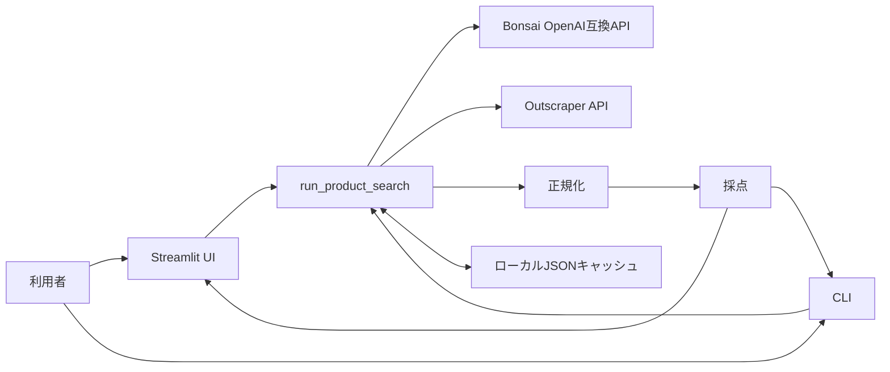

# 設計方針

> **標準文書との関係:** 実装領域ごとの正本は [FRONTEND.md](FRONTEND.md)、[BACKEND.md](BACKEND.md)、[SECURITY.md](SECURITY.md)、[DB-SCHEMA.md](DB-SCHEMA.md) とする。この文書は領域を横断する設計原則と構成を保持する。

## 1. 文書の目的

この文書は、amazon-explorer の現行アーキテクチャ、責務分割、主要な設計判断を示す。実装済みの事実と将来の設計候補を混同しないため、次の優先順位で判断する。

1. `src/` と `app.py` の現行コード
2. `tests/` が固定している振る舞い
3. この文書を含む `docs/`

文書とコードが食い違う場合はコードを正とし、同じ変更で文書とテストを更新する。要件は [REQUIREMENTS.md](REQUIREMENTS.md)、承認済みの次期検索フローは [SEARCH-FLOW.md](SEARCH-FLOW.md)、制約は [CONSTRAINTS.md](CONSTRAINTS.md)、サーバー側の詳細は [BACKEND.md](BACKEND.md)、永続化形式は [DB-SCHEMA.md](DB-SCHEMA.md)を参照する。

## 2. プロダクトの境界

amazon-explorer は、日本語の自然文から Amazon.co.jp の商品候補を探し、条件への近さで順位付けするローカル実行向けPythonアプリケーションである。

現行実装の範囲:

- Bonsai 8BのOpenAI互換APIによる商品属性抽出
- Outscraper Amazon Products APIによる候補取得
- 外部レスポンスのPydanticモデルへの正規化
- SudachiPyとTF-IDFによる日本語・英語テキスト比較
- 条件一致、価格、否定条件を組み合わせたランキング
- Streamlit UIとCLI
- 処理段階ごとのローカルJSONキャッシュ

現行実装に含まれないもの:

- アプリ独自のHTTP API
- RDB、検索エンジン、オブジェクトストレージ
- 認証、認可、テナント管理
- バックグラウンドジョブ、キャンセル、進捗API
- [次期検索フロー v2](SEARCH-FLOW.md) のBonsai strict応答境界、Cloudflare 4方向画像生成、2段階確認、画像類似度。strict intent、正規化、最大2件query planだけは独立domain基盤として実装済み
- コンテナ、クラウド配布設定。決定論的CI定義は現行作業ツリーに追加済みだが、GitHub上の実行結果は未確認

## 3. アーキテクチャ原則

### 3.1 ローカルファーストのモジュラーモノリス

UI、CLI、オーケストレーション、外部APIクライアント、ドメイン変換を1つのPythonリポジトリに置く。ネットワーク越しの内部サービス分割は行わない。外部通信は `src/clients/` に限定し、UIとCLIは同じ `run_product_search()` を利用する。

### 3.2 外部データを内部モデルへ変換する

BonsaiとOutscraperの可変なレスポンスを後段へ直接流さず、次の境界を置く。

```text
利用者入力
  -> Bonsai応答文字列
  -> ProductAttributes
  -> Outscraper生レスポンス
  -> list[NormalizedAmazonProduct]
  -> list[ProductScore]
```

内部モデルは `src/schemas.py` のPydanticモデルを正とする。外部値の緩い表現はサービス層で補正し、キャッシュから復元する場合もモデル検証をやり直す。

### 3.3 結果に影響する値をキャッシュキーへ含める

各キャッシュキーは、入力、設定、前段の内容、処理版を正規化したJSONからSHA-256を計算し、先頭24桁を使う。APIキーは含めない。Streamlitではランダムなセッションscope、CLIでは `local-cli` scopeを使用する。

### 3.4 外部APIを信頼境界として扱う

Outscraperの結果URLは、APIキーを送信する前にHTTPSかつ設定endpointと同一ホスト・ポートであることを検証する。APIキー付き要求のリダイレクトは拒否する。成功、正常な0件、処理中、失敗、不明、待機超過を区別する。

### 3.5 現行機能と設計候補を区別する

将来構想は、実装、設定、テストが追加されるまで現行仕様として扱わない。特に本番化、認証、ジョブキュー、RDB移行、画像処理は未実装である。ただし画像処理を含む次期検索フローの採用判断は [SEARCH-FLOW.md](SEARCH-FLOW.md) で確定済みであり、未決候補ではなく実装待ちの仕様として扱う。

## 4. システム構成



内部は次の責務に分ける。

| 場所 | 責務 |
|---|---|
| `app.py` | Streamlitエントリーポイント |
| `src/ui/streamlit_ui.py` | 入力、状態表示、検索実行、結果描画 |
| `src/main/run.py` | 4段階パイプライン、キャッシュ制御、CLI |
| `src/clients/` | Bonsai・OutscraperとのHTTP通信 |
| `src/services/` | 属性補正、検索語選択、商品正規化、テキスト処理、採点 |
| `src/repositories/` | JSONキャッシュのパス検証、TTL判定、読込・保存 |
| `src/utilities/` | ハッシュ生成、アトミックJSON読書き |
| `src/config.py` | Pydantic Settings、既定値、設定値検証 |
| `src/schemas.py` | 内部データモデル |
| `src/paths.py` | リポジトリルートの絶対パス解決 |

`examples/legacy-phases/` は過去の段階別検証コードであり、現行仕様やテスト対象ではない。

## 5. 処理フロー

`src/main/run.py` の `run_product_search()` が同期的に次を実行する。

1. 入力と `cache_scope` を検証する。
2. Bonsaiを呼び、自然文を `ProductAttributes` に変換する。TTL内の属性キャッシュがあれば再利用する。
3. 日本語検索語、英語検索語、推定日本語商品名の順にOutscraper検索語を選ぶ。
4. Outscraperの非同期タスクを作成し、完了までポーリングする。TTL内の生レスポンスがあればAPIを呼ばない。
5. 生レスポンスを `NormalizedAmazonProduct` のリストへ変換し、重複を除く。
6. 商品名、属性、価格、否定条件を採点し、`ProductScore` の降順リストを作る。
7. 各段階の結果をJSONへ保存し、UIまたはCLIへ返す。

`use_cache=False`、CLIの `--no-cache`、または `ENABLE_CACHE=false` は既存キャッシュの読込だけを無効にする。新たに取得・計算した結果は保存する。

## 6. 属性抽出の設計

Bonsaiへは `src/clients/bonsai_prompt.md` をsystemメッセージ、利用者入力をuserメッセージとして渡す。応答は次の順で扱う。

1. HTTP成功とOpenAI互換レスポンス形状を確認する。
2. `choices[0].message.content` の非空文字列を取り出す。
3. Markdownコードフェンスを除き、最初の `{` から最後の `}` までをJSON候補にする。
4. 辞書上でリスト項目と価格を補正する。
5. `ProductAttributes` で検証する。
6. モデル上で価格帯を整え、根拠の薄いカテゴリを除き、検索語を再構成する。

入力へ含まれない属性を過剰に補わないことをプロンプト方針とする。ただしLLM出力であるため、後段でも不正形状を拒否・補正する。

## 7. 商品正規化の設計

Outscraperの生レスポンスは保存してから正規化する。正規化では次を行う。

- `data` の直下にある辞書と、1段ネストした辞書リストを商品候補として展開する
- 空タイトルの商品を除外する
- 文字列の前後空白を除く
- 明示通貨がJPYまたはUSD以外の商品を除外する
- USDを設定済み固定レートでJPYへ換算する
- 価格、評価、レビュー数から最初の有限数値を抽出する
- Primeのbool、数値、代表的な文字列表現をboolへ変換する
- 高解像度画像と `image_1` から `image_10` を順に集める
- ASIN、短縮URL、商品URL、タイトルの優先順で重複を除く

外部レスポンスが完全であることを前提にせず、利用可能な値だけを内部モデルへ移す。

## 8. ランキング設計

商品名類似度と属性類似度は日本語・英語を別々に計算し、高い方を採用する。属性類似度はTF-IDFコサイン類似度と重み付き条件一致率の高い方である。同点時は、実際に条件語が存在する言語を優先して不足条件を保持する。

既定の総合スコアは次である。

```text
clamp(
  商品名類似度 * 0.45
  + 属性類似度 * 0.35
  + 価格スコア * 0.20
  - 否定条件ペナルティ,
  0.0,
  1.0
)
```

条件語の既定重みは必須語4、色3、特徴2、優先語2、関連語1である。同じ語が複数グループにあれば、優先度の高い最初のグループだけを使う。否定条件は一致1件につき0.2、最大0.5を減点する。スコアは小数4桁へ丸め、総合値の降順に並べる。

ランキング重みは設定可能だが、3つの総合係数は合計1.0、条件語重みは少なくとも1つが正でなければ起動できない。

## 9. キャッシュ設計

現行実装はRDBではなく、共通のローカルディレクトリへJSONを保存する。

```text
cache/
  product_attributes/<key>.json
  outscraper/raw/<key>.json
  outscraper/normalized/<key>.json
  outscraper/scored/<key>.json
```

属性キャッシュは既定24時間、生レスポンスは既定1時間のTTLを持つ。正規化と採点は内容ベースのキーで無期限に再利用できるが、自動削除はない。書込は同じディレクトリ内の一時ファイルへ行い、flush、`fsync`、`Path.replace()` の順で置換する。詳細な論理スキーマとキー材料は [DB-SCHEMA.md](DB-SCHEMA.md)を参照する。

## 10. エラー設計

外部連携の失敗を正常な0件と混同しない。

| 境界 | 現行分類 |
|---|---|
| Bonsai | `BonsaiRequestError`、`BonsaiResponseError` |
| 属性JSON | 生応答を含まない固定文言の `ValueError` |
| Outscraper | `OutscraperRequestError`、`OutscraperResponseError`、`OutscraperSecurityError`、`OutscraperTaskFailedError`、`OutscraperTaskTimeoutError` |
| 入力 | 空入力、空または長すぎるscope、日本語・英語検索語の空文字またはURL形式を `ValueError` |
| キャッシュ | 不在、期限切れ、JSON破損、モデル不一致をミスとして再計算 |

Streamlitは詳細例外をサーバーログへ記録し、画面には固定の失敗メッセージを表示する。CLIでは例外が呼出元へ伝播する。

## 11. 設定とパス

`src/config.py` の `Settings` がOS環境変数とプロジェクトルートの `.env` を読む。環境変数名はフィールド名の大文字表記である。相対指定されたプロンプトとキャッシュのパスは `src/paths.py` の `PROJECT_ROOT` を基準に解決するため、別のカレントディレクトリからCLIを起動できる。

設定値はimport時にグローバルな `settings` として生成される。実行中に環境変数を変更しても自動再読込しない。

## 12. 変更時の判断基準

- 外部API仕様を変える場合はクライアント、例外、モックテストを同時に更新する。
- モデルを変える場合は `src/schemas.py`、変換処理、キャッシュ版、[DB-SCHEMA.md](DB-SCHEMA.md)を更新する。
- スコア結果へ影響する設定を増やす場合は採点キーにも含める。
- 正規化結果へ影響する設定を増やす場合は正規化キーにも含める。
- 保存形式を変える場合は旧キャッシュとの互換性または再計算方針を決める。
- 秘密情報をURL、キャッシュキー、payload、ログ、利用者向け例外へ含めない。
- 長時間化や複数利用者対応は、同期処理や共有ファイルを前提に継ぎ足さず、[PLANS.md](PLANS.md)で移行計画を作る。

## 13. 本番化の設計候補（未実装）

必要性と運用規模を測定した後、次の順で検討する。

1. 認証、認可、利用者単位の保存領域、レート制限、API利用上限
2. キャッシュ容量上限、保持期間、自動削除、破損隔離
3. 代表クエリと期待順位を使うランキング評価
4. ジョブキュー、進捗、キャンセル、期限切れ
5. 構造化ログ、相関ID、メトリクス、分散トレース、アラート
6. 複数ワーカーに適したDBまたはオブジェクトストレージ
7. CI、配布方式、シークレット管理

これらの未実装項目は [TECH-DEBT-TRACKER.md](TECH-DEBT-TRACKER.md)、[ISSUES.md](ISSUES.md)、[TASKS.md](TASKS.md)で状態を管理する。

## 14. 承認済みの次期検索アーキテクチャ（基盤を一部実装）

[SEARCH-FLOW.md](SEARCH-FLOW.md) は次期検索フロー v2 の正本である。現行4段階パイプラインへ画像生成を直接差し込まず、次の独立した状態機械へ置き換える。

```text
自然文
  -> Bonsai JSON text / fail-closed strict intent
  -> deterministic normalization / query plan
  -> 第1確認
  -> optional Cloudflare 4方向画像
  -> 第2確認
  -> Outscraper
  -> deterministic product normalization
  -> deterministic product attributes / unknown preservation
  -> text / price / optional image scoring
  -> total score降順
  -> immutable result snapshot / search history
```

次の判断は確定している。

- 画像生成トグルは既定OFF
- ONでは `@cf/black-forest-labs/flux-2-klein-4b` が基準、左、右、背面の4方向をすべて生成する
- 派生3方向は同じ基準画像を参照し、他providerやComfyUIへ分岐しない
- pHashは重複検出、固定CLIP embeddingは意味的画像scoreと役割を分ける
- 欠損componentのweightを除外して再正規化する
- Outscraperは第2確認のsingle-use承認なしでは呼ばない
- Outscraper後の商品候補はBonsai、OpenAIその他のLLMへ送らず、未観測属性を未知のまま保持する
- UIは状態機械とtyped APIだけに依存し、StreamlitまたはReact/Tailwindを検索ロジックの所有者にしない
- 完了結果は0件も含めて検索履歴へ冪等に保存し、履歴一覧・詳細・削除から外部処理を呼ばない
- 検索履歴はcache TTLと分離して完了日時から30日間保持し、ownerを検証した表示用スナップショットだけを通常画面へ返す。個別削除と期限削除は結果と専有生成画像を物理削除する
- 一時確認はLightboxとAlertDialogへ分離し、待機中の承認済み条件は読み取り専用の右側要約として常時表示する。検索語と商品詳細はページ内折り畳みを維持する

実装は [TASK-008](TASKS.md#task-008-次期検索フロー-v2-の実装) と個別Execution Planで管理する。

最初の境界として `src/search_v2/intent.py` と `query_planner.py` を現行pipelineから分離して追加した。ここではstrict schema、価格mode整合、NFKC正規化、source/prompt/schema/response digest、最大2件queryとplan digestだけを扱う。外部client、state machine、画像、商品候補、採点をimportしないため、この追加だけで利用者フローや外部通信は変化しない。実装証拠は [EXEC-003](old/plans/EXEC-003-SEARCH-FLOW-V2-BACKEND.md) を参照する。
