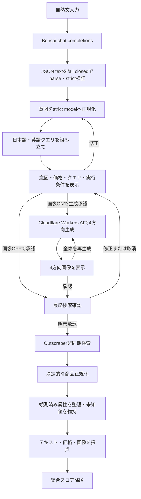

# 次期検索フロー仕様

> **標準文書との関係:** [REQUIREMENTS.md](REQUIREMENTS.md) と [BACKEND.md](BACKEND.md) は要件・実装境界の要約入口である。この文書は次期検索フローの詳細仕様とBonsaiを正本とするprovider判断を保持し、計画中の内容を現行実装済みとは扱わない。

## 1. 状態と正本

この文書は、amazon-explorer の次期検索フロー v2 を定義する。製品検索のLLM providerは現行実装と同じBonsaiを正とし、OpenAI Responses APIやOpenAI Structured Outputsへ置き換えない。strict intent、決定的正規化、最大2件のquery planだけは `src/search_v2/` に隔離実装済みである。現行の `run_product_search()` はまだv2へ切り替えておらず、Bonsai応答をv2 strict modelへ接続する境界、承認state、画像、複数queryの商品取得、ranking v2も未接続である。現行挙動はコードとテスト、この次期仕様の実装判断は本文書を正とする。

関連資料:

- 現行要件: [REQUIREMENTS.md](REQUIREMENTS.md)
- 現行構成: [DESIGN.md](DESIGN.md)
- 現行バックエンド: [BACKEND.md](BACKEND.md)
- 次期UIの人間向け操作: [UI-FLOW.md](../UI-FLOW.md)
- 実装タスク: [TASK-008](TASKS.md#task-008-次期検索フロー-v2-の実装)
- セキュリティ境界: [SECURITY.md](SECURITY.md)

この仕様を文書化する変更では、Bonsai、Cloudflare Workers AI、Outscraperの実サービスを呼ばない。実装、live試験、本番切替は別の変更と承認を必要とする。

## 2. 確定した判断

1. 自然文の意味抽出には、現行と同じBonsaiのOpenAI互換 `/chat/completions` を使う。
2. Bonsaiの `message.content` はJSON textとして受け取り、content全体が単一JSON objectである場合だけparseする。Markdown code fence、前後の説明文、JSON断片抽出、複数object、末尾データを許可しない。
3. parse後の値はPydanticの `strict=True`、`extra="forbid"` モデルで検証してから正規化し、型coercion、unknown field、欠落fieldをfail closedにする。Bonsai側がschema準拠を保証するとはみなさない。
4. LLMは検索に使う意味語句を提案するが、TF-IDFへ渡す最終的な分かち書きは決定的なローカル処理で行う。
5. 検索クエリは正規化済み意図から決定的に組み立て、日本語1件、英語1件の最大2件に制限する。
6. スクレイピング前に利用者確認を必須とする。画像生成を有効にした場合は、画像生成前とOutscraper実行前の2回確認する。
7. 画像生成トグルの既定値はOFFとする。ONの場合はCloudflare Workers AIだけを使い、同じ商品案の4方向画像を生成する。
8. Outscraper結果は決定的に正規化する。正規化で解決できない商品属性は `unknown` のまま保持し、Bonsai、OpenAIその他のLLMによる商品属性補完を行わない。価格、ASIN、URL等の観測済み事実を推論値で上書きしない。
9. 日本語・英語のTF-IDFは別々に計算し、高い方を採用する。
10. pHashとHamming距離はほぼ同一画像の重複検出だけに使い、意味的な画像類似度には使わない。
11. 意味的な画像類似度は固定したCLIP画像エンコーダーのcosine類似度で計算する。
12. 総合スコアは高い順、すなわち降順で並べる。通常画面の並び順名は `条件に近い順` とする。
13. フローはUI技術から独立させる。現行StreamlitからReact/Tailwindへ移行しても同じ状態遷移、承認、API契約を維持する。

## 3. 利用者フロー



### 3.1 第1確認: 条件・価格・参考画像

利用者へ次を表示する。

- 入力から抽出した商品種別、カテゴリ、必須・希望・除外条件
- 明示価格と推定価格を区別した価格条件
- 既定OFFの参考画像トグル
- 参考画像をONにした場合は、4方向を1組として1計画で2回まで作ることと、初回生成前の `参考画像を使う（残り2回）`
- 回数制限がある他の外部処理は、サーバーが残数を返せる場合だけ利用者向けの `残りN回`。返せない場合は実行可否だけ

検索クエリは通常閉じた `検索語を確認・修正` 内へ置く。利用者は属性、価格、クエリを編集できる。編集後は再正規化して新しい計画digestを作り、旧承認を無効にする。model名、サービス名、call数、token数、digestはserver-side metadataへ保持し、通常画面へ表示しない。

### 3.2 第2確認: 商品検索の最終確認

画像OFFの場合はクエリ確認後、画像ONの場合は4方向画像の確認後に、次を1画面で表示する。

- 整理済みの商品条件と価格
- `Amazon.co.jp` のような検索先
- 比較候補の上限（最大48件）
- 承認済み4方向画像、または参考画像を使わない表示
- `商品名と特徴`、`価格`、`見た目` のような比較項目
- 現在のsingle-use承認で商品検索を1回実行すること。これは検索クォータの残数として表示しない

実際のクエリ配列、domain、language、postal code、limit、採点profile、外部APIごとの予約済みcall数・token・金額上限は承認対象データへ含めるが、通常画面には表示しない。外部APIの単価、見積額、合計額、金額上限も通常画面へ表示または入力させない。postal codeはserver-sideの送信条件として保持し、お届け先や郵便番号の表示項目を利用者向け最終確認に追加しない。クエリは利用者が開いた場合だけ表示する。

`この条件で商品を探す` という専用操作だけを明示承認とする。ページ表示、画像生成承認、Enterキーによるフォーム送信、以前の承認を商品検索の実行承認として扱わない。

### 3.3 通常画面の表示境界

通常画面に表示するのは、利用者が内容を判断するため、次の操作を選ぶため、または問題から回復するために必要な情報だけとする。

次は保存・監査・再現に必要でも通常画面へ表示しない。

- session、run、request、task、candidate等の内部ID
- provider名、model名、revision、prompt、schema、reasoning設定
- attempt番号、seed、digest、SHA、hash、evidence
- API call数、token数、batch数、poll数、内部query数
- JSON、内部状態名、ranking profile、raw score、component、正規化weight、採用言語
- TF-IDF、CLIP、pHash、Hamming距離等の実装方式
- 外部APIの単価、見積額、合計額、金額上限

技術情報はserver-side metadataと運用者向けログへ保持する。診断画面を設ける場合は通常画面と認可境界を分け、内部情報を任意のJSONとしてbrowserへ返さない。

残り回数はproviderのAPI call数ではなく、利用者が選ぶ外部処理1回を単位とする。画像生成は4画像1 setを1回、1計画を最大2回と数え、初回生成前 `残り2回`、初回生成後 `残り1回`、一括作り直し後 `残り0回` を通常画面へ出す。それ以外の残数は画面側で算出せず、予約の成否と失敗分の扱いを反映したサーバー応答が返せる場合だけ `残りN回` を示す。残数を返せない再試行は可否だけを示す。`残り0回` では該当操作を無効にする。内部のcall・token・金額上限は別にfail closedで強制し、残り回数が正でも予約できなければ外部要求を送らず、通常画面には金額を含まない理由を返す。

画像setの残数はサーバーが最初のCloudflare要求より前に原子的に予約する。予約拒否や入力検証失敗により外部要求を0件のまま止めた場合は消費しない。1件でも外部要求を開始した後は、4枚の一部または全部が失敗してもset 1回を消費する。画面は予約後の応答を正とし、楽観的に残数を減らさない。

### 3.4 モーダル系UIの境界

ページから切り離すのは、一時的な確認と補助参照だけとする。

- 4方向参考画像の拡大は、採否を変更しないライトボックスにする
- 4枚一括の画像再生成は、置換範囲、現在と実行後の残り回数を示す確認ダイアログにする
- 待機画面の右側には、承認済みの条件、価格、検索先、比較候補の上限、参考画像利用の有無を読み取り専用の要約として常時表示する。これはページ内のサイドビューであり、独立したDialogやSheetにしない。郵便番号、お届け先、検索語、内部情報は含めない
- 検索中止は、serverが安全に取消可能と判定した場合だけ確認ダイアログを開く
- 新しい検索は、現在結果が履歴から復元不能な場合だけ確認ダイアログを開く
- 再試行は、外部処理を再実行する場合だけ対象範囲を示す確認ダイアログを開く。サーバーが残数を返せる場合は `残りN回`、返せない場合は再試行可否だけを示す
- 履歴削除は、復元不能であることを示す確認ダイアログにする

検索語編集と商品詳細はページ内の折り畳みを維持する。最終確認画面、待機画面、結果画面、履歴一覧をDialogへ入れない。モーダルを開いたこと、閉じたこと、ライトボックスで画像を移動したことをserver-sideの承認または外部API実行として扱わない。

## 4. 状態遷移

検索sessionは次の状態を持つ。

| 状態 | 意味 | 外部通信 |
|---|---|---|
| `draft` | 自然文入力中 | なし |
| `intent_processing` | Bonsaiで意図抽出・strict検証中 | Bonsaiのみ |
| `intent_review` | 属性・価格・クエリの第1確認 | なし |
| `image_generating` | 4方向画像を生成中 | Cloudflareのみ |
| `image_review` | 生成画像の確認・全体再生成待ち | なし |
| `search_approval` | Outscraper実行の第2確認 | なし |
| `scrape_submitted` | 承認済み要求を投入済み | Outscraperのみ |
| `scrape_pending` | 非同期結果を待機中 | Outscraperのみ |
| `normalizing` | 商品を決定的に正規化中 | なし |
| `attribute_preparing` | 観測済みの商品属性を決定的に整理中 | なし |
| `scoring` | 決定的な採点中 | 商品画像取得を除きなし |
| `completed` | 結果表示可能 | なし |
| `failed` | 再試行または修正が必要 | なし |
| `cancelled` | 利用者が取消済み | なし |

状態遷移はサーバー側で検証する。ブラウザから任意の状態、承認済みflag、API要求を直接指定させない。

通常の待機画面は内部状態名を描画せず、次の5段階へ変換する。

| 通常画面の段階 | 対応する内部状態 | 利用者向けの確定情報 |
|---|---|---|
| `商品を探しています` | `scrape_submitted`、`scrape_pending` | 取得が確定した後の商品件数 |
| `商品情報を整理しています` | `normalizing` | 比較対象件数と、必要な場合だけ対象外理由の要約 |
| `商品の特徴を確認しています` | `attribute_preparing` | 観測できない属性を未知のまま続行する場合の平易な注意 |
| `希望条件と比べています` | `scoring` | 参考画像を使わなかった場合の案内 |
| `結果を準備しています` | sort・結果保存から `completed` まで | 表示可能になった結果件数 |

進行中は現在の段階だけを `処理中`、完了済みを `完了`、後続を `待機` とする。確定していない進捗率や残り時間を生成しない。完了後は自動遷移せず `結果を見る` を有効にする。取消操作はサーバーが安全に取消可能と返した状態だけに表示する。

`completed` と履歴保存状態は分離する。履歴保存の `pending`、`saved`、`failed` によって検索処理を再実行したり、完了済みの順位を変えたりしない。完了した同じ検索を複数回受信しても履歴項目は1件だけ作る。

## 5. 意図抽出と型境界

### 5.1 Bonsai要求と応答境界

意図抽出は次の契約に固定する。

| 項目 | 値 |
|---|---|
| API | Bonsai OpenAI互換 `POST {BONSAI_BASE_URL}/chat/completions` |
| 出力 | `choices[0].message.content` のJSON text |
| 既定モデル | `Bonsai-8B.gguf` |
| temperature | `0.1` |
| max tokens | `1000` |
| timeout | `60` 秒 |
| 自然文上限 | 2,000 Unicode code points |

モデル名、system prompt、期待するJSON契約は版とSHA-256を持ち、応答とキャッシュキーへ結び付ける。利用できる場合は実モデルのdigest、request ID、usage、終了理由もserver-side metadataへ保存するが、Bonsai応答に存在しないmetadataを推測して作らない。

BonsaiのHTTP失敗、OpenAI互換envelope不正、空content、JSON構文不正、JSON object以外、前後の非JSON text、unknown field、欠落field、strict型不一致を正常な検索意図として扱わない。contentから最初の `{` と最後の `}` の間だけを抜き出したり、Markdown code fenceを除いて救済したりしない。利用者へ固定メッセージを返し、入力の修正または明示的な再試行を求める。生contentを画面や例外メッセージへ含めない。

### 5.2 `SearchIntentDraft`

Bonsaiには次の全fieldを持つ単一JSON objectを返すようpromptで要求する。promptは保証境界ではないため、全field required、任意値は `null` を許すstrict Pydanticモデルで受信後に検証する。

| field | 内容 |
|---|---|
| `product_name_ja` / `product_name_en` | 推定商品名 |
| `category_ja` / `category_en` | 推定カテゴリ |
| `required_terms_ja` / `_en` | 必須条件の意味語句 |
| `preferred_terms_ja` / `_en` | 希望条件の意味語句 |
| `negative_terms_ja` / `_en` | 除外条件の意味語句 |
| `color_ja` / `_en` | 明示または推定色 |
| `features_ja` / `_en` | 機能・材質・形状等 |
| `brand` / `model_number` | 明示された場合だけ設定 |
| `price` | 通貨、exact/range/min/max/none、各値、explicit/inferred、confidence |
| `ambiguities` | 検索前に確認すべき曖昧点 |

LLMが返す語句配列は意味単位の候補であり、TF-IDFへ直接渡すtoken列ではない。

### 5.3 `NormalizedSearchIntent`

サーバーは次を決定的に実行し、Pydanticの `strict=True`、`extra="forbid"` モデルへ格納する。

1. Unicode NFKC、前後空白除去、空値除去、casefold重複判定
2. field・配列件数・文字列長を検査し、intent全体を49,152 UTF-8 bytes以下に制限
3. 価格を正のJPY整数へ限定し、`min <= max` を強制
4. 明示値と推定値の区別を維持し、推定価格を画面で明示
5. brandとmodel numberは利用者入力に根拠がない場合 `null`
6. 重大な矛盾や商品カテゴリ不明を `blocking ambiguity` として検索前に停止
7. source input、prompt、schema、responseのdigestをserver-side metadataへ付与

型変換で文字列の真偽値化、負数価格の絶対値化、未知fieldの黙認をしない。

## 6. 検索クエリ計画

`SearchQueryPlan` はLLM出力をそのまま採用せず、`NormalizedSearchIntent` から決定的に構築する。

- 日本語クエリ1件、英語クエリ1件の最大2件
- 各クエリは1文字以上200文字以下
- URL、制御文字、改行、API構文、空クエリを拒否
- 商品名、カテゴリ、明示brand/model、必須語を優先し、希望語は長さ上限内だけ追加
- 除外語をAmazon検索構文へ埋め込まず、採点時の減点へ使う
- NFKC・casefold後に同一となる2件は1件へ縮約
- 利用者編集後も同じ検証を通す

Outscraper要求は1回の非同期要求にクエリ配列を渡す。既定は `amazon.co.jp`、`ja`、設定済み郵便番号、`async=true`、1クエリ当たり24件とし、最大候補数は48件である。ASINを第一キーとして後段で重複を除く。

## 7. Cloudflare Workers AIによる4方向画像生成

### 7.1 有効化条件

- 画像生成トグルの既定値はOFF
- 第1確認で利用者が画像生成を明示承認した場合だけ実行
- Cloudflare account ID、API token、内部費用上限が揃わなければONにできない。内部費用上限は通常画面へ表示しない
- API tokenはサーバー側だけに保持し、ブラウザへ渡さない

### 7.2 モデルと生成枚数

| 項目 | 確定値 |
|---|---|
| provider | Cloudflare Workers AI |
| model | `@cf/black-forest-labs/flux-2-klein-4b` |
| output | 512 × 512、PNGへ正規化 |
| steps | モデル固定の4 steps |
| guidance | 要求へ指定せずprovider既定値を使用 |
| 1 set | 4画像、4 API calls |
| 再生成 | 全4画像を一括、既定1回まで |
| 最大 | 1計画当たり2 sets、8 API calls |

生成順序を固定する。

1. `front_three_quarter`: 自然文だけから基準画像を生成
2. `left_side`: 基準画像を `input_image_0` にして左側面を生成
3. `right_side`: 同じ基準画像を `input_image_0` にして右側面を生成
4. `rear_three_quarter`: 同じ基準画像を `input_image_0` にして背面斜めを生成

派生3画像も別の生成器へ渡さず、すべて同じCloudflare Workers AIモデルで生成する。基準画像は参照入力前に縦横最大511pxへ縮小し、PNG、sRGB、メタデータ除去済みにする。派生画像を次の派生画像へ連鎖入力しない。

### 7.3 promptとseed

promptは正規化済み意図からテンプレートで作る。商品種別、明示色、材質、形状、必須機能、対象角度、中立背景、単一商品、同一identityの維持を含める。利用者が明示していないbrand、logo、model number、文字、認証マークを生成するよう指示しない。

seedは次のdomain-separated SHA-256の先頭32bitから決める。

```text
SHA256("amazon-explorer-image-seed-v1\n" + preimage_plan_sha256 + "\n" + angle + "\n" + attempt)
```

seed、prompt、model、寸法、angle、attempt、request ID、出力SHA-256を保存する。seedが同じでもprovider更新後のbyte一致は保証しない。

### 7.4 確認と失敗

- 4枚を角度名と `AI生成イメージ` 表示付きで同時表示する。attempt番号は表示せず、初回生成後は `作り直せる回数：残り1回`、作り直し後は `残り0回` だけを示す
- 1枚でも失敗または同一性が明らかに崩れた場合、そのsetを最終承認できない
- 作り直しは4枚全体を新しいattemptで生成し、旧setの承認を無効にする。attemptはserver-side metadataにだけ保持する
- 生成画像は商品の存在、仕様、在庫、価格を証明しない
- 生成画像そのものをOutscraperへ送らない

## 8. 承認済み計画の固定

第2確認ではcanonical JSONから `approved_plan_sha256` を作る。少なくとも次を含める。

- 正規化済み意図とsource digests
- クエリ配列とOutscraper全parameter
- 画像ON/OFF、4画像のSHA-256、生成request metadata
- Bonsaiのcall・生成上限、CloudflareとOutscraperのcall・費用上限
- ranking profile、model IDs、prompt/schema/version digests
- 作成時刻、15分の期限、session主体

承認tokenはsingle-useとし、利用者、session、plan digest、期限へ結び付ける。クエリ、属性、価格、画像、API parameter、ranking profileのどれかが変わったら承認を破棄して第1または第2確認へ戻す。

## 9. 商品取得と決定的正規化

### 9.1 Outscraper

Outscraperは承認済みparameter以外を送らない。task作成、同一originの結果URL、bounded polling、retry対象、redirect拒否は現行の安全境界を維持する。

実APIテストは、送信クエリ、domain、language、postal code、limit、最大候補数、timeout、見積費用を実施者へ提示し、その実行ごとに明示承認を得るまで開始しない。CIと通常pytestからは呼ばない。

### 9.2 決定的な正規化

Outscraperの観測値を `RawProductCandidate` から `NormalizedProductCandidate` へ変換する。

- ASIN、商品URL、画像URL、title、brand、description、categories
- JPY価格、rating、review count、Prime、availability
- query provenanceとOutscraper request ID
- 重複除去とreject理由

価格、URL、ASIN、rating、review countは観測値として保持し、LLM出力で置換しない。

### 9.3 商品属性の未知値

商品候補には、Outscraperで観測した構造化fieldと、長さを制限したtitle、description、categoriesだけを使う。正規化と採点用属性の組み立ては決定的なローカル処理に限定する。

- 観測されなかったカテゴリ、色、材質、機能等は `null` または空配列として保持し、意味上は `unknown` とする
- 欠損と「該当しない」を同じ値にしない
- Bonsaiは利用者の検索意図抽出だけに使い、Outscraper後の商品文を送らない
- OpenAIその他のLLMによる商品属性補完経路を設けない
- 価格、ASIN、URL、rating、review count等の観測値を推論で変更しない
- 未知属性を架空の値で埋めず、採点componentの欠損規則へ渡す

未知属性が判断に影響する場合だけ、通常画面に `商品説明では確認できない点` または `確認できた情報で比較しています` と案内する。内部field名や欠損理由をそのまま表示しない。

## 10. テキスト、価格、画像の採点

### 10.1 テキスト

- 日本語はSudachiPy `SplitMode.C` と内容語filterを使う
- 英語・数字はcasefold後の `[a-z0-9]+` を使う
- queryと当該結果集合を同じcorpusとしてTF-IDFをfitする
- 商品名と属性を日本語・英語で別々に計算し、それぞれ高い方を採用する
- 必須、色、機能、希望、関連語の重み付き一致とTF-IDFの高い方を属性値に使う
- 採用言語と両言語のraw scoreを結果へ残す

### 10.2 価格

価格scoreは現行の比率式を維持する。

- exact: `min(actual, target) / max(actual, target)`
- range内: `1.0`
- range外: 最も近い境界との小さい値 / 大きい値
- max/minだけ: 境界を満たす場合 `1.0`、外れる場合は比率
- 価格条件なし: `0.5`
- 価格不明: price componentを欠損として総合重みから除く

推定価格は利用者が第1確認で承認した場合だけ使う。

### 10.3 画像

#### 重複検出

64bit pHashとHamming距離を使い、距離5以下をほぼ同一画像として重複除去候補にする。pHash値やHamming距離を商品意味類似度へ変換しない。

#### 意味的類似度

画像rankingを有効にする場合は、ローカルの `openai/clip-vit-base-patch32`、revision `12b36594d53414ecfba93c7200dbb7c7db3c900a` を使う。model assetsはreleaseに固定し、runtime downloadを行わず、起動時にdigestを検証する。

1. 承認済み4方向画像と、商品ごとに最大4枚の画像を同じprocessorでencodeする。
2. 各embeddingをL2正規化する。
3. 各生成角度について商品画像とのcosine類似度の最大値を取る。
4. 4角度の平均cosineを `mean_cosine` とする。
5. `image_score = clamp((mean_cosine + 1) / 2, 0, 1)` とする。

CLIPによるimage-to-image比較は本タスク向けに品質保証されたものではないため、固定評価fixtureで採用基準を満たすまで `IMAGE_RANKING_ENABLED=false` とする。無効時も4方向画像の生成・利用者確認は利用できる。

商品画像の取得はHTTPS、許可host、redirect拒否、DNS/IP再検証、content type、8 MiB、4096px、10秒、decompression bomb検査を満たすproxyだけで行う。条件を満たさない画像は欠損扱いにし、ブラウザやモデルへ直接取得させない。

### 10.4 総合score

ranking profile v2の基準重みは次である。

| component | weight |
|---|---:|
| title | 0.40 |
| attributes | 0.30 |
| price | 0.20 |
| image | 0.10 |

欠損または無効なcomponentは0点として残さず、そのweightを除いて利用可能なweightを合計1.0へ正規化する。

```text
positive_score = sum(component_score * normalized_available_weight)
negative_penalty = min(0.5, 0.2 * matched_negative_term_count)
total_score = round(clamp(positive_score - negative_penalty, 0, 1), 4)
```

並び順は次のstable keyによる降順・昇順の組合せに固定する。

1. `total_score` 降順
2. `attribute_score` 降順
3. `title_score` 降順
4. price既知を先、同条件なら `price_jpy` 昇順
5. ASIN、なければcanonical product URLの辞書順

通常画面では総合scoreを `条件との近さ` として表示し、`希望に合う点`、`商品説明では確認できない点`、`避けたい条件への該当` を平易な語句で示す。参考画像を使わなかった場合や商品画像がない場合は、`画像を使わずに比較しました` と案内する。各componentのraw score、実際に使った正規化weight、採用言語、内部の画像scoreはserver-side結果へ残し、通常画面には表示しない。

ランキング結果は全件を保持し、固定3件へ切り捨てない。初期表示件数は現行Streamlitと同じ10件、変更範囲は1件から30件とする。表示件数の変更は保存済みの順位付け結果の描画だけを変え、クエリ生成、商品取得、正規化、採点を再実行しない。最大候補数、実際に比較できた件数、現在の表示件数を混同しない。

## 11. データ保持とキャッシュ

cache keyには入力、prompt/schema/model、正規化版、query plan、provider parameter、画像SHA、ranking profile、CLIP asset digestを含める。API key、access token、approval tokenは含めない。

| データ | 既定保持 |
|---|---:|
| intentとquery plan | 24時間 |
| 生成画像 | 24時間 |
| Outscraper raw response | 1時間 |
| 正規化商品 | 24時間 |
| scoring result | 24時間 |
| approval token | 15分、single-use |

外部providerの保持方針はローカルTTLと別である。公開前に利用者向け通知と削除手順を実装する。

### 11.1 検索履歴

計算を省略するためのcacheと、利用者が後から結果を見るための検索履歴を分離する。検索履歴は完了日時から30日間保持する。新しい検索、ページ再読込、再ログインまたはアプリ再起動をまたいでも、同じownerは保存期間内の履歴を開ける。cache TTLの満了を理由に履歴を一覧から消したり、履歴表示時に外部処理で結果を作り直したりしない。

正常に `completed` へ到達した検索1回を、0件の場合も含めて履歴1項目として冪等に保存する。`failed` と `cancelled` は結果履歴へ保存しない。保存単位は次を含むimmutableな表示用スナップショットである。

- 完了日時、利用者が入力した自然文、確定した条件と価格
- 参考画像利用の有無と、利用した場合の承認済み4画像
- 比較候補上限、実際に比較できた件数、順位付け済みの商品全件
- 商品名、画像、価格、外部リンク、条件との近さと判断理由の利用者向け表示値
- 履歴のownerと、重複保存を防ぐserver-sideの完了キー

表示用スナップショットと、再現・監査用metadataは別の保存モデルにする。browser向け履歴APIはallowlistで表示モデルを構築し、郵便番号、お届け先、内部ID、クエリparameter、provider、model、prompt、token、digest、raw score、内部component、実weightを返さない。

履歴ownerは認証済み利用者またはtenantのserver-side主体へ結び付ける。session IDや公開用locatorを認可境界に使わない。認証を備えないローカル版で先行実装する場合はsingle-user deploymentだけに限定し、複数利用者へ公開しない。

履歴一覧は新しい完了日時順とし、一覧読込、詳細読込、削除は外部AI、Outscraper、商品画像評価を呼び出せない専用serviceで行う。詳細読込と再読込は保存済みスナップショットの取得だけを行う。商品リンク先の価格、在庫、内容が保存時点から変わり得ることを通常画面で案内する。

個別削除はownerを再検証し、対象履歴に属する表示スナップショットと承認済み生成画像を一つの操作として物理削除する。失敗時は項目を一覧に残し、再試行しても外部検索や採点を実行しない。

完了日時から30日の期限へ到達した履歴も同じ範囲を期限削除し、期限後の一覧・詳細APIから返さない。期限削除は冪等に再実行でき、部分削除を成功として扱わない。期限切れ履歴を外部処理から再構築しない。監査上の最小記録を別途保持する必要がある場合も、利用者入力、商品内容、生成画像を含めず、通常画面へ表示しない。

## 12. 失敗時の動作

| 失敗 | 動作 |
|---|---|
| Bonsai通信・envelope不正 | 意図確認へ戻し、検索・画像生成を開始しない |
| Bonsai contentのJSON・strict schema不一致 | 固定エラー、raw本文を画面へ出さない |
| Cloudflare 1枚失敗 | set全体を未承認にし、再試行または画像OFFを選ばせる |
| 再生成上限到達 | 画像OFFへ切替えるか検索を取消す |
| Outscraper作成失敗 | bounded retry後にfailed。自動で別queryを追加しない |
| Outscraper正常0件 | completedの0件。エラーとしない |
| 商品属性が未知 | 観測・正規化できた値だけで続行し、必要な場合だけ確認できない点を表示 |
| 商品画像取得失敗 | image componentを欠損にし、重みを再正規化 |
| CLIP asset不一致 | image rankingを起動時に拒否。text/priceだけのprofileへ明示切替可能 |
| 承認期限切れ | 外部APIを呼ばず第2確認へ戻す |

上表は内部処理とログの契約である。通常画面ではprovider名や失敗した実装方式を出さず、次のように利用者の行動へ結び付く文言へ変換する。

| 通常画面の状況 | 表示 | 操作 |
|---|---|---|
| 条件を整理できない | `入力内容を整理できませんでした` | `入力を修正`、`もう一度試す` |
| 参考画像の一部を作れない | `参考画像をすべて作成できませんでした` | `画像を作り直す`、`参考画像を使わない` |
| 商品検索を開始または完了できない | `商品を探せませんでした` | `もう一度試す`、`条件を見直す` |
| 一部の特徴を確認できないが続行可能 | `確認できた情報で比較を続けています` | 操作不要 |
| 画像による比較を利用できない | `画像を使わずに比較します` | 続行、または条件を見直す |
| 正常に0件 | `条件に合う商品が見つかりませんでした` | `条件を見直す` |

credential、provider raw error、stack trace、内部ID、request metadataはエラーレスポンスへ含めない。運用者が照合できる短い公開用エラーコードを設ける場合も、内部IDそのものを流用しない。

## 13. セキュリティと費用境界

- Bonsai接続先はserver-side設定に限定し、CloudflareとOutscraperのcredentialはそれぞれ別のserver-side secretとして管理する
- browserへcredential、provider raw error、内部prompt、stack traceを返さない
- browser向け表示モデルをallowlistで構築し、内部ID、model、digest、hash、評価方式、raw score、weight等を通常レスポンスへ含めない
- 履歴の一覧・詳細・削除は毎回ownerを検証し、公開用locatorやsession IDだけで別利用者の履歴へアクセスさせない
- 外部AIへ送る前にcredential file、secret assignment、高entropy tokenを検査する
- 外部商品文、画像、URLをBonsaiその他のLLMへ渡さず、命令として扱わない
- per-user、per-session、per-dayでBonsaiのcall・生成上限と、Cloudflare・Outscraperのcall・金額上限を強制し、予約に失敗した要求は送らない
- provider料金は変更され得るため、production releaseで承認済みpricing policyと上限を固定する
- 画像再生成、Bonsai再試行、Outscraper再試行も失敗分を含めて利用量へ計上する
- 明示確認は費用上限を迂回しない。上限超過は利用者が確認しても拒否する

## 14. テストとlive実行規約

### 14.1 通常テスト

通常pytestとCIは外部通信を行わず、次をfixtureで検証する。

- Bonsai request、OpenAI互換response envelope、content全体のJSON parse、strict schema、unknown field、型不一致
- 正規化、価格矛盾、query件数・文字数、plan digest、承認失効
- Cloudflareの4 call順序、角度、参照画像、seed、再生成上限
- 初回画像生成前の `残り2回`、生成後の作り直し `残り1回`、実行後の `残り0回`、残数を返せない再試行の可否表示
- Outscraper request previewと未承認時の未呼出
- deterministic product normalization、未知属性の維持、Outscraper後にLLMを呼ばないこと
- 日本語・英語TF-IDF、価格式、pHash重複検出、CLIP fixture embedding
- 欠損componentのweight再正規化、stable sort、score breakdown
- secret、SSRF、画像byte・dimension・timeout上限
- completed 1件につき履歴1件、0件結果の保存、重複完了通知の冪等性
- 履歴の空・読込失敗・詳細not found・削除失敗・owner不一致
- 履歴一覧、詳細、再読込、削除が外部処理を呼ばないこと
- 履歴表示モデルに郵便番号、お届け先、内部metadataが含まれないこと
- 通常画面用モデルに外部APIの単価、見積額、合計額、金額上限が含まれないこと
- 完了から30日未満は保持し、`expires_at` 到達後は一覧・詳細へ返さず、履歴・結果・専有生成画像を物理削除すること

### 14.2 Bonsai結合試験

通常pytestではBonsaiを呼ばない。実Bonsaiとの結合試験は、送信する自然文、model、prompt digest、max tokens、timeoutを記録し、最初は意図抽出1回だけにする。商品fixtureをBonsaiへ送る補完試験は設けない。

### 14.3 Cloudflare live試験

実画像試験は必要最低限とする。最初は `front_three_quarter` 1枚だけを生成し、prompt、model、寸法、seed、見積費用を提示して承認を得る。4方向set、再生成、負荷試験は別々の承認なしに実行しない。

### 14.4 Outscraper live試験

実行前に、送信クエリ、domain、language、postal code、limit、最大候補数、timeout、見積費用を必ず提示し、その回の明示承認を得る。承認前の事前通信、疎通目的の有料検索、CIからの実行を禁止する。

## 15. 実装順序と完了条件

実装は次の順序に固定する。

1. strict domain model、Bonsai contentのfail-closed JSON parser、schema不一致tests
2. intent normalization、deterministic tokenizer、query plan、digest
3. 2段階承認state machineと費用ledger
4. Cloudflare 4方向request builderをmockでRED→GREEN
5. Outscraper複数query境界と明示承認guard
6. deterministic product normalization、未知属性の維持、post-Outscraper LLM非呼出しguard
7. text・price scoreとstable sort
8. image proxy、pHash dedupe、pinned CLIP score
9. API-first backend contractとUI
10. offline全体回帰、security review、承認済みの最小live試験

2026-08-16時点では手順1のstrict domain modelと手順2のintent normalization・最大2件query plan・digestまでをTDDで実装した。Bonsaiをv2 strict modelへ接続するrequest/response境界、決定的tokenizer、手順3以降は未実装である。[EXEC-003](old/plans/EXEC-003-SEARCH-FLOW-V2-BACKEND.md) は当時の実装証拠として参照し、そこに残るOpenAI provider案は本文書の現行判断を上書きしない。

次をすべて満たすまで「次期検索フロー実装済み」と表現しない。

- 本文の状態遷移と2段階承認を改ざんできない
- Cloudflare Workers AIで4方向を同一setとして生成・再生成できる
- Outscraperは第2確認なしでは1回も呼ばれない
- Bonsaiの通信・envelope・JSON・strict schema不一致をfail closedにする
- pHashとsemantic image scoreが別の役割として実装される
- component欠損時の重み、stable sort、score breakdownが決定的である
- 通常CIがnetworkなしで通り、live試験の実施・未実施境界が記録される
- 固定評価fixtureでranking profile v2とCLIP image rankingを承認する

## 16. 明示的な非採用

- LLMが返したtoken配列をそのままTF-IDFへ渡す
- pHash/Hamming距離を商品の意味的類似度とする
- 生成画像を実在商品または商品仕様の証拠とする
- 画像生成後に利用者確認なしでOutscraperを起動する
- 4方向を別providerやローカルComfyUIで補う
- 欠損した画像・価格を0点として不利にする
- 総合類似度の昇順表示
- 現行Streamlit画面へ全処理を同期的に継ぎ足す
- OpenAI Responses APIまたはOpenAI Structured Outputsを製品検索の意図抽出へ追加する
- Outscraper後の商品候補をBonsai、OpenAIその他のLLMで補完する
