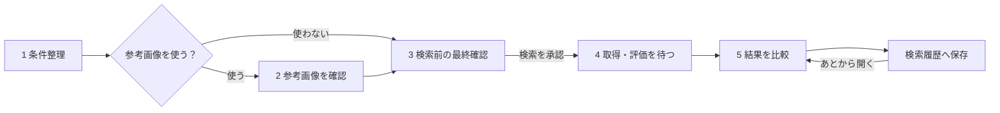

# Amazon Explorer UI操作フロー

この文書は、次期UIを実際に使う人が「どの画面で、何を確認し、どのボタンを押すか」を説明する操作ガイドである。利用者に必要な情報だけを扱い、内部サービス、モデル、識別子、計算方式の説明は画面へ出さない。

- 対象: デスクトップ版のみ
- デザイン: [amazon-explorer｜検索フロー UI Design Sheet v2](https://www.figma.com/design/PEVM5G4854vaDqdWgSA3ui)
- 現行Streamlitではなく、採用済みの次期検索画面を対象とする

## 1. 最短の操作順

1. 探している商品を自然文で入力する
2. 整理された条件と価格を確認する
3. 必要なら4方向の参考画像を生成して確認する
4. 実際に送信する検索内容と実行範囲を最終確認する
5. `この条件で商品を探す` を押す
6. 商品の取得と評価が終わるまで待つ
7. 条件に近い順に結果を比較する
8. 必要なときにヘッダーの `検索履歴` から保存済み結果を開く



### 画面上部の共通表示

画面上部のヘッダーと進行表示は、どのStepでも同じ位置に残る。

| 部分 | 通常時の表示 | 状態が変わったときの表示 |
|---|---|---|
| ヘッダー左 | `Amazon Explorer` と現在画面の名前 | 画面遷移後に画面名だけ切り替わる |
| ヘッダー右 | `検索履歴` | 接続に問題がある場合は履歴ボタンへ状態を詰め込まず、見出しの下へ `接続を確認しています` を表示する |
| 進行表示の完了Step | 緑の番号とラベル | 条件変更で確認が無効になると、影響を受けるStepは未完了の灰色へ戻る |
| 進行表示の現在Step | 紫の番号とラベル | 次画面を開いた時に紫表示が1つ右へ移る |
| 進行表示の未到達Step | 灰色の番号とラベル | そのStepへ到達するまで押せない |

次期UIの初回実装で共通ヘッダーへ追加するグローバル操作は、検索中の画面から履歴一覧へ移動する `検索履歴` だけとする。設定ボタン、設定画面、設定用routeは今回の実装範囲に含めず、無効な設定ボタンも置かない。

session ID、run ID、request ID、内部接続先、利用量メーターはヘッダーへ表示しない。画面を移動した直後は、新しい画面の見出しへキーボードフォーカスを移す。進行表示自体は押して移動する部品ではない。

## 2. Step 1: 条件整理

### 画面で行うこと

自然文入力欄に、探している商品の条件を入力する。

入力例:

```text
1万5千円以内で、白くて静かな日本語配列のワイヤレスキーボード。
テンキー付きは避けたい。
```

入力後に `条件を整理する` を押す。入力は2,000文字以内とする。

### 入力から条件整理完了までの画面変化

| タイミング | 入力欄と条件領域 | ボタン | 進行表示・メッセージ |
|---|---|---|---|
| 初期表示 | 空の自然文入力欄、`0 / 2,000`、参考画像OFF | `条件を整理する` は無効 | Step 1だけ紫、Step 2以降は灰色 |
| 文字入力中 | 文字数を即時更新する | 1文字以上かつ2,000文字以内で有効 | 外部処理は始まらない |
| 2,000文字超過 | 入力枠と文字数を赤色にし、`2,000文字以内で入力してください` を直下表示 | `条件を整理する` を無効化 | エラー箇所へフォーカスできる |
| `条件を整理する` 押下直後 | 入力欄を読み取り専用にし、条件領域へ読み込み用の仮表示を置く | `整理しています…` に変えて無効化 | 見出し下へ `入力内容を整理しています` を表示 |
| 整理成功 | 仮表示を条件カードと価格へ置換 | 画像OFFなら `画像なしで最終確認へ`、ONなら `参考画像を作る` を表示 | Step 1は紫のまま。内容確認待ちになる |
| 整理失敗 | 入力欄を再編集可能に戻し、条件カードは表示しない | `もう一度試す` を表示 | 画面上部と入力欄直下へ同じ要旨のエラーを表示 |

### 整理後に確認すること

画面には、入力内容から整理された次の情報が表示される。

- 商品の種類とカテゴリ
- 必ず満たしたい条件
- できれば満たしたい条件
- 避けたい条件
- 色、材質、機能
- 明示した価格、またはAIが提案した価格の目安

AIが提案した価格には `AIが提案した目安` と表示される。希望と違う場合はそのまま進まず、値を修正する。

条件は種類ごとに見分けられる短いラベルで表示する。`必ずほしい`、`できればほしい`、`避けたい` を色だけで区別せず、必ず文字ラベルも付ける。利用者が入力した条件に `入力値` のような内部タグは付けない。価格欄は `入力した価格` または `AIが提案した目安` を見出しに表示する。

条件や価格を編集すると、変更した欄の下へ `内容が変更されました。次へ進む前に更新してください` を表示する。検索に使う語句も確認したい利用者だけが、折り畳まれた `検索語を確認・修正` を開ける。`変更を反映` を押すまで、次Stepの主要ボタンは無効にする。

### 利用者が選べる操作

| 操作 | 次に起きること |
|---|---|
| 条件や価格を修正 | 修正した内容で検索計画を作り直す |
| 参考画像をOFFにして次へ | 参考画像を作らずStep 3へ進む |
| `参考画像を使う（残り2回）` をONにして `参考画像を作る` | 4方向の参考画像を1組作り、Step 2へ進む |
| `もう一度試す` | 条件整理に失敗した場合だけ、同じ入力でもう一度整理する |

未解決の曖昧点が表示されている間は次へ進めない。該当する条件を修正してから再確認する。

参考画像は4枚1組を1回と数え、1計画で初回生成と一括作り直しを合わせて2回までとする。初回生成前はトグルへ `参考画像を使う（残り2回）` と表示する。この2回は画像setの作成回数であり、4枚の画像数や内部のAPI call数ではない。

画像setの回数はサーバーが外部要求の直前に予約する。予約できず外部要求を1件も送らなかった場合は残り回数を減らさない。1件目の外部要求を開始した後は、4枚の一部または全部が失敗しても1回を使用済みとし、画面はサーバー応答の残り回数へ更新する。browserだけで先に減算しない。

## 3. Step 2: 参考画像

参考画像をONにした場合だけ表示される画面である。

### 画面に表示されるもの

- 正面
- 左側面
- 右側面
- 背面
- 各画像の `AI生成イメージ` 表示
- 作り直せる残り回数
- 4枚すべての生成状態

4枚は商品の見た目を検索へ伝えるための参考画像であり、実在商品や商品仕様の証明ではない。

各画像を押すと、その1枚だけを大きく確認するライトボックスを開く。角度名と `AI生成イメージ` を残し、前後の画像への移動と閉じる操作だけを置く。ライトボックス内で採用や作り直しは行わない。

### 利用者が選べる操作

| 操作 | 次に起きること |
|---|---|
| `この画像で進む` | 表示中の4枚を採用し、Step 3へ進む |
| `画像を作り直す` | 作り直し確認ダイアログを開く。確認後に現在の4枚を破棄し、新しい4枚をまとめて生成する |
| `参考画像を使わない` | 画像を比較に使わずStep 3へ進む |

1枚だけを作り直したり、成功した画像だけを採用したりはできない。1枚でも失敗している場合、`この画像で進む` は押せない。

作り直しは既定で1回までであり、実行すると以前の画像に対する確認結果は無効になる。画面には試行番号ではなく `作り直せる回数：残り1回` のように、次の操作に必要な情報だけを表示する。

作り直し確認ダイアログには、`4枚すべてが置き換わります`、現在の残り回数、実行後の残り回数を表示する。既定では初回生成後に `作り直せる回数：残り1回`、確認ダイアログ内に `実行後：残り0回` と表示する。`キャンセル` では何も変更せず元のボタンへ戻り、`4枚を作り直す` でのみ外部処理を開始する。

### 画像生成中と生成後の画面変化

| タイミング | 4枚の画像カード | 操作領域 | 進行表示・メッセージ |
|---|---|---|---|
| Step 2へ移動直後 | 正面、左、右、背面の空カードを表示 | 採用と作り直しを無効化 | Step 1は緑、Step 2は紫 |
| 正面を生成中 | 正面カードに回転表示と `生成中`、残り3枚は `待機` | 全操作を無効化 | `1 / 4枚を生成中` を表示 |
| 残りの画像を生成中 | 完了カードは画像と `生成済み`、現在カードは回転表示、残りは待機 | 全操作を無効化 | `2 / 4`、`3 / 4` のように件数を更新 |
| 4枚すべて成功 | 空カードを画像へ置換し、角度と `AI生成イメージ` を表示 | `この画像で進む` と `画像を作り直す` を有効化 | 4カードの状態を緑の `準備完了` にする |
| 1枚でも失敗 | 該当カードの枠を赤くし、画像位置へ `画像を作成できませんでした` を表示 | 採用は無効。上限内なら作り直しだけ有効 | 画面上部へ `4枚すべての準備が必要です` を表示 |
| 作り直しを開始 | 旧画像を薄く表示し、その上へ `作り直しています` を重ねる | 採用と作り直しを無効化 | 残り回数を更新する |
| 参考画像をOFFへ変更 | 4カードを画面から外す | 主要操作を `画像なしで最終確認へ` に変更 | Step 2を完了扱いにしてStep 3へ進む |

生成中に同じボタンを連打しても、回転表示や生成件数を増やさない。4枚の生成が終わるまでページ内の設定変更も無効にする。model名、request ID、seed、hash、画像寸法は通常画面に表示しない。

## 4. Step 3: 内容確認

この画面は、外部の商品検索を始める前の最終確認画面である。画面を開いただけでは検索を開始しない。

### 必ず確認する項目

- 整理された商品条件と価格
- 検索先
- 比較候補の上限（最大48件）
- 採用した4方向画像、または参考画像を使わない設定
- 比較に使う項目
- この承認で商品検索を1回実行すること

検索語を確認したい場合だけ `検索語を確認・修正` を開く。内部サービス名、送信parameter、call数、token数、model名、評価profileは表示しない。

採用した4方向画像のサムネイルを押した場合も、Step 2と同じ画像ライトボックスを開く。ライトボックス内で採用内容や検索条件は変更しない。

内容に誤りがある場合は `修正` でStep 1へ戻る。画像だけを変更したい場合は参考画像画面へ戻る。

### 検索を開始する操作

内容を確認した後、`この条件で商品を探す` を押す。このボタンだけが商品検索の承認になる。

次の操作では検索を開始しない。

- 画面を開く
- ページを再読み込みする
- Enterキーを押す
- 参考画像を採用する
- 以前の検索で承認した内容を表示する

確認内容には15分の有効期限がある。期限切れが表示された場合は、内容をもう一度確認してから検索を承認する。

### 確認から検索開始までの画面変化

| タイミング | 確認カード | 主要ボタン | 進行表示・メッセージ |
|---|---|---|---|
| Step 3へ移動直後 | 条件、価格、検索先、比較候補の上限、比較項目、画像、`この承認で商品検索を1回実行します` を読み取り専用カードで表示 | 内容が有効なら `この条件で商品を探す` を有効化 | Step 1と2は緑、Step 3は紫 |
| `修正` を押す | Step 1へ戻り、以前の入力値を編集欄へ復元 | 検索ボタンは画面から消える | `検索内容を変更すると、現在の確認は取り消されます` を表示 |
| 期限切れ | 確認カードは残すが、カード上部に黄色の警告を表示 | `この条件で商品を探す` を無効化し、`内容を再確認` を表示 | Step 3は紫のまま |
| `この条件で商品を探す` 押下直後 | 確認カード全体を編集不可のまま維持 | `検索を開始しています…` に変えて無効化 | 二重送信を防ぐため画面内の `修正` と `戻る` を一時無効化 |
| 検索開始成功 | 確認カードを閉じ、Step 4画面へ置換 | 検索ボタンは表示しない | Step 3が緑、Step 4が紫になる |
| 検索開始失敗 | 確認カードを残し、上部へ失敗理由の短い説明を表示 | 再実行できる場合だけ `もう一度試す` を表示 | Step 3に留まり、Step 4は灰色のまま |

`この承認で商品検索を1回実行します` は主要ボタンの近くにも表示する。これは現在の確認内容に結び付いた承認が1回限りであることを示し、利用者の検索残数を意味しない。最大件数も同じ場所へ表示し、画面上部だけ確認して検索を開始できない配置にする。

## 5. Step 4: 待機と取得・評価

検索開始後は、専用の待機画面へ切り替わる。見出しは `商品を探しています`、説明は `条件に合う商品を集めて、比較しています。完了までこの画面でお待ちください。` とする。

内部処理名をそのまま見せず、次の5段階を上から順に表示する。

1. 商品を探しています
2. 商品情報を整理しています
3. 商品の特徴を確認しています
4. 希望条件と比べています
5. 結果を準備しています

各段階には次の状態が文字で表示される。

| 表示 | 意味 |
|---|---|
| `待機` | 前の工程が終わるのを待っている |
| `処理中` | 現在実行している |
| `完了` | 正常に終了した |
| `失敗` | 利用者の対応または再試行が必要 |

この画面では通常、利用者は処理完了を待つ。画面を再読み込みしても、完了済みの段階を最初からやり直さない。裏側の処理を継続できる保証がない間は、ブラウザを閉じても検索が続くとは案内しない。

待機画面は、左側の進行状況と右側の `検索条件` 要約を同時に表示する。右側の要約は画面内へ常時表示する読み取り専用のサイドビューであり、ボタンで開閉するモーダルやシートにはしない。条件、価格、検索先、比較候補の上限、参考画像を使うかどうかを表示し、郵便番号、お届け先、検索語、内部情報は表示しない。取得・評価が進んでも内容を書き換えず、条件を変える必要がある場合は、画面が許可する中止または条件見直しを使う。

確定していない進捗率や残り時間は表示しない。商品件数は実数が確定した時点で初めて `24件の商品が見つかりました` のように表示する。確定前に仮の商品名、価格、件数を置かない。

すべて完了すると見出しを `比較が終わりました` に変え、`結果を見る` が押せるようになる。自動で結果画面へ切り替えず、利用者が完了を確認してから進む。

### 待機中に段階が進むときの画面変化

| タイミング | 工程行 | 上部の要約 | 操作 |
|---|---|---|---|
| Step 4へ移動直後 | 1行目だけ紫の `処理中`、2〜5行目は灰色の `待機` | 件数はまだ表示しない | `結果を見る` は無効 |
| 商品が見つかった | 1行目を緑の `完了` にし、2行目を `処理中` にする | `24件の商品が見つかりました` のように確定件数を表示 | 利用者の操作は不要 |
| 商品情報の整理が完了 | 2行目を緑の `完了` にし、3行目を `処理中` にする | 対象外の商品がある場合だけ、理由を平易に要約する | 利用者の操作は不要 |
| 特徴の確認が完了 | 3行目を緑の `完了` にし、4行目を `処理中` にする | 一部を確認できなくても続行できる場合は `確認できた情報で比較を続けています` と表示 | 利用者の操作は不要 |
| 条件との比較が完了 | 4行目を緑の `完了` にし、5行目を `処理中` にする | 参考画像を使わなかった場合は `画像を使わずに比較しました` と表示 | 利用者の操作は不要 |
| 結果の準備が完了 | 5行すべてを緑の `完了` にする | `22件の比較が終わりました` のように結果件数を表示 | `結果を見る` を有効化 |
| 途中で失敗 | 完了済み行は緑のまま、失敗行だけ赤い `失敗`、後続行は待機のまま | 上部へ `商品を探せませんでした` を表示 | 許可された `もう一度試す` または `条件を見直す` を表示 |

サーバーが現在の段階を安全に取り消せると返した場合だけ、`検索を中止する` を表示する。押すと確認ダイアログを開き、完了済み処理は元に戻らないこと、保持される条件、再開できないことを平易に示す。`中止しない` では処理を継続し、`検索を中止する` でのみ取消要求を送る。

`もう一度試す` が保存済み処理の再読込だけなら確認ダイアログを出さない。外部処理を再実行する場合だけ、再実行する範囲を示す確認ダイアログを開く。サーバーが再試行残数を返せる場合は `もう一度試せる回数：残りN回` と実行後の残り回数を表示し、返せない場合は `再試行できます` または `再試行できません` だけを表示する。再試行回数は固定値を画面側で仮定しない。

### 取得・評価が完了した画面

最後の段階が完了すると、待機画面を同じ位置で次の表示へ更新する。

- 回転表示を緑のチェックへ置き換える
- 見出しを `比較が終わりました` に変える
- `22件の比較が終わりました` のように確定件数を表示する
- 5段階をすべて緑の `完了` にする
- `結果を見る` を主要ボタンとして有効化する
- 内部の処理時間、証拠値、識別子は追加表示しない

各更新時に画面全体を白く点滅させたり、スクロール位置を先頭へ戻したりしない。変化した工程行だけを更新し、現在処理中の行が画面外の場合だけその行まで滑らかに移動する。

画面上の段階名や補足に、内部ID、サービス名、model名、JSON、batch、query数、hash、証拠値、TF-IDF、CLIP、pHash、Hamming距離、内部weightを表示しない。これらはサーバー側の記録と運用者向けログだけに保持する。

## 6. Step 5: 結果

商品は `条件に近い順` に表示される。

ランキング後の結果全体は固定3件に切り捨てず、検索履歴の1項目として自動保存を試みる。履歴保存だけに失敗しても完了した比較を捨てず、現在結果は表示できるようにする。初期表示は先頭10件とし、利用者は1件から30件の範囲で表示件数を変更できる。比較候補の上限、実際に比較できた件数、現在表示している件数は別の値として表示する。

### 商品カードで確認できること

- 順位と商品名
- 商品画像
- 商品価格
- 条件との近さ
- 希望に合う点
- 商品説明では確認できない点
- 避けたい条件への該当
- 参考画像を比較に使ったかどうか

価格や画像がない商品では、`価格は確認できません`、`画像を使わずに比較しました` のように利用者が判断できる事実を表示する。内部の点数調整や重みは表示しない。

`Amazonで開く` を押すと、外部の商品ページを新しいタブで開く。最終的な価格、在庫、仕様はAmazonの商品ページで確認する。

表示件数を変えたり、商品カードを開閉したりしても再検索は行わない。

別の商品を探す場合は `新しい検索` を押し、新しい入力から始める。現在結果が履歴へ保存済みなら確認ダイアログを出さない。履歴保存に失敗し、この画面を離れると結果を復元できない場合だけ確認ダイアログを開く。

### 結果表示時の画面変化

| タイミング | 結果領域 | 操作 |
|---|---|---|
| Step 5へ移動直後 | 表示対象の商品カードと件数要約の読み込み用仮表示を置く | 表示件数変更と外部リンクは一時無効 |
| 結果読込完了 | 仮表示を件数要約と商品カードへ置換 | 表示件数、カード詳細、`Amazonで開く` を有効化 |
| 表示件数を変更 | 表示するカード数だけ即時に増減 | 検索や評価は再実行しない |
| 商品カードの詳細を開く | `希望に合う点`、`商品説明では確認できない点`、`避けたい条件への該当` をカード内へ展開 | 他の商品カードと順位は変えない |
| `Amazonで開く` | 現在画面を維持したまま新しいブラウザタブを開く | 戻ったときも同じスクロール位置と展開状態を維持 |
| `新しい検索` | 保存済み結果は履歴に残し、空の入力画面へ移動 | 進行表示をStep 1だけ紫、残り灰色へ戻す。保存済みなら追加確認しない |
| 履歴保存失敗 | 現在の商品カードは維持し、上部へ `結果を履歴に保存できませんでした` を表示 | `履歴への保存を再試行` と `保存せず新しい検索` を表示 |

結果カードの読み込みに失敗しても、商品取得や比較を自動で再実行しない。`結果を再読込` は保存済み結果の再取得だけを行う。raw score、評価component、内部weight、採用言語、内部タグは通常の商品カードへ表示しない。

## 7. 検索履歴

ヘッダーの `検索履歴` を押すと、現在の検索を再実行せず履歴一覧画面を開く。処理中の検索がある場合も、その処理を止めたり別の要求を送ったりしない。

履歴一覧と保存済み結果は5段階の検索Step外にあるため、進行表示は置かない。ヘッダーには `検索へ戻る` を表示し、押すと進行中または表示中だった検索の同じ画面と状態へ戻る。戻る対象がない場合は `商品を探す` を表示してStep 1へ移動する。

### 保存単位

正常に比較が完了した検索1回を、履歴の1項目として完了日時から30日間自動保存する。0件で正常完了した検索も保存する。失敗または中止した検索は結果履歴へ保存しない。新しい検索を始めた後、ページを再読み込みした後、アプリを再起動した後も、同じ利用者は保存期間内の履歴を開ける。

履歴の1項目には、次の利用者向けスナップショットをまとめて保存する。

- 検索した日時
- 自然文と、その時点で確定した条件・価格
- 参考画像を比較に使ったかどうかと、使った場合の4枚
- 比較できた件数と、順位付け済み結果全件
- 商品カードに表示する商品名、画像、価格、説明、外部商品リンク、判断用の平易な説明

画面表示用スナップショットと監査用metadataは分離する。履歴画面には郵便番号、お届け先、内部ID、外部サービス名、model名、検索要求parameter、token数、digest、raw score、評価方式、内部タグを表示しない。

### 履歴一覧の操作

新しい履歴から順に表示する。各項目には検索日時、商品の種類または自然文の短い要約、価格条件、参考画像利用の有無、比較件数、`YYYY年MM月DD日 HH:mmまで保存` を表示し、`結果を見る` と `削除` を置く。

| 状態 | 一覧の表示 | 操作 |
|---|---|---|
| 読込中 | 履歴カードと同じ大きさの仮表示 | 操作を一時無効化する |
| 履歴なし | `保存された検索結果はまだありません` と説明を表示 | `商品を探す` でStep 1へ移動する |
| 読込成功 | 新しい順に履歴カードを表示 | 結果を見る、削除 |
| 読込失敗 | 既存項目を勝手に空扱いせず、`検索履歴を読み込めませんでした` を表示 | `もう一度読み込む` だけを行う。検索は実行しない |

### 保存済み結果を開く

`結果を見る` を押すと、保存時の条件要約と順位付け結果を履歴用の結果画面へ読み込む。画面上部には `保存された検索結果` と検索日時を表示し、価格、在庫、商品ページの内容は現在と異なる可能性があると案内する。`検索履歴に戻る` で一覧の同じスクロール位置へ戻る。

履歴を開く、表示件数を変える、商品詳細を開閉する、結果を再読込する操作では、クエリ生成、画像生成、商品取得、商品属性整理、採点を一切再実行しない。商品詳細は現在結果と同じくカード内で展開し、モーダルやシートへ切り離さない。

### 履歴を削除する

`削除` を押すと確認ダイアログを開き、対象の検索日時と条件要約、削除後に結果を復元できないことを示す。`削除しない` では何も変更せず元のボタンへ戻り、`履歴から削除` でのみ、その履歴項目に属する利用者向け結果、条件スナップショット、生成画像を削除する。

削除中は対象カードだけを操作不能にする。成功時は一覧から取り除き、残りが0件なら空状態へ切り替える。失敗時はカードを残し、`履歴を削除できませんでした` と `もう一度試す` を表示する。削除の再試行は外部検索や採点を実行しない。

完了日時から30日の期限へ到達した履歴は、履歴項目、結果スナップショット、その履歴だけが所有する生成画像をサーバー側で物理削除し、一覧へ返さない。期限切れ項目をブラウザ履歴等から開いた場合は、外部処理で復元せず `この検索履歴の保存期間は終了しました` と表示して履歴一覧へ戻る。

## 8. ダイアログとライトボックスの共通動作

一時的な確認と補助参照だけをページから切り離す。採用する部品は次のとおりである。

| 部品 | 開く操作 | 閉じた後 |
|---|---|---|
| 画像ライトボックス | 参考画像を押す | 同じ画像へフォーカスを戻す |
| 画像再生成の確認ダイアログ | `画像を作り直す` | キャンセル時は作り直すボタンへ戻す |
| 検索中止の確認ダイアログ | 安全に取消可能なときの `検索を中止する` | 中止しない場合は待機を継続する |
| 新しい検索の確認ダイアログ | 現在結果を復元できない場合の `新しい検索` | 保存済みならダイアログ自体を開かない |
| 外部処理の再試行確認ダイアログ | 外部処理を再実行する `もう一度試す` | 保存済み結果の再読込では開かない |
| 履歴削除の確認ダイアログ | 履歴項目の `削除` | 削除しない場合は対象カードへ戻す |

条件・価格の編集、`検索語を確認・修正`、待機画面右側の読み取り専用条件要約、商品カードの詳細はページ内の要素として維持する。Step 3全体、待機画面、結果画面、履歴一覧をモーダルへ入れない。表示件数は選択部品、エラーは発生箇所近くのalertを使う。

同時に開けるモーダル系部品は1つだけとし、重ねて開かない。開いたときは見出しまたは安全な操作へフォーカスを移し、背景をキーボードと支援技術から操作できなくする。閉じる、`Esc`、キャンセルはいずれも実行操作を起こさず、閉じた後は起動元へフォーカスを戻す。内容が画面高を超える場合は部品内だけをスクロール可能にし、背後のページはスクロールさせない。

## 9. 外部処理を実行する操作

| 利用者の操作 | 起きること | 画面での案内 |
|---|---|---|
| `条件を整理する` | 入力内容を検索条件へ整理する | 押す前には始まらない。残数をサーバーが返せる場合だけ `残りN回` を表示 |
| `参考画像を作る` | 4方向の参考画像を1組作る | `参考画像を使う（残り2回）` と表示し、4枚1組を1回として数える |
| `画像を作り直す` | 4枚すべてを新しく作る | 既定では現在 `残り1回`、実行後 `残り0回` を事前表示 |
| `この条件で商品を探す` | 商品を取得して比較する | 最大件数と `この承認で商品検索を1回実行します` をボタン付近へ表示 |
| 商品情報の確認 | 不足情報がある商品だけ追加確認する | 承認した商品検索1回に含まれる自動処理であり、別の利用者向け回数として数えない |

残り回数は、利用者が選ぶ操作1回を単位とし、provider別のcall数、token数、poll数へ置き換えない。画像生成は4枚1組を1回とし、固定値は初回前 `残り2回`、初回後 `残り1回`、一括作り直し後 `残り0回` である。それ以外は画面側で残数を仮定せず、サーバーが返せる場合だけ `残りN回` を表示する。`残り0回` または実行不可では該当操作を無効にし、実行できない理由と条件を見直す操作を示す。

通常画面には外部APIの単価、見積額、合計額、金額上限を表示または入力させない。サーバーは従来どおり内部のcall・token・金額上限をfail closedで強制し、残り回数が正でも内部上限を予約できない要求は送信しない。その場合は金額を明かさず `今回はこれ以上実行できません` と案内する。

開発時に実サービスへ接続する試験は、通常の利用画面とは別に、送信内容、上限、見積費用を実施者へ提示して明示的な確認を得るまで開始しない。詳細な実施規約は [次期検索フロー仕様](docs/SEARCH-FLOW.md) を参照する。

## 10. 条件を変更したときの注意

検索内容の整合性を保つため、次の変更では以前の確認が取り消される。

| 変更したもの | 取り消されるもの |
|---|---|
| 自然文、属性、価格、検索語 | 参考画像の採用と検索実行の確認 |
| 参考画像の作り直し | 以前の画像採用と検索実行の確認 |
| 画像生成をOFF | 画像採点と検索実行の確認 |
| 取得件数や評価方法 | 検索実行の確認 |
| 確認期限切れ | 検索実行の確認 |

修正後は、画面に表示された最新の内容をもう一度確認してから進む。

条件変更で確認が取り消された場合は、画面上部の黄色い案内領域へ `検索内容が変更されたため、以降の確認を取り消しました` と表示する。該当する進行表示の完了色を灰色へ戻し、古い画面をブラウザ履歴から開いても主要操作を無効にする。

## 11. エラーが表示された場合

### 条件を整理できなかった

入力内容を短く具体的にする。商品名、価格、必要条件、避けたい条件を分けて書き、`もう一度試す` を押す。

### 参考画像の一部が失敗した

`画像を作り直す` を使う。作り直し上限へ達した場合は、参考画像を使わずに続行するか検索を取り消す。

### 商品取得に失敗した

画面に `もう一度試す` が表示された場合だけ再試行する。条件修正が必要と表示された場合はStep 3またはStep 1へ戻る。

### 取得・評価の途中で失敗した

完了済みの段階と失敗した段階を確認する。画面が提示する `もう一度試す`、`条件を見直す`、`検索を中止する` のいずれかを選ぶ。ブラウザを連続して再読み込みしても解決手段にはならない。

エラー画面にはcredential、生response、内部stack trace、内部ID、サービス名を表示しない。運用者が調査する場合はサーバーログを使う。

### エラー表示の共通ルール

- 画面全体の処理を続けられないエラーは、画面見出しの直下へ赤いalertとして表示する。
- 入力値だけのエラーは、該当する入力欄の枠と説明だけを赤くし、最初のエラー欄へフォーカスを移す。
- 工程単位のエラーは、該当する工程行を赤くし、完了済みの行を失敗表示へ戻さない。
- alertを閉じただけで再試行しない。再試行は明示されたボタンから行う。
- 再試行開始後は古いエラー文を消し、同じ位置へ `もう一度試しています` を表示する。
- 成功通知は数秒で消えるtoastだけに頼らず、カードや工程行の状態変更として残す。

## 12. 手動確認チェックリスト

- [ ] 画像生成の初期状態がOFFになっている
- [ ] `条件を整理する` 前に外部処理が始まっていない
- [ ] `参考画像を作る` 前に画像作成が始まっていない
- [ ] 初回生成前は `参考画像を使う（残り2回）` と表示され、4枚1組が1回として扱われる
- [ ] 4枚のうち1枚でも失敗すると採用ボタンが無効になる
- [ ] 作り直すと4枚すべてが置き換わる
- [ ] 初回生成後は作り直し `残り1回`、実行後は `残り0回` と表示される
- [ ] Step 3を表示しただけでは商品検索が始まらない
- [ ] `この条件で商品を探す` の二重クリックでも検索要求が1件だけになる
- [ ] 追加確認が不要な場合は外部処理を増やさない
- [ ] Step 4を再読み込みしても完了工程を再実行しない
- [ ] 結果が条件に近い順に表示される
- [ ] 表示件数の変更だけでは再検索しない
- [ ] credentialや外部response本文が画面に表示されない
- [ ] 外部APIの単価、見積額、合計額、金額上限を通常画面に表示または入力させない
- [ ] 内部ID、サービス名、model名、hash、内部評価方式、内部weightが通常画面に表示されない
- [ ] 現在Stepだけが紫、完了Stepが緑、未到達Stepが灰色になる
- [ ] 処理中の主要ボタンが文言変更後に無効になる
- [ ] 条件変更後に後続Stepが灰色へ戻り、古い承認ボタンが押せない
- [ ] エラー時に最初の問題箇所へフォーカスが移る
- [ ] Step 4の更新でスクロール位置が不必要に先頭へ戻らない
- [ ] 結果画面の再読込が外部検索や採点を再実行しない
- [ ] 完了した検索が履歴へ1件だけ保存され、0件の正常完了も履歴に残る
- [ ] 履歴を開く、再読込する、表示件数を変える操作が外部処理を再実行しない
- [ ] 保存済み結果から `新しい検索` を押しても不要な確認ダイアログを出さない
- [ ] 履歴削除のキャンセルでは何も消えず、削除失敗時も履歴カードが残る
- [ ] 履歴カードに30日の保存期限が表示され、期限後の項目が一覧・詳細へ表示されない
- [ ] ライトボックス、ダイアログ、シートを閉じると起動元へフォーカスが戻る
- [ ] 郵便番号、お届け先、内部metadataが現在結果と履歴のどちらにも表示されない
